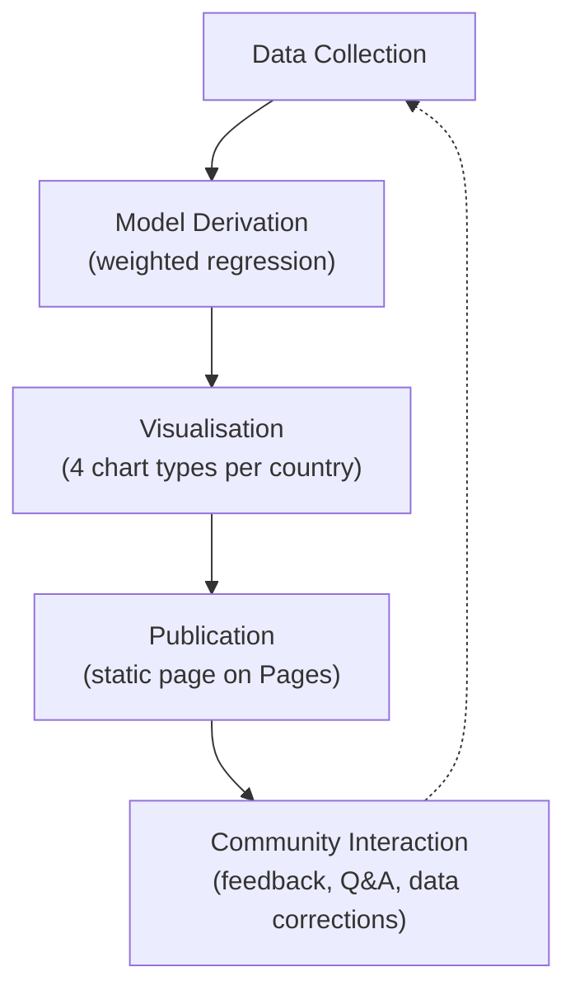
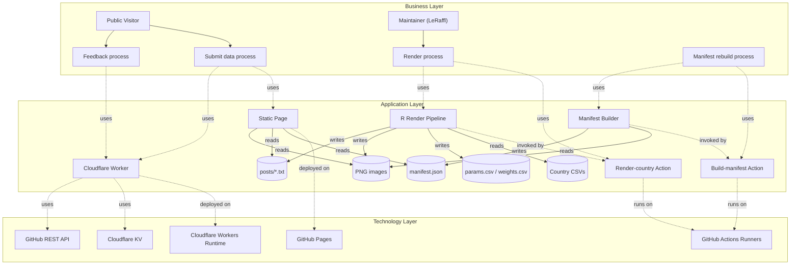

# 01 · Overview

## What this project is

A public-facing static site at <https://leraffl.github.io/LeRaffl-Gallery/> that publishes monthly extrapolations of the BEV / PHEV / ICE share of new vehicle registrations across ~43 countries, plus four canonical chart types per country, plus interactive tools (Builder, Thresholds, Durations, World Map, Fleet) backed by a model parameter file.

Every chart is the output of a weighted regression on registration data the maintainer collects from national statistics offices. The same parameter set (`params.csv`) drives both the static images and the in-browser interactive tools — there is one source of truth for the model.

## What problems it solves

| For | What |
|---|---|
| The maintainer | A reproducible pipeline that turns monthly source data into charts + cross-country comparison tables, with a clear audit trail in Git, and an option to delegate the data-entry step to volunteers without giving anyone push access. |
| Researchers, journalists, EV-curious public | A single page where you can compare countries on the same scale, read the methodology, see the trajectory and threshold tables, and submit corrections when source data changes. |
| The maintainer's own Bluesky/X posting workflow | A pre-formatted post text generated from each render that can be copied with one tap on mobile or one click on desktop. |

## Business capabilities

The capabilities form a clockwise cycle: corrections submitted by the public re-enter Data Collection as Submission PRs.

## Actors

| Actor | Type | Authority |
|---|---|---|
| Public visitor | Anonymous human | Read everything, submit feedback issues, submit data corrections (PR-based, requires maintainer merge) |
| Maintainer (`LeRaffl`) | Authenticated human | Push to master, merge PRs, trigger Actions, hold the GitHub PAT, configure Cloudflare |
| GitHub Actions runner | Automation | Run R rendering and manifest building, push commits to master with the workflow-scoped token |
| Cloudflare Worker | Automation | Hold the PAT secret; create issues; open PRs (no direct push) |
| External data sources | External (KBA, ACEA, Statistik Austria, …) | Provide the source registration data the maintainer transcribes into `data/<Country>.csv` |

## ArchiMate layer view

This is the conceptual layering — Business processes use Application Components; Application Components run on Technology Services. Use this as a navigation aid: if you're thinking about user behaviour go to the Business layer, if you're debugging code go to the Application layer, if you're debugging deploys go to the Technology layer.

## Operating principles (the "why" anchors)

These shape every architectural decision. If a future change conflicts with one of these, that's a discussion to have, not a thing to silently break.

1. **Git is the target source-of-truth.** Every persistent artefact (data, parameters, weights, images, posts, manifest) lives as a file in the repo, audit trail = `git log`, no DB to back up, no schema migrations. *Status today:* the data CSVs are in Git for the 43 listed countries; some upstream collection still flows through external sheets that the maintainer maintains separately. Long-term direction is to retire those and have Git be the only place data ever lives.

2. **The model has history; treat it accordingly.** The weighted regression in `R/fit.R` was developed iteratively; the most influential countries during assumption-setting were Germany, Austria, the Nordics, and Ireland. Two operational consequences:
   - *Numeric drift is expected and bounded.* Refits across machines / R builds drift at the ~1e-7 relative tolerance level due to optim convergence and BLAS differences. Anything beyond that means the math has changed and historical thresholds become non-reproducible — that's a code-review-stop.
   - *The grey/coloured band around each curve is not a true confidence interval (yet).* It's a visual range derived from the fit's standard error, useful for "this is roughly where the uncertainty sits" but not statistically rigorous. A proper CI is a future improvement.
   - For an engineer touching `R/fit.R`: the math implementation is intentionally a near byte-copy of the historical script. Restructure freely, but do not change the formula or the optimiser without coordinating with the maintainer.

3. **Public submitters never write directly.** Any change to `data/<Country>.csv` from outside the maintainer's machine goes through a PR for review. The Worker has Contents+PRs scopes but is structurally constrained to only ever open PRs, never push to master.

4. **Static-first on the read path.** The page is plain HTML/CSS/JS that fetches static files. No backend on read. The Worker is only on the write path (feedback, submit). This means the page survives any Worker outage in read-only mode.

5. **Renders are reproducible.** Given `data/<Country>.csv` at a point in time, the Render Action produces a deterministic set of PNGs and `params.csv`/`weights.csv` rows, modulo the bounded ~1e-7 drift in principle 2.

6. **Editor-friendly diffs.** Wide-but-sparse CSVs (one row per period, fuel columns NA when not reported) over Long format, because they're readable in the GitHub diff view. Line-level upserts on `params.csv` so a single-country render only diff-touches its own row.

## See also

- [02-components.md](02-components.md) — what each named box in the diagrams above actually is
- [05-flows.md](05-flows.md) — sequence diagrams for the user journeys
- [09-glossary.md](09-glossary.md) — domain jargon
