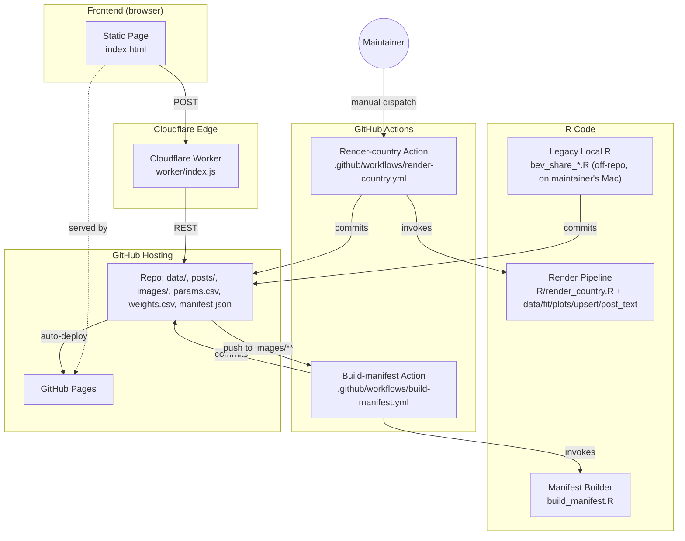

# 02 · Components

This is the application inventory. For each component: what it is, where it lives, what it depends on, why it exists in this shape (rationale).

## Component map



---

## 2.1 Static Page (`index.html`)

### What it is

A single ~6000-line HTML file with inline CSS and inline JavaScript. No build step, no framework, no transpiler. Served verbatim from `master:index.html` by GitHub Pages.

### Tabs

| Tab | Source of data | What it shows |
|---|---|---|
| Gallery | `manifest.json` + `images/<period>/<slug>_*.png` | Grid of all PNGs filterable by country, type, period |
| Thresholds | `params.csv` | When each country reaches 20%/50%/80% BEV under the current model |
| Durations | `params.csv` | How many years each country needs to traverse 20→80% |
| Speed | `params.csv` | Interval chart: horizontal bar per country from From%→To% BEV share, dot at Mid%; sortable by start/mid/end/duration, region encoded by color, variant (Whole / Private / Industry / HDV / Used / …) encoded by bar shape (solid / diagonal / cross-hatch / thick stripes / outline). Custom From/Mid/To inputs default to 20/50/80. PNG and SVG export with `@LeRaffl` tag, created timestamp (incl. time, UTC) and `data per <oldest> (<country>) – <newest>` footer. |
| Builder | `params.csv` | Interactive "what-if" curves with adjustable v1/v2/t0 |
| Fleet | `fleet/*.csv`, `fleet_meta.json` | Bestand projection (separate from new-registrations data) |
| World Map | `params.csv` + `weights.csv` | Choropleth of current BEV share |
| FAQ | inline `FAQ_DATA` array | Searchable Q&A |
| Submit Data | Worker `POST /submissions` | Form for new monthly data points + corrections |
| Feedback & Questions | Worker `GET/POST /issues` | Public discussion thread mirrored from GitHub Issues |

### Notable in-page features

- **Copy-post button** on every Gallery card: fetches `posts/<slug>.txt` and writes to clipboard
- **FAB** (floating action button) bottom-right: opens the feedback modal from any tab with the current tab's filters captured as context
- **Math captcha** on feedback submit (3 + 4 = ?), **honeypot** on both feedback and submit
- **Lightbox** on chart click → larger image + Download link

### Why a single file with no build?

- The maintainer runs the project solo and wants to be able to edit the page in any text editor without setting up Node/Webpack/etc.
- GitHub Pages serves it as-is. No CI build required for the read path.
- LLMs and AI agents can read the entire UI in one pass.
- Trade-off accepted: harder to organise, no component reuse, no type safety.

---

## 2.2 Cloudflare Worker (`worker/index.js`)

### What it is

A ~600-line JavaScript module deployed to Cloudflare's V8-isolate runtime. The single bridge between the read-only static page and the write-side of GitHub.

### Endpoints

| Method | Path | Purpose |
|---|---|---|
| `GET`  | `/issues` | List feedback issues (cached 60 s) |
| `POST` | `/issues` | Create a feedback issue |
| `POST` | `/submissions` | Open a PR with one or more upserted rows in `data/<Country>.csv` |
| `OPTIONS` | * | CORS preflight |

Full contracts → [04-interfaces.md](04-interfaces.md).

### What's in the env

- `GITHUB_TOKEN` (secret) — fine-grained PAT with Issues R/W, Contents R/W, Pull requests R/W, Metadata R, scoped to this repo
- `RATE_KV` (binding) — Cloudflare KV namespace used as a per-IP counter with 1-hour TTL
- `GITHUB_OWNER`, `GITHUB_REPO` (vars) — non-secret config

### Why a Worker and not Lambdas / Vercel functions / a tiny VPS?

- Cloudflare Workers free tier covers our load comfortably (we'd need >100k requests/day to leave it)
- Cold-start time is essentially zero (V8 isolates, not containers), so the page never feels slow
- The same Worker now hosts Feedback **and** Submit — adding new write endpoints is just another route, no new infrastructure
- Trade-off accepted: limited runtime API (no Node `fs`, no native modules), but everything we do is HTTP fetches so this is a fit

---

## 2.3 R Render Pipeline (`R/`)

### What it is

A set of small, focused R modules that turn `data/<Country>.csv` into the four canonical PNGs for that country, plus a `params.csv` row, a `weights.csv` row, and a `posts/<slug>.txt` social-media text.

### Files

| File | Responsibility | Shape |
|---|---|---|
| `R/data.R` | CSV loader, share derivations, TTM (rolling-12-month) aggregation | `load_country_csv(path)`, `compute_ttm_long(df)` |
| `R/fit.R` | Weighted regression with full time-history loop | `fit_history(df, extrapol = 2200, confidence_level = 0.999)` |
| `R/plots.R` | The four ggplot2 plot constructors | `plot_bev_trajectory`, `plot_ice_bev_phev`, `plot_timer`, `plot_ttm_shares` |
| `R/upsert.R` | Line-level upsert into `params.csv` and `weights.csv` | `upsert_params`, `upsert_weights`, `data_per_from_df`, `compute_weight` |
| `R/post_text.R` | Build the social-media post text per country | `build_post_text(df, country, last_period = NULL)` |
| `R/render_country.R` | Entry point: orchestrates everything | `Rscript R/render_country.R <Country> [<Variant>]` |

### Key invariants

- `R/fit.R::fit_history` is **byte-for-byte the historical Germany script's regression code**, only renamed for country-agnostic use. Do not change the math without coordinating with the maintainer; threshold reproducibility for old runs depends on it.
- `R/data.R::compute_ttm_long` only emits a row when **every present fuel column** has a complete 12-month non-NA window. This is what makes the TTM stack hit 100% from the very first plotted period.
- `R/upsert.R::upsert_params` writes line-level — only the touched country/variant row changes. Previous attempts that round-tripped the whole CSV through `read.csv`/`write.table` caused noisy reformatting (scientific → decimal, trailing zero changes) and were reverted.

### Why split into so many files?

- The original Germany R script was 1360 lines mixing IO, math, plotting, Git operations, and Google Sheets. It was unreadable.
- Splitting by responsibility lets each module have a contract that's testable in isolation. `fit.R` doesn't know about plots; `plots.R` doesn't know about CSVs; `render_country.R` is the only orchestrator.
- The math file is now small enough to audit in one screen, which is essential because of invariant #1 above.

---

## 2.4 Manifest Builder (`build_manifest.R`)

### What it is

An R script that scans `images/` and writes `manifest.json`. The manifest is what the Static Page's Gallery tab fetches at load.

### Inputs and outputs

```
INPUT:  images/<YYYY-MM>/<slug>_<type>_<YYYYMMDD>.png   (recursively)
OUTPUT: manifest.json   (top-level, committed to repo)
```

`manifest.json` shape:

```json
{
  "updated": "2026-05-08",
  "images": [
    {
      "country": "Germany",
      "country_slug": "germany",
      "type": "ICE_BEV",
      "period": "2026-04",
      "date": "2026-05-08",
      "filename": "germany_ICE_BEV_20260508.png",
      "url": "images/2026-04/germany_ICE_BEV_20260508.png",
      "alt": "Germany ICE-BEV-Hybrid trajectory"
    }
  ]
}
```

### Why a separate manifest instead of letting the page list directories?

- GitHub Pages does not support directory listings. The page would have to either (a) hardcode every filename or (b) hit a backend.
- Pre-computing the manifest at push-time is free, fast, and lets the page stay completely static.

---

## 2.5 Render-country Action (`.github/workflows/render-country.yml`)

### What it is

A GitHub Action with `workflow_dispatch` only — it runs only when manually triggered from the Actions UI with `country` and `variant` inputs.

### What it does

1. Checks out the repo
2. Sets up R via `r-lib/actions/setup-r`
3. Installs the R package set (ggplot2, scales, grid, png, ggtext, viridis, showtext, sysfonts, glue) with apt prebuilds
4. Runs `Rscript R/render_country.R <country> <variant>`
5. Commits the resulting `images/<period>/*.png`, `params.csv` row update, `weights.csv` row update, `posts/<slug>.txt`, `posts/<slug>_<period>.txt` via `EndBug/add-and-commit`
6. Dispatches `build-manifest.yml` explicitly so the generated images are indexed immediately

### Why manual trigger only and not on `data/` push?

Submission PRs typically batch multiple corrections in one merge. Auto-rendering on every `data/` push would re-render before the maintainer's review of the merge result. Manual trigger keeps the maintainer in the loop and lets them choose which country to refresh.

---

## 2.6 Build-manifest Action (`.github/workflows/build-manifest.yml`)

### What it is

A GitHub Action that rebuilds `manifest.json` whenever PNG files change.

### Triggers

- Push to `images/**` (any new/deleted/renamed image)
- Push to `build_manifest.R` (the builder itself changed)
- Daily cron at 03:17 UTC as a self-healing fallback
- Manual dispatch, including the explicit dispatch from Render-country after a successful render commit

### Why the cron?

Defensive — if a manual upload bypasses the Render action (legacy local R workflow), the cron still picks it up within a day.

---

## 2.7 GitHub Pages

### What it is

A built-in GitHub feature that serves `master:/index.html` (and any referenced static asset) at `https://leraffl.github.io/LeRaffl-Gallery/`. Configured in repo Settings → Pages.

### What it serves

The entire repo content is technically reachable, but the page only references:
- `index.html` (entry)
- `manifest.json`
- `params.csv`, `weights.csv`
- `images/<period>/*.png`
- `posts/<slug>.txt`
- `fleet/*.csv`, `fleet/fleet_meta.json`

### Caching

GitHub Pages serves with default `Cache-Control: max-age=600`. The page uses `cache: 'no-store'` on critical fetches (manifest, posts) so corrections appear fast.

---

## 2.8 Builder Snapshot Script (`scripts/snapshot_builder.py`)

### What it is

A small Python script that mirrors the in-page Builder logic and writes a snapshot of the aggregated BEV / ICE / PHEV curves to `builder_history/<date>.csv` plus a metadata entry into `builder_history/index.json`. One snapshot per run; the run is driven by `.github/workflows/snapshot-builder.yml` on a monthly cron.

### Inputs and outputs

```
INPUT:  params.csv, weights.csv
OUTPUT: builder_history/<YYYY-MM-DD>.csv   (14 groups × 351 year-steps)
        builder_history/index.json         (updated in place)
```

### Key invariants

- Mirrors `index.html`'s `bevShareIndex` / `iceShareIndex` / `getT0Years` / `baselineYearOf` byte-for-byte, including the JS-only quirk that `Number('') === 0` (the in-page Builder relies on this when `params.csv` carries no `baseline_year` column — see the script's module docstring).
- Same v1=0 anchor recovery as `index.html::recoverV1FromAnchor()`. A v1=0 row from external CSV round-trip corruption produces the same recovered Weibull on the page and in the snapshot.
- Idempotent: running twice on the same `--date` overwrites the file; the workflow only commits on a content change.
- No render trigger downstream — snapshots are pure read-only artefacts; the static page is not (yet) a consumer.

### Why a separate script instead of extending `R/render_country.R`?

The render pipeline produces per-country PNGs and updates `params.csv` / `weights.csv` — its output feeds the page. The snapshot is *downstream* of those files; it has no dependency on the R toolchain or on data ingestion. Keeping it as a small Python script (zero dependencies, matches the `scripts/fetch_*.py` pattern) means the snapshot workflow installs in ~5 s and doesn't have to re-mount the R action runner.

---

## 2.9 Snapshot-Builder Action (`.github/workflows/snapshot-builder.yml`)

### What it is

A GitHub Action that runs `scripts/snapshot_builder.py` on the 25th of each month at 09:00 UTC (after the bulk of in-month country fetches has settled) and commits the resulting `builder_history/` changes back to master.

### Triggers

- Monthly cron at 09:00 UTC on the 25th
- Manual dispatch with optional `--date YYYY-MM-DD` override (useful for testing or labelling a back-dated run)

### Why the 25th and not the 1st?

Most country fetchers (Brazil, Chile, Japan, ACEA) run during the first half of the month and finish writing their target month between the 10th and the 23rd. Snapshotting on the 25th means the recorded snapshot reflects the most complete picture available for the previous month before the next month's data starts arriving — the curve we store is the one a visitor would have seen on the page that day.

---

## 2.10 Legacy Local R Pipeline

### What it is

Per-country R scripts on the maintainer's Mac (`bev_share_<Country>_*.R`) that read directly from a Google Sheet and push images + params + weights to the repo. Off-repo; not part of CI.

### Status

Still functional and the maintainer's preferred path for fast iteration during data-collection. Output is byte-compatible with the new pipeline — same image filenames, same `params.csv` row format.

### Why keep it instead of migrating fully to the new pipeline?

- The maintainer can iterate in RStudio with breakpoints, `View(df)`, etc. — far faster than triggering CI.
- Google Sheets is still where the maintainer transcribes raw national data; until that flow moves to direct CSV editing, the local R is the bridge.
- The new pipeline is the **authoritative** path (used by the Render Action and any public submission). The local R is the **convenience** path. Both write the same files; whichever wins last wins.

## See also

- [03-data-objects.md](03-data-objects.md) — what each component reads/writes
- [04-interfaces.md](04-interfaces.md) — Worker endpoint contracts
- [05-flows.md](05-flows.md) — how the components dance together for each user journey
- [08-deploy-ops.md](08-deploy-ops.md) — how to deploy/trigger each component
