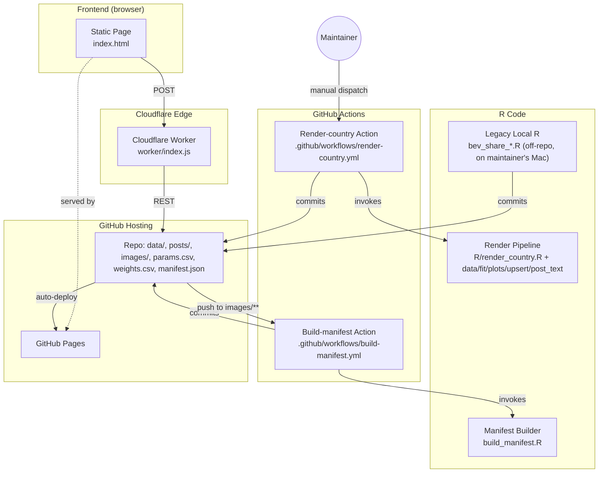

# 02 · Components

This is the application inventory. For each component: what it is, where it lives, what it depends on, why it exists in this shape (rationale).

## Component map


```mermaid
flowchart TB
    subgraph Frontend["Frontend (browser)"]
        SP["Static Page<br/>index.html"]
    end

    subgraph Edge["Cloudflare Edge"]
        WK["Cloudflare Worker<br/>worker/index.js"]
    end

    subgraph CI["GitHub Actions"]
        RA["Render-country Action<br/>.github/workflows/render-country.yml"]
        BA["Build-manifest Action<br/>.github/workflows/build-manifest.yml"]
    end

    subgraph R["R Code"]
        RP["Render Pipeline<br/>R/render_country.R + data/fit/plots/upsert/post_text"]
        MB["Manifest Builder<br/>build_manifest.R"]
        LR["Legacy Local R<br/>bev_share_*.R (off-repo, on maintainer's Mac)"]
    end

    subgraph Host["GitHub Hosting"]
        GP["GitHub Pages"]
        REPO["Repo: data/, posts/, images/, params.csv, weights.csv, manifest.json"]
    end

    Maintainer((Maintainer))

    SP -.served by.-> GP
    SP -- POST --> WK
    WK -- REST --> REPO
    RA -- invokes --> RP
    BA -- invokes --> MB
    RA -- commits --> REPO
    BA -- commits --> REPO
    LR -- commits --> REPO
    Maintainer -- manual dispatch --> RA
    REPO -- "push to images/**" --> BA
    REPO -- auto-deploy --> GP
```

---

## 2.1 Static Page (`index.html`)

### What it is

A single ~13,600-line HTML file with inline CSS and inline JavaScript. No build step, no framework, no transpiler. Served verbatim from `master:index.html` by GitHub Pages.

### Navigation (2026-09 redesign)

The flat tab strip was replaced by **four primary entries with a sub-nav**, each primary being a link to its family's first section:

| Primary (`data-nav`) | Target | Sub-nav |
|---|---|---|
| Charts (`charts`) | `#gallery` | — (the landing surface; the page *is* the gallery) |
| Map (`map`) | `#worldmap` | — |
| Rankings (`rankings`) | `#thresholds` | Thresholds, Durations, Time Interval |
| Tools (`tools`) | `#builder` | Builder, Compare, Raw Data, Fleet, Data freshness, Submit Data, Data sources |

`.nav-sub` blocks are `hidden` and revealed only for the active family. FAQ and Feedback are deliberately **not** in the bar — FAQ is reached from About, Feedback via the FAB and the emoji cluster (both capture tab context).

**All 14 sections and every `#hash` are unchanged.** That is the reason old links, bookmarks and the `context.hash` recorded in feedback issues still resolve after the redesign — treat it as an invariant, not an accident. The sections are `tab-about`, `tab-faq`, `tab-submit`, `tab-feedback`, `tab-gallery`, `tab-thresholds`, `tab-schedule`, `tab-durations`, `tab-speed`, `tab-builder`, `tab-compare`, `tab-rawdata`, `tab-fleet`, `tab-worldmap`.

A small inline script measures the header and the (now wrapping, not scrolling) tab bar into `--header-h` / `--tabs-h`, so `--chrome-h` and the sticky offsets stay correct at every width.

### Tabs

| Tab | Source of data | What it shows |
|---|---|---|
| Gallery | `manifest.json` + `images/<period>/<slug>_*.png` | Grid of all PNGs filterable by country, type, period |
| Thresholds | `params.csv` | When each country reaches 20%/50%/80% BEV under the current model |
| Durations | `params.csv` | How many years each country needs to traverse 20→80% |
| Time Interval | `params.csv` | Interval chart: horizontal bar per country from From%→To% BEV share, dot at Mid%; sortable by start/mid/end/duration, region encoded by color, variant (Whole / Private / Industry / HDV / Used / …) encoded by bar shape (solid / diagonal / cross-hatch / thick stripes / outline). Custom From/Mid/To inputs default to 20/50/80. PNG and SVG export with `@LeRaffl` tag, created timestamp (incl. time, UTC) and `data per <oldest> (<country>) – <newest>` footer. |
| Builder | `params.csv` + `weights.csv` | Weighted aggregate BEV/ICE/PHEV curves for arbitrary country sets or predefined groups (EU, World, …). Plots **real monthly dates** (`monthGrid(2015, 2050)`), not index time. ICE and PHEV always draw — the old "Show ICE & PHEV" toggle is gone (`showICE` is a `const true`). |
| Compare | `params.csv` + `weights.csv` + `data/<Country>.csv` | Overlay of **any number** of curves (same powertrain, same variant) for individual countries or aggregated regions. The first three are pinned and keep their labels; past three only fitted curves draw (no monthly steps) and the extras are named on hover. Overlays observed annual data points (volume-weighted share from raw CSVs, summed across member countries for aggregates) — it reads `data/*.csv` directly, *not* `series/`. |
| Raw Data | `series/index.json` + `series/<slug>.json` | The country CSVs as stacked bars, one bar per rolling trailing window. Hand-drawn SVG, not Plotly — it renders up to 51 charts at once, and the bar geometry is the feature. Build-time half is `scripts/build_series.py`; spec in [35-proposal-raw-data-tab.md](35-proposal-raw-data-tab.md). |
| Fleet | `fleet/*.csv`, `fleet_meta.json` | Bestand projection (separate from new-registrations data) |
| Data freshness | `sources/schedule.json` | In-page render of the fetch schedule; `schedule.html` / `schedule-<YYYY-MM>.html` / `schedule.ics` are its generated standalone counterparts. All from `scripts/build_schedule.py`. |
| World Map | `params.csv` + `weights.csv` | Choropleth of current BEV share. **Colour scale is a single-hue blue ramp, light → dark** — the data is a magnitude with no meaningful midpoint, and a monotonic lightness ramp stays readable under every form of colour blindness because luminance is preserved. It replaced two opposed red↔green scales, the pair protanopes and deuteranopes cannot separate ([#226](https://github.com/LeRaffl/LeRaffl-Gallery/issues/226)); measured, the old scale put two adjacent steps at ΔE 1.9 under deuteranopia and 4.3 under *normal* vision. Dark always means further along, so `year`/`duration` set `reversescale` rather than carrying a second scale. The two off-scale categories — `pioneer` (amber) and `stalled` (neutral grey) — sit outside the ramp **and** carry a heavier outline, because five ramp steps plus two categories is more than colour alone can separate. Has a **variant selector** (`#wmVariant`, revealed once more than one variant is available) — no longer whole-market passenger cars only. |
| About | inline | Landing section; the default active tab. |
| FAQ | inline `FAQ_DATA` array | Searchable Q&A |
| Submit Data | Worker `POST /submissions` | Form for new monthly data points + corrections |
| Feedback & Questions | Worker `GET/POST /issues` | Public discussion thread mirrored from GitHub Issues |

### Notable in-page features

- **Landing hero chart** (`#galHeroPlot`): a **hand-rolled inline SVG**, not Plotly — it is the first paint and must not wait on the plotting library. Its "home market" comes from the browser timezone (`Intl.DateTimeFormat().resolvedOptions().timeZone` against `TZ_COUNTRY` / `TZ_PREFIX`), falling back to Germany; **no IP lookup, no geolocation prompt.** `homeCountry()` is shared with Compare via `window.__bevHomeCountry` so the timezone table is maintained once. The chart fails soft: if `params.csv` is unavailable the figure hides itself and the rest of the page still works.
- **Landing search** (`#heroSearch`): writes through to the real gallery filter (`#search`) and dispatches an `input` event there, so the existing `resetDebounced` → `applyFilters` path runs — not a second filter implementation. It shows a live match count and jumps to `#gallery` on **Enter**, deliberately not on first keystroke (a tab switch mid-typing would pull the field out from under the cursor).
- **Copy-post button** on every Gallery card: fetches `posts/<slug>.txt` and writes to clipboard
- **FAB** (floating action button) bottom-right: opens the feedback modal from any tab with the current tab's filters captured as context
- **Math captcha** on feedback submit (3 + 4 = ?), **honeypot** on both feedback and submit
- **Lightbox** on chart click → larger image + Download link

### Runtime data dependencies

Beyond `manifest.json` / `params.csv` / `weights.csv`, the page fetches **`series/index.json` once and `series/<slug>.json` per country on demand**. That is a runtime dependency on the output of [`scripts/build_series.py`](../../scripts/build_series.py) — a stale or missing `series/` directory degrades those surfaces, it does not merely age them. Per-country files mean picking one country costs one request and a single-country data update invalidates one cache entry.

Two consumers, and it is worth keeping them straight:

| Surface | Observations come from |
|---|---|
| Raw Data | `series/index.json` + `series/<slug>.json` |
| Landing hero chart | `series/index.json` + `series/<slug>.json` (home market only) — so `series/` is on the **first-paint** path, not just behind a tab switch |
| Compare | `data/<Country>[_<Variant>].csv`, fetched and parsed in the page (`fetchObsCsv`) |

### Reconstructed rows (`v1 = 0` anchor recovery)

`params.csv` stores `v1` at CSV precision. A curve whose real `v1` is small
enough rounds to a literal `0` in the file, which is not a usable Weibull. The
page does not drop those rows: `recoverV1FromAnchor()` / `applyV1Recovery()`
reconstruct `v1` at load time by anchoring the model to the row's most recent
observation, and every `params.csv` consumer on the page (Thresholds, Durations,
Time Interval, Builder, World Map) then works off the recovered value.

**Consequence worth knowing when quoting these rows:** a recovered curve is
pinned to one observation rather than fitted across the series, so its dates can
sit a few months either side of what a full re-fit would produce.

**Where `v1 = 0` comes from** is documented in full in
[08-deploy-ops.md § Indonesia v1=0 corruption](08-deploy-ops.md#indonesia-v10-corruption)
— that section is canonical for the cause, the backend self-heal
(`R/upsert.R::heal_v1_zero_rows()`) and why both layers are kept. Read it before
changing anything here.

**Do not hardcode a country list.** The trigger is `v1 == 0` *exactly*: a
property of a row's rounding at a point in time, not of a country. It moves as
parameters are re-fitted and as the corruption in §8.8 recurs. A note on the
Thresholds tab used to name Indonesia; it was dropped in the 2026-09 redesign and
had by then gone stale anyway — Indonesia's `v1` currently reads `-6.7e-17`, near
zero but not *at* zero, so it is fitted normally. Note that this is **not** a
permanent state: §8.8 describes the corruption as episodic, so Indonesia can
re-enter the recovery path at any time. To see what is affected right now, read
`params.csv` and select `float(v1) == 0`.

### Fit reliability gate (`fitReliability()`)

Not every fitted curve can carry a ranking. One function in `index.html`,
`fitReliability(row)` (next to `rowHasNoTransition`), classifies each
`params.csv` row as `ok`, `provisional` or `excluded`, and **every** consumer
reads that verdict: Thresholds, Durations, Time Interval, the World Map, the
gallery tags and the speed-quartile pool behind the *Fast/Slow* tags. Keep it
one function — a second, slightly different copy in one tab is how rankings and
tags start to disagree.

A row is **excluded** when any one of three tests fails:

| Test | Rule | Why a separate test |
|---|---|---|
| unsettled | `refit_swing > FIT_UNSETTLED_SWING` (25 y), or `Inf` | The 80 % date still jumps with each new month. |
| collapsed | shape `v2 ≤ 0`, or 10 %→80 % in `< FIT_COLLAPSE_SPAN` (3 y) while `ttm_bev_share < FIT_COLLAPSE_OBS` (10 %) | A near-vertical step the data has not reached. It can repeat identically on every refit (Argentina), so `refit_swing` alone does not catch it. The fastest *observed* transitions take 5–8 years. |
| stale | `data_per` more than `FIT_STALE_MONTHS` (12) before today | The curve describes a market no longer observed (Belgium Vans ended 2023-03). |

`provisional` = swing between `FIT_PROVISIONAL_SWING` (5 y) and the unsettled
cut-off; tags stay, drawn hollow.

What exclusion does: the row drops out of the three ranking tabs and the map (a
note under each table names what was left out), its gallery cards carry a
single *Unreliable fit* pill whose popover lists the failed tests, and the
gallery's **Fit** filter can hide those charts. The chart PNGs themselves are
never touched. Rows that already read "shows no transition" keep that label and
stay in the tables: `rowIsUnreliableFit()` checks `rowHasNoTransition` first.
The Builder is deliberately **not** gated — it aggregates by volume weight and
mirrors `scripts/snapshot_builder.py`, and changing its inputs is a Builder
change (see AGENTS.md).

The gate is a browser-side reading of the fit, not a fix for it. Some collapses
are optimizer failures in `R/fit.R` (Belgium Vans/HDV, Romania Vans, Slovakia
HDV: Nelder-Mead from the single start `(-0.1, 4)` stops far from the
least-squares minimum). Fixing that belongs in `R/fit.R` and needs review.

**Known gap, as of 2026-09.** The two rows currently on `v1 = 0` are
`Uruguay|Buses` and `Cyprus|HDV`, and neither is the §8.8 corruption pattern:
both carry `v2 = 4.15` exactly — a round number where every genuine `optim()`
output in the file is a long float — together with `ttm_bev_share = 0`. They look
like placeholder rows for which no fit was ever produced, rather than clobbered
ones. Two consequences follow:

- `heal_v1_zero_rows()` will never touch them. Its fingerprint is
  `abs(v1) < 1e-25 **AND v2 >= 10**`, and 4.15 fails the second test, so the
  backend layer does not apply and they sit permanently on the frontend net.
- `recoverV1FromAnchor()` anchors them at the `v2 < 10` branch, i.e. **50 % BEV
  share at `data_per`** — for two rows whose measured TTM share is `0`. Whatever
  those rows render is an artefact of that assumption, not a fit.

Not fixed here because it is a data question rather than a frontend one, but do
not quote either row until it is resolved.

### Why a single file with no build?

- The maintainer runs the project solo and wants to be able to edit the page in any text editor without setting up Node/Webpack/etc.
- GitHub Pages serves it as-is. No CI build required for the read path.
- LLMs and AI agents can read the entire UI in one pass.
- Trade-off accepted: harder to organise, no component reuse, no type safety.

---

## 2.2 Cloudflare Worker (`worker/index.js`)

### What it is

A ~600-line JavaScript module deployed to Cloudflare's V8-isolate runtime. The single bridge between the read-only static page and the write-side of GitHub.

### Endpoints

| Method | Path | Purpose |
|---|---|---|
| `GET`  | `/issues` | List feedback issues (cached 60 s) |
| `POST` | `/issues` | Create a feedback issue |
| `POST` | `/submissions` | Open a PR with one or more upserted rows in `data/<Country>.csv` |
| `OPTIONS` | * | CORS preflight |

Full contracts → [04-interfaces.md](04-interfaces.md).

### What's in the env

- `GITHUB_TOKEN` (secret) — fine-grained PAT with Issues R/W, Contents R/W, Pull requests R/W, Metadata R, scoped to this repo
- `RATE_KV` (binding) — Cloudflare KV namespace used as a per-IP counter with 1-hour TTL
- `GITHUB_OWNER`, `GITHUB_REPO` (vars) — non-secret config

### How it gets deployed

The Worker is linked to this repository via **Cloudflare Workers Builds** (configured in the Cloudflare dashboard → Workers → `leraffl-gallery-feedback` → Settings → Builds). Any push to `master` that touches `worker/` triggers `npx wrangler deploy` from the `worker/` subdirectory inside a Cloudflare-managed build container. No local CLI step needed for routine deploys; `wrangler` from the maintainer's Mac is the manual fallback. Secrets (`GITHUB_TOKEN`) live in the Worker's runtime env and are not read from the repo. Full deploy runbook in [08-deploy-ops.md § 8.1](08-deploy-ops.md#81-deploy-the-worker).

### Why a Worker and not Lambdas / Vercel functions / a tiny VPS?

- Cloudflare Workers free tier covers our load comfortably (we'd need >100k requests/day to leave it)
- Cold-start time is essentially zero (V8 isolates, not containers), so the page never feels slow
- The same Worker now hosts Feedback **and** Submit — adding new write endpoints is just another route, no new infrastructure
- Trade-off accepted: limited runtime API (no Node `fs`, no native modules), but everything we do is HTTP fetches so this is a fit

---

## 2.3 R Render Pipeline (`R/`)

### What it is

A set of small, focused R modules that turn `data/<Country>.csv` into the four canonical PNGs for that country, plus a `params.csv` row, a `weights.csv` row, and a `posts/<slug>.txt` social-media text.

### Files

| File | Responsibility | Shape |
|---|---|---|
| `R/data.R` | CSV loader, share derivations, TTM (rolling-12-month) aggregation | `load_country_csv(path)`, `compute_ttm_long(df)` |
| `R/fit.R` | Weighted regression with full time-history loop | `fit_history(df, extrapol = 2200, confidence_level = 0.999)` |
| `R/plots.R` | The four ggplot2 plot constructors | `plot_bev_trajectory`, `plot_ice_bev_phev`, `plot_timer`, `plot_ttm_shares` |
| `R/upsert.R` | Line-level upsert into `params.csv` and `weights.csv` | `upsert_params`, `upsert_weights`, `data_per_from_df`, `compute_weight` |
| `R/post_text.R` | Build the social-media post text per country | `build_post_text(df, country, last_period = NULL)` |
| `R/render_country.R` | Entry point: orchestrates everything | `Rscript R/render_country.R <Country> [<Variant>]` |

### Key invariants

- `R/fit.R::fit_history` is **byte-for-byte the historical Germany script's regression code**, only renamed for country-agnostic use. Do not change the math without coordinating with the maintainer; threshold reproducibility for old runs depends on it.
- `R/data.R::compute_ttm_long` only emits a row when **every present fuel column** has a complete 12-month non-NA window. This is what makes the TTM stack hit 100% from the very first plotted period.
- `R/upsert.R::upsert_params` writes line-level — only the touched country/variant row changes. Previous attempts that round-tripped the whole CSV through `read.csv`/`write.table` caused noisy reformatting (scientific → decimal, trailing zero changes) and were reverted.
- **A chart never claims a split its source does not publish.** Two flags in `render_country.R` carry this, both derived per country/variant and passed through `meta`:
  - `bev_label` — `"EV"` instead of `"BEV"` where the source folds PHEV *into* the BEV column (ACEA's CV release; gated on source **and** variant).
  - `has_phev_split` — `FALSE` where the source publishes a single combined hybrid figure, which the pipeline parks in `HEV` with `PHEV`/`EREV` left empty (Türkiye, Georgia, Colombia, Malaysia, Ukraine, and every ACEA CV variant). `compute_shares()` reads an empty column as `0`, so the trajectory plot used to draw a PHEV curve, ribbon, points and legend entry pinned at a zero the source never measured — the chart-level twin of the "leave empty, never `0.0`" CSV invariant ([#210](https://github.com/LeRaffl/LeRaffl-Gallery/issues/210)). When `FALSE`, `plot_ice_bev_phev()` omits the PHEV series and titles the chart `<BEV> / ICE`.

  `has_phev_split` is read **from the data**, never from a country list: which sources split PHEV changes over time (`data.gov.my` gained `plug_in_hybrid_petrol` around 2024), so the curve returns by itself the moment a real value lands. Neither flag touches the fit — hybrids stay inside ICE, so `params.csv`, thresholds and durations are unchanged and countries stay comparable.

### Why split into so many files?

- The original Germany R script was 1360 lines mixing IO, math, plotting, Git operations, and Google Sheets. It was unreadable.
- Splitting by responsibility lets each module have a contract that's testable in isolation. `fit.R` doesn't know about plots; `plots.R` doesn't know about CSVs; `render_country.R` is the only orchestrator.
- The math file is now small enough to audit in one screen, which is essential because of invariant #1 above.

---

## 2.4 Manifest Builder (`build_manifest.R`)

### What it is

An R script that scans `images/` and writes `manifest.json`. The manifest is what the Static Page's Gallery tab fetches at load.

### Inputs and outputs

```
INPUT:  images/<YYYY-MM>/<slug>_<type>_<YYYYMMDD>.png   (recursively)
OUTPUT: manifest.json   (top-level, committed to repo)
```

`manifest.json` shape:

```json
{
  "updated": "2026-05-08",
  "images": [
    {
      "country": "Germany",
      "country_slug": "germany",
      "type": "ICE_BEV",
      "period": "2026-04",
      "date": "2026-05-08",
      "filename": "germany_ICE_BEV_20260508.png",
      "url": "images/2026-04/germany_ICE_BEV_20260508.png",
      "alt": "Germany ICE-BEV-Hybrid trajectory"
    }
  ]
}
```

### Why a separate manifest instead of letting the page list directories?

- GitHub Pages does not support directory listings. The page would have to either (a) hardcode every filename or (b) hit a backend.
- Pre-computing the manifest at push-time is free, fast, and lets the page stay completely static.

---

## 2.5 Render-country Action (`.github/workflows/render-country.yml`)

### What it is

A GitHub Action with two entry points and three inputs:

- **`workflow_dispatch`** — the maintainer's Run-workflow UI button, with a `country` and a single `variant` (dropdown).
- **`workflow_call`** — the reusable-workflow entry point, used only by the genuinely multi-**country** fetcher `fetch-acea.yml`, which fans it out one country at a time (`max-parallel: 1`) passing a single `variant` per country.
- **`variants`** — an optional pipe-separated list (`"Whole|Private|HDV"`) accepted on both triggers. When set it **overrides** `variant`, and the run renders each entry serially in one job. This is how the single-country fetchers (fetch-finland.yml, …) ask for all their touched variants at once: they `gh workflow run render-country.yml -f country=X -f variants=…`, which produces one top-level **"Render: X"** run in this workflow's history rather than a matrix of jobs nested inside the fetcher's own run.

### What it does

1. Checks out the repo (pinned to the branch tip via `ref: github.ref_name`, so a fetcher's just-committed data rows are present)
2. Sets up R via `r-lib/actions/setup-r`
3. Installs the R package set (ggplot2, scales, grid, png, ggtext, viridis, showtext, sysfonts, glue) with apt prebuilds
4. Builds the variant work-list (`variants` if set, else the single `variant`) and runs `Rscript R/render_country.R <country> <v>` for each entry **serially**, collecting any failures without aborting the rest (mirrors the old fail-fast:false matrix)
5. Commits the resulting `images/<period>/*.png`, `params.csv` row updates, `weights.csv` row updates, `posts/<slug>.txt`, `posts/<slug>_<period>.txt` **once** for all rendered variants via `EndBug/add-and-commit`
6. Dispatches `build-manifest.yml` explicitly so the generated images are indexed immediately (one dispatch per run, not per variant)
7. Fails the run at the end if any variant failed — so a broken render shows as a red **"Render: X"** entry in the Actions list, while the variants that did render are still committed and deployed

### Why serial-in-one-run for multiple variants?

Every render upserts the **shared** `params.csv`/`weights.csv` (and `heal_v1_zero_rows` rewrites them wholesale). Two renders for the same country running concurrently race on that commit — an earlier per-variant `gh workflow run` fan-out did exactly this and failed intermittently with "conflicting files". Rendering the variants serially inside a single run removes the race without a `max-parallel: 1` matrix, and keeps the whole country's refresh as one scannable run. The per-country `concurrency` group additionally prevents two runs for the *same* country from overlapping.

### Why manual trigger only and not on `data/` push?

Submission PRs typically batch multiple corrections in one merge. Auto-rendering on every `data/` push would re-render before the maintainer's review of the merge result. Manual trigger (plus the fetchers' explicit dispatch) keeps the maintainer in the loop and lets them choose which country to refresh.

---

## 2.6 Build-manifest Action (`.github/workflows/build-manifest.yml`)

### What it is

A GitHub Action that rebuilds `manifest.json` whenever PNG files change.

### Triggers

- Push to `images/**` (any new/deleted/renamed image)
- Push to `build_manifest.R` (the builder itself changed)
- Daily cron at 03:17 UTC as a self-healing fallback
- Manual dispatch, including the explicit dispatch from Render-country after a successful render commit

### Why the cron?

Defensive — if a manual upload bypasses the Render action (legacy local R workflow), the cron still picks it up within a day.

---

## 2.7 Fetch Actions (overview)

A family of country-specific `fetch-<source>.yml` workflows that scrape national registration sources, upsert the new monthly row into the relevant `data/<Country>.csv`, and — when a CSV actually changed — dispatch `render-country.yml` to redraw the charts. Each follows the same shape (`workflow_dispatch` + `schedule`, Python script under `scripts/fetch_<source>.py`, EndBug commit, then `gh workflow run render-country.yml`) but the parser is intentionally country-local — every statistics agency has its own URL scheme, file layout, and quirks that don't justify a generic abstraction.

A single-country fetcher dispatches **once** with the pipe-separated list of its touched variants (`-f country=X -f variants="Whole|HDV|…"`); render-country.yml renders them serially in one run, so each fetcher's render is one top-level **"Render: X"** entry in the Render-country-charts history (easy to scan from the mobile GitHub app). The one exception is the multi-**country** fetcher `fetch-acea.yml`, which still calls render-country.yml as a reusable workflow via a `max-parallel: 1` matrix over the changed countries — see [05-flows.md § Flow N](05-flows.md).

| Workflow | Source | Variants written | Schedule (UTC) |
|---|---|---|---|
| [`fetch-acea.yml`](../../.github/workflows/fetch-acea.yml) | ACEA monthly PDF press release | Always-list (16): Belgium, Bulgaria, Croatia, Cyprus, Czechia, Estonia, France, Greece, Hungary, Iceland, Latvia, Lithuania, Malta, Romania, Slovakia, Slovenia. Conditional-list: Norway, Switzerland — written only if the existing source is exactly `ACEA` | 08:40 UTC, 16th → EOM |
| [`fetch-acea-cv.yml`](../../.github/workflows/fetch-acea-cv.yml) | ACEA's quarterly-cumulative Commercial Vehicle PDF press releases (`scripts/fetch_acea_cv.py`) | `Vans` + `HDV` + `Buses` for a maintainer-curated 21-country roster (not the same list as fetch-acea.yml — adds Germany/France/Sweden, which have no national commercial-vehicle source despite having one for passenger cars; excludes Austria/Denmark/Finland/Luxembourg/Netherlands/Spain, which do; Poland stays in as a conditional case). Skips any file whose existing source isn't `ACEA`, so Poland's national HDV/Vans/Buses CSVs are left untouched. Reconstructs genuine Q1/Q2/Q3/Q4 rows from ACEA's cumulative Q1/H1/Q1-Q3/FY checkpoints, falling back to a yearly row only with no quarterly baseline yet — see [38-source-acea-cv.md](38-source-acea-cv.md) § 1a for the roster reasoning | 10:15 UTC, four windows (Jan/Apr/Jul-Aug/Oct) — see 08-deploy-ops.md § 8.11 |
| [`fetch-albania.yml`](../../.github/workflows/fetch-albania.yml) | DPSHTRR Open Data via its public Looker Studio report (headless Chromium) | `Whole` + `HDV` + `Buses` + `2-Wheelers` — first registrations, new **and** imported used | 07:00 UTC, 10th → 28th |
| [`fetch-argentina.yml`](../../.github/workflows/fetch-argentina.yml) | DNRPA "Inscripciones iniciales" open microdata (`datos.jus.gob.ar` CKAN) — record-level registry; powertrain classified from the model designation by the hand-edited rule table `classification/argentina_rules.csv`, which also yields the generated mapping `classification/argentina_models.csv` and top-models file `classification/argentina_top.json` rendered on the source page ([39](39-source-argentina.md)) | `Whole` (≈M1) + `Private` + `Industry` (rendered) + `Pickups` (**data only**, never rendered) | 09:15 & 21:15 UTC, 8th → 25th |
| [`fetch-austria.yml`](../../.github/workflows/fetch-austria.yml) | Statistik Austria DE2/DE3 `.ods` (via the Cloudflare Worker relay — the source blocks datacenter IPs) | `Whole` + `HDV` + `Vans` | 09:25 UTC, 8th → 22nd |
| [`fetch-brazil.yml`](../../.github/workflows/fetch-brazil.yml) | ANFAVEA Central de Dados (admin-ajax query) | `Whole` (cars + light commercials) | 08:50 UTC, 10th |
| [`fetch-canada.yml`](../../.github/workflows/fetch-canada.yml) | StatCan WDS cube 20-10-0025 | `Whole` (EU M1) + `Pickups` + `Vans` | 06:40 UTC, 8th → 20th of Mar/Jun/Sep/Dec |
| [`fetch-chile.yml`](../../.github/workflows/fetch-chile.yml) | ANAC (Mercado Automotor + Cero y Bajas Emisiones PDFs) | `Whole` | 08:20 UTC, 14th → EOM |
| [`fetch-china.yml`](../../.github/workflows/fetch-china.yml) | CPCA monthly market analysis (article + OCR of the NEV slide) | `Whole` (retail) + `Wholesale` to a separate CSV | 11:00 UTC, 1st → EOM |
| [`fetch-colombia.yml`](../../.github/workflows/fetch-colombia.yml) | ANDI/FENALCO Boletín PDF (datos RUNT) | `Whole` — single combined Hybrid bucket | 07:30 UTC, 5th → 25th |
| [`fetch-denmark.yml`](../../.github/workflows/fetch-denmark.yml) | Statbank BIL53 (`api.statbank.dk`) | `Whole` + `Private` + `Industry` + `HDV` + `Vans` | 05:15 UTC, 1st → 15th |
| [`fetch-finland.yml`](../../.github/workflows/fetch-finland.yml) | StatFin 121d (`pxdata.stat.fi` PxWeb) | `Whole` + `Private` + `Industry` + `HDV` + `Vans` + `Buses` | 04:40 UTC, 1st → 15th |
| [`fetch-france.yml`](../../.github/workflows/fetch-france.yml) | SDES «Immatriculations mensuelles de voitures neuves par motorisation» workbook (série VP neuves par énergie; the média id rotates, so the link is resolved from the SDES landing page each run — `url` input overrides) ([36](36-source-france.md)) | `Whole` (EU M1, full énergie split incl. a real HEV column, from 2011) — Vans/HDV/Buses come from ACEA CV | 07:40 UTC, 18th → EOM |
| [`fetch-indonesia.yml`](../../.github/workflows/fetch-indonesia.yml) | GAIKINDO wholesales PDF (ProjectSend portal, client login) | `Whole` (auto-render) + `Pickups` + `HDV` + `Buses` (fetch-only) | 09:35 UTC, 10th → EOM |
| [`fetch-ireland.yml`](../../.github/workflows/fetch-ireland.yml) | SIMI motorstats (`stats.simi.ie`, Inertia SPA) | `Whole` + `Vans` + `HDV` + `Buses` | 04:00 & 13:00 UTC, 1st → 5th |
| [`fetch-israel.yml`](../../.github/workflows/fetch-israel.yml) | Ministry of Transport open vehicle registry on `data.gov.il` (CKAN datastore; a daily-updated snapshot of currently registered vehicles) — HEV/PHEV recovered by joining the model catalogue ([34](34-source-israel.md)) | `Whole` (private cars) + `Vans` (light commercials ≤ 3.5 t); re-counts the last 3 months each real run | 08:00 UTC, 10th → 20th |
| [`fetch-italy.yml`](../../.github/workflows/fetch-italy.yml) | UNRAE «struttura del mercato» PDF; LCV from the separate Comunicato Stampa | `Whole` + `Rental` + `NonRental` + `Vans` | 06:00/10:00/14:00/18:00 UTC, 1st → 3rd (passenger); 10:00/14:00/18:00 UTC, 13th → 16th (vans) |
| [`fetch-japan.yml`](../../.github/workflows/fetch-japan.yml) | JADA monthly registrations file (XLSX preferred, PDF fallback) | `Whole` — 登録車 only, kei cars excluded | 08:00 UTC, 1st → EOM |
| [`fetch-luxembourg.yml`](../../.github/workflows/fetch-luxembourg.yml) | STATEC SDMX 2.1, dataflow DF_D6122 (`lustat.statec.lu`) | `Whole` + `Vans` + `HDV` | 06:45 UTC, 1st → 15th |
| [`fetch-malaysia.yml`](../../.github/workflows/fetch-malaysia.yml) | data.gov.my cars dataset (Parquet) — record-level; also writes the top brands/models summary `market/malaysia_top.json` ([3.16](03-data-objects.md#316-top-brands--models-market)), which alone never dispatches a render | `Whole` | 07:00 UTC, 15th → EOM |
| [`fetch-nepal.yml`](../../.github/workflows/fetch-nepal.yml) | Department of Customs FTS XLSX (`customs.gov.np`) — HS 8703 **imports**, not registrations | `Whole` + `3-Wheelers` | 07:50 UTC, daily |
| [`fetch-hong-kong.yml`](../../.github/workflows/fetch-hong-kong.yml) | Transport Department «Particulars of first registered vehicles» (`data.gov.hk` CKAN — one CSV per month, one row per vehicle, with TD's own fuel field and first-registration status); plug-in hybrids classified from the model designation; every run cross-checked against TD table 4.1(e); also writes `market/hong_kong_top.json` ([41](41-source-hong-kong.md)) | `Whole` (M1, status A/B/C1) + `Used` (status C2) + `Vans` (LGV ≤ 3.5 t) — one set of files, every variant; no HEV column | 03:20 & 11:20 UTC, daily |
| [`fetch-netherlands.yml`](../../.github/workflows/fetch-netherlands.yml) | RDW via Swing BI (`duurzamemobiliteit.databank.nl`, Deno Deploy relay) | `Whole` + `Used` + `HDV` | 06:30 UTC, 1st → 15th |
| [`fetch-new-zealand.yml`](../../.github/workflows/fetch-new-zealand.yml) | transport.govt.nz `/inner` (CKAN fallback) | `Whole` | **disabled** — cron commented out 2026-06 (Imperva); `workflow_dispatch` only, data entered by hand |
| [`fetch-poland.yml`](../../.github/workflows/fetch-poland.yml) | PZPM eRegistrations XLSX (from the CEP register) | `Whole` + `Vans` + `HDV` + `Buses` | 09:30 & 13:30 UTC, 6th → 10th |
| [`fetch-portugal.yml`](../../.github/workflows/fetch-portugal.yml) | ACAP via motordata.pt (`chartdata_novo.php`) | `Whole` (auto-render) + `Vans` + `HDV` + `Buses` (fetch-only, thin history) | 17:30 & 20:30 UTC, 1st → 5th |
| [`fetch-singapore.yml`](../../.github/workflows/fetch-singapore.yml) | LTA Monthly Vehicle Statistics, file M03 (PDF) | `Whole` | 08:00 UTC, 15th → EOM |
| [`fetch-south-korea.yml`](../../.github/workflows/fetch-south-korea.yml) | MOTIR «자동차산업 동향» monthly press release (`motir.go.kr` board, PDF parsed with pdfplumber) — current + revised previous month per release ([43](43-source-south-korea.md)) | `Whole` — domestic sales, all vehicle types, domestic makers + KAIDA imports; aggregate ICE | 03:35 & 09:35 UTC, 12th → 25th |
| [`fetch-spain.yml`](../../.github/workflows/fetch-spain.yml) | DGT matriculaciones microdata (fixed-width, monthly zip) — also writes `market/spain_top.json` (top brands/models, Whole, trailing 12 months; [3.16](03-data-objects.md#316-top-brands--models-market)) once per new month | `Whole` + `Rental` + `NonRental` + `Used` + `Vans` + `HDV` + `Buses` + `2-Wheelers` — one download, every variant | 06:30 UTC, 1st → 16th |
| [`fetch-sweden.yml`](../../.github/workflows/fetch-sweden.yml) | SCB PxWeb `PersBilarDrivMedel` (`api.scb.se`) | `Whole` | 05:50 UTC, 1st → 15th |
| [`fetch-thailand.yml`](../../.github/workflows/fetch-thailand.yml) | TAI / AIU member portal JSON API (`taiapi.thaiauto.or.th:3000`, cookie login) | `Whole` (Passenger Car + Pickup Truck) + `HDV` + `Buses` + `3-Wheelers` | 04:40 UTC, 1st → 20th |
| [`fetch-turkey.yml`](../../.github/workflows/fetch-turkey.yml) | TÜİK «Motorlu Kara Taşıtları» bulletin (id auto-discovered; fuel table OCR'd) | `Whole` — otomobil only, combined Hybrid bucket | 08:30 UTC, 15th → EOM |
| [`fetch-ukraine.yml`](../../.github/workflows/fetch-ukraine.yml) | MIA open vehicle register (`data.gov.ua` CKAN — one record per registration operation, with the register's own fuel field; yearly zips) — new vs used from the register's first-registration operation codes, combined Hybrid bucket; also writes `market/ukraine_top.json` ([40](40-source-ukraine.md)) | `Whole` (M1) + `Private` + `Industry` + `Used` (used imports) + `Vans` (N1 ≤ 3.5 t) | 08:40 & 20:40 UTC, 1st → 15th |
| [`fetch-uruguay.yml`](../../.github/workflows/fetch-uruguay.yml) | ACAU «Compilado YYYY» xlsx | `Whole` (AUTOS + SUV) + `Vans` + `HDV` + `Buses` | 08:10 UTC, 1st → EOM |
| [`fetch-usa.yml`](../../.github/workflows/fetch-usa.yml) | ANL «Total Sales for Website» PDF | `Whole` — trailing 3-month window, re-written each run to absorb ANL revisions | 10:30 UTC, 10th → EOM |

Countries with a `data/<Country>.csv` but **no** auto-fetcher are maintained by hand (legacy local R pipeline or public-submit PRs): **Australia, Georgia, Germany, UK**, plus **India** (which has no committed CSV at all) and **New Zealand**, whose fetcher exists but whose cron is disabled — see its row above. ACEA's conditional-list countries (Norway, Switzerland) stay on ACEA until their source flips.

For countries that were **investigated and deliberately not added** — and why (e.g. Mexico — structural undercount of BYD) — see [14-data-source-gaps.md](14-data-source-gaps.md). That's the reference for the "why isn't \<country\> on the map?" question. Colombia and Argentina were originally shelved there and are now ingested — Colombia via ANDI/FENALCO ([18-source-colombia.md](18-source-colombia.md)), Argentina via DNRPA's free record-level open data instead of the paid, ID-gated ACARA report ([39-source-argentina.md](39-source-argentina.md)).

Per-flow design notes, sequence diagrams, and validation tables live in [05-flows.md](05-flows.md) (Flows H–P). Cron schedules in one place: [08-deploy-ops.md § 8.11](08-deploy-ops.md#811-cron-schedule-overview).

---

## 2.8 GitHub Pages

### What it is

A built-in GitHub feature that serves `master:/index.html` (and any referenced static asset) at `https://leraffl.github.io/LeRaffl-Gallery/`. Configured in repo Settings → Pages.

### What it serves

The entire repo content is technically reachable, but the page only references:
- `index.html` (entry)
- `manifest.json`
- `params.csv`, `weights.csv`
- `images/<period>/*.png`
- `posts/<slug>.txt`
- `fleet/*.csv`, `fleet/fleet_meta.json`

### Caching

GitHub Pages serves with default `Cache-Control: max-age=600`. The page uses `cache: 'no-store'` on critical fetches (manifest, posts) so corrections appear fast.

---

## 2.9 Builder Snapshot Script (`scripts/snapshot_builder.py`)

### What it is

A small Python script that mirrors the in-page Builder logic and writes a snapshot of the aggregated BEV / ICE / PHEV curves to `builder_history/<date>.csv` plus a metadata entry into `builder_history/index.json`. One snapshot per run; the run is driven by `.github/workflows/snapshot-builder.yml` on a monthly cron.

### Inputs and outputs

```
INPUT:  params.csv, weights.csv
OUTPUT: builder_history/<YYYY-MM-DD>.csv   (14 groups × 351 year-steps)
        builder_history/index.json         (updated in place)
```

### Key invariants

- Mirrors `index.html`'s `bevShareIndex` / `iceShareIndex` / `getT0Years` / `baselineYearOf` / `calendarYearOrNaN`. The JS quirk that `Number('') === 0` is **not** something either side leans on: both guard every calendar-year field through `calendarYearOrNaN` / `calendar_year_or_nan()`, so an absent `baseline_year` column reads as NaN rather than "baseline year 0". **2026-06 calendar-year fix:** both `index.html` and this script feed the calendar year directly (`x = year`) instead of `year + 1`; see the `verschiebung` glossary entry and `inv_x_years` comment in `index.html`.
- `baseline_year_of()` returns NaN for a production row (no `baseline_year` column, empty `baseline_date`) and is **not** part of the finiteness gate in `compute_group_curve()` — `index.html` computes it and does not gate on it either. Gating on it would silently empty every snapshot.
- > ℹ️ **`builder_history/` spans two x-bases; snapshots dated 2026-06-25 through 2026-09-09 are one year off.** Resolved in
  > [#219](https://github.com/LeRaffl/LeRaffl-Gallery/issues/219); the seam is a
  > closed band, not an open bug, but read this before comparing snapshots across it.
  >
  > `get_t0_years()` used to read an absent `baseline_year` as `0` and return
  > `(t0 - 0) + 1`. Before the 2026-06 calendar-year fix that cancelled against
  > the `x = year + 1` the script also used, so `z = x - t0` came out right by
  > accident. The 2026-06 fix removed the first offset and left the second
  > exposed, putting those snapshots one year **late**; #219 removed the second.
  > Measurable in the committed files: the world 50%-crossing jumps +1.08 years
  > at 2026-06-25 against ~0.05 years of normal drift.
  >
  > **Those snapshots were rebuilt, not annotated**, so the series is on one
  > basis end to end and no correction is needed to compare any two entries.
  > #219 assumed the band could not be regenerated "without a historical
  > parameter store ([#220](https://github.com/LeRaffl/LeRaffl-Gallery/issues/220))";
  > that premise was wrong — `params.csv` and `weights.csv` are versioned, so
  > **git is that store**. See 2.13.
- Same v1=0 anchor recovery as `index.html::recoverV1FromAnchor()` (see *Reconstructed rows* under 2.1). A v1=0 row produces the same recovered Weibull on the page and in the snapshot — **this part of the mirror is genuinely still intact.** `applyV1Recovery()` passes the raw `r.t0` straight through on both sides and never calls `getT0Years()`, so the drift above cannot reach it. The recovery keeps R's own `verschiebung - 1` convention internally (`dt = year_model - (t0n - 1)`), which is why it is unaffected and must stay that way.
- Idempotent: running twice on the same `--date` overwrites the file; the workflow only commits on a content change. `update_index_json()` rewrites only `snapshots` and `updated`, leaving `basis_history` and any other top-level key intact.
- Regression tests: [`scripts/test_snapshot_builder.py`](../../scripts/test_snapshot_builder.py) (`python scripts/test_snapshot_builder.py` — no network, no dependencies, not wired into CI). They pin the #219 fix, the baseline branches that must still work, and `baseline_year_of()` staying out of the finiteness gate.
- No render trigger downstream — snapshots are pure read-only artefacts; the static page is not (yet) a consumer.

### Why a separate script instead of extending `R/render_country.R`?

The render pipeline produces per-country PNGs and updates `params.csv` / `weights.csv` — its output feeds the page. The snapshot is *downstream* of those files; it has no dependency on the R toolchain or on data ingestion. Keeping it as a small Python script (zero dependencies, matches the `scripts/fetch_*.py` pattern) means the snapshot workflow installs in ~5 s and doesn't have to re-mount the R action runner.

---

## 2.10 Snapshot-Builder Action (`.github/workflows/snapshot-builder.yml`)

### What it is

A GitHub Action that runs on the 25th of each month at 09:00 UTC (after the bulk of in-month country fetches has settled), doing two separate jobs in one run and committing both back to master:

1. `scripts/snapshot_builder.py` → `builder_history/<date>.csv`, freezing what the Builder tab shows **today**. Nothing renders it any more, but it is the only record of what was actually shown and cannot be reconstructed later.
2. `R/build_backtest.R` → `backtest/params|weights/<YYYY-MM>.csv`, extending the backtest by the months that have appeared since the last run (~95 fits, a couple of minutes), and backfilling any series that is in no month yet (a newly added country) into every existing month once. Then `build_backtest_series.py` and `build_builder_gif.py`, so the new month reaches the **Time-lapse panel** and its animation in the same commit.

The two are different quantities and must never be mixed in one series — see [2.13b](#213b-backtest-rbuild_backtestr).

Manual dispatch takes `date` (label a back-dated snapshot) and `backtest_only` (skip step 1 — use it to backfill a newly added country right away without writing an off-schedule `builder_history/` file).

`timeout-minutes: 25` (raised from 10 when the backtest step was added): the snapshot itself finishes in seconds, and the budget is the fits plus R setup plus the GIF render. Still capped, so a hang fails fast and visibly instead of burning ~40 min then being cancelled — as happened on the 2026-07-25 scheduled run.

`fit.R`/`data.R` are base R plus `parallel`, so the job needs `setup-r` but no `setup-r-dependencies` step and no package cache to restore.

### Triggers

- Monthly cron at 09:00 UTC on the 25th
- Manual dispatch with optional `--date YYYY-MM-DD` override (useful for testing or labelling a back-dated run)

### Why the 25th and not the 1st?

Most country fetchers (Brazil, Chile, Japan, ACEA) run during the first half of the month and finish writing their target month between the 10th and the 23rd. Snapshotting on the 25th means the recorded snapshot reflects the most complete picture available for the previous month before the next month's data starts arriving — the curve we store is the one a visitor would have seen on the page that day.

---

## 2.11 Legacy Local R Pipeline

### What it is

Per-country R scripts on the maintainer's Mac (`bev_share_<Country>_*.R`) that read directly from a Google Sheet and push images + params + weights to the repo. Off-repo; not part of CI.

### Status

Still functional and the maintainer's preferred path for fast iteration during data-collection. Output is byte-compatible with the new pipeline — same image filenames, same `params.csv` row format.

### Why keep it instead of migrating fully to the new pipeline?

- The maintainer can iterate in RStudio with breakpoints, `View(df)`, etc. — far faster than triggering CI.
- Google Sheets is still where the maintainer transcribes raw national data; until that flow moves to direct CSV editing, the local R is the bridge.
- The new pipeline is the **authoritative** path (used by the Render Action and any public submission). The local R is the **convenience** path. Both write the same files; whichever wins last wins.

---

## 2.12 Theme Extractor (`scripts/build_theme.py`)

### What it is

A small, dependency-free Python script that lifts the design tokens out of `index.html` and writes them to `assets/theme.css`, the stylesheet the **generated standalone pages** link.

### Inputs and outputs

```
INPUT:  index.html            (the :root block carrying --bg, + the Google Fonts <link>)
OUTPUT: assets/theme.css      (generated — never hand-edit)
```

### Why it exists

The 2026-09 redesign ([#218](https://github.com/LeRaffl/LeRaffl-Gallery/issues/218)) moved `index.html` to a light editorial theme. `sources/*.html` and `schedule*.html` did not follow — they carried a dark palette and a third, older one respectively. Since **"Data sources" is linked straight from the Tools nav**, a visitor went from the new design to the old one in a single click ([#221](https://github.com/LeRaffl/LeRaffl-Gallery/issues/221)).

Hand-porting the palette into each generator would have left three copies to drift. Instead `index.html` **stays the single source of truth** and the other two surfaces link a stylesheet derived from it.

### Key invariants

- **`index.html` is the only place a colour or font is defined.** Change its `:root` block, re-run the script. Never edit `assets/theme.css`.
- **A shared *file*, not a shared module, is the only option.** The two generators are in different languages — `scripts/build_source_pages.py` (Python) and `R/render_schedule.R` (R) — so a Python constant could not reach the R side.
- **Extraction is strict and fails loudly.** The `:root` block is located by the `--bg:` token (there is an earlier, unrelated `:root` in `index.html`) and brace-matched, not lazy-regexed. If the block or the font `<link>` cannot be found, the script exits non-zero rather than emitting a stylesheet that quietly lost half the palette.
- **`--check` proves the committed stylesheet matches `index.html`** without writing, so `build-source-pages.yml` fails a PR that changes the palette without regenerating.
- **Legacy aliases are deliberate and minimal.** `sources/*.html` was written against an older vocabulary (`--panel`, `--border`, `--chip-bg`, `--ok-tx`); theme.css maps exactly those four onto canonical tokens so the port did not have to rewrite ~80 unrelated rules. Aliases nothing uses are not carried on spec. New rules should use the canonical names.
- The schedule pages **link** the stylesheet rather than inlining it, so a palette change reaches them without a re-render.

### Why not just give `index.html` the same `<link>`?

It would make the single-file page depend on a second file and add a render-blocking request to the first paint — the one surface where that matters. `index.html` keeps its tokens inline and *exports* them; the secondary pages import. See § 2.1 *Why a single file with no build?*.
## 2.13 Builder-History Rebuilder (`scripts/rebuild_builder_history.py`)

### What it is

A script that regenerates **any** past `builder_history/` snapshot from the `params.csv` / `weights.csv` that git holds for that date, by resolving the newest commit touching each file at or before the target date and re-running `snapshot_builder.py` over the recovered blobs.

### Why it exists

[#219](https://github.com/LeRaffl/LeRaffl-Gallery/issues/219) offered two ways to handle the one-year basis error and ruled out the better one:

> *"Cannot be regenerated without a historical parameter store, so this is blocked on #220."*

**That premise was wrong. `params.csv` and `weights.csv` are versioned — git is the historical parameter store.** The snapshots were therefore repaired rather than merely labelled, and #220 is no longer a prerequisite for a correct history (it remains useful for other reasons, but not for this).

### Evidence it reconstructs rather than approximates

| check | result |
|---|---|
| Rebuild `2026-09-09` from that date's commit vs the committed file | identical to **0.0000 pp** once the known one-year shift is applied |
| Rebuild the four May snapshots (already on the correct basis) | reproduced to within **0.008 years** — residual is params moving inside the snapshot day |
| Rebuild the six offset snapshots | each moved by exactly **−1.000 years** |
| Largest step between consecutive snapshots after the rebuild | **0.442 years**, i.e. ordinary drift — the +1.08-year seam is gone |

### Key invariants

- **The date list is explicit** (`SNAPSHOT_DATES`), not a resampling of git. The ten dates that were really taken are preserved — a snapshot records that a run happened, and renaming that is worse than correcting it — plus a monthly backfill on the 25th, the snapshot-builder cron day.
- **`weights.csv` first exists 2025-12-22**, which is the hard floor for a *weighted* aggregate. Earlier params-only dates are skipped rather than aggregated unweighted, because an unweighted curve is a different quantity wearing the same name.
- `params.csv` and `weights.csv` are resolved **independently**; they usually move in one commit but not always (2025-12-25, 2026-05-31 and 2026-08-25 each draw them from different commits).
- Re-running is safe and idempotent: the output depends only on git history and the current `snapshot_builder.py`.

### Consequence for the series

The history now spans **2025-12-25 → 2026-09-09** (15 snapshots) instead of starting 2026-05-20, because the inputs existed in git long before anyone took the first snapshot. The world-aggregate 50 %-crossing estimate visibly drifts 2030.9 → 2032.0 → 2031.7 across that span, which is the "what did I estimate back then?" question [#220](https://github.com/LeRaffl/LeRaffl-Gallery/issues/220) asks — now answerable for dates before the feature existed.

### The cohort set (`--cohort`)

`rebuild_builder_history.py --cohort` writes a **second** series into `builder_history/cohort/`, where every frame is restricted to the countries present on *all* snapshot dates (currently **44**).

This exists because the `world` group grows from 44 to 52 countries across the series, so a naive time-lapse animates the gallery being built as much as the market moving. Measured on the 50 %-crossing:

| | span across the 15 frames |
|---|---|
| all countries as of each date | 2030.87 → 2032.01 — **1.13 years** |
| fixed 44-country cohort | 2030.87 → 2031.50 — **0.63 years** |

So roughly **half** of the apparent drift is composition, not the model changing its mind. Both sets are kept; the difference between them is the finding.

Countries are matched on **identity, not spelling**: `params.csv` carried `New Zealand` until 2026-01, `NewZealand` through 2026-03, then `New Zealand` again. A cohort built on raw strings silently drops it and reports 43.

### Spotlight countries

`snapshot_builder.py::SPOTLIGHT_COUNTRIES` adds a handful of single-country series — currently Germany, China, Norway, USA, Japan, France — written under a `country_<slug>` key.

They are **not** added to `BUILDER_GROUPS`, which mirrors `index.html`; a country is not a group there. The separate key space keeps the mirror intact and cannot collide with a group name, and the slug is safe as a filename and a URL.

A country belongs on the list only if it is worth a single-case discussion **and** appears in every snapshot — otherwise its time-lapse has holes. Check `builder_history/cohort/index.json` before adding one.

## 2.13b Backtest (`R/build_backtest.R`)

### Responsibility

Answers **"what would this model have said at date X, given the data available at date X"** by re-fitting every country series from `data/<Country>.csv` truncated to that month.

```
INPUT:  data/<Country>[_<Variant>].csv   (truncated to <= <month>)
OUTPUT: backtest/params/<YYYY-MM>.csv    (same schema as params.csv)
        backtest/weights/<YYYY-MM>.csv   (same schema as weights.csv)
```

### Why it exists alongside `builder_history/`

They answer different questions and **must never share a series**:

| | `builder_history/` ([2.13](#213-builder-history-rebuilder-scriptsrebuild_builder_historypy)) | `backtest/` |
|---|---|---|
| question | what the gallery *actually estimated* on date X | what *this* model would say given data to date X |
| recovered from | git (`params.csv` at that commit) | today's CSVs, truncated |
| earliest date | **2025-09** — the repo does not exist before it | fits run from **2015-01**; the animation starts **2017-01** (see below) |
| carries | the coverage and the bugs we had that day | today's code throughout |

The hard 2025-09 wall is why the Time-lapse shows the backtest: a dozen frames is not a time-lapse. `builder_history/` keeps being written anyway, because it is the only record of what was actually shown and it cannot be reconstructed later.

### The limitation every consumer must state

This truncates **today's** CSVs, which hold **revised** figures. The numbers as first published are not recoverable (they exist in git only from 2025-09 — the same wall). So the model is handed a corrected past, which flatters it: a real forecaster would have had the first-release numbers. It is an **upper bound** on how well the model would have done, not a clean out-of-sample test.

Both consumers say so: the panel prints `doc.caveat` under the chart, and every GIF frame carries `re-fitted on revised data, not clean out-of-sample` in its footer.

### Cost, and why the cron can afford it

A fit is ~1.8 s and does **not** get cheaper with a smaller `extrapol` — the cost is the optimiser, not the projection. Monthly from 2015 is ~9,200 fits, about an hour across 4 cores, **once**. Each new month afterwards is only ~95 fits, roughly three minutes, which is what `snapshot-builder.yml` runs.

Output is written per month and skipped when present, so an interrupted backfill resumes where it stopped and the monthly run is automatically incremental.

**New countries are backfilled once, automatically.** "Skip what exists" alone would mean a country added later never appears in the months already on disk. So each run first collects every `country|variant` present in *any* month file; a data series in *none* of them (a newly added country or variant) is fitted into every existing month where it has ≥ `MIN_ROWS` rows, and its rows are merged in as **pure line insertions** — existing lines stay byte-identical and in place, the new ones land next to their alphabetical neighbours. After that one run the series is known and the normal incremental path takes over. Series listed in `DATA_ONLY_SERIES` (currently `Argentina|Pickups`, which is fetched but never rendered) are left out of the backtest entirely. To backfill right after adding a country instead of waiting for the 25th, dispatch **Snapshot Builder curves** with `backtest_only = true` (skips the `builder_history/` snapshot, which should only come from the regular run).

`MIN_ROWS = 24`: a Weibull fit on a handful of points is noise wearing a curve's clothes. Twenty-four months is where the shape parameter stops swinging on one extra observation. Coverage therefore *grows* — 23 fittable series in 2015-01, ~95 by 2026 — which is exactly the composition problem the cohort answers (see 2.15).

### Where the animation starts, and why it is not where the fits start

The fits run from **2015-01**. The animation starts **2017-01** (`DEFAULT_FROM` in `build_backtest_series.py`), and the earlier months stay on disk — filtered at series-build time rather than deleted, so the choice is reversible for the cost of a flag.

The cohort is "countries fittable in *every* frame", so the earliest frame caps it. Measured over the full backfill:

| start | frames | cohort |
|---|---|---|
| 2015-01 | 140 | 18 |
| 2016-11 | 118 | 20 |
| **2017-01** | **116** | **25** |
| 2018-01 | 104 | 27 |
| 2020-01 | 80 | 41 |

2017-01 is a cliff edge: five more countries than two months earlier, and they include **Italy, Spain and the UK** — three major European markets whose absence from a curve labelled "World" is conspicuous. 2018-01 buys only Singapore and Türkiye for another year of history, which is the worse trade. Weight at the newest frame goes 50.2M → 55.8M vehicles/yr.

### `ttm_bev_share` delegates to `compute_ttm_long()`

The column mirrors the one `render_country.R` writes into `params.csv`, and it must mean the same thing in both files — a consumer reads them the same way.

It did not, briefly: an earlier version wrote `tail(d$bev_share, 1)`, the most recent single period's share, under a name that says trailing-twelve-month. Seasonality makes that a different number entirely and all 87 comparable rows disagreed. A hand-rolled "sum(BEV)/sum(TOTAL) over the last 12 rows" is *also* not equivalent — `compute_ttm_long()` restricts the window to rows sharing the series' last `time_interval` (so a mixed yearly/monthly history does not blend the two) and sums each fuel strictly, returning NA rather than treating a missing month as zero. Calling it is the only way to be sure.

Checked against `params.csv` at the matching `data_per`: **84 of 87 rows identical**, the other three (France, Spain, Thailand) within 0.03 and attributable to data revised after those countries were last rendered — which is this component's headline caveat, not a formula difference.

### `obs_*_share`: what the Time-lapse actually plots

Three more columns — `obs_bev_share`, `obs_phev_share`, `obs_ice_share` — carry the **observed** TTM shares of the 3-curve rollup. They are what the panel and the GIFs draw as data points, and they are deliberately *not* `compute_ttm_long()`.

That function keeps a month only when **every** fuel column it found has a complete window. Correct for a stacked bar, which has to sum to 100 %; wrong here. Germany has 61 monthly rows by 2017-01 and still yields nothing, because a column it does not need lacks a full window — so China, Germany and Italy all had no observed point in 2017. Countries would drop in and out of the aggregate frame by frame, which is the composition artefact the cohort exists to remove, reintroduced in the observed series.

`obs_shares()` uses instead the rollup `load_country_csv()` derives and `fit.R` actually fits: `bev_share`, `phev_share` (EREV folded in) and `ice_share` (the residual, hybrids included), summed over the trailing window weighted by `overall`. Each point is then compared against a curve fitted to the same quantity, and the three sum to 1 per country by construction — verified across all 116 frames of the world aggregate.

**Reading them back needs care.** `norm_number("")` is `0.0`, not NaN — the same `Number('') === 0` trap as [#219](https://github.com/LeRaffl/LeRaffl-Gallery/issues/219). An empty cell means the country has no full trailing window yet, and counting it as a real zero is not a rounding error: China carries 28M of the cohort's weight, and reading its blank as 0 % ICE dragged the 2017 world aggregate from ~99 % down to 47 %. `build_backtest_series.py` checks the raw string before the number.

## 2.14 Time-lapse Series Builder (`scripts/build_backtest_series.py`, `scripts/build_builder_series.py`)

### Responsibility

Two scripts, one shape. [`build_backtest_series.py`](../../scripts/build_backtest_series.py) aggregates `backtest/` into `backtest/series/<group>.json` — **this is what the panel and the GIFs read**. [`build_builder_series.py`](../../scripts/build_builder_series.py) does the same for `builder_history/`; nothing renders its output today, but it still owns the grid/sampling/labelling helpers that the backtest builder imports, so the two aggregations cannot drift.

```
INPUT:  backtest/params/<YYYY-MM>.csv    backtest/weights/<YYYY-MM>.csv
OUTPUT: backtest/series/<group>.json     (one group, all months, both sets)
        backtest/series/index.json       (groups, months, cohort list)
```

The backtest builder deliberately imports `load_params` / `resolve_groups` / `compute_group_curve` from `snapshot_builder.py` rather than reimplementing them. A backtest curve and a snapshot curve have to be produced identically, or a difference between them is a difference in the code rather than in the model.

**Thresholds are precomputed here**, not in the browser: each frame carries `cross_all` / `cross_cohort`, the linearly-interpolated year the BEV curve first reaches 20/50/80 %. `null` when it never does inside the range — in the early frames the model did not think 80 % was reachable by 2050 at all, and faking that with an endpoint would show a crossing nobody predicted.

### The older path, for reference

Pivots `builder_history/` into the shape a browser wants: one file per group carrying **every** snapshot date for **both** country sets.

```
INPUT:  builder_history/<date>.csv          (all groups, one date)
        builder_history/cohort/<date>.csv
OUTPUT: builder_history/series/<group>.json (one group, all dates, both sets)
        builder_history/series/index.json   (groups, dates, cohort list)

        -- not currently written; nothing renders it. Kept because this module
           owns the grid/sampling/label helpers the backtest builder imports.
```

### Why a separate artefact

The archive is 197 KB per snapshot and 5.8 MB in total. A reader looking at one group would otherwise download all fourteen, fifteen times over. The pivoted form is **~39 KB per group**, and the panel fetches only the group on screen.

Resolution drops from 0.1-year to **0.5-year steps**. The stored curves are smooth fits; at animation speed the finer grid is invisible and costs five times the bytes.

**Empty cells stay empty.** `params.csv` carried no ICE fit before 2026-01, so the oldest frame has no `ice_share`/`phev_share` at all. Those become `null` and the chart sets `connectgaps: false`, drawing a gap — a `0.0` there would assert "no combustion cars", the chart-level form of the no-split-column invariant in `AGENTS.md`.

### Regeneration

`.github/workflows/snapshot-builder.yml` runs `build_backtest_series.py` right after extending the backtest, so a new month reaches the panel in the same commit. Output is byte-identical on re-run.

## 2.15 Time-lapse panel (`index.html`, Builder tab)

Reads `backtest/series/`, lazily — only when `#builder` is opened, and only the selected group. Titled *"Time-lapse — what the model said, as the data came in"*.

- **Group** — the 14 aggregate groups, then the spotlight countries, in two `<optgroup>`s. Display names come from the series files, so the country list lives only in `snapshot_builder.py`.
- **Countries** — `Fixed cohort` (default) or `All covered on each date`. Choosing the latter surfaces a marked warning naming the coverage growth, because that view genuinely mixes two effects.
- **Transport** — play (one pass, resting on the newest frame), step, and a scrub slider.
- **Observed points.** BEV, ICE and PHEV as dots for every frame up to the current one, plotted at the month each belongs to, each series' last point ringed. The fitted lines run 2015–2050 whatever frame you are on, so without these nothing on screen says where the evidence stopped and the extrapolation began; the gap between a ring and the rest of that curve *is* the prediction. Drawn in a darker shade of each curve's colour — in the same colour they read as a second fitted line, and the page's convention everywhere else is points for what was measured and a line for what was modelled.
- Behind the current frame, the BEV curve of **earlier** frames is drawn faint, so the movement reads as a shape and the trail builds as the animation plays. Earlier only: drawing the whole fan on every frame would put a later estimate faintly behind an earlier one — knowledge that did not exist on the date the frame is labelled with. Capped at 24 ghosts (stride-sampled): 116 monthly frames drawn in full turn the fan into a solid block and lose the individual revisions.
- **Threshold corners.** At 20/50/80 % a dotted horizontal runs from the axis to the predicted crossing and a vertical drops from there, bracketing "below this threshold, before this year", with the year at the corner. The horizontals are scaffolding and never move; the verticals slide as the model revises, which is the whole point. A threshold the model never reaches in range gets **no vertical** and an explicit note — dropping the line silently would read as "zero" when it means "never, as far as this model could see".
  - They are drawn in a neutral grey ramp (darker = higher threshold), **not** the fuel palette. These are all *BEV* crossings; giving 20 % the PHEV blue and 80 % the ICE brown would paint each marker in the colour of a curve it has nothing to do with — and put a blue line across the blue PHEV curve at 20 %, and a brown one across the brown ICE curve exactly where ICE itself passes 80 %.
- **Convergence chart** (`#tlConv`) below the animation: predicted threshold year against the month of prediction, one line per threshold. The animation shows a curve moving; this shows *how far* it moved and whether it is settling. `connectgaps: false`, so a stretch where the model predicted no crossing is a gap, not a bridge across a prediction never made.
- Readout: month, data-through period, country count, weighted volume, and the BEV-50 %/80 % years.
- **Download** — links the GIF the workflow already committed (see 2.16). Nothing is encoded in the browser, and the button hides itself if that group has no file yet.

It is deliberately a **separate panel** rather than a mode of the Builder above: the series holds fixed aggregate *groups*, not arbitrary country picks, so folding it into the country selector would promise a view the data cannot produce.

There is only **one** time-lapse. The backtest covers 2015 onward and carries strictly more information, so a second panel on `builder_history/` would be a shorter, weaker version of the same chart next to it — and two time-lapses that answer different questions invite exactly the mixing that 2.13b forbids.

## 2.16 Time-lapse GIF (`scripts/build_builder_gif.py`)

### Responsibility

Renders each group's series into `backtest/series/<group>.gif` — one animated GIF per group, **overwritten in place** on every run.

**Subsampled.** The backtest is monthly, so 116 frames — at a readable rate that is well over a minute of footage for something meant to be glanced at. `--step` (default 3, i.e. quarterly) keeps the drift continuous and lands the loop around 14 s. The newest frame is always kept whatever the stride lands on: the last thing the animation shows has to be the current estimate.

Not dated. Each rebuild is the same animation with one more frame on the end, so keeping `timelapse-2026-09.gif` beside `timelapse-2026-10.gif` would store the same seconds of footage over and over.

### Why server-side, and why Pillow

Encoding in the browser would ship a GIF encoder to every visitor for a button almost nobody presses, and this repo already generates and commits its images (`images/`, `posts/`). So `snapshot-builder.yml` renders it once and the page links to the file.

Pillow rather than matplotlib: the chart is three polylines and a pair of axes. That costs one small dependency instead of matplotlib + numpy, and the frame uses the gallery's own palette instead of a plotting library's defaults.

### Size

`disposal=1` lets Pillow store only what changed between frames. The axes and grid are identical throughout, so this roughly halves the file. Verified rather than assumed: every decoded frame is pixel-identical to the source render, so the optimiser is emitting the erase regions the moving curves need.

Against the backtest the per-file figure is ~200–260 KB for a quarterly 22-frame loop — higher than the `builder_history` era's 107 KB, because the ghost fan now accumulates across many more frames and so is no longer static between them.

### Which series get one

`GIF_GROUPS` — a curated list, **not** every series. Four blocs (`world`, `eu`, `asia`, `north_america`) and the six spotlight countries: ten files, ~970 KB, rewritten monthly. Rendering all twenty would double that for an artefact whose job is to be shared rather than exhaustive. `--all` overrides it; the panel still scrubs and plays every series either way, and the download button hides itself for the ones without a file.

### Which country set

The **cohort**. The "all countries as of each date" view is honest but mixes two effects, and a GIF travels without the panel's warning around it — so the shareable artefact is the one that does not need the warning. The frame says which set it is showing, and the download button repeats it. A spotlight country is a group of one, where "44-country cohort" would be nonsense, so those frames read `single market` instead.

### Honesty in the frame

A frame names only the series it actually has. `params.csv` carried no ICE fit before 2026-01, so the oldest frame is titled *"World — BEV share"* with a single legend entry and *"(ICE/PHEV not fitted in this snapshot)"*. A title promising three curves over a chart with one reads as "the other two are at zero" rather than "the other two were never computed".

The frame also carries the observed points and their rings, for the same reason the panel does — more so, because a still has no scrubber or readout, so the rings are the only thing on the image saying where the data ended.

Each frame also carries `LeRaffl BEV Gallery · fitted model, not a forecast · re-fitted on revised data, not clean out-of-sample`, because the still travels without the page — and without the caveat paragraph — around it. That second clause is the one limitation a reader cannot recover on their own (see 2.13b).

The subtitle reads *"What the model said using data through Apr 2020"*, taken from the series file's own `headline`. The `builder_history` wording (*"as estimated <date> · data through <period>"*) says one thing twice here: in a backtest the estimate date and the data cutoff are the same month by construction.

## 2.17 Render preview (`.github/workflows/preview-render.yml`, `scripts/build_render_preview.py`)

Before/after chart renders for a pull request that changes `R/`, so a model or
plot change can be looked at **before** it is merged. Nothing else renders on a
PR: `render-country.yml` commits to the branch it runs on, so dispatching it on a
PR branch would push generated files into the PR.

- **Trigger:** `pull_request` touching `R/**`, the workflow or its script; or
  `workflow_dispatch` on any branch (`series` = `"Country:Variant; …"`, `base` =
  the branch whose `R/` is the "before" side, default `master`).
- **Shape:** `plan` turns the series list (default: 24 series from settled —
  Norway, Germany — to collapsed — Argentina, Belgium Vans, Slovenia Buses) into
  a matrix. Each `render` job runs `R/render_country.R` **twice from the same
  data**: once with the PR's `R/`, then `R/` is deleted and restored from the
  base branch and it renders again. Deleting first matters — `git checkout
  <base> -- R/` alone would keep files the PR *added* under `R/`. Between the
  two renders `images/`, `params.csv`, `weights.csv` and `posts/` are reset.
- **Output:** `collect` runs `build_render_preview.py`, which pairs the PNGs by
  filename and writes `compare/<series>__<chart>.png` (base | PR side by side,
  labelled, readable on a phone), `index.html` (everything, identical charts
  dimmed, the `params.csv` row and the 10/50/80 % years before/after) and
  `summary.md`. Uploaded as the `render-preview` artifact (30 days); the summary
  also goes to the run summary and to **one** PR comment, found by the marker
  `<!-- render-preview -->` and edited in place on each push.
- **Read-only:** `contents: read`; only `collect` gets `pull-requests: write`, for
  the comment, which is `continue-on-error` so a fork PR's read-only token does
  not fail the run. No commit, no push, no dispatch of `render-country.yml` or
  `build-manifest.yml` — production cannot change through it.

## See also

- [03-data-objects.md](03-data-objects.md) — what each component reads/writes
- [04-interfaces.md](04-interfaces.md) — Worker endpoint contracts
- [05-flows.md](05-flows.md) — how the components dance together for each user journey
- [08-deploy-ops.md](08-deploy-ops.md) — how to deploy/trigger each component
