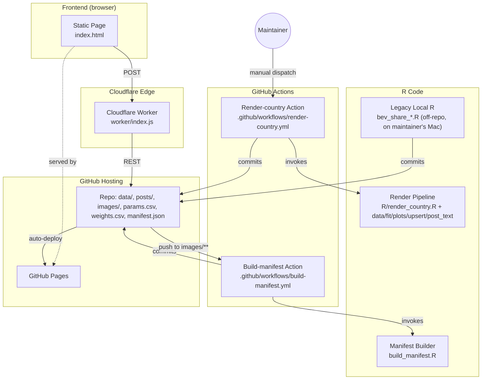

# 02 · Components

This is the application inventory. For each component: what it is, where it lives, what it depends on, why it exists in this shape (rationale).

## Component map


```mermaid
flowchart TB
    subgraph Frontend["Frontend (browser)"]
        SP["Static Page<br/>index.html"]
    end

    subgraph Edge["Cloudflare Edge"]
        WK["Cloudflare Worker<br/>worker/index.js"]
    end

    subgraph CI["GitHub Actions"]
        RA["Render-country Action<br/>.github/workflows/render-country.yml"]
        BA["Build-manifest Action<br/>.github/workflows/build-manifest.yml"]
    end

    subgraph R["R Code"]
        RP["Render Pipeline<br/>R/render_country.R + data/fit/plots/upsert/post_text"]
        MB["Manifest Builder<br/>build_manifest.R"]
        LR["Legacy Local R<br/>bev_share_*.R (off-repo, on maintainer's Mac)"]
    end

    subgraph Host["GitHub Hosting"]
        GP["GitHub Pages"]
        REPO["Repo: data/, posts/, images/, params.csv, weights.csv, manifest.json"]
    end

    Maintainer((Maintainer))

    SP -.served by.-> GP
    SP -- POST --> WK
    WK -- REST --> REPO
    RA -- invokes --> RP
    BA -- invokes --> MB
    RA -- commits --> REPO
    BA -- commits --> REPO
    LR -- commits --> REPO
    Maintainer -- manual dispatch --> RA
    REPO -- "push to images/**" --> BA
    REPO -- auto-deploy --> GP
```

---

## 2.1 Static Page (`index.html`)

### What it is

A single ~6000-line HTML file with inline CSS and inline JavaScript. No build step, no framework, no transpiler. Served verbatim from `master:index.html` by GitHub Pages.

### Tabs

| Tab | Source of data | What it shows |
|---|---|---|
| Gallery | `manifest.json` + `images/<period>/<slug>_*.png` | Grid of all PNGs filterable by country, type, period |
| Thresholds | `params.csv` | When each country reaches 20%/50%/80% BEV under the current model |
| Durations | `params.csv` | How many years each country needs to traverse 20→80% |
| Time Interval | `params.csv` | Interval chart: horizontal bar per country from From%→To% BEV share, dot at Mid%; sortable by start/mid/end/duration, region encoded by color, variant (Whole / Private / Industry / HDV / Used / …) encoded by bar shape (solid / diagonal / cross-hatch / thick stripes / outline). Custom From/Mid/To inputs default to 20/50/80. PNG and SVG export with `@LeRaffl` tag, created timestamp (incl. time, UTC) and `data per <oldest> (<country>) – <newest>` footer. |
| Builder | `params.csv` + `weights.csv` | Weighted aggregate BEV/ICE/PHEV curves for arbitrary country sets or predefined groups (EU, World, …). |
| Compare | `params.csv` + `weights.csv` + `data/<Country>.csv` | Side-by-side overlay of 2–3 curves (same powertrain, same variant) for individual countries or aggregated regions. Overlays observed annual data points (volume-weighted share from raw CSVs, summed across member countries for aggregates). |
| Fleet | `fleet/*.csv`, `fleet_meta.json` | Bestand projection (separate from new-registrations data) |
| World Map | `params.csv` + `weights.csv` | Choropleth of current BEV share |
| FAQ | inline `FAQ_DATA` array | Searchable Q&A |
| Submit Data | Worker `POST /submissions` | Form for new monthly data points + corrections |
| Feedback & Questions | Worker `GET/POST /issues` | Public discussion thread mirrored from GitHub Issues |

### Notable in-page features

- **Copy-post button** on every Gallery card: fetches `posts/<slug>.txt` and writes to clipboard
- **FAB** (floating action button) bottom-right: opens the feedback modal from any tab with the current tab's filters captured as context
- **Math captcha** on feedback submit (3 + 4 = ?), **honeypot** on both feedback and submit
- **Lightbox** on chart click → larger image + Download link

### Reconstructed rows (`v1 = 0` anchor recovery)

`params.csv` stores `v1` at CSV precision. A curve whose real `v1` is small
enough rounds to a literal `0` in the file, which is not a usable Weibull. The
page does not drop those rows: `recoverV1FromAnchor()` / `applyV1Recovery()`
reconstruct `v1` at load time by anchoring the model to the row's most recent
observation, and every `params.csv` consumer on the page (Thresholds, Durations,
Time Interval, Builder, World Map) then works off the recovered value.

**Consequence worth knowing when quoting these rows:** a recovered curve is
pinned to one observation rather than fitted across the series, so its dates can
sit a few months either side of what a full re-fit would produce.

**Where `v1 = 0` comes from** is documented in full in
[08-deploy-ops.md § Indonesia v1=0 corruption](08-deploy-ops.md#indonesia-v10-corruption)
— that section is canonical for the cause, the backend self-heal
(`R/upsert.R::heal_v1_zero_rows()`) and why both layers are kept. Read it before
changing anything here.

**Do not hardcode a country list.** The trigger is `v1 == 0` *exactly*: a
property of a row's rounding at a point in time, not of a country. It moves as
parameters are re-fitted and as the corruption in §8.8 recurs. A note on the
Thresholds tab used to name Indonesia; it was dropped in the 2026-09 redesign and
had by then gone stale anyway — Indonesia's `v1` currently reads `-6.7e-17`, near
zero but not *at* zero, so it is fitted normally. Note that this is **not** a
permanent state: §8.8 describes the corruption as episodic, so Indonesia can
re-enter the recovery path at any time. To see what is affected right now, read
`params.csv` and select `float(v1) == 0`.

**Known gap, as of 2026-09.** The two rows currently on `v1 = 0` are
`Uruguay|Buses` and `Cyprus|HDV`, and neither is the §8.8 corruption pattern:
both carry `v2 = 4.15` exactly — a round number where every genuine `optim()`
output in the file is a long float — together with `ttm_bev_share = 0`. They look
like placeholder rows for which no fit was ever produced, rather than clobbered
ones. Two consequences follow:

- `heal_v1_zero_rows()` will never touch them. Its fingerprint is
  `abs(v1) < 1e-25 **AND v2 >= 10**`, and 4.15 fails the second test, so the
  backend layer does not apply and they sit permanently on the frontend net.
- `recoverV1FromAnchor()` anchors them at the `v2 < 10` branch, i.e. **50 % BEV
  share at `data_per`** — for two rows whose measured TTM share is `0`. Whatever
  those rows render is an artefact of that assumption, not a fit.

Not fixed here because it is a data question rather than a frontend one, but do
not quote either row until it is resolved.

### Why a single file with no build?

- The maintainer runs the project solo and wants to be able to edit the page in any text editor without setting up Node/Webpack/etc.
- GitHub Pages serves it as-is. No CI build required for the read path.
- LLMs and AI agents can read the entire UI in one pass.
- Trade-off accepted: harder to organise, no component reuse, no type safety.

---

## 2.2 Cloudflare Worker (`worker/index.js`)

### What it is

A ~600-line JavaScript module deployed to Cloudflare's V8-isolate runtime. The single bridge between the read-only static page and the write-side of GitHub.

### Endpoints

| Method | Path | Purpose |
|---|---|---|
| `GET`  | `/issues` | List feedback issues (cached 60 s) |
| `POST` | `/issues` | Create a feedback issue |
| `POST` | `/submissions` | Open a PR with one or more upserted rows in `data/<Country>.csv` |
| `OPTIONS` | * | CORS preflight |

Full contracts → [04-interfaces.md](04-interfaces.md).

### What's in the env

- `GITHUB_TOKEN` (secret) — fine-grained PAT with Issues R/W, Contents R/W, Pull requests R/W, Metadata R, scoped to this repo
- `RATE_KV` (binding) — Cloudflare KV namespace used as a per-IP counter with 1-hour TTL
- `GITHUB_OWNER`, `GITHUB_REPO` (vars) — non-secret config

### How it gets deployed

The Worker is linked to this repository via **Cloudflare Workers Builds** (configured in the Cloudflare dashboard → Workers → `leraffl-gallery-feedback` → Settings → Builds). Any push to `master` that touches `worker/` triggers `npx wrangler deploy` from the `worker/` subdirectory inside a Cloudflare-managed build container. No local CLI step needed for routine deploys; `wrangler` from the maintainer's Mac is the manual fallback. Secrets (`GITHUB_TOKEN`) live in the Worker's runtime env and are not read from the repo. Full deploy runbook in [08-deploy-ops.md § 8.1](08-deploy-ops.md#81-deploy-the-worker).

### Why a Worker and not Lambdas / Vercel functions / a tiny VPS?

- Cloudflare Workers free tier covers our load comfortably (we'd need >100k requests/day to leave it)
- Cold-start time is essentially zero (V8 isolates, not containers), so the page never feels slow
- The same Worker now hosts Feedback **and** Submit — adding new write endpoints is just another route, no new infrastructure
- Trade-off accepted: limited runtime API (no Node `fs`, no native modules), but everything we do is HTTP fetches so this is a fit

---

## 2.3 R Render Pipeline (`R/`)

### What it is

A set of small, focused R modules that turn `data/<Country>.csv` into the four canonical PNGs for that country, plus a `params.csv` row, a `weights.csv` row, and a `posts/<slug>.txt` social-media text.

### Files

| File | Responsibility | Shape |
|---|---|---|
| `R/data.R` | CSV loader, share derivations, TTM (rolling-12-month) aggregation | `load_country_csv(path)`, `compute_ttm_long(df)` |
| `R/fit.R` | Weighted regression with full time-history loop | `fit_history(df, extrapol = 2200, confidence_level = 0.999)` |
| `R/plots.R` | The four ggplot2 plot constructors | `plot_bev_trajectory`, `plot_ice_bev_phev`, `plot_timer`, `plot_ttm_shares` |
| `R/upsert.R` | Line-level upsert into `params.csv` and `weights.csv` | `upsert_params`, `upsert_weights`, `data_per_from_df`, `compute_weight` |
| `R/post_text.R` | Build the social-media post text per country | `build_post_text(df, country, last_period = NULL)` |
| `R/render_country.R` | Entry point: orchestrates everything | `Rscript R/render_country.R <Country> [<Variant>]` |

### Key invariants

- `R/fit.R::fit_history` is **byte-for-byte the historical Germany script's regression code**, only renamed for country-agnostic use. Do not change the math without coordinating with the maintainer; threshold reproducibility for old runs depends on it.
- `R/data.R::compute_ttm_long` only emits a row when **every present fuel column** has a complete 12-month non-NA window. This is what makes the TTM stack hit 100% from the very first plotted period.
- `R/upsert.R::upsert_params` writes line-level — only the touched country/variant row changes. Previous attempts that round-tripped the whole CSV through `read.csv`/`write.table` caused noisy reformatting (scientific → decimal, trailing zero changes) and were reverted.

### Why split into so many files?

- The original Germany R script was 1360 lines mixing IO, math, plotting, Git operations, and Google Sheets. It was unreadable.
- Splitting by responsibility lets each module have a contract that's testable in isolation. `fit.R` doesn't know about plots; `plots.R` doesn't know about CSVs; `render_country.R` is the only orchestrator.
- The math file is now small enough to audit in one screen, which is essential because of invariant #1 above.

---

## 2.4 Manifest Builder (`build_manifest.R`)

### What it is

An R script that scans `images/` and writes `manifest.json`. The manifest is what the Static Page's Gallery tab fetches at load.

### Inputs and outputs

```
INPUT:  images/<YYYY-MM>/<slug>_<type>_<YYYYMMDD>.png   (recursively)
OUTPUT: manifest.json   (top-level, committed to repo)
```

`manifest.json` shape:

```json
{
  "updated": "2026-05-08",
  "images": [
    {
      "country": "Germany",
      "country_slug": "germany",
      "type": "ICE_BEV",
      "period": "2026-04",
      "date": "2026-05-08",
      "filename": "germany_ICE_BEV_20260508.png",
      "url": "images/2026-04/germany_ICE_BEV_20260508.png",
      "alt": "Germany ICE-BEV-Hybrid trajectory"
    }
  ]
}
```

### Why a separate manifest instead of letting the page list directories?

- GitHub Pages does not support directory listings. The page would have to either (a) hardcode every filename or (b) hit a backend.
- Pre-computing the manifest at push-time is free, fast, and lets the page stay completely static.

---

## 2.5 Render-country Action (`.github/workflows/render-country.yml`)

### What it is

A GitHub Action with two entry points and three inputs:

- **`workflow_dispatch`** — the maintainer's Run-workflow UI button, with a `country` and a single `variant` (dropdown).
- **`workflow_call`** — the reusable-workflow entry point, used only by the genuinely multi-**country** fetcher `fetch-acea.yml`, which fans it out one country at a time (`max-parallel: 1`) passing a single `variant` per country.
- **`variants`** — an optional pipe-separated list (`"Whole|Private|HDV"`) accepted on both triggers. When set it **overrides** `variant`, and the run renders each entry serially in one job. This is how the single-country fetchers (fetch-finland.yml, …) ask for all their touched variants at once: they `gh workflow run render-country.yml -f country=X -f variants=…`, which produces one top-level **"Render: X"** run in this workflow's history rather than a matrix of jobs nested inside the fetcher's own run.

### What it does

1. Checks out the repo (pinned to the branch tip via `ref: github.ref_name`, so a fetcher's just-committed data rows are present)
2. Sets up R via `r-lib/actions/setup-r`
3. Installs the R package set (ggplot2, scales, grid, png, ggtext, viridis, showtext, sysfonts, glue) with apt prebuilds
4. Builds the variant work-list (`variants` if set, else the single `variant`) and runs `Rscript R/render_country.R <country> <v>` for each entry **serially**, collecting any failures without aborting the rest (mirrors the old fail-fast:false matrix)
5. Commits the resulting `images/<period>/*.png`, `params.csv` row updates, `weights.csv` row updates, `posts/<slug>.txt`, `posts/<slug>_<period>.txt` **once** for all rendered variants via `EndBug/add-and-commit`
6. Dispatches `build-manifest.yml` explicitly so the generated images are indexed immediately (one dispatch per run, not per variant)
7. Fails the run at the end if any variant failed — so a broken render shows as a red **"Render: X"** entry in the Actions list, while the variants that did render are still committed and deployed

### Why serial-in-one-run for multiple variants?

Every render upserts the **shared** `params.csv`/`weights.csv` (and `heal_v1_zero_rows` rewrites them wholesale). Two renders for the same country running concurrently race on that commit — an earlier per-variant `gh workflow run` fan-out did exactly this and failed intermittently with "conflicting files". Rendering the variants serially inside a single run removes the race without a `max-parallel: 1` matrix, and keeps the whole country's refresh as one scannable run. The per-country `concurrency` group additionally prevents two runs for the *same* country from overlapping.

### Why manual trigger only and not on `data/` push?

Submission PRs typically batch multiple corrections in one merge. Auto-rendering on every `data/` push would re-render before the maintainer's review of the merge result. Manual trigger (plus the fetchers' explicit dispatch) keeps the maintainer in the loop and lets them choose which country to refresh.

---

## 2.6 Build-manifest Action (`.github/workflows/build-manifest.yml`)

### What it is

A GitHub Action that rebuilds `manifest.json` whenever PNG files change.

### Triggers

- Push to `images/**` (any new/deleted/renamed image)
- Push to `build_manifest.R` (the builder itself changed)
- Daily cron at 03:17 UTC as a self-healing fallback
- Manual dispatch, including the explicit dispatch from Render-country after a successful render commit

### Why the cron?

Defensive — if a manual upload bypasses the Render action (legacy local R workflow), the cron still picks it up within a day.

---

## 2.7 Fetch Actions (overview)

A family of country-specific `fetch-<source>.yml` workflows that scrape national registration sources, upsert the new monthly row into the relevant `data/<Country>.csv`, and — when a CSV actually changed — dispatch `render-country.yml` to redraw the charts. Each follows the same shape (`workflow_dispatch` + `schedule`, Python script under `scripts/fetch_<source>.py`, EndBug commit, then `gh workflow run render-country.yml`) but the parser is intentionally country-local — every statistics agency has its own URL scheme, file layout, and quirks that don't justify a generic abstraction.

A single-country fetcher dispatches **once** with the pipe-separated list of its touched variants (`-f country=X -f variants="Whole|HDV|…"`); render-country.yml renders them serially in one run, so each fetcher's render is one top-level **"Render: X"** entry in the Render-country-charts history (easy to scan from the mobile GitHub app). The one exception is the multi-**country** fetcher `fetch-acea.yml`, which still calls render-country.yml as a reusable workflow via a `max-parallel: 1` matrix over the changed countries — see [05-flows.md § Flow N](05-flows.md).

| Workflow | Source | Variants written | Schedule (UTC) |
|---|---|---|---|
| [`fetch-acea.yml`](../../.github/workflows/fetch-acea.yml) | ACEA monthly PDF press release | Always-list (16): Belgium, Bulgaria, Croatia, Cyprus, Czechia, Estonia, France, Greece, Hungary, Iceland, Latvia, Lithuania, Malta, Romania, Slovakia, Slovenia. Conditional-list: Norway, Switzerland — written only if the existing source is exactly `ACEA` | 08:40 UTC, 16th → EOM |
| [`fetch-acea-cv.yml`](../../.github/workflows/fetch-acea-cv.yml) | ACEA's quarterly-cumulative Commercial Vehicle PDF press releases (`scripts/fetch_acea_cv.py`) | `Vans` + `HDV` + `Buses` for a maintainer-curated 21-country roster (not the same list as fetch-acea.yml — adds Germany/France/Sweden, which have no national commercial-vehicle source despite having one for passenger cars; excludes Austria/Denmark/Finland/Luxembourg/Netherlands/Spain, which do; Poland stays in as a conditional case). Skips any file whose existing source isn't `ACEA`, so Poland's national HDV/Vans/Buses CSVs are left untouched. Reconstructs genuine Q1/Q2/Q3/Q4 rows from ACEA's cumulative Q1/H1/Q1-Q3/FY checkpoints, falling back to a yearly row only with no quarterly baseline yet — see [38-source-acea-cv.md](38-source-acea-cv.md) § 1a for the roster reasoning | 10:15 UTC, four windows (Jan/Apr/Jul-Aug/Oct) — see 08-deploy-ops.md § 8.11 |
| [`fetch-albania.yml`](../../.github/workflows/fetch-albania.yml) | DPSHTRR Open Data via its public Looker Studio report (headless Chromium) | `Whole` + `HDV` + `Buses` + `2-Wheelers` — first registrations, new **and** imported used | 07:00 UTC, 10th → 28th |
| [`fetch-austria.yml`](../../.github/workflows/fetch-austria.yml) | Statistik Austria DE2/DE3 `.ods` (via the Cloudflare Worker relay — the source blocks datacenter IPs) | `Whole` + `HDV` + `Vans` | 09:25 UTC, 8th → 22nd |
| [`fetch-brazil.yml`](../../.github/workflows/fetch-brazil.yml) | ANFAVEA yearly Excel workbook | `Whole` (cars + light commercials) | 08:50 UTC, 10th |
| [`fetch-canada.yml`](../../.github/workflows/fetch-canada.yml) | StatCan WDS cube 20-10-0025 | `Whole` (EU M1) + `Pickups` + `Vans` | 06:40 UTC, 8th → 20th of Mar/Jun/Sep/Dec |
| [`fetch-chile.yml`](../../.github/workflows/fetch-chile.yml) | ANAC (Mercado Automotor + Cero y Bajas Emisiones PDFs) | `Whole` | 08:20 UTC, 14th → EOM |
| [`fetch-china.yml`](../../.github/workflows/fetch-china.yml) | CPCA monthly market analysis (article + OCR of the NEV slide) | `Whole` (retail) + `Wholesale` to a separate CSV | 11:00 UTC, 1st → EOM |
| [`fetch-colombia.yml`](../../.github/workflows/fetch-colombia.yml) | ANDI/FENALCO Boletín PDF (datos RUNT) | `Whole` — single combined Hybrid bucket | 07:30 UTC, 5th → 25th |
| [`fetch-denmark.yml`](../../.github/workflows/fetch-denmark.yml) | Statbank BIL53 (`api.statbank.dk`) | `Whole` + `Private` + `Industry` + `HDV` + `Vans` | 05:15 UTC, 1st → 15th |
| [`fetch-finland.yml`](../../.github/workflows/fetch-finland.yml) | StatFin 121d (`pxdata.stat.fi` PxWeb) | `Whole` + `Private` + `Industry` + `HDV` + `Vans` + `Buses` | 04:40 UTC, 1st → 15th |
| [`fetch-indonesia.yml`](../../.github/workflows/fetch-indonesia.yml) | GAIKINDO wholesales PDF (ProjectSend portal, client login) | `Whole` (auto-render) + `Pickups` + `HDV` + `Buses` (fetch-only) | 09:35 UTC, 10th → EOM |
| [`fetch-ireland.yml`](../../.github/workflows/fetch-ireland.yml) | SIMI motorstats (`stats.simi.ie`, Inertia SPA) | `Whole` + `Vans` + `HDV` + `Buses` | 04:00 & 13:00 UTC, 1st → 5th |
| [`fetch-italy.yml`](../../.github/workflows/fetch-italy.yml) | UNRAE «struttura del mercato» PDF; LCV from the separate Comunicato Stampa | `Whole` + `Rental` + `NonRental` + `Vans` | 06:00/10:00/14:00/18:00 UTC, 1st → 3rd (passenger); 10:00/14:00/18:00 UTC, 13th → 16th (vans) |
| [`fetch-japan.yml`](../../.github/workflows/fetch-japan.yml) | JADA monthly registrations file (XLSX preferred, PDF fallback) | `Whole` — 登録車 only, kei cars excluded | 08:00 UTC, 1st → EOM |
| [`fetch-luxembourg.yml`](../../.github/workflows/fetch-luxembourg.yml) | STATEC SDMX 2.1, dataflow DF_D6122 (`lustat.statec.lu`) | `Whole` + `Vans` + `HDV` | 06:45 UTC, 1st → 15th |
| [`fetch-malaysia.yml`](../../.github/workflows/fetch-malaysia.yml) | data.gov.my cars dataset (Parquet) | `Whole` | 07:00 UTC, 15th → EOM |
| [`fetch-nepal.yml`](../../.github/workflows/fetch-nepal.yml) | Department of Customs FTS XLSX (`customs.gov.np`) — HS 8703 **imports**, not registrations | `Whole` + `3-Wheelers` | 07:50 UTC, daily |
| [`fetch-netherlands.yml`](../../.github/workflows/fetch-netherlands.yml) | RDW via Swing BI (`duurzamemobiliteit.databank.nl`, Deno Deploy relay) | `Whole` + `Used` + `HDV` | 06:30 UTC, 1st → 15th |
| [`fetch-new-zealand.yml`](../../.github/workflows/fetch-new-zealand.yml) | transport.govt.nz `/inner` (CKAN fallback) | `Whole` | **disabled** — cron commented out 2026-06 (Imperva); `workflow_dispatch` only, data entered by hand |
| [`fetch-poland.yml`](../../.github/workflows/fetch-poland.yml) | PZPM eRegistrations XLSX (from the CEP register) | `Whole` + `Vans` + `HDV` + `Buses` | 09:30 & 13:30 UTC, 6th → 10th |
| [`fetch-portugal.yml`](../../.github/workflows/fetch-portugal.yml) | ACAP via motordata.pt (`chartdata_novo.php`) | `Whole` (auto-render) + `Vans` + `HDV` + `Buses` (fetch-only, thin history) | 17:30 & 20:30 UTC, 1st → 5th |
| [`fetch-singapore.yml`](../../.github/workflows/fetch-singapore.yml) | LTA Monthly Vehicle Statistics, file M03 (PDF) | `Whole` | 08:00 UTC, 15th → EOM |
| [`fetch-spain.yml`](../../.github/workflows/fetch-spain.yml) | DGT matriculaciones microdata (fixed-width, monthly zip) | `Whole` + `Rental` + `NonRental` + `Used` + `Vans` + `HDV` + `Buses` + `2-Wheelers` — one download, every variant | 06:30 UTC, 1st → 16th |
| [`fetch-sweden.yml`](../../.github/workflows/fetch-sweden.yml) | SCB PxWeb `PersBilarDrivMedel` (`api.scb.se`) | `Whole` | 05:50 UTC, 1st → 15th |
| [`fetch-thailand.yml`](../../.github/workflows/fetch-thailand.yml) | TAI / AIU member portal JSON API (`taiapi.thaiauto.or.th:3000`, cookie login) | `Whole` (Passenger Car + Pickup Truck) + `HDV` + `Buses` + `3-Wheelers` | 04:40 UTC, 1st → 20th |
| [`fetch-turkey.yml`](../../.github/workflows/fetch-turkey.yml) | TÜİK «Motorlu Kara Taşıtları» bulletin (id auto-discovered; fuel table OCR'd) | `Whole` — otomobil only, combined Hybrid bucket | 08:30 UTC, 15th → EOM |
| [`fetch-uruguay.yml`](../../.github/workflows/fetch-uruguay.yml) | ACAU «Compilado YYYY» xlsx | `Whole` (AUTOS + SUV) + `Vans` + `HDV` + `Buses` | 08:10 UTC, 1st → EOM |
| [`fetch-usa.yml`](../../.github/workflows/fetch-usa.yml) | ANL «Total Sales for Website» PDF | `Whole` — trailing 3-month window, re-written each run to absorb ANL revisions | 10:30 UTC, 10th → EOM |

Countries with a `data/<Country>.csv` but **no** auto-fetcher are maintained by hand (legacy local R pipeline or public-submit PRs): **Australia, Georgia, Germany, South Korea, UK**, plus **India** (which has no committed CSV at all) and **New Zealand**, whose fetcher exists but whose cron is disabled — see its row above. ACEA's conditional-list countries (Norway, Switzerland) stay on ACEA until their source flips.

For countries that were **investigated and deliberately not added** — and why (e.g. Argentina, Mexico — paywalled or with structural undercount) — see [14-data-source-gaps.md](14-data-source-gaps.md). That's the reference for the "why isn't \<country\> on the map?" question. Colombia was originally shelved there and is now ingested via ANDI/FENALCO ([18-source-colombia.md](18-source-colombia.md)).

Per-flow design notes, sequence diagrams, and validation tables live in [05-flows.md](05-flows.md) (Flows H–P). Cron schedules in one place: [08-deploy-ops.md § 8.11](08-deploy-ops.md#811-cron-schedule-overview).

---

## 2.8 GitHub Pages

### What it is

A built-in GitHub feature that serves `master:/index.html` (and any referenced static asset) at `https://leraffl.github.io/LeRaffl-Gallery/`. Configured in repo Settings → Pages.

### What it serves

The entire repo content is technically reachable, but the page only references:
- `index.html` (entry)
- `manifest.json`
- `params.csv`, `weights.csv`
- `images/<period>/*.png`
- `posts/<slug>.txt`
- `fleet/*.csv`, `fleet/fleet_meta.json`

### Caching

GitHub Pages serves with default `Cache-Control: max-age=600`. The page uses `cache: 'no-store'` on critical fetches (manifest, posts) so corrections appear fast.

---

## 2.9 Builder Snapshot Script (`scripts/snapshot_builder.py`)

### What it is

A small Python script that mirrors the in-page Builder logic and writes a snapshot of the aggregated BEV / ICE / PHEV curves to `builder_history/<date>.csv` plus a metadata entry into `builder_history/index.json`. One snapshot per run; the run is driven by `.github/workflows/snapshot-builder.yml` on a monthly cron.

### Inputs and outputs

```
INPUT:  params.csv, weights.csv
OUTPUT: builder_history/<YYYY-MM-DD>.csv   (14 groups × 351 year-steps)
        builder_history/index.json         (updated in place)
```

### Key invariants

- Mirrors `index.html`'s `bevShareIndex` / `iceShareIndex` / `getT0Years` / `baselineYearOf` / `calendarYearOrNaN`. The JS quirk that `Number('') === 0` is **not** something either side leans on: both guard every calendar-year field through `calendarYearOrNaN` / `calendar_year_or_nan()`, so an absent `baseline_year` column reads as NaN rather than "baseline year 0". **2026-06 calendar-year fix:** both `index.html` and this script feed the calendar year directly (`x = year`) instead of `year + 1`; see the `verschiebung` glossary entry and `inv_x_years` comment in `index.html`.
- `baseline_year_of()` returns NaN for a production row (no `baseline_year` column, empty `baseline_date`) and is **not** part of the finiteness gate in `compute_group_curve()` — `index.html` computes it and does not gate on it either. Gating on it would silently empty every snapshot.
- > ℹ️ **`builder_history/` spans two x-bases; snapshots dated 2026-06-25 through 2026-09-09 are one year off.** Resolved in
  > [#219](https://github.com/LeRaffl/LeRaffl-Gallery/issues/219); the seam is a
  > closed band, not an open bug, but read this before comparing snapshots across it.
  >
  > `get_t0_years()` used to read an absent `baseline_year` as `0` and return
  > `(t0 - 0) + 1`. Before the 2026-06 calendar-year fix that cancelled against
  > the `x = year + 1` the script also used, so `z = x - t0` came out right by
  > accident. The 2026-06 fix removed the first offset and left the second
  > exposed, putting those snapshots one year **late**; #219 removed the second.
  > Measurable in the committed files: the world 50%-crossing jumps +1.08 years
  > at 2026-06-25 against ~0.05 years of normal drift.
  >
  > **Those snapshots were rebuilt, not annotated**, so the series is on one
  > basis end to end and no correction is needed to compare any two entries.
  > #219 assumed the band could not be regenerated "without a historical
  > parameter store ([#220](https://github.com/LeRaffl/LeRaffl-Gallery/issues/220))";
  > that premise was wrong — `params.csv` and `weights.csv` are versioned, so
  > **git is that store**. See 2.13.
- Same v1=0 anchor recovery as `index.html::recoverV1FromAnchor()` (see *Reconstructed rows* under 2.1). A v1=0 row produces the same recovered Weibull on the page and in the snapshot — **this part of the mirror is genuinely still intact.** `applyV1Recovery()` passes the raw `r.t0` straight through on both sides and never calls `getT0Years()`, so the drift above cannot reach it. The recovery keeps R's own `verschiebung - 1` convention internally (`dt = year_model - (t0n - 1)`), which is why it is unaffected and must stay that way.
- Idempotent: running twice on the same `--date` overwrites the file; the workflow only commits on a content change. `update_index_json()` rewrites only `snapshots` and `updated`, leaving `basis_history` and any other top-level key intact.
- Regression tests: [`scripts/test_snapshot_builder.py`](../../scripts/test_snapshot_builder.py) (`python scripts/test_snapshot_builder.py` — no network, no dependencies, not wired into CI). They pin the #219 fix, the baseline branches that must still work, and `baseline_year_of()` staying out of the finiteness gate.
- No render trigger downstream — snapshots are pure read-only artefacts; the static page is not (yet) a consumer.

### Why a separate script instead of extending `R/render_country.R`?

The render pipeline produces per-country PNGs and updates `params.csv` / `weights.csv` — its output feeds the page. The snapshot is *downstream* of those files; it has no dependency on the R toolchain or on data ingestion. Keeping it as a small Python script (zero dependencies, matches the `scripts/fetch_*.py` pattern) means the snapshot workflow installs in ~5 s and doesn't have to re-mount the R action runner.

---

## 2.10 Snapshot-Builder Action (`.github/workflows/snapshot-builder.yml`)

### What it is

A GitHub Action that runs `scripts/snapshot_builder.py` on the 25th of each month at 09:00 UTC (after the bulk of in-month country fetches has settled) and commits the resulting `builder_history/` changes back to master.

### Triggers

- Monthly cron at 09:00 UTC on the 25th
- Manual dispatch with optional `--date YYYY-MM-DD` override (useful for testing or labelling a back-dated run)

### Why the 25th and not the 1st?

Most country fetchers (Brazil, Chile, Japan, ACEA) run during the first half of the month and finish writing their target month between the 10th and the 23rd. Snapshotting on the 25th means the recorded snapshot reflects the most complete picture available for the previous month before the next month's data starts arriving — the curve we store is the one a visitor would have seen on the page that day.

---

## 2.11 Legacy Local R Pipeline

### What it is

Per-country R scripts on the maintainer's Mac (`bev_share_<Country>_*.R`) that read directly from a Google Sheet and push images + params + weights to the repo. Off-repo; not part of CI.

### Status

Still functional and the maintainer's preferred path for fast iteration during data-collection. Output is byte-compatible with the new pipeline — same image filenames, same `params.csv` row format.

### Why keep it instead of migrating fully to the new pipeline?

- The maintainer can iterate in RStudio with breakpoints, `View(df)`, etc. — far faster than triggering CI.
- Google Sheets is still where the maintainer transcribes raw national data; until that flow moves to direct CSV editing, the local R is the bridge.
- The new pipeline is the **authoritative** path (used by the Render Action and any public submission). The local R is the **convenience** path. Both write the same files; whichever wins last wins.

---

## 2.13 Builder-History Rebuilder (`scripts/rebuild_builder_history.py`)

### What it is

A script that regenerates **any** past `builder_history/` snapshot from the `params.csv` / `weights.csv` that git holds for that date, by resolving the newest commit touching each file at or before the target date and re-running `snapshot_builder.py` over the recovered blobs.

### Why it exists

[#219](https://github.com/LeRaffl/LeRaffl-Gallery/issues/219) offered two ways to handle the one-year basis error and ruled out the better one:

> *"Cannot be regenerated without a historical parameter store, so this is blocked on #220."*

**That premise was wrong. `params.csv` and `weights.csv` are versioned — git is the historical parameter store.** The snapshots were therefore repaired rather than merely labelled, and #220 is no longer a prerequisite for a correct history (it remains useful for other reasons, but not for this).

### Evidence it reconstructs rather than approximates

| check | result |
|---|---|
| Rebuild `2026-09-09` from that date's commit vs the committed file | identical to **0.0000 pp** once the known one-year shift is applied |
| Rebuild the four May snapshots (already on the correct basis) | reproduced to within **0.008 years** — residual is params moving inside the snapshot day |
| Rebuild the six offset snapshots | each moved by exactly **−1.000 years** |
| Largest step between consecutive snapshots after the rebuild | **0.442 years**, i.e. ordinary drift — the +1.08-year seam is gone |

### Key invariants

- **The date list is explicit** (`SNAPSHOT_DATES`), not a resampling of git. The ten dates that were really taken are preserved — a snapshot records that a run happened, and renaming that is worse than correcting it — plus a monthly backfill on the 25th, the snapshot-builder cron day.
- **`weights.csv` first exists 2025-12-22**, which is the hard floor for a *weighted* aggregate. Earlier params-only dates are skipped rather than aggregated unweighted, because an unweighted curve is a different quantity wearing the same name.
- `params.csv` and `weights.csv` are resolved **independently**; they usually move in one commit but not always (2025-12-25, 2026-05-31 and 2026-08-25 each draw them from different commits).
- Re-running is safe and idempotent: the output depends only on git history and the current `snapshot_builder.py`.

### Consequence for the series

The history now spans **2025-12-25 → 2026-09-09** (15 snapshots) instead of starting 2026-05-20, because the inputs existed in git long before anyone took the first snapshot. The world-aggregate 50 %-crossing estimate visibly drifts 2030.9 → 2032.0 → 2031.7 across that span, which is the "what did I estimate back then?" question [#220](https://github.com/LeRaffl/LeRaffl-Gallery/issues/220) asks — now answerable for dates before the feature existed.

### The cohort set (`--cohort`)

`rebuild_builder_history.py --cohort` writes a **second** series into `builder_history/cohort/`, where every frame is restricted to the countries present on *all* snapshot dates (currently **44**).

This exists because the `world` group grows from 44 to 52 countries across the series, so a naive time-lapse animates the gallery being built as much as the market moving. Measured on the 50 %-crossing:

| | span across the 15 frames |
|---|---|
| all countries as of each date | 2030.87 → 2032.01 — **1.13 years** |
| fixed 44-country cohort | 2030.87 → 2031.50 — **0.63 years** |

So roughly **half** of the apparent drift is composition, not the model changing its mind. Both sets are kept; the difference between them is the finding.

Countries are matched on **identity, not spelling**: `params.csv` carried `New Zealand` until 2026-01, `NewZealand` through 2026-03, then `New Zealand` again. A cohort built on raw strings silently drops it and reports 43.

## 2.14 Time-lapse Series Builder (`scripts/build_builder_series.py`)

### Responsibility

Pivots `builder_history/` into the shape a browser wants: one file per group carrying **every** snapshot date for **both** country sets.

```
INPUT:  builder_history/<date>.csv          (all groups, one date)
        builder_history/cohort/<date>.csv
OUTPUT: builder_history/series/<group>.json (one group, all dates, both sets)
        builder_history/series/index.json   (groups, dates, cohort list)
```

### Why a separate artefact

The archive is 197 KB per snapshot and 5.8 MB in total. A reader looking at one group would otherwise download all fourteen, fifteen times over. The pivoted form is **~39 KB per group**, and the panel fetches only the group on screen.

Resolution drops from 0.1-year to **0.5-year steps**. The stored curves are smooth fits; at animation speed the finer grid is invisible and costs five times the bytes.

**Empty cells stay empty.** `params.csv` carried no ICE fit before 2026-01, so the oldest frame has no `ice_share`/`phev_share` at all. Those become `null` and the chart sets `connectgaps: false`, drawing a gap — a `0.0` there would assert "no combustion cars", the chart-level form of the no-split-column invariant in `AGENTS.md`.

### Regeneration

`.github/workflows/snapshot-builder.yml` runs it right after `snapshot_builder.py`, so a new snapshot reaches the panel in the same commit. Output is byte-identical on re-run.

## 2.15 Time-lapse panel (`index.html`, Builder tab)

Reads `builder_history/series/`, lazily — only when `#builder` is opened, and only the selected group.

- **Group** — the 14 aggregate groups the archive carries.
- **Countries** — `Fixed cohort` (default) or `All covered on each date`. Choosing the latter surfaces a marked warning naming the coverage growth, because that view genuinely mixes two effects.
- **Transport** — play (one pass, resting on the newest frame), step, and a scrub slider.
- Behind the current frame, every other frame's BEV curve is drawn faint, so the movement reads as a shape and not only as motion.
- Readout: date, data-through period, country count, weighted volume, and the interpolated BEV-50 % year (`null` when the curve never reaches it in range — "not in this window" is a real answer and is not faked with an endpoint).

It is deliberately a **separate panel** rather than a mode of the Builder above: the archive holds fixed aggregate *groups*, not arbitrary country picks, so folding it into the country selector would promise a view the data cannot produce.

## See also

- [03-data-objects.md](03-data-objects.md) — what each component reads/writes
- [04-interfaces.md](04-interfaces.md) — Worker endpoint contracts
- [05-flows.md](05-flows.md) — how the components dance together for each user journey
- [08-deploy-ops.md](08-deploy-ops.md) — how to deploy/trigger each component
