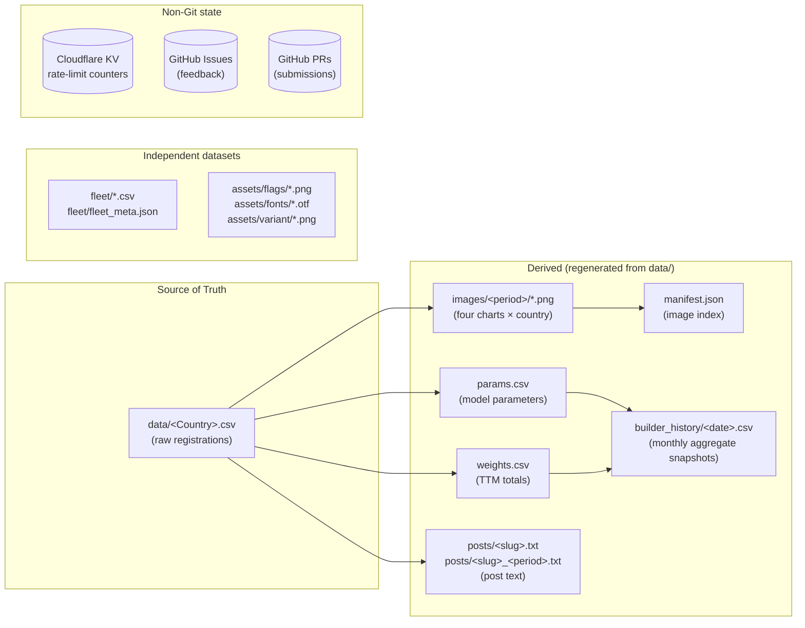

# 03 · Data Objects

Every persistent piece of data in the system, in one place. Schema, owner, lifecycle, intentional design choices.

## Inventory at a glance



## 3.1 Country Raw Data

### Where

`data/<Country>.csv` for variant "Whole" (the default).
`data/<Country>_<Variant>.csv` for non-Whole variants. Active for Netherlands
(`data/Netherlands_Used.csv`, `data/Netherlands_HDV.csv`), Denmark
(`data/Denmark_Private.csv`, `data/Denmark_Industry.csv`, `data/Denmark_HDV.csv`,
`data/Denmark_Vans.csv`), Finland (`data/Finland_Private.csv`,
`data/Finland_Industry.csv`, `data/Finland_HDV.csv`, `data/Finland_Vans.csv`,
`data/Finland_Buses.csv`) and Ireland (`data/Ireland_Vans.csv`,
`data/Ireland_HDV.csv`, `data/Ireland_Buses.csv`); R/render_country.R also
retains a fall-through to the single-CSV-with-variant-column layout so countries
that haven't been migrated yet still render.

Examples: `data/Germany.csv`, `data/Türkiye.csv`, `data/New Zealand.csv`, `data/Netherlands_HDV.csv`.

### Schema

CSV with header. **Wide-but-sparse**: per-country only the fuel columns that the source actually reports.

| Column | Required | Type | Notes |
|---|---|---|---|
| `period` | yes | `YYYY-MM` | Month-resolution. Quarterly rows use the middle month (Q1→Feb, Q2→May, Q3→Aug, Q4→Nov). Yearly rows use July (`YYYY-07`). |
| `time_interval` | yes | `monthly` \| `quarterly` \| `yearly` | Drives the post-text "TTM" computation and the chart x-axis treatment. |
| `variant` | yes | string | Always `Whole` for top-level country files. Reserved for future per-CSV variants. |
| `source` | yes | string | URL or short name (`KBA`, `Statistik Austria`). Carried per-row so the maintainer can audit which row came from where. |
| `BEV` | yes | numeric | Battery electric vehicles registered in the period. |
| `PHEV` | optional | numeric | Plug-in hybrid. Absent in Türkiye, Georgia. |
| `EREV` | optional | numeric | Extended-range EVs (subset of PHEV in some sources). Currently only China. |
| `HEV` | optional | numeric | Full hybrid. For countries that report a single "Hybrid" total without splitting (Türkiye, Georgia), this column carries the total and the post-text labels it as "Hybrid". |
| `MHEV` | optional | numeric | Mild hybrid. Reserved; not currently in any active CSV. Treated as a subset of HEV (which is a subset of ICE) in every output chart. |
| `PETROL` | optional | numeric | Conceptually pure-petrol ICE. *Caveat:* a small number of source statistics today fold petrol-HEV variants into this column rather than the HEV column. Improving the upstream split is a known data-quality task; for now the headline ICE/BEV/PHEV trajectory is unaffected because all of it ends up in the ICE bucket either way. |
| `DIESEL` | optional | numeric | Conceptually pure-diesel ICE. Same caveat as `PETROL` — a few sources fold diesel-HEV here. |
| `GAS`, `CNG`, `LPG` | optional | numeric | Reserved for sources that split natural-gas variants. In practice most countries' source data folds these into `OTHERS`. Always counted as ICE in the output charts. |
| `FLEXFUEL` | optional | numeric | Country-specific (Brazil-relevant; some Sweden rows). Counted as ICE in the output charts. |
| `ETHANOL` | optional | numeric | Reserved; mostly seen folded into `OTHERS` upstream. ICE in the output charts. |
| `OTHERS` | optional | numeric | Catch-all bucket — typically absorbs `GAS`/`CNG`/`LPG`/`ETHANOL` when the source doesn't split them. ICE in the output charts. |
| `ICE` | optional | numeric | Reported when source gives a single ICE total without petrol/diesel breakdown (China, USA, South Korea, Thailand, Chile). |
| `TOTAL` | yes | numeric | Sum of everything for the period. |
| `notes` | optional | string | Free text for the submitter or maintainer. |

### Owner / lifecycle

- **Author**: Maintainer (when transcribing from source) or Public Visitor (via Submit Data form, then merged after review).
- **Created**: Per-country, when the country is added to the project.
- **Updated**: When a new period arrives or when older data is corrected upstream. Upserts are keyed on `(period, variant)`.
- **Deleted**: Never expected. Deleting a row would make the historical chart incomprehensible.

### Why wide-but-sparse and not long format?

- Diff readability: a corrected April row in Wide format is one CSV line edit. In Long format it would be 5–8 separate rows changing.
- Editor-friendliness: spreadsheet apps open Wide naturally. Long needs a pivot to read.
- Schema flexibility: adding a new fuel category for one country is a new column; old rows stay byte-identical because empty cells are valid.

### Why one file per country and not one mega-CSV?

- PR diffs only touch one country at a time.
- Different countries have different categorical schemas; one big CSV would either be 20+ columns wide or split into smaller subsets.
- Performance is irrelevant at this scale (largest country = ~250 rows). Discoverability and diffability win.

### Country-specific column mappings (applied at extraction)

Some sources use non-canonical column names. The Excel→CSV extraction normalises:

| Source column | Canonical column | Country |
|---|---|---|
| `OTHER` | `OTHERS` | Malta |
| `HYBRIDS` | `HEV` | Türkiye (single hybrid bucket) |
| `Hybrid` | `HEV` | Georgia (single hybrid bucket) |
| `PETROL-GAS` | `PETROL` | Georgia (treated as ICE/petrol per maintainer convention) |
| `Benzine` | `PETROL` | Netherlands |
| `Overig` + `FCEV` | `OTHERS` | Netherlands (FCEV folded — single-digit units/month) |

### Netherlands (per-variant files)

Netherlands is the first country split into per-variant CSVs:

| Variant | File | What it covers |
|---|---|---|
| `Whole` | `data/Netherlands.csv` | Instroom Personenauto Nieuw — newly-registered passenger cars. Includes pre-2018 backfill from the maintainer's Google Sheet. |
| `Used` | `data/Netherlands_Used.csv` | Personenauto Occasion import (sum of `> 90 dgn` + `<= 90 dgn` sub-categories). |
| `HDV` | `data/Netherlands_HDV.csv` | Zware bedrijfsvoertuigen Nieuw — heavy goods vehicles (≈ N-class trucks ≥3500kg). |

Netherlands also has an **HEV gap** (RDW doesn't split full hybrids; they fold into Benzine/Diesel) and **FCEV folded into OTHERS** (~1 unit/month — negligible).

The full source-playbook for this pipeline — Swing endpoint flow, variant rationale, schedule, fragility, maintenance recipes — lives in [10-source-netherlands.md](10-source-netherlands.md). Read that doc before changing anything in [scripts/fetch_netherlands.py](../../scripts/fetch_netherlands.py).

### Denmark (per-variant files)

Denmark uses the same per-variant CSV layout, sourced from Statistics Denmark's StatBank table BIL53 (`api.statbank.dk`):

| Variant | File | What it covers |
|---|---|---|
| `Whole` | `data/Denmark.csv` | Passenger cars, terms of use = Total. Includes pre-2018 backfill from the maintainer's Google Sheet (2014-01..2017-12). |
| `Private` | `data/Denmark_Private.csv` | Passenger cars, terms of use = In households. |
| `Industry` | `data/Denmark_Industry.csv` | Passenger cars, terms of use = In industries. |
| `HDV` | `data/Denmark_HDV.csv` | Lorries, total. History starts 2021-01 (Statbank only began publishing the Lorries × propellant breakdown then; pre-2021 cells are real zeros). |
| `Vans` | `data/Denmark_Vans.csv` | Vans, total. |

Invariant (per-month): `Private + Industry = Whole`. Statbank uses two distinct `Ethanol` propellant codes (`20256`, `20258`) that both fold into `OTHERS`. Like Netherlands, Denmark has an **HEV gap** — Statbank folds full hybrids into Petrol/Diesel and the renderer recovers ICE share from `(TOTAL − BEV − PHEV)`.

The full source-playbook — API request shape, BILTYPE/BRUG/DRIV codes, HDV-2021 quirk, backfill, fragility, maintenance recipes — lives in [11-source-denmark.md](11-source-denmark.md). Read that doc before changing anything in [scripts/fetch_denmark.py](../../scripts/fetch_denmark.py).

### Finland (per-variant files)

Finland uses the same per-variant CSV layout, sourced from Statistics Finland's PxWeb table StatFin 121d (`pxdata.stat.fi`). It migrated from the legacy local R pipeline (which had no committed `data/Finland*.csv`) to the automated fetcher, gaining two new variants (Vans, Buses):

| Variant | File | What it covers |
|---|---|---|
| `Whole` | `data/Finland.csv` | Passenger cars, possessor = Total. |
| `Private` | `data/Finland_Private.csv` | Passenger cars, possessor = Private person. |
| `Industry` | `data/Finland_Industry.csv` | Passenger cars, possessor = Total − Private person (derived cell-by-cell; Finland has no "industry" possessor bucket). |
| `HDV` | `data/Finland_HDV.csv` | Lorries > 3.5 tonnes, possessor = Total. |
| `Vans` | `data/Finland_Vans.csv` | Vans, possessor = Total. |
| `Buses` | `data/Finland_Buses.csv` | Buses & coaches, possessor = Total. Very low volume. |

Invariant (per-month): `Private + Industry = Whole`. Finland **splits plug-in hybrids natively** (driving-power `39` Petrol/Electricity + `44` Diesel/Electricity → PHEV) but has **no non-plug-in full-hybrid code**, so full hybrids fold into Petrol and the `HEV` column stays blank — same outcome as Denmark/Netherlands. Region is pinned to `MA1` Mainland Finland; **Åland is not in table 121d** so the "Finland" figure is mainland-only. History starts 2014-01 with no backfill (table start; no pre-2014 maintainer data).

The full source-playbook — PxWeb query shape, driving-power codes, Industry-derivation, Åland exclusion, fragility, maintenance recipes — lives in [12-source-finland.md](12-source-finland.md). Read that doc before changing anything in [scripts/fetch_finland.py](../../scripts/fetch_finland.py).

### Sweden (single variant, native HEV + FLEXFUEL)

Sweden has a single `Whole` variant in `data/Sweden.csv`, sourced from SCB's PxWeb table TK1001A/PersBilarDrivMedel (`statistikdatabasen.scb.se`). The table is passenger-cars-only with no possessor or vehicle-class dimension, so there is no Private/Industry/HDV/Vans/Buses split. Sweden is notable for being the first database-fed country to report **HEV natively** (fuel code `130` "electric hybrid") and **ethanol/flexifuel natively** (`150` → the `FLEXFUEL` column). The renderer gives both their own TTM stacked-shares slices and folds `FLEXFUEL` + `HEV` into the brown ICE line of the three-curve (ICE = all minus BEV and PHEV/EREV). History runs from 2006-01 (table start; 2002–2005 excluded upstream). Migrated from the legacy local R pipeline; the migration normalised the file from CRLF to LF line endings.

The full source-playbook — PxWeb v1 query shape, fuel codes, the HEV/FLEXFUEL handling, the CRLF→LF normalisation, fragility, maintenance recipes — lives in [13-source-sweden.md](13-source-sweden.md). Read that doc before changing anything in [scripts/fetch_sweden.py](../../scripts/fetch_sweden.py).

### Ireland (four variants, Inertia session-filter source)

Ireland has four variants — `Whole` (`data/Ireland.csv`), `Vans` (`data/Ireland_Vans.csv`, Light Commercial N1), `HDV` (`data/Ireland_HDV.csv`, Heavy Commercial N2/N3 >3.5t goods incl. tractor units) and `Buses` (`data/Ireland_Buses.csv`, M2/M3) — all sourced from the SIMI / motorstats public dashboard (`stats.simi.ie`). There is **no public REST API** — it's a Laravel + Inertia.js SPA, so the fetcher replays a session-filter flow per category (GET → PATCH `/filter/<type>` → GET Inertia partial `carsByEngineType`); see [scripts/fetch_ireland.py](../../scripts/fetch_ireland.py). Engine-type labels map to BEV/PHEV/HEV/PETROL/DIESEL/FLEXFUEL/OTHERS — Ireland reports **HEV** (a large slice for passenger) and **ethanol/flexifuel** natively, like Sweden. All variants backfilled to 2010-01 (Whole's 2008-2009 remain legacy rows). Migrated from the legacy local R pipeline; the migration normalised `Ireland.csv` from the **old 12-column schema (no FLEXFUEL) to the canonical 13 columns** and re-sourced the full history so FLEXFUEL is populated across the plotted span (a half-filled FLEXFUEL column otherwise breaks the strict TTM 12-month window — see [15-source-ireland.md § 6](15-source-ireland.md)). The commercial variants are diesel-dominated with electrification just starting, so their fits are deliberately noisy.

The full source-playbook — the Inertia session-filter flow, the `month_from` must-be-an-object and Inertia-version quirks, the FLEXFUEL backfill gotcha, fragility, maintenance recipes — lives in [15-source-ireland.md](15-source-ireland.md). Read that doc before changing anything in [scripts/fetch_ireland.py](../../scripts/fetch_ireland.py).

### Portugal (single variant, OTHERS as residual)

Portugal has a single `Whole` variant in `data/Portugal.csv`, sourced from ACAP via its motordata.pt chart backend (`chartdata_novo.php`). The endpoint returns the **current calendar year's** monthly series per fuel (no year parameter); see [scripts/fetch_portugal.py](../../scripts/fetch_portugal.py). Fuel codes map to BEV/PHEV/HEV/PETROL/DIESEL; **OTHERS is computed as the residual** against the all-fuels total (the fuel dropdown is incomplete, so summing named "other" codes would undercount — verified against the maintainer's Google Sheet). Portugal reports **HEV** natively but **never reports ethanol/flexfuel**, so the FLEXFUEL column is **uniformly empty** (an all-empty column is skipped by the TTM logic — no half-fill hazard). Migrated from the legacy local R pipeline; the file went from the old 12-column schema to the canonical 13. History retained from 2010-01; a `--sheet` mode patches from the Google Sheet (also the fallback for the December year-boundary, when motordata's current-year window can't yet see December).

The full source-playbook — the motordata POST flow, the OTHERS-residual rationale, the December year-boundary caveat, the vehicle categories (HDV/Vans/Buses available but out of scope), fragility, maintenance recipes — lives in [16-source-portugal.md](16-source-portugal.md). Read that doc before changing anything in [scripts/fetch_portugal.py](../../scripts/fetch_portugal.py).

---

## 3.2 Model Parameters

### Where

`params.csv` (top-level).

### Schema

```csv
country,variant,v1,v2,t0,data_per,model_date,source,baseline_date,ice_v1,ice_v2,ice_t0
Germany,Whole,-1.050261627753e-4,2.898020288277,2011,2026-04,2026-05-08,KBA,,-3.461242394113e-4,2.637247479199,2011
```

| Column | Meaning |
|---|---|
| `country, variant` | Composite key |
| `v1, v2, t0` | BEV-curve regression parameters: `share(t) = 1 - exp(v1 * (t - (t0-1))^v2)` |
| `ice_v1, ice_v2, ice_t0` | ICE-curve regression parameters (analogous form) |
| `data_per` | Latest data period this fit was based on (`YYYY-MM`) |
| `model_date` | When the fit was last run (`YYYY-MM-DD`) |
| `source` | Mirror of the raw-data source for display purposes |
| `baseline_date` | Reserved (always blank currently) |

### Owner / lifecycle

- **Author**: R Render Pipeline (`R/upsert.R::upsert_params`) on every render.
- **Updated**: Line-level — only the touched `(country, variant)` row changes. The rest of the file stays byte-identical.
- **Read by**: The Static Page for Builder, Thresholds, Durations, Time Interval, World Map tabs.

### Number formatting convention

- Scientific notation when `|x| < 1e-3` (e.g. `-1.050261627753e-4`)
- Decimal otherwise (e.g. `2.898020288277`)
- Exponents use the historical `e-4` style, not `e-04`

This matches what the maintainer's local R script produces, so PR diffs from local-R pushes and from the Render Action look the same.

### Known fragility — Indonesia-style `v1=0` corruption

Fast-adoption markets (currently only Indonesia) fit to `v1 ≈ -6e-20` with `v2 > 10`. R's default `format()` / `round(x, 6)` rounds these to literal `0`, so any external tool that round-trips `params.csv` via base-R defaults silently destroys the precision. Once `v1 = 0` is in the CSV, the page used to anchor the Weibull ~20 years too far into the future and reported a ~5-year 20→80 transition for Indonesia (the truth is ~2.3 years).

The schema is deliberately **not** extended to defend against this — every defence sits in code, so external tools that aren't aware of the new schema can't accidentally undo it:

- **Frontend `index.html::recoverV1FromAnchor()`** — at load time, every `v1 = 0` row is rewritten by anchoring the Weibull at a v2-dependent BEV share at `data_per` (28 % for `v2 ≥ 10` like Indonesia, else 50 %). Calibrated against the live Indonesia fit, the resulting 20→80 lands within ~1 day of the true fit.
- **Backend `R/upsert.R::heal_v1_zero_rows()`** — invoked from `R/render_country.R` at the end of every render. Scans `params.csv` for rows with `|v1| < 1e-25` AND `v2 ≥ 10`, re-fits them from `data/<Country>.csv`, and rewrites the row in place. Cheap when nothing is corrupted (file read + numeric parse).

See [08-deploy-ops.md § "Indonesia v1=0 corruption"](08-deploy-ops.md#indonesia-v10-corruption) for the operator-facing runbook and the long-form root-cause story.

---

## 3.3 Aggregate Weights

### Where

`weights.csv` (top-level).

### Schema

```csv
country,variant,weight,data_per,model_date
Germany,Whole,2892424,2026-04,2026-05-08
```

`weight` = trailing 12-month sum of `TOTAL` for monthly countries; trailing 4 quarters for quarterly; the latest year's value for yearly. Used by the World Map tab to weight the country choropleth and by aggregate "EU/world" computations.

### Owner / lifecycle

Same as params.csv — rewritten line-level by `R/upsert.R::upsert_weights` on each render.

---

## 3.4 Chart Images

### Where

`images/<YYYY-MM>/<slug>[_<type>]_<YYYYMMDD>.png`

- `<YYYY-MM>` = the period the data is from (e.g. `2026-04`)
- `<slug>` = the lower-cased country, with non-alphanumerics replaced by `_` (`germany`, `new_zealand`, `türkiye`)
- `<type>` ∈ {`ICE_BEV`, `time`, `ttm_shares`} or absent for the BEV trajectory
- `<YYYYMMDD>` = the day the chart was rendered (the model_date, in compact form)

### Four chart types per country

| Type suffix | What it shows | Dimensions |
|---|---|---|
| (no suffix) | BEV-share trajectory, BEV vs all alternatives, with quartile-coloured points | 3840×2160 px |
| `_ICE_BEV` | Combined ICE/BEV/PHEV trajectories with confidence ribbons | 12.8×7.2 in @ 300 dpi |
| `_time` | Timer plot — how the "years to 80% BEV" expectation evolved over time | 12.8×7.2 in @ 300 dpi |
| `_ttm_shares` | Stacked trailing-12-month bar plot per fuel type | 12.8×7.2 in @ 300 dpi |

### Owner / lifecycle

- **Author**: R Render Pipeline (via the Action) or Legacy Local R (via the maintainer's Mac).
- **Created**: One quartet per render run. Old PNGs from previous run-days stay in the `images/<period>/` folder as historical record (you can `git log` them to see how the curve shifted).
- **Read by**: GitHub Pages (the Gallery), externally embedded by anyone who links to a chart.

### Why include the render-day in the filename?

Two renders of the same country in the same period (e.g. data was corrected on day 5, re-rendered on day 8) produce two distinct files. This way:
- The page's gallery view sees both
- Old links from social-media posts don't 404
- `git log` shows when each version was rendered

---

## 3.5 Image Manifest

### Where

`manifest.json` (top-level).

### Owner / lifecycle

Written by the Build-manifest Action (`build_manifest.R`) on push to `images/**` or on its daily cron. Read by the Static Page on every load.

### Schema

See [02-components.md § 2.4](02-components.md). Top-level `{updated, images: [{country, country_slug, type, period, date, filename, url, alt}, …]}`.

---

## 3.6 Posts

### Where

- `posts/<slug>.txt` — the **latest** post text per country, overwritten on each render. **This is what the Copy-post button and Apple Shortcut fetch.**
- `posts/<slug>_<period>.txt` — historical archive, one file per render. Never overwritten; pile up for as long as the country exists.

### Schema

Plain UTF-8 text, ~10 lines, one country flag emoji at the top, BEV/PHEV/ICE breakdown for the latest period, then trailing-12-months breakdown, then a link to the gallery. Format matches what the historical Germany R script produced for posting on Bluesky/X.

### Why two files per render?

- `<slug>.txt` is the stable URL. Shortcuts and the page link to a fixed address. New render → file content changes, URL unchanged.
- `<slug>_<period>.txt` is the audit trail. If you want to re-post an old month or audit how the text evolved, the file with that period in its name is right there.

### Why generate at render-time and not on-demand in the page?

- The percentages depend on the data at the moment of render, not the moment of viewing. Lock them in.
- Shortcuts (raw URL fetch) need a static endpoint, not a JS-computed string.
- Computing in-page would duplicate the logic in JS and risk drift from the R version.

---

## 3.7 Builder History Snapshots

### Where

- `builder_history/<YYYY-MM-DD>.csv` — one file per snapshot run. Columns: `group, year, bev_share, ice_share, phev_share`.
- `builder_history/index.json` — top-level index of all snapshots with per-group metadata (`n_countries`, `total_weight`, `latest_data_per`).

### Schema (`builder_history/<date>.csv`)

| Column | Type | Notes |
|---|---|---|
| `group` | string | One of: `world`, `western_europe`, `northern_europe`, `southern_europe`, `eastern_europe`, `eu`, `g7`, `north_america`, `south_america`, `americas`, `asia`, `small_markets`, `medium_markets`, `big_markets` (mirrors `BUILDER_GROUPS` in `index.html`). |
| `year` | float | Fractional calendar year, `2015.0`–`2050.0` in 0.1-year steps (~36-day resolution). |
| `bev_share` | float | Weighted aggregate BEV share in `[0, 100]`. |
| `ice_share` | float \| empty | Weighted aggregate ICE share in `[0, 100]`. Empty when no row in the group has ICE Weibull parameters. |
| `phev_share` | float \| empty | Implied PHEV = `max(0, 100 - bev - ice)`, weighted. Empty when ICE is empty. |

### Schema (`builder_history/index.json`)

```json
{
  "updated": "2026-05-20",
  "snapshots": [
    {
      "date": "2026-05-20",
      "file": "2026-05-20.csv",
      "groups": {
        "world": {"n_countries": 48, "total_weight": 69682736, "latest_data_per": "2026-04"},
        "eu":    {"n_countries": 26, "total_weight": 10970870, "latest_data_per": "2026-04"}
      }
    }
  ]
}
```

`updated` tracks the maximum snapshot `date` in the file (not the file's mtime) so a back-dated run doesn't make it go backwards.

### Owner / lifecycle

- **Author**: [scripts/snapshot_builder.py](../../scripts/snapshot_builder.py), invoked by [.github/workflows/snapshot-builder.yml](../../.github/workflows/snapshot-builder.yml).
- **Created**: On the 25th of each month (cron) or via manual workflow dispatch.
- **Updated**: Each new snapshot adds one CSV and replaces / appends one entry in `index.json`. Running on a date that already exists overwrites that snapshot only.
- **Read by**: Nothing in the static page today. Reserved for a future time-lapse visualisation tab.

### Why one CSV per snapshot date and not one growing CSV?

- Diffs stay tiny: a new snapshot is a single new file, not a 4900-row append to an existing file.
- Frontend time-lapse can fetch any one frame in a single HTTP request and skip the rest.
- Per-snapshot replacement (re-running for the same date) is just an overwrite — no row-level upsert logic.

### Why include ICE / PHEV next to BEV?

The in-page Builder shows all three when the ICE toggle is on, and the underlying weighted aggregation is byte-identical work. The marginal storage cost is two columns × a few percent and the snapshot becomes useful for "ICE phase-out" time-lapses too. The schema is conservative: empty cells signal "no ICE params in this group", not "0%".

### Why no per-snapshot rebuild of the input parameters?

`params.csv` is the source of truth for the curves and is already versioned by git. A historian who wants the parameters that produced a given snapshot can `git log` `params.csv` at that date. Duplicating the inputs into `builder_history/` would just bloat the repo with redundant data.

---

## 3.8 Fleet Dataset

### Where

`fleet/fleet_initial.csv`, `fleet/fleet_observed.csv`, `fleet/fleet_meta.json`, `fleet/hazard_defaults.csv`.

### What it is

A **separate** dataset and model — vehicle fleet (stock) projections, not new-registrations. Driven by a hazard-rate retirement model. Has its own tab in the static page.

### Why separate from the main pipeline?

Different units (stock vs flow), different time-resolution (year-of-vintage cohorts), different model (hazard rates, not weighted regression). Forcing it into the same files as `data/<Country>.csv` would just confuse both.

### Owner / lifecycle

Maintainer-curated. No public submit path yet. No automatic render — fleet visualisations are computed in-browser from the static CSVs.

---

## 3.9 Assets

### Where

- `assets/flags/<slug>.png` — one per country/variant, used as a watermark in the corner of charts
- `assets/fonts/fontawesome/otfs/*.otf` + `icomoon.ttf` — used for the social-media icons in chart captions
- `assets/variant/{ldv,hdv,bus}.png` — symbol overlays for variant slices

### Lifecycle

Static. New flags added when a new country joins. Font files immutable.

### Why bundle FontAwesome OTFs in the repo instead of CDN?

The R-render runs in a CI sandbox without internet for asset fetches (and even if it could, it would be brittle). Bundling the OTFs (~1.7 MB) makes renders deterministic and offline-capable.

### Why no SVGs / metadata of FontAwesome?

The maintainer originally bundled the full FA distribution (~24 MB). Only the OTFs are referenced by `showtext` for caption rendering. SVG and metadata files were trimmed in the initial repo-import.

---

## 3.10 Feedback Issues

### Where

GitHub Issues with label `feedback`. Not files in the repo.

### Lifecycle

- Created via Worker `POST /issues` from the Feedback tab modal
- Labelled with `feedback` + `feedback:<category>` (where category is one of `question`, `bug`, `idea`, `data`, `comment`)
- Maintainer can reply on GitHub; replies show up in the page's Feedback tab as comments
- Status derived from issue state: open → "open"; closed → "resolved"; commented by maintainer → "answered"
- Hidden by adding the `hidden` label; pinned by adding `pinned`

### Why issues and not a separate database?

Free, integrated with maintainer's existing GitHub workflow, no extra moderation tooling, native push notifications via the GitHub mobile app.

---

## 3.11 Submission PRs

### Where

GitHub Pull Requests. Branch name `submit/<country>-<variant>-<YYYYMMDDHHMMSS>`.

### Lifecycle

- Created by Worker `POST /submissions` after validating the payload and applying the upsert in-memory
- Diff is exactly one file: the affected `data/<Country>.csv` (or new file if first ever submission for that country)
- PR body lists added rows and corrected rows with before/after values
- Maintainer reviews → merges → manually triggers Render Action

### Why PR-based and not a moderation queue?

Re-uses GitHub's review UI (rich diff, line comments, mobile app). Zero new infrastructure. Audit trail is the standard PR record. Roll-back is `git revert`.

---

## 3.12 Rate-Limit Counters

### Where

Cloudflare KV namespace `RATE_KV`. Keys:
- `rl:<ip>` — feedback submissions counter
- `sub:<ip>` — data-submission counter

### Schema

Value = ASCII integer count. TTL = 3600 s.

### Why two separate counters?

A user submitting many corrections shouldn't lock themselves out of asking a question, and vice-versa. Different counters keep the two flows independent.

### Why KV and not Durable Objects / a database?

Counter granularity is per-IP-per-hour, eventual consistency is fine. KV is the cheapest, simplest option. We never read the counter outside the per-request rate-check.

## See also

- [04-interfaces.md](04-interfaces.md) — exactly how the Worker reads/writes these
- [05-flows.md](05-flows.md) — when each object is created/updated in the user journeys
- [09-glossary.md](09-glossary.md) — term definitions for `slug`, `period`, `TTM`, etc.
