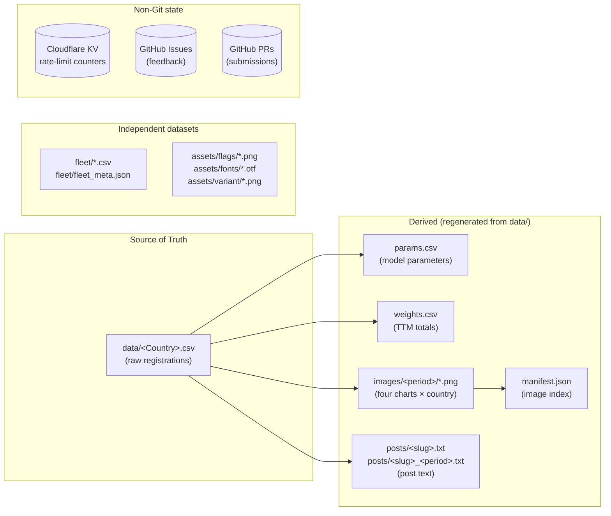

# 03 · Data Objects

Every persistent piece of data in the system, in one place. Schema, owner, lifecycle, intentional design choices.

## Inventory at a glance



## 3.1 Country Raw Data

### Where

`data/<Country>.csv` for variant "Whole" (the default).
`data/<Country>_<Variant>.csv` for non-Whole variants (planned, not yet active).

Examples: `data/Germany.csv`, `data/Türkiye.csv`, `data/New Zealand.csv`.

### Schema

CSV with header. **Wide-but-sparse**: per-country only the fuel columns that the source actually reports.

| Column | Required | Type | Notes |
|---|---|---|---|
| `period` | yes | `YYYY-MM` | Month-resolution. Quarterly rows use the middle month (Q1→Feb, Q2→May, Q3→Aug, Q4→Nov). Yearly rows use July (`YYYY-07`). |
| `time_interval` | yes | `monthly` \| `quarterly` \| `yearly` | Drives the post-text "TTM" computation and the chart x-axis treatment. |
| `variant` | yes | string | Always `Whole` for top-level country files. Reserved for future per-CSV variants. |
| `source` | yes | string | URL or short name (`KBA`, `Statistik Austria`). Carried per-row so the maintainer can audit which row came from where. |
| `BEV` | yes | numeric | Battery electric vehicles registered in the period. |
| `PHEV` | optional | numeric | Plug-in hybrid. Absent in Türkiye, Georgia. |
| `EREV` | optional | numeric | Extended-range EVs (subset of PHEV in some sources). Currently only China. |
| `HEV` | optional | numeric | Full hybrid. For countries that report a single "Hybrid" total without splitting (Türkiye, Georgia), this column carries the total and the post-text labels it as "Hybrid". |
| `MHEV` | optional | numeric | Mild hybrid. Reserved; not currently in any active CSV. Treated as a subset of HEV (which is a subset of ICE) in every output chart. |
| `PETROL` | optional | numeric | Conceptually pure-petrol ICE. *Caveat:* a small number of source statistics today fold petrol-HEV variants into this column rather than the HEV column. Improving the upstream split is a known data-quality task; for now the headline ICE/BEV/PHEV trajectory is unaffected because all of it ends up in the ICE bucket either way. |
| `DIESEL` | optional | numeric | Conceptually pure-diesel ICE. Same caveat as `PETROL` — a few sources fold diesel-HEV here. |
| `GAS`, `CNG`, `LPG` | optional | numeric | Reserved for sources that split natural-gas variants. In practice most countries' source data folds these into `OTHERS`. Always counted as ICE in the output charts. |
| `FLEXFUEL` | optional | numeric | Country-specific (Brazil-relevant; some Sweden rows). Counted as ICE in the output charts. |
| `ETHANOL` | optional | numeric | Reserved; mostly seen folded into `OTHERS` upstream. ICE in the output charts. |
| `OTHERS` | optional | numeric | Catch-all bucket — typically absorbs `GAS`/`CNG`/`LPG`/`ETHANOL` when the source doesn't split them. ICE in the output charts. |
| `ICE` | optional | numeric | Reported when source gives a single ICE total without petrol/diesel breakdown (China, USA, South Korea, Thailand, Chile). |
| `TOTAL` | yes | numeric | Sum of everything for the period. |
| `notes` | optional | string | Free text for the submitter or maintainer. |

### Owner / lifecycle

- **Author**: Maintainer (when transcribing from source) or Public Visitor (via Submit Data form, then merged after review).
- **Created**: Per-country, when the country is added to the project.
- **Updated**: When a new period arrives or when older data is corrected upstream. Upserts are keyed on `(period, variant)`.
- **Deleted**: Never expected. Deleting a row would make the historical chart incomprehensible.

### Why wide-but-sparse and not long format?

- Diff readability: a corrected April row in Wide format is one CSV line edit. In Long format it would be 5–8 separate rows changing.
- Editor-friendliness: spreadsheet apps open Wide naturally. Long needs a pivot to read.
- Schema flexibility: adding a new fuel category for one country is a new column; old rows stay byte-identical because empty cells are valid.

### Why one file per country and not one mega-CSV?

- PR diffs only touch one country at a time.
- Different countries have different categorical schemas; one big CSV would either be 20+ columns wide or split into smaller subsets.
- Performance is irrelevant at this scale (largest country = ~250 rows). Discoverability and diffability win.

### Country-specific column mappings (applied at extraction)

Some sources use non-canonical column names. The Excel→CSV extraction normalises:

| Source column | Canonical column | Country |
|---|---|---|
| `OTHER` | `OTHERS` | Malta |
| `HYBRIDS` | `HEV` | Türkiye (single hybrid bucket) |
| `Hybrid` | `HEV` | Georgia (single hybrid bucket) |
| `PETROL-GAS` | `PETROL` | Georgia (treated as ICE/petrol per maintainer convention) |

---

## 3.2 Model Parameters

### Where

`params.csv` (top-level).

### Schema

```csv
country,variant,v1,v2,t0,data_per,model_date,source,baseline_date,ice_v1,ice_v2,ice_t0
Germany,Whole,-1.050261627753e-4,2.898020288277,2011,2026-04,2026-05-08,KBA,,-3.461242394113e-4,2.637247479199,2011
```

| Column | Meaning |
|---|---|
| `country, variant` | Composite key |
| `v1, v2, t0` | BEV-curve regression parameters: `share(t) = 1 - exp(v1 * (t - (t0-1))^v2)` |
| `ice_v1, ice_v2, ice_t0` | ICE-curve regression parameters (analogous form) |
| `data_per` | Latest data period this fit was based on (`YYYY-MM`) |
| `model_date` | When the fit was last run (`YYYY-MM-DD`) |
| `source` | Mirror of the raw-data source for display purposes |
| `baseline_date` | Reserved (always blank currently) |

### Owner / lifecycle

- **Author**: R Render Pipeline (`R/upsert.R::upsert_params`) on every render.
- **Updated**: Line-level — only the touched `(country, variant)` row changes. The rest of the file stays byte-identical.
- **Read by**: The Static Page for Builder, Thresholds, Durations, World Map tabs.

### Number formatting convention

- Scientific notation when `|x| < 1e-3` (e.g. `-1.050261627753e-4`)
- Decimal otherwise (e.g. `2.898020288277`)
- Exponents use the historical `e-4` style, not `e-04`

This matches what the maintainer's local R script produces, so PR diffs from local-R pushes and from the Render Action look the same.

---

## 3.3 Aggregate Weights

### Where

`weights.csv` (top-level).

### Schema

```csv
country,variant,weight,data_per,model_date
Germany,Whole,2892424,2026-04,2026-05-08
```

`weight` = trailing 12-month sum of `TOTAL` for monthly countries; trailing 4 quarters for quarterly; the latest year's value for yearly. Used by the World Map tab to weight the country choropleth and by aggregate "EU/world" computations.

### Owner / lifecycle

Same as params.csv — rewritten line-level by `R/upsert.R::upsert_weights` on each render.

---

## 3.4 Chart Images

### Where

`images/<YYYY-MM>/<slug>[_<type>]_<YYYYMMDD>.png`

- `<YYYY-MM>` = the period the data is from (e.g. `2026-04`)
- `<slug>` = the lower-cased country, with non-alphanumerics replaced by `_` (`germany`, `new_zealand`, `türkiye`)
- `<type>` ∈ {`ICE_BEV`, `time`, `ttm_shares`} or absent for the BEV trajectory
- `<YYYYMMDD>` = the day the chart was rendered (the model_date, in compact form)

### Four chart types per country

| Type suffix | What it shows | Dimensions |
|---|---|---|
| (no suffix) | BEV-share trajectory, BEV vs all alternatives, with quartile-coloured points | 3840×2160 px |
| `_ICE_BEV` | Combined ICE/BEV/PHEV trajectories with confidence ribbons | 12.8×7.2 in @ 300 dpi |
| `_time` | Timer plot — how the "years to 80% BEV" expectation evolved over time | 12.8×7.2 in @ 300 dpi |
| `_ttm_shares` | Stacked trailing-12-month bar plot per fuel type | 12.8×7.2 in @ 300 dpi |

### Owner / lifecycle

- **Author**: R Render Pipeline (via the Action) or Legacy Local R (via the maintainer's Mac).
- **Created**: One quartet per render run. Old PNGs from previous run-days stay in the `images/<period>/` folder as historical record (you can `git log` them to see how the curve shifted).
- **Read by**: GitHub Pages (the Gallery), externally embedded by anyone who links to a chart.

### Why include the render-day in the filename?

Two renders of the same country in the same period (e.g. data was corrected on day 5, re-rendered on day 8) produce two distinct files. This way:
- The page's gallery view sees both
- Old links from social-media posts don't 404
- `git log` shows when each version was rendered

---

## 3.5 Image Manifest

### Where

`manifest.json` (top-level).

### Owner / lifecycle

Written by the Build-manifest Action (`build_manifest.R`) on push to `images/**` or on its daily cron. Read by the Static Page on every load.

### Schema

See [02-components.md § 2.4](02-components.md). Top-level `{updated, images: [{country, country_slug, type, period, date, filename, url, alt}, …]}`.

---

## 3.6 Posts

### Where

- `posts/<slug>.txt` — the **latest** post text per country, overwritten on each render. **This is what the Copy-post button and Apple Shortcut fetch.**
- `posts/<slug>_<period>.txt` — historical archive, one file per render. Never overwritten; pile up for as long as the country exists.

### Schema

Plain UTF-8 text, ~10 lines, one country flag emoji at the top, BEV/PHEV/ICE breakdown for the latest period, then trailing-12-months breakdown, then a link to the gallery. Format matches what the historical Germany R script produced for posting on Bluesky/X.

### Why two files per render?

- `<slug>.txt` is the stable URL. Shortcuts and the page link to a fixed address. New render → file content changes, URL unchanged.
- `<slug>_<period>.txt` is the audit trail. If you want to re-post an old month or audit how the text evolved, the file with that period in its name is right there.

### Why generate at render-time and not on-demand in the page?

- The percentages depend on the data at the moment of render, not the moment of viewing. Lock them in.
- Shortcuts (raw URL fetch) need a static endpoint, not a JS-computed string.
- Computing in-page would duplicate the logic in JS and risk drift from the R version.

---

## 3.7 Fleet Dataset

### Where

`fleet/fleet_initial.csv`, `fleet/fleet_observed.csv`, `fleet/fleet_meta.json`, `fleet/hazard_defaults.csv`.

### What it is

A **separate** dataset and model — vehicle fleet (stock) projections, not new-registrations. Driven by a hazard-rate retirement model. Has its own tab in the static page.

### Why separate from the main pipeline?

Different units (stock vs flow), different time-resolution (year-of-vintage cohorts), different model (hazard rates, not weighted regression). Forcing it into the same files as `data/<Country>.csv` would just confuse both.

### Owner / lifecycle

Maintainer-curated. No public submit path yet. No automatic render — fleet visualisations are computed in-browser from the static CSVs.

---

## 3.8 Assets

### Where

- `assets/flags/<slug>.png` — one per country/variant, used as a watermark in the corner of charts
- `assets/fonts/fontawesome/otfs/*.otf` + `icomoon.ttf` — used for the social-media icons in chart captions
- `assets/variant/{ldv,hdv,bus}.png` — symbol overlays for variant slices

### Lifecycle

Static. New flags added when a new country joins. Font files immutable.

### Why bundle FontAwesome OTFs in the repo instead of CDN?

The R-render runs in a CI sandbox without internet for asset fetches (and even if it could, it would be brittle). Bundling the OTFs (~1.7 MB) makes renders deterministic and offline-capable.

### Why no SVGs / metadata of FontAwesome?

The maintainer originally bundled the full FA distribution (~24 MB). Only the OTFs are referenced by `showtext` for caption rendering. SVG and metadata files were trimmed in the initial repo-import.

---

## 3.9 Feedback Issues

### Where

GitHub Issues with label `feedback`. Not files in the repo.

### Lifecycle

- Created via Worker `POST /issues` from the Feedback tab modal
- Labelled with `feedback` + `feedback:<category>` (where category is one of `question`, `bug`, `idea`, `data`, `comment`)
- Maintainer can reply on GitHub; replies show up in the page's Feedback tab as comments
- Status derived from issue state: open → "open"; closed → "resolved"; commented by maintainer → "answered"
- Hidden by adding the `hidden` label; pinned by adding `pinned`

### Why issues and not a separate database?

Free, integrated with maintainer's existing GitHub workflow, no extra moderation tooling, native push notifications via the GitHub mobile app.

---

## 3.10 Submission PRs

### Where

GitHub Pull Requests. Branch name `submit/<country>-<variant>-<YYYYMMDDHHMMSS>`.

### Lifecycle

- Created by Worker `POST /submissions` after validating the payload and applying the upsert in-memory
- Diff is exactly one file: the affected `data/<Country>.csv` (or new file if first ever submission for that country)
- PR body lists added rows and corrected rows with before/after values
- Maintainer reviews → merges → manually triggers Render Action

### Why PR-based and not a moderation queue?

Re-uses GitHub's review UI (rich diff, line comments, mobile app). Zero new infrastructure. Audit trail is the standard PR record. Roll-back is `git revert`.

---

## 3.11 Rate-Limit Counters

### Where

Cloudflare KV namespace `RATE_KV`. Keys:
- `rl:<ip>` — feedback submissions counter
- `sub:<ip>` — data-submission counter

### Schema

Value = ASCII integer count. TTL = 3600 s.

### Why two separate counters?

A user submitting many corrections shouldn't lock themselves out of asking a question, and vice-versa. Different counters keep the two flows independent.

### Why KV and not Durable Objects / a database?

Counter granularity is per-IP-per-hour, eventual consistency is fine. KV is the cheapest, simplest option. We never read the counter outside the per-request rate-check.

## See also

- [04-interfaces.md](04-interfaces.md) — exactly how the Worker reads/writes these
- [05-flows.md](05-flows.md) — when each object is created/updated in the user journeys
- [09-glossary.md](09-glossary.md) — term definitions for `slug`, `period`, `TTM`, etc.
