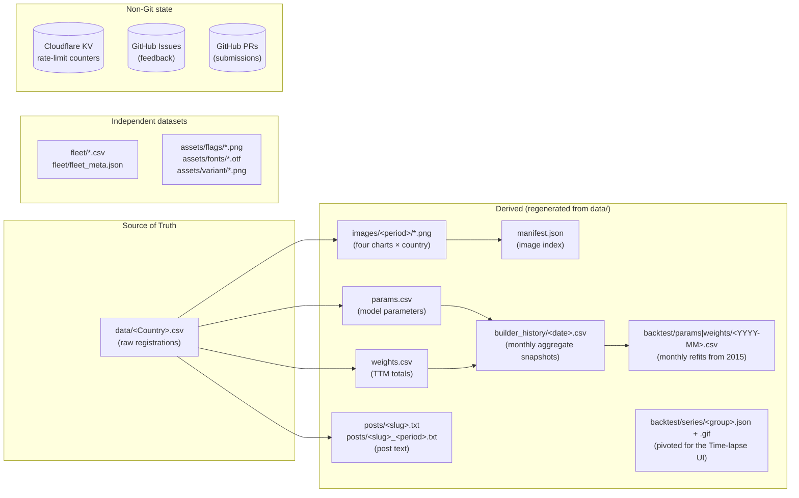

# 03 · Data Objects

Every persistent piece of data in the system, in one place. Schema, owner, lifecycle, intentional design choices.

## Inventory at a glance


```mermaid
flowchart LR
    subgraph SoT["Source of Truth"]
        D1["data/&lt;Country&gt;.csv<br/>(raw registrations)"]
    end

    subgraph Derived["Derived (regenerated from data/)"]
        D2["params.csv<br/>(model parameters)"]
        D3["weights.csv<br/>(TTM totals)"]
        D4["images/&lt;period&gt;/*.png<br/>(four charts × country)"]
        D5["posts/&lt;slug&gt;.txt<br/>posts/&lt;slug&gt;_&lt;period&gt;.txt<br/>(post text)"]
        D6["manifest.json<br/>(image index)"]
        D12["builder_history/&lt;date&gt;.csv<br/>(monthly aggregate snapshots)"]
        D13["backtest/params|weights/&lt;YYYY-MM&gt;.csv<br/>(monthly refits from 2015)"]
        D14["backtest/series/&lt;group&gt;.json + .gif<br/>(pivoted for the Time-lapse UI)"]
    end

    subgraph Independent["Independent datasets"]
        D7["fleet/*.csv<br/>fleet/fleet_meta.json"]
        D8["assets/flags/*.png<br/>assets/fonts/*.otf<br/>assets/variant/*.png"]
    end

    subgraph Ephemeral["Non-Git state"]
        D9[("Cloudflare KV<br/>rate-limit counters")]
        D10[("GitHub Issues<br/>(feedback)")]
        D11[("GitHub PRs<br/>(submissions)")]
    end

    D1 --> D2 & D3 & D4 & D5
    D4 --> D6
    D2 & D3 --> D12 --> D13
```

## 3.1 Country Raw Data

### Where

`data/<Country>.csv` for variant "Whole" (the default).
`data/<Country>_<Variant>.csv` for non-Whole variants. Active for Netherlands
(`data/Netherlands_Used.csv`, `data/Netherlands_HDV.csv`), Denmark
(`data/Denmark_Private.csv`, `data/Denmark_Industry.csv`, `data/Denmark_HDV.csv`,
`data/Denmark_Vans.csv`), Finland (`data/Finland_Private.csv`,
`data/Finland_Industry.csv`, `data/Finland_HDV.csv`, `data/Finland_Vans.csv`,
`data/Finland_Buses.csv`) and Portugal (`data/Portugal_Vans.csv`,
`data/Portugal_HDV.csv`, `data/Portugal_Buses.csv`); Ireland adds the same
three (`data/Ireland_Vans.csv`, `_HDV`, `_Buses`). R/render_country.R also
retains a fall-through to the single-CSV-with-variant-column layout so countries
that haven't been migrated yet still render.

Examples: `data/Germany.csv`, `data/Türkiye.csv`, `data/New Zealand.csv`, `data/Netherlands_HDV.csv`.

### Schema

CSV with header. **Wide-but-sparse**: per-country only the fuel columns that the source actually reports.

| Column | Required | Type | Notes |
|---|---|---|---|
| `period` | yes | `YYYY-MM` | Month-resolution. Quarterly rows use the middle month (Q1→Feb, Q2→May, Q3→Aug, Q4→Nov). Yearly rows use July (`YYYY-07`). |
| `time_interval` | yes | `monthly` \| `quarterly` \| `yearly` | Drives the post-text "TTM" computation and the chart x-axis treatment. |
| `variant` | yes | string | Always `Whole` for top-level country files. Reserved for future per-CSV variants. |
| `source` | yes | string | URL or short name (`KBA`, `Statistik Austria`). Carried per-row so the maintainer can audit which row came from where. |
| `BEV` | yes | numeric | Battery electric vehicles registered in the period. |
| `PHEV` | optional | numeric | Plug-in hybrid. Absent in Türkiye, Georgia, Ukraine. |
| `EREV` | optional | numeric | Extended-range EVs (a subset of PHEV in some sources). Written by **China** (retail + wholesale), **Spain** (all eight variants), **Argentina** and **Hong Kong** (both from range-extender designations, e.g. `REEV`). Folds into PHEV in the three-curve view. |
| `HEV` | optional | numeric | Full hybrid. For countries that report a single "Hybrid" total without splitting (Türkiye, Georgia, Ukraine), this column carries the total and the post-text labels it as "Hybrid". |
| `MHEV` | optional | numeric | Mild hybrid. Only **Argentina** writes it (from explicit designations and verified model rules — a lower bound, see [39-source-argentina.md](39-source-argentina.md) § 4); elsewhere it is absent or folded upstream. Counted on the ICE side in every output chart. |
| `PETROL` | optional | numeric | Conceptually pure-petrol ICE. *Caveat:* a small number of source statistics today fold petrol-HEV variants into this column rather than the HEV column (Hong Kong by construction: TD's fuel field has no hybrid value, [41](41-source-hong-kong.md)). Improving the upstream split is a known data-quality task; for now the headline ICE/BEV/PHEV trajectory is unaffected because all of it ends up in the ICE bucket either way. |
| `DIESEL` | optional | numeric | Conceptually pure-diesel ICE. Same caveat as `PETROL` — a few sources fold diesel-HEV here. |
| `GAS`, `CNG`, `LPG` | optional | numeric | Reserved for sources that split natural-gas variants. In practice most countries' source data folds these into `OTHERS`. Always counted as ICE in the output charts. |
| `FLEXFUEL` | optional | numeric | Counted as ICE in the output charts. The column is in the schema for Brazil, Colombia, Denmark, Finland, Ireland, Netherlands, Portugal and Sweden, but only **Brazil, Ireland and Sweden** ever put values in it — everywhere else it is uniformly empty because the source doesn't report ethanol/flexifuel. That distinction matters: a uniformly-empty column is skipped by the TTM logic, whereas a *half*-filled one breaks the strict 12-month window (see [15-source-ireland.md § 6](15-source-ireland.md)). |
| `ETHANOL` | optional | numeric | Reserved; mostly seen folded into `OTHERS` upstream. ICE in the output charts. |
| `OTHERS` | optional | numeric | Catch-all bucket — typically absorbs `GAS`/`CNG`/`LPG`/`ETHANOL` when the source doesn't split them. ICE in the output charts. |
| `ICE` | optional | numeric | Used when the source gives a single combustion total with no petrol/diesel breakdown: **Argentina, Chile, China, Colombia, South Korea, Thailand, USA**. Where it is present, `PETROL` and `DIESEL` stay empty. |
| `TOTAL` | yes | numeric | Sum of everything for the period. |
| `notes` | optional | string | Free text for the submitter or maintainer. Some fetchers store the source URL or provenance note here (e.g. Brazil, Japan, Türkiye). |

**`notes` preservation contract:** Automated fetchers write `notes = ""` for new rows. On re-ingestion (e.g. `--force`), a fetcher must not silently clear an existing non-empty `notes` value. The correct pattern (implemented in all `fetch_*.py` scripts since June 2026) is:

```python
if not new_row["notes"] and old is not None:
    new_row["notes"] = old.get("notes", "")
```

Scripts that build `new_row` with meaningful notes (Brazil, Netherlands, Japan, China — where `notes` carries provenance) always populate it explicitly, so the preservation guard is a no-op for them.

**Estimated-value convention.** When a row's figures are **modelled rather than
observed** (a real source value is unavailable for that period), the row is
written with a short provenance phrase in `notes` so the estimate is never
mistaken for ground truth. The phrase states *how* the estimate was derived, in
one line. Current example: Italy's `Rental`/`NonRental` split before `2019-06`
— UNRAE PDFs carry no rental breakdown that far back, so those rows are
`Whole × 2019-H2 rental share` and tagged
`est: Whole x rental-share(2019-H2); …` (see
[18-source-italy.md § Rental/NonRental history](18-source-italy.md) and
`scripts/estimate_italy_rental_history.py`). Estimated rows still satisfy every
structural invariant (here `Rental + NonRental == Whole`); only their origin
differs. An empty `notes` means "directly from the source" **for rows written
or reviewed under this convention (June 2026 onward)**; legacy rows predating
it may also carry empty `notes` simply because the convention didn't exist yet.

### Owner / lifecycle

- **Author**: Maintainer (when transcribing from source) or Public Visitor (via Submit Data form, then merged after review).
- **Created**: Per-country, when the country is added to the project.
- **Updated**: When a new period arrives or when older data is corrected upstream. Upserts are keyed on `(period, variant)`.
- **Deleted**: Never expected. Deleting a row would make the historical chart incomprehensible.

### Why wide-but-sparse and not long format?

- Diff readability: a corrected April row in Wide format is one CSV line edit. In Long format it would be 5–8 separate rows changing.
- Editor-friendliness: spreadsheet apps open Wide naturally. Long needs a pivot to read.
- Schema flexibility: adding a new fuel category for one country is a new column; old rows stay byte-identical because empty cells are valid.

### Why one file per country and not one mega-CSV?

- PR diffs only touch one country at a time.
- Different countries have different categorical schemas; one big CSV would either be 20+ columns wide or split into smaller subsets.
- Performance is irrelevant at this scale (largest country = ~250 rows). Discoverability and diffability win.

### Country-specific column mappings (applied at extraction)

Some sources use non-canonical column names. The Excel→CSV extraction normalises:

| Source column | Canonical column | Country |
|---|---|---|
| `OTHER` | `OTHERS` | Malta |
| `HYBRIDS` | `HEV` | Türkiye (single hybrid bucket) |
| `Hybrid` | `HEV` | Georgia (single hybrid bucket) |
| `PETROL-GAS` | `PETROL` | Georgia (treated as ICE/petrol per maintainer convention) |
| `Benzine` | `PETROL` | Netherlands |
| `Overig` + `FCEV` | `OTHERS` | Netherlands (FCEV folded — single-digit units/month) |

### Netherlands (per-variant files)

Netherlands is the first country split into per-variant CSVs:

| Variant | File | What it covers |
|---|---|---|
| `Whole` | `data/Netherlands.csv` | Instroom Personenauto Nieuw — newly-registered passenger cars. Includes pre-2018 backfill from the maintainer's Google Sheet. |
| `Used` | `data/Netherlands_Used.csv` | Personenauto Occasion import (sum of `> 90 dgn` + `<= 90 dgn` sub-categories). |
| `HDV` | `data/Netherlands_HDV.csv` | Zware bedrijfsvoertuigen Nieuw — heavy goods vehicles (≈ N-class trucks ≥3500kg). |

Netherlands also has an **HEV gap** (RDW doesn't split full hybrids; they fold into Benzine/Diesel) and **FCEV folded into OTHERS** (~1 unit/month — negligible).

The full source-playbook for this pipeline — Swing endpoint flow, variant rationale, schedule, fragility, maintenance recipes — lives in [10-source-netherlands.md](10-source-netherlands.md). Read that doc before changing anything in [scripts/fetch_netherlands.py](../../scripts/fetch_netherlands.py).

### Denmark (per-variant files)

Denmark uses the same per-variant CSV layout, sourced from Statistics Denmark's StatBank table BIL53 (`api.statbank.dk`):

| Variant | File | What it covers |
|---|---|---|
| `Whole` | `data/Denmark.csv` | Passenger cars, terms of use = Total. Includes pre-2018 backfill from the maintainer's Google Sheet (2014-01..2017-12). |
| `Private` | `data/Denmark_Private.csv` | Passenger cars, terms of use = In households. |
| `Industry` | `data/Denmark_Industry.csv` | Passenger cars, terms of use = In industries. |
| `HDV` | `data/Denmark_HDV.csv` | Lorries, total. History starts 2021-01 (Statbank only began publishing the Lorries × propellant breakdown then; pre-2021 cells are real zeros). |
| `Vans` | `data/Denmark_Vans.csv` | Vans, total. |

Invariant (per-month): `Private + Industry = Whole`. Statbank uses two distinct `Ethanol` propellant codes (`20256`, `20258`) that both fold into `OTHERS`. Like Netherlands, Denmark has an **HEV gap** — Statbank folds full hybrids into Petrol/Diesel and the renderer recovers ICE share from `(TOTAL − BEV − PHEV)`.

The full source-playbook — API request shape, BILTYPE/BRUG/DRIV codes, HDV-2021 quirk, backfill, fragility, maintenance recipes — lives in [11-source-denmark.md](11-source-denmark.md). Read that doc before changing anything in [scripts/fetch_denmark.py](../../scripts/fetch_denmark.py).

### Finland (per-variant files)

Finland uses the same per-variant CSV layout, sourced from Statistics Finland's PxWeb table StatFin 121d (`pxdata.stat.fi`). It migrated from the legacy local R pipeline (which had no committed `data/Finland*.csv`) to the automated fetcher, gaining two new variants (Vans, Buses):

| Variant | File | What it covers |
|---|---|---|
| `Whole` | `data/Finland.csv` | Passenger cars, possessor = Total. |
| `Private` | `data/Finland_Private.csv` | Passenger cars, possessor = Private person. |
| `Industry` | `data/Finland_Industry.csv` | Passenger cars, possessor = Total − Private person (derived cell-by-cell; Finland has no "industry" possessor bucket). |
| `HDV` | `data/Finland_HDV.csv` | Lorries > 3.5 tonnes, possessor = Total. |
| `Vans` | `data/Finland_Vans.csv` | Vans, possessor = Total. |
| `Buses` | `data/Finland_Buses.csv` | Buses & coaches, possessor = Total. Very low volume. |

Invariant (per-month): `Private + Industry = Whole`. Finland **splits plug-in hybrids natively** (driving-power `39` Petrol/Electricity + `44` Diesel/Electricity → PHEV) but has **no non-plug-in full-hybrid code**, so full hybrids fold into Petrol and the `HEV` column stays blank — same outcome as Denmark/Netherlands. Region is pinned to `MA1` Mainland Finland; **Åland is not in table 121d** so the "Finland" figure is mainland-only. History starts 2014-01 with no backfill (table start; no pre-2014 maintainer data).

The full source-playbook — PxWeb query shape, driving-power codes, Industry-derivation, Åland exclusion, fragility, maintenance recipes — lives in [12-source-finland.md](12-source-finland.md). Read that doc before changing anything in [scripts/fetch_finland.py](../../scripts/fetch_finland.py).

### Sweden (single variant, native HEV + FLEXFUEL)

Sweden has a single `Whole` variant in `data/Sweden.csv`, sourced from SCB's PxWeb table TK1001A/PersBilarDrivMedel (`statistikdatabasen.scb.se`). The table is passenger-cars-only with no possessor or vehicle-class dimension, so there is no Private/Industry/HDV/Vans/Buses split. Sweden is notable for being the first database-fed country to report **HEV natively** (fuel code `130` "electric hybrid") and **ethanol/flexifuel natively** (`150` → the `FLEXFUEL` column). The renderer gives both their own TTM stacked-shares slices and folds `FLEXFUEL` + `HEV` into the brown ICE line of the three-curve (ICE = all minus BEV and PHEV/EREV). History runs from 2006-01 (table start; 2002–2005 excluded upstream). Migrated from the legacy local R pipeline; the migration normalised the file from CRLF to LF line endings.

The full source-playbook — PxWeb v1 query shape, fuel codes, the HEV/FLEXFUEL handling, the CRLF→LF normalisation, fragility, maintenance recipes — lives in [13-source-sweden.md](13-source-sweden.md). Read that doc before changing anything in [scripts/fetch_sweden.py](../../scripts/fetch_sweden.py).

### Ireland (four variants, Inertia session-filter source)

Ireland has four variants — `Whole` (`data/Ireland.csv`), `Vans` (`data/Ireland_Vans.csv`, Light Commercial N1), `HDV` (`data/Ireland_HDV.csv`, Heavy Commercial N2/N3 >3.5t goods incl. tractor units) and `Buses` (`data/Ireland_Buses.csv`, M2/M3) — all sourced from the SIMI / motorstats public dashboard (`stats.simi.ie`). There is **no public REST API** — it's a Laravel + Inertia.js SPA, so the fetcher replays a session-filter flow per category (GET → PATCH `/filter/<type>` → GET Inertia partial `carsByEngineType`); see [scripts/fetch_ireland.py](../../scripts/fetch_ireland.py). Engine-type labels map to BEV/PHEV/HEV/PETROL/DIESEL/FLEXFUEL/OTHERS — Ireland reports **HEV** (a large slice for passenger) and **ethanol/flexifuel** natively, like Sweden. All variants backfilled to 2010-01 (Whole's 2008-2009 remain legacy rows). Migrated from the legacy local R pipeline; the migration normalised `Ireland.csv` from the **old 12-column schema (no FLEXFUEL) to the canonical 13 columns** and re-sourced the full history so FLEXFUEL is populated across the plotted span (a half-filled FLEXFUEL column otherwise breaks the strict TTM 12-month window — see [15-source-ireland.md § 6](15-source-ireland.md)). The commercial variants are diesel-dominated with electrification just starting, so their fits are deliberately noisy.

The full source-playbook — the Inertia session-filter flow, the `month_from` must-be-an-object and Inertia-version quirks, the FLEXFUEL backfill gotcha, fragility, maintenance recipes — lives in [15-source-ireland.md](15-source-ireland.md). Read that doc before changing anything in [scripts/fetch_ireland.py](../../scripts/fetch_ireland.py).

### Portugal (Whole + commercials, OTHERS as residual)

Portugal has `Whole` (`data/Portugal.csv`) plus three **fetch-only** commercial variants — `Vans` (N1), `HDV` (N2/N3 >3.5t goods incl. tractor units), `Buses` (M2/M3) — sourced from ACAP via its motordata.pt chart backend (`chartdata_novo.php`). The endpoint returns the **current calendar year's** monthly series per fuel (no year parameter); see [scripts/fetch_portugal.py](../../scripts/fetch_portugal.py). Fuel codes map to BEV/PHEV/HEV/PETROL/DIESEL; **OTHERS is computed as the residual** against the all-fuels total (the fuel dropdown is incomplete, so summing named "other" codes would undercount — verified against the maintainer's Google Sheet). Portugal reports **HEV** natively but **never reports ethanol/flexfuel**, so the FLEXFUEL column is **uniformly empty** (an all-empty column is skipped by the TTM logic — no half-fill hazard). `Whole` was migrated from the legacy local R pipeline (old 12-column schema → canonical 13) and its history is retained from 2010-01; a `--sheet` mode patches it from the Google Sheet (also the fallback for the December year-boundary). The **commercials start thin (2025/2026)** because motordata has no year param and the sheet has no commercial history — so they are fetched/committed but **not auto-rendered on schedule** (a 4-point Weibull is meaningless); render on demand once depth accumulates.

The full source-playbook — the motordata POST flow, the OTHERS-residual rationale, the December year-boundary caveat, the vehicle categories (HDV/Vans/Buses available but out of scope), fragility, maintenance recipes — lives in [16-source-portugal.md](16-source-portugal.md). Read that doc before changing anything in [scripts/fetch_portugal.py](../../scripts/fetch_portugal.py).

### Colombia (single variant, combined Hybrid bucket)

Colombia has a single `Whole` variant in `data/Colombia.csv`, sourced from the joint **FENALCO + ANDI** monthly *Informe del Sector Automotor* PDF (linked from ANDI's Cámara Automotriz page; underlying figures from **RUNT**, Colombia's official registry — same registry behind ANDEMOS's gated dashboards). The PDF is parsed with `pdftotext -layout` and three monthly series (Pkw total, BEV, Híbridos) are extracted by position. Colombia **does not split PHEV vs HEV** in this report — combined "híbridos" go in the `HEV` column with the *single Hybrid bucket* convention shared with Türkiye and Georgia (see [09-glossary.md § Variant definitions](09-glossary.md)). `ICE` is the residual `TOTAL − BEV − HEV`; `PHEV`, `PETROL`, `DIESEL`, `FLEXFUEL`, `OTHERS` are empty. Each PDF carries the previous ~3 years of monthly history (older history via the annual "INFORME A DICIEMBRE YYYY" PDFs on the same page).

The full source-playbook — discovery (ANDI renames the bulletin file every year; discovery reads month + year out of any bulletin-named link), the batch-detection parser with its below-the-label value look-ahead, the Spanish thousands separator, the "unknown is not 0" merge rule that protects hand-corrected cells, fragility, maintenance recipes — lives in [18-source-colombia.md](18-source-colombia.md). Read that doc before changing anything in [scripts/fetch_colombia.py](../../scripts/fetch_colombia.py).

---

> **Only seven countries have a subsection here.** These were written as each
> database-fed source landed and were not continued; Canada, Austria, Italy,
> Luxembourg, Poland, Malaysia, Singapore, Albania, Spain, Thailand, Indonesia,
> Nepal, China and Argentina have no entry above. They are not undocumented — each has a
> full playbook at `docs/architecture/NN-source-<country>.md` covering the same
> ground (variants, column mapping, history, quirks), and the canonical column
> semantics are the table at the top of § 3.1, which applies to every country.
> The generated source pages under `sources/` also show, per country and per
> variant, exactly which of these columns carry values.

## 3.2 Model Parameters

### Where

`params.csv` (top-level).

### Schema

```csv
country,variant,v1,v2,t0,data_per,model_date,source,baseline_date,ice_v1,ice_v2,ice_t0
Germany,Whole,-1.050261627753e-4,2.898020288277,2011,2026-04,2026-05-08,KBA,,-3.461242394113e-4,2.637247479199,2011
```

| Column | Meaning |
|---|---|
| `country, variant` | Composite key |
| `v1, v2, t0` | BEV-curve regression parameters. Calendar-year form: `S(C) = 1 − exp(v1 × (C − t0)^v2)` where `C` is the fractional calendar year and `t0` is the first calendar year of data. Crossing year: `C = t0 + (ln(1−y)/v1)^(1/v2)`. See the `verschiebung` / `period_to_year` note in the glossary for the R-internal −1 offset. |
| `ice_v1, ice_v2, ice_t0` | ICE-curve regression parameters (analogous form) |
| `data_per` | Latest data period this fit was based on (`YYYY-MM`) |
| `model_date` | When the fit was last run (`YYYY-MM-DD`) |
| `source` | Mirror of the raw-data source for display purposes |
| `baseline_date` | Reserved (always blank currently) |

### Owner / lifecycle

- **Author**: R Render Pipeline (`R/upsert.R::upsert_params`) on every render.
- **Updated**: Line-level — only the touched `(country, variant)` row changes. The rest of the file stays byte-identical.
- **Read by**: The Static Page for Builder, Thresholds, Durations, Time Interval, World Map tabs.

### Number formatting convention

- Scientific notation when `|x| < 1e-3` (e.g. `-1.050261627753e-4`)
- Decimal otherwise (e.g. `2.898020288277`)
- Exponents use the historical `e-4` style, not `e-04`

This matches what the maintainer's local R script produces, so PR diffs from local-R pushes and from the Render Action look the same.

### Known fragility — Indonesia-style `v1=0` corruption

Fast-adoption markets (currently only Indonesia) fit to `v1 ≈ -6e-20` with `v2 > 10`. R's default `format()` / `round(x, 6)` rounds these to literal `0`, so any external tool that round-trips `params.csv` via base-R defaults silently destroys the precision. Once `v1 = 0` is in the CSV, the page used to anchor the Weibull ~20 years too far into the future and reported a ~5-year 20→80 transition for Indonesia (the truth is ~2.3 years).

The schema is deliberately **not** extended to defend against this — every defence sits in code, so external tools that aren't aware of the new schema can't accidentally undo it:

- **Frontend `index.html::recoverV1FromAnchor()`** — at load time, every `v1 = 0` row is rewritten by anchoring the Weibull at a v2-dependent BEV share at `data_per` (28 % for `v2 ≥ 10` like Indonesia, else 50 %). Calibrated against the live Indonesia fit, the resulting 20→80 lands within ~1 day of the true fit.
- **Backend `R/upsert.R::heal_v1_zero_rows()`** — invoked from `R/render_country.R` at the end of every render. Scans `params.csv` for rows with `|v1| < 1e-25` AND `v2 ≥ 10`, re-fits them from `data/<Country>.csv`, and rewrites the row in place. Cheap when nothing is corrupted (file read + numeric parse).

See [08-deploy-ops.md § "Indonesia v1=0 corruption"](08-deploy-ops.md#indonesia-v10-corruption) for the operator-facing runbook and the long-form root-cause story.

---

## 3.3 Aggregate Weights

### Where

`weights.csv` (top-level).

### Schema

```csv
country,variant,weight,data_per,model_date
Germany,Whole,2892424,2026-04,2026-05-08
```

`weight` = trailing 12-month sum of `TOTAL` for monthly countries; trailing 4 quarters for quarterly; the latest year's value for yearly. Used by the World Map tab to weight the country choropleth and by aggregate "EU/world" computations.

### Owner / lifecycle

Same as params.csv — rewritten line-level by `R/upsert.R::upsert_weights` on each render.

---

## 3.4 Chart Images

### Where

`images/<YYYY-MM>/<slug>[_<type>]_<YYYYMMDD>.png`

- `<YYYY-MM>` = the period the data is from (e.g. `2026-04`)
- `<slug>` = the lower-cased country, with non-alphanumerics replaced by `_` (`germany`, `new_zealand`, `türkiye`)
- `<type>` ∈ {`ICE_BEV`, `time`, `ttm_shares`} or absent for the BEV trajectory
- `<YYYYMMDD>` = the day the chart was rendered (the model_date, in compact form)

### Four chart types per country

| Type suffix | What it shows | Dimensions |
|---|---|---|
| (no suffix) | BEV-share trajectory, BEV vs all alternatives, with quartile-coloured points | 3840×2160 px |
| `_ICE_BEV` | Combined ICE/BEV/PHEV trajectories with confidence ribbons | 12.8×7.2 in @ 300 dpi |
| `_time` | Timer plot — how the "years to 80% BEV" expectation evolved over time | 12.8×7.2 in @ 300 dpi |
| `_ttm_shares` | Stacked trailing-12-month bar plot per fuel type | 12.8×7.2 in @ 300 dpi |

### Owner / lifecycle

- **Author**: R Render Pipeline (via the Action) or Legacy Local R (via the maintainer's Mac).
- **Created**: One quartet per render run. Old PNGs from previous run-days stay in the `images/<period>/` folder as historical record (you can `git log` them to see how the curve shifted).
- **Read by**: GitHub Pages (the Gallery), externally embedded by anyone who links to a chart.

### Why include the render-day in the filename?

Two renders of the same country in the same period (e.g. data was corrected on day 5, re-rendered on day 8) produce two distinct files. This way:
- The page's gallery view sees both
- Old links from social-media posts don't 404
- `git log` shows when each version was rendered

---

## 3.5 Image Manifest

### Where

`manifest.json` (top-level).

### Owner / lifecycle

Written by the Build-manifest Action (`build_manifest.R`) on push to `images/**` or on its daily cron. Read by the Static Page on every load.

### Schema

See [02-components.md § 2.4](02-components.md). Top-level `{updated, images: [{country, country_slug, type, period, date, filename, url, alt}, …]}`.

---

## 3.6 Posts

### Where

- `posts/<slug>.txt` — the **latest** post text per country, overwritten on each render. **This is what the Copy-post button and Apple Shortcut fetch.**
- `posts/<slug>_<period>.txt` — historical archive, one file per render. Never overwritten; pile up for as long as the country exists.

### Schema

Plain UTF-8 text, ~10 lines, one country flag emoji at the top, BEV/PHEV/ICE breakdown for the latest period, then trailing-12-months breakdown, then a link to the gallery. Format matches what the historical Germany R script produced for posting on Bluesky/X.

### Why two files per render?

- `<slug>.txt` is the stable URL. Shortcuts and the page link to a fixed address. New render → file content changes, URL unchanged.
- `<slug>_<period>.txt` is the audit trail. If you want to re-post an old month or audit how the text evolved, the file with that period in its name is right there.

### Why generate at render-time and not on-demand in the page?

- The percentages depend on the data at the moment of render, not the moment of viewing. Lock them in.
- Shortcuts (raw URL fetch) need a static endpoint, not a JS-computed string.
- Computing in-page would duplicate the logic in JS and risk drift from the R version.

---

## 3.7 Builder History Snapshots

### Where

- `builder_history/<YYYY-MM-DD>.csv` — one file per snapshot run. Columns: `group, year, bev_share, ice_share, phev_share`.
- `builder_history/index.json` — top-level index of all snapshots with per-group metadata (`n_countries`, `total_weight`, `latest_data_per`), each snapshot's x-`basis`, and a `basis_history` documenting where the basis changed.
- `builder_history/cohort/<date>.csv` + `cohort/index.json` — the same snapshots restricted to the **44 countries present on every date**, written by `rebuild_builder_history.py --cohort`. See [2.13](02-components.md#213-builder-history-rebuilder-scriptsrebuild_builder_historypy).

> ℹ️ `builder_history/series/` no longer exists. The Time-lapse reads `backtest/series/` (see [3.8](#38-backtest)), which reaches 2015 where this archive cannot start before 2025-09. `builder_history/` itself is still written every month — it is the only record of what the page actually showed, and that cannot be reconstructed later.

### Shape

The archive keeps full fidelity at 0.1-year resolution (351 points, 197 KB per snapshot, 5.8 MB in total), grouped by date. It is read by scripts and by `git` archaeology, not by the browser.

### Schema (`builder_history/<date>.csv`)

| Column | Type | Notes |
|---|---|---|
| `group` | string | One of: `world`, `western_europe`, `northern_europe`, `southern_europe`, `eastern_europe`, `eu`, `g7`, `north_america`, `south_america`, `americas`, `asia`, `oceania` (from 2026-09-25), `small_markets`, `medium_markets`, `big_markets` (mirrors `BUILDER_GROUPS` in `index.html`). |
| `year` | float | Fractional calendar year, `2015.0`–`2050.0` in 0.1-year steps (~36-day resolution). **Which basis this is on is per-snapshot — read the entry's `basis` field before comparing two snapshots** (see below). |
| `bev_share` | float | Weighted aggregate BEV share in `[0, 100]`. |
| `ice_share` | float \| empty | Weighted aggregate ICE share in `[0, 100]`. Empty when no row in the group has ICE Weibull parameters. |
| `phev_share` | float \| empty | Implied PHEV = `max(0, 100 - bev - ice)`, weighted. Empty when ICE is empty. |

### Schema (`builder_history/index.json`)

```json
{
  "basis_history": [
    {"basis": "calendar_year", "from": "2025-12-25", "issue": 219, "note": "…"}
  ],
  "snapshots": [
    {
      "date": "2026-05-20",
      "file": "2026-05-20.csv",
      "basis": "calendar_year",
      "groups": {
        "world": {"n_countries": 48, "total_weight": 69682736, "latest_data_per": "2026-04"},
        "eu":    {"n_countries": 26, "total_weight": 10970870, "latest_data_per": "2026-04"}
      }
    }
  ],
  "updated": "2026-05-20"
}
```

`updated` tracks the maximum snapshot `date` in the file (not the file's mtime) so a back-dated run doesn't make it go backwards.

**`basis` / `basis_history` ([#219](https://github.com/LeRaffl/LeRaffl-Gallery/issues/219)).** Every snapshot carries the x-basis its `year` column is on:

| `basis` | Meaning |
|---|---|
| `calendar_year` | `z = year - t0`. Agrees with the live Builder. **Every snapshot in the series.** |

The field is kept even though the answer is currently uniform — a consumer should not have to know that, and a future basis change should be readable from the data rather than from a changelog.

Snapshots dated `2026-06-25`…`2026-09-09` were once on a `calendar_year_plus_1` basis (one year late). **They were rebuilt, not annotated**, by [`scripts/rebuild_builder_history.py`](../../scripts/rebuild_builder_history.py), which recovers each date's `params.csv` / `weights.csv` out of git and re-runs the snapshot builder over them — so no correction is needed to compare any two entries. See [2.13](02-components.md#213-builder-history-rebuilder-scriptsrebuild_builder_historypy) for the evidence that this reconstructs rather than approximates.

That also extended the series backwards: it starts **2025-12-25**, the first date `weights.csv` exists, rather than 2026-05-20.

### Owner / lifecycle

- **Author**: [scripts/snapshot_builder.py](../../scripts/snapshot_builder.py), invoked by [.github/workflows/snapshot-builder.yml](../../.github/workflows/snapshot-builder.yml).
- **Created**: On the 25th of each month (cron) or via manual workflow dispatch.
- **Updated**: Each new snapshot adds one CSV and replaces / appends one entry in `index.json`. Running on a date that already exists overwrites that snapshot only.
- **Read by**: Nothing in the static page today. Reserved for a future time-lapse visualisation tab.

### Why one CSV per snapshot date and not one growing CSV?

- Diffs stay tiny: a new snapshot is a single new file, not a 4900-row append to an existing file.
- Frontend time-lapse can fetch any one frame in a single HTTP request and skip the rest.
- Per-snapshot replacement (re-running for the same date) is just an overwrite — no row-level upsert logic.

### Why include ICE / PHEV next to BEV?

The in-page Builder shows all three when the ICE toggle is on, and the underlying weighted aggregation is byte-identical work. The marginal storage cost is two columns × a few percent and the snapshot becomes useful for "ICE phase-out" time-lapses too. The schema is conservative: empty cells signal "no ICE params in this group", not "0%".

### Why no per-snapshot rebuild of the input parameters?

`params.csv` is the source of truth for the curves and is already versioned by git. A historian who wants the parameters that produced a given snapshot can `git log` `params.csv` at that date. Duplicating the inputs into `builder_history/` would just bloat the repo with redundant data.

---

## 3.8 Backtest

### Where

- `backtest/params/<YYYY-MM>.csv` — one file per month, **`params.csv`'s schema plus three observed columns**: `country, variant, v1, v2, t0, data_per, model_date, source, baseline_date, ice_*, ttm_bev_share, obs_bev_share, obs_phev_share, obs_ice_share, refit_swing`, with `source = backtest` and `model_date` = the month. Written by [`R/build_backtest.R`](../../R/build_backtest.R).
  - `ttm_bev_share` keeps **params.csv's** definition — `compute_ttm_long()`'s last BEV value, exactly what `render_country.R` writes — so the column means the same thing in both files.
  - `obs_*_share` are the **observed** trailing-twelve-month shares of the 3-curve rollup, and are what the Time-lapse plots as data points. They deliberately do *not* use `compute_ttm_long()`: that keeps a month only when every fuel column it found has a complete window, which is right for a stacked bar and wrong here — Germany has 61 monthly rows by 2017-01 and still yields nothing, so countries would drop in and out of the aggregate frame by frame, reintroducing the composition artefact the cohort exists to remove. Instead they use the rollup `load_country_csv()` derives and `fit.R` actually fits (EREV folded into PHEV, ICE the residual), so each point is compared against a curve fitted to the same quantity.
- `backtest/weights/<YYYY-MM>.csv` — same schema as `weights.csv`; the trailing-twelve-month total **as of that month**, `NA` rows dropped because a partial window is a smaller quantity wearing the same name.
- `backtest/series/<group>.json` + `series/index.json` — pivoted per group for the Time-lapse panel by [`scripts/build_backtest_series.py`](../../scripts/build_backtest_series.py). **This is the only form the browser reads.** Currently gitignored during a backfill and committed once complete.
- `backtest/series/<group>.gif` — the animation, by [`scripts/build_builder_gif.py`](../../scripts/build_builder_gif.py). **Overwritten in place, never dated.** Cohort set, quarterly subsample, and only the curated `GIF_GROUPS` — ten of the twenty series.

### What it is, and what it is not

"What the model said using data through `<month>`" — the fit re-run against the observations available at that date. Because it re-fits from the CSVs rather than recovering stored parameters, it reaches **2015** (and could reach further), where `builder_history/` cannot start before the repository did in **2025-09**.

Three things it is **not**, all of which a consumer has to state:

1. It is **not** `builder_history/` ([3.7](#37-builder-history-snapshots)). That records what the gallery actually estimated at the time, bugs and coverage included. Different quantities; never one series.
2. It is **not** clean out-of-sample. It truncates **today's revised** CSVs — the figures as first published are not recoverable — so the model is handed a corrected past, which flatters it. An upper bound, not a test.
3. Its coverage **grows**: 23 fittable series in 2015-01, ~95 by 2026 (`MIN_ROWS = 24`). So a world aggregate moves partly because the gallery gained countries. The `cohort` set is the answer, exactly as in `builder_history`.

**New countries are backfilled once, automatically.** "Skip what exists" alone would mean a country added later never appears in the months already on disk. So each run first collects every `country|variant` present in *any* month file; a data series in *none* of them (a newly added country or variant) is fitted into every existing month where it has ≥ `MIN_ROWS` rows, and its rows are merged in as **pure line insertions** — existing lines stay byte-identical and in place, the new ones land next to their alphabetical neighbours. After that one run the series is known and the normal incremental path takes over. Series listed in `DATA_ONLY_SERIES` (currently `Argentina|Pickups`, which is fetched but never rendered) are left out of the backtest entirely. To backfill right after adding a country instead of waiting for the 25th, dispatch **Snapshot Builder curves** with `backtest_only = true` (skips the `builder_history/` snapshot, which should only come from the regular run).

### Per-frame shape (`series/<group>.json`)

Each frame carries both country sets — `all` (coverage as of that month) and `cohort` (the fixed set present in *every* month) — plus `n_countries`, `total_weight`, `n_cohort`, `cohort_weight` and `data_per`.

`obs_all` / `obs_cohort` hold `{bev, ice, phev}`: the group's **observed** TTM shares for that month, aggregated with the same weights as the curves. Plotted as points up to the current frame, they are what makes the truncation visible — each trail ends at the data cutoff and the curves carry on alone from there. A series no country reports is `null`, never `0`. Years are a 0.5-year grid; a share is `null` where the model produced none, and the chart sets `connectgaps: false` so that draws a **gap**, not a zero line.

`cross_all` / `cross_cohort` hold the interpolated year the BEV curve first reaches each of 20/50/80 %, or `null` where it never does inside the range. Precomputed server-side so the chart, the readout and the GIF agree by construction.

The document also carries `kind: "backtest"`, a `headline` (*"What the model said using data through"*) and a `caveat` — the limitation above, in the file, so a consumer cannot render the series without having been handed the warning.

### Cohort matching is on identity, not spelling

`norm()` strips whitespace and case before comparing country names. `New Zealand` was once written `NewZealand`; matching on the raw string silently drops it from the cohort and reports 43 countries where there are 44. See [#219](https://github.com/LeRaffl/LeRaffl-Gallery/issues/219).

---

## 3.9 Fleet Dataset

### Where

`fleet/fleet_initial.csv`, `fleet/fleet_observed.csv`, `fleet/fleet_meta.json`, `fleet/hazard_defaults.csv`.

### What it is

A **separate** dataset and model — vehicle fleet (stock) projections, not new-registrations. Driven by a hazard-rate retirement model. Has its own tab in the static page.

### Why separate from the main pipeline?

Different units (stock vs flow), different time-resolution (year-of-vintage cohorts), different model (hazard rates, not weighted regression). Forcing it into the same files as `data/<Country>.csv` would just confuse both.

### Owner / lifecycle

Maintainer-curated, now partly automated. `fleet/fleet_initial.csv` uses the harmonized schema (`docs/architecture/37-fleet-data-harmonization.md`): `country,variant,year,source,` the full fuel template, `TOTAL,notes`. **Germany** is fetched automatically by `scripts/fetch_fleet_germany.py` + `.github/workflows/fetch-fleet-germany.yml` (KBA FZ 13.2.1, annual, monthly cron); the other 11 countries remain maintainer-curated for now. No public submit path yet. No automatic render — fleet visualisations are computed in-browser from the static CSVs.

---

## 3.10 Assets

### Where

- `assets/flags/<slug>.png` — one per country/variant, used as a watermark in the corner of charts
- `assets/fonts/fontawesome/otfs/*.otf` + `icomoon.ttf` — used for the social-media icons in chart captions
- `assets/variant/{ldv,hdv,bus}.png` — symbol overlays for variant slices

### Lifecycle

Static. New flags added when a new country joins. Font files immutable.

### Why bundle FontAwesome OTFs in the repo instead of CDN?

The R-render runs in a CI sandbox without internet for asset fetches (and even if it could, it would be brittle). Bundling the OTFs (~1.7 MB) makes renders deterministic and offline-capable.

### Why no SVGs / metadata of FontAwesome?

The maintainer originally bundled the full FA distribution (~24 MB). Only the OTFs are referenced by `showtext` for caption rendering. SVG and metadata files were trimmed in the initial repo-import.

---

## 3.11 Feedback Issues

### Where

GitHub Issues with label `feedback`. Not files in the repo.

### Lifecycle

- Created via Worker `POST /issues` from the Feedback tab modal
- Labelled with `feedback` + `feedback:<category>` (where category is one of `question`, `bug`, `idea`, `data`, `comment`)
- Maintainer can reply on GitHub; replies show up in the page's Feedback tab as comments
- Status derived from issue state: open → "open"; closed → "resolved"; commented by maintainer → "answered"
- Hidden by adding the `hidden` label; pinned by adding `pinned`

### Why issues and not a separate database?

Free, integrated with maintainer's existing GitHub workflow, no extra moderation tooling, native push notifications via the GitHub mobile app.

---

## 3.12 Submission PRs

### Where

GitHub Pull Requests. Branch name `submit/<country>-<variant>-<YYYYMMDDHHMMSS>`.

### Lifecycle

- Created by Worker `POST /submissions` after validating the payload and applying the upsert in-memory
- Diff is exactly one file: the affected `data/<Country>.csv` (or new file if first ever submission for that country)
- PR body lists added rows and corrected rows with before/after values
- Maintainer reviews → merges → manually triggers Render Action

### Why PR-based and not a moderation queue?

Re-uses GitHub's review UI (rich diff, line comments, mobile app). Zero new infrastructure. Audit trail is the standard PR record. Roll-back is `git revert`.

---

## 3.13 Rate-Limit Counters

### Where

Cloudflare KV namespace `RATE_KV`. Keys:
- `rl:<ip>` — feedback submissions counter
- `sub:<ip>` — data-submission counter

### Schema

Value = ASCII integer count. TTL = 3600 s.

### Why two separate counters?

A user submitting many corrections shouldn't lock themselves out of asking a question, and vice-versa. Different counters keep the two flows independent.

### Why KV and not Durable Objects / a database?

Counter granularity is per-IP-per-hour, eventual consistency is fine. KV is the cheapest, simplest option. We never read the counter outside the per-request rate-check.

---

## 3.14 Freshness + Arrival Data (`sources/schedule.json`, `sources/runs.json`)

### Where

Both generated by [`scripts/build_schedule.py`](../../scripts/build_schedule.py) in one pass, from the `fetch-*.yml` crons, the data CSVs and `manifest.json`. Read at runtime by the **Data freshness** tab. **Generated — do not hand-edit.** `build-source-pages.yml` commits the whole `sources/` directory, so no workflow lists them individually.

### Schema

```json
// sources/schedule.json  — ~62 KB, bounded
{
  "generated": "2026-09-20T09:26:29Z",
  "today": "2026-09-20",
  "countries": [ { "country": "Albania", "slug": "albania", "flag": "🇦🇱",
                   "latest_period": "2026-08", "expected_period": "2026-08",
                   "status": "current", "last_render": "2026-09-10",
                   "schedule": { "enabled": true, "days": [10, …] }, "variants": [ … ] } ]
}

// sources/runs.json  — ~85 KB and growing
{
  "generated": "2026-09-20T09:26:29Z",
  "runs": [ { "date": "2026-09-19", "label": "Chile", "base": "Chile",
              "slug": "chile", "period": "2026-08", "flag": "🇨🇱" } ]
}
```

### `countries` vs `runs` — two different questions

| | answers | source | size |
|---|---|---|---|
| `countries[].status` / `last_render` | *"Is this country up to date, and when is the next point due?"* | CSV periods + cron windows + newest manifest date | bounded — one row per dataset |
| `runs` | *"What landed, and when?"* — one row per (country, render date) | every `manifest.json` entry, deduped on that pair | append-only, ~900 rows/year |

`last_render` is only the **newest** arrival; `runs` is the history, which is what the calendar's past half is drawn from. Variants stay separate rows — "Canada (Pickups)" arriving is its own event — and `period` is the data month that landed, so a cell can read *"Chile · data through Aug 2026"* rather than just *"Chile"*.

### Why two files rather than one

They have opposite lifecycles. `countries` is bounded and is what the freshness **table** — the tab's main content — needs on every visit. `runs` is an append-only history that only the **calendar** reads, and it grows by roughly 900 rows a year with no upper bound.

Carrying `runs` inside `schedule.json` took it from 61 KB to 147 KB, and that gap widens every month for a payload most readers never open. Splitting keeps the table's fetch flat over time.

The frontend loads them **independently**: `schedule.json` gates the tab, `runs.json` arrives afterwards and only re-renders the calendar. A failed or missing `runs.json` therefore costs the calendar its "landed" chips and nothing else — the table, the month grid and the future half (drawn from `countries[].schedule`) all still work. In `index.html`, `RUNS === null` means *not here yet*, `[]` means *here and empty*.

### What is deliberately **not** in here

**Polling ticks.** Most fetchers poll daily through a window, so a month of cron ticks is ~460 entries for ~30 real arrivals. A tick is not an event a reader cares about, and rendering them all is what made the pre-2026-09 calendar unreadable ([#235](https://github.com/LeRaffl/LeRaffl-Gallery/issues/235)). The future half of the calendar therefore shows only each window's **opening** day — the earliest a figure can appear — and says so, rather than implying a guaranteed date.

### `flag`

Parsed out of `R/post_text.R::.pt_flag` at build time rather than duplicated here. That R map is already the single place a country's flag is declared (step 4 of the add-a-country checklist, [08-deploy-ops.md §8.3](08-deploy-ops.md#83-add-a-new-country)), and parsing it means the two cannot drift. A country missing from the map simply gets no flag and the calendar falls back to its name — it degrades, it does not break.

### Known upstream wrinkle

`manifest.json` currently carries a malformed label `India-Wheelers` alongside `India (4 Wheelers)` — a slug→label round-trip artefact of the same class as the `t_rkiye` → `T (Rkiye)` case documented in `R/render_country.R`. It has no flag and shows under that name. Fixing it belongs in `build_manifest.R`, not here.

## 3.15 Powertrain Classification (`classification/`)

For sources whose records carry **no fuel field** the gallery derives the
powertrain from the model designation. Three files per such country (so far
only Argentina — [39-source-argentina.md](39-source-argentina.md) §4–§7):

| file | lifecycle | shape |
|---|---|---|
| `classification/<slug>_rules.csv` | **hand-edited source of truth**; validated by the country's tests | ordered first-match rules: `order, id, class, brand, pattern, kind, reason, evidence, example_brand, example_model` |
| `classification/<slug>_models.csv` | generated by the fetcher on every real run (full re-derivation), committed with the data | one row per (brand, designation, scope): `class`, deciding `rule`, `units_total`, `units_last_12m`, `first_seen`, `last_seen` |
| `classification/<slug>_top.json` | generated by the fetcher | top brands / designations per class over the trailing 12 months — the country-neutral schema of [3.16](#316-top-brands--models-market) (Argentina's predates `market/`) |

The source page renders them when the country's front-matter declares
`market_breakdown:` (top JSON) and/or `classification: {rules, mapping,
intro}` ([39](39-source-argentina.md) §6); `build-source-pages.yml` rebuilds on
`classification/**`. The data CSV is still the single source of truth for the
numbers; these files explain and audit how its fuel columns were derived.

## 3.16 Top brands / models (`market/`)

### Where

`market/<slug>_top.json`, one per country whose source carries brand + model
per registration. **Generated** by that country's fetcher through the shared
builder [`scripts/market_top.py`](../../scripts/market_top.py); never
hand-edited. Argentina's equivalent is `classification/argentina_top.json`
(same schema, same builder — it predates the folder).

| Country | Fetcher | Brand / model fields | Rebuilt |
|---|---|---|---|
| Spain | `fetch_spain.py` | DGT `MARCA_ITV` / `MODELO_ITV`, Whole records | when missing or behind the newest DGT month in `data/Spain.csv` — twelve monthly downloads |
| Malaysia | `fetch_malaysia.py` | data.gov.my `maker` / `model` | when missing or behind the last complete month — from the two yearly parquets the fetch reads anyway |
| Ukraine | `fetch_ukraine.py` | MIA register `BRAND` / `MODEL`, Whole records; classes BEV and the combined Hybrid (HEV column, relabelled on the page via `market_class_names`) | every real run — from the current + previous yearly file the fetch reads anyway |
| Hong Kong | `fetch_hong_kong.py` | TD `Vehicle Make` / `Vehicle Model`, Whole records; classes BEV (TD's fuel value) and PHEV/EREV (classified). Display names only: brand aliases merged, brand prefix, chassis codes and trim words stripped so trims rank as one model (`market_designation_note` explains it on the page) | every real run — from the 12 newest monthly files the fetch reads anyway |
| Finland | `fetch_finland.py` | Traficom PxWeb (`trafi2.stat.fi`) make × driving power × month for brands and totals, model series × driving power × month for BEV/PHEV designations; scope-checked against `data/Finland.csv` | when Whole data is written or the top file lags — twelve one-month queries per table |
| Ireland | `fetch_ireland.py` | SIMI dashboard `carsByMake` / `carsByModel` per month, one `engine_types` filter per class (BEV, PHEV, HEV); unlisted makes/models = unranked rest | after a Whole update or when the top file lags — ~50 filter round-trips |
| Austria | `fetch_austria.py` | DE2 Tabelle 7 (month) / Tabelle 14 (January to date) — top 10 BEV makes and types + "Sonstige"; **BEV only**, headline year-to-date | with the Whole parse of the newest DE2 file |
| Japan | `fetch_japan.py` | JADA maker rows of the 燃料別メーカー別登録台数 workbook — **brands only**, imports lumped into one row, kei cars excluded like the CSV | whenever the workbook is downloaded (also when only the top file lags); 4 months per file → month store |
| Singapore | `fetch_singapore.py` | LTA M03 row label `Make Importer Fuel` — **brands only**; AD and PI rows of a make are added; an unknown importer part stops the refresh | every real run; the PDF holds the current half-year → month store |
| Uruguay | `fetch_uruguay.py` | ACAU Compilado `Marca` / `Modelo` columns, AUTOS + SUV; MHEV ranked as its own class (OTHERS in the CSV); columns found by header name, never guessed | whenever the workbook is downloaded; one calendar year per file → month store |

**Record-level vs. summary sources.** The first five (and Argentina, Ireland, Austria) re-read twelve months of
records whenever they like. The last three only ever see a few recent months
per publication, so they keep every month they have parsed in a **month store**
`market/<slug>_months.json` (generated; electrified brand/model counts plus the
month's whole-market total, newest `STORE_MONTHS` = 15 months, one month per
line) and rebuild the summary from it (`market_top.refresh_from_store`). A
month the source restates overwrites the stored one.

### Schema

```json
{"country": "Spain", "variant": "Whole", "source": "DGT", "as_of": "2026-08",
 "window": {"from": "2025-09", "to": "2026-08", "months": 12},
 "total_registrations": 1100000,
 "unit": "registrations (model = DGT MODELO_ITV string, brand = MARCA_ITV)",
 "classes": {"BEV": {"units": 90000, "share_of_market": 0.08,
                     "brands": [{"brand": "TESLA", "units": 15000, "share_of_class": 0.17}, …],
                     "models": [{"brand": "TESLA", "model": "MODEL Y", "units": 9000, "share_of_class": 0.1}, …]},
             "PHEV": {…}, "EREV": {…}, "HEV": {…}, "MHEV": {…}},
 "months": [{"period": "2026-08", "total_registrations": 95000,
             "classes": {"BEV": {"units", "share_of_market", "brands": […], "models": […]}, …}},
            …]}                                   # newest first, one per month in the window
```

(Values illustrative.) Top 10 brands and top 15 models per electrified class
for the window; each entry of `months` ranks one single month (top 10 brands,
top 10 models) — the source page's **month picker** switches between the
twelve-month view and each month. A brand-only source has `"models": []`
and the page shows the brand table alone.

**Window honesty.** `window` describes the months actually summed
(`market_top.build_top_monthly`): a source that does not yet reach back
twelve months gets `"months": 8` and a `from` of its first month, and gaps
inside the span are listed in `window.missing`; the page words its lead
accordingly ("last 8 months", "no data for …") instead of claiming a year.

combustion classes only count towards `total_registrations`. The class of each
registration is the **same** one the fetcher writes into the data CSV, and the
window total equals the CSV's TOTAL summed over the window, so the tables and
the charts can never disagree. Brand and model strings are the source's own,
trimmed, whitespace-collapsed and upper-cased (`market_top.clean`). Ties sort
alphabetically so the file is byte-stable (no spurious commits).

### Behaviour that matters

- **Never blocks the data.** The refresh runs after the CSVs are written and
  is wrapped by `market_top.guarded`: any error becomes a GitHub Actions
  warning, the fetch still commits.
- **Never renders.** A change to a top file alone is committed but does not
  dispatch `render-country.yml`; it reaches the reader through
  `build-source-pages.yml`, which triggers on `market/**`.
- **Shown on the source page** when the country's front-matter has
  `market_breakdown: market/<slug>_top.json` ("Who sells the electrified
  cars", [39](39-source-argentina.md) §6). A missing file renders as "not
  generated yet".
- Offline tests: `scripts/test_market_top.py` (gates every fetch workflow that writes `market/`; the Japan test runs against the JADA sample workbook in `data/`).

**Adding a country:** have its fetcher count `(month, class, brand, model)`
with the same class logic it uses for the CSV (model `""` for a brand-only
source). A source that can re-read twelve months calls
`market_top.build_top_monthly(...)` / `write_top(...)`; one that only sees a
few months per file calls `market_top.refresh_from_store(...)`. Either runs
behind `guarded`. Add `market/<slug>_top.json` (and `_months.json` if used) to
the workflow's commit list (not to the render trigger: gate the render on the
data CSV's own diff), and add `market_breakdown:` to its source doc
front-matter. Rebuild gates use `market_top.top_is_current` so a file written
before the single-month rankings existed is rebuilt once. Sources whose brand field
needs translation first (Israel's registry names manufacturers in Hebrew) are
not "easy" and were left out on purpose. Also left out for now: Chile (ANAC
publishes monthly brand rankings per class, but in a Power-BI PDF whose text
layer overlaps and whose model lists are year-to-date top 10s), Indonesia
(GAIKINDO's per-model sheets are 1.5 pt print and recent editions dropped the
fuel column), Brazil (the Central de Dados brand totals cannot be crossed with
fuel — [05](05-flows.md)) and Luxembourg (STATEC's `BRAND` dimension would need
a second query that has not been probed).

**Not available / still being probed (2026-09):**

| Country | Status |
|---|---|
| Denmark, Sweden | No make dimension in the tables the fetchers use (DST BIL5x, SCB PersBilarDrivMedel); the brand statistics live with the importers' associations (Mobility Denmark / Mobility Sweden), not in an API. Not planned. |
| Austria, Ireland | Wired (rows above) after their probes ran in CI on 2026-09-26. |
| Germany | The monthly release links a `…_marken.xlsx` next to `…_merkmale.xlsx`; `fetch_germany.py --dry-run` logs its sheets (`[probe] marken.xlsx`). KBA's "… nach Marken und alternativen Antrieben" release is a PDF only (year to date). Wire the xlsx once its layout is confirmed. |

## 3.17 Uncertainty bands (`bands/`)

`bands/<slug>.json`, one per rendered series, written by `R/render_country.R`
through [`R/bands.R`](../../R/bands.R) on every render and committed with the
PNGs. **Generated — never hand-edit.** Frontend data only; the PNGs do not use
it. `index.html` draws it as the **Uncertainty band** in Builder and Compare
([44 §10](44-uncertainty-bands.md#10-in-the-frontend-builder-and-compare)).
`backfill-bands.yml` (manual) recomputes every file without re-rendering.

It holds the 95 % confidence (CI), prediction (PI) and tolerance (TI, 95 / 95)
bands around the fitted curve on a quarterly calendar-year grid to 2060, the
fitted share, and the fit and CI range of the 10/20/50/80/90 % crossing years.
All dates are **calendar** decimal years (R's internal axis + 1). A fit with no
usable S-shape writes no file and removes a stale one. The random seed is fixed,
so a re-render of unchanged data produces an identical file.

Schema, maths, validation and how to quote the numbers:
[44-uncertainty-bands.md](44-uncertainty-bands.md) — the canonical page.

## See also

- [04-interfaces.md](04-interfaces.md) — exactly how the Worker reads/writes these
- [05-flows.md](05-flows.md) — when each object is created/updated in the user journeys
- [09-glossary.md](09-glossary.md) — term definitions for `slug`, `period`, `TTM`, etc.
