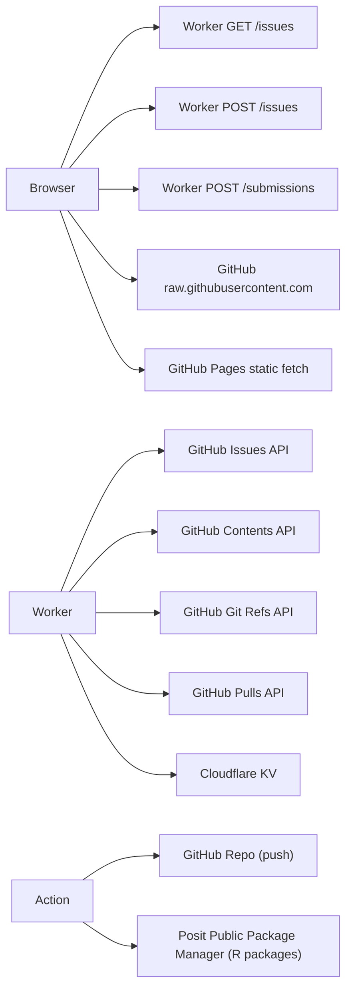

# 04 · Interfaces

Wire-level contracts. If something on this page changes (request shape, response shape, status codes, validation rules), update it the same PR.

## Interface map



---

## 4.1 Worker GET /issues

### Purpose

Return all visible feedback issues with their comments, mapped into the page's expected shape.

### Request

```
GET /issues
Headers:
  Origin: https://leraffl.github.io
```

### Response 200

```json
{
  "updated": "2026-05-08T12:34:56.789Z",
  "issues": [
    {
      "number": 42,
      "title": "Belgium March data looks off",
      "body": "...",
      "category": "data",
      "status": "open" | "answered" | "resolved",
      "author": "alice",
      "pinned": false,
      "created_at": "2026-04-30T10:00:00Z",
      "updated_at": "2026-05-01T11:00:00Z",
      "context": { "tab": "thresholds", "country": "Belgium" },
      "version": { "git_sha": "abc123" },
      "comments": [
        { "author": "leraffl", "is_maintainer": true, "body": "fixed in #45", "created_at": "..." }
      ]
    }
  ]
}
```

### Caching

- Worker side: stores the response in `caches.default` for 60 seconds keyed on `https://internal-cache/issues-v1`.
- The `POST /issues` handler invalidates this cache after creating a new issue so the new issue shows up in the next GET.

### Errors

- `502` "Failed to fetch issues from GitHub" — upstream API unreachable.

---

## 4.2 Worker POST /issues

### Purpose

Validate a feedback submission and create a GitHub Issue with the right labels and metadata block.

### Request

```
POST /issues
Headers:
  Content-Type: application/json
  Origin: https://leraffl.github.io
```

```json
{
  "title": "string, ≥ 5 chars after trim",
  "body":  "string, ≥ 10 chars after trim",
  "category": "question" | "bug" | "idea" | "data" | "comment",
  "author": "optional string, ≤ 60 chars (defaults to 'Anonymous')",
  "context": { /* arbitrary JSON object — what tab the user was on, current filters */ },
  "version": { /* arbitrary JSON object — current git_sha, build date */ },
  "math_answer":   "string — user's answer to the captcha",
  "math_expected": "string — the correct answer (sent by client; we re-verify)",
  "website": "honeypot — must be empty"
}
```

### Validation

| Check | Behaviour on fail |
|---|---|
| `website` non-empty (honeypot) | `200 {"number":0,"ok":true}` — silent accept, no issue created. Bots think it worked, humans never trip this. |
| Title < 5 chars | `400 "Title must be at least 5 characters."` |
| Body < 10 chars | `400 "Description must be at least 10 characters."` |
| Category not in allowlist | `400 "Invalid category."` |
| Captcha missing or wrong | `400 "Incorrect answer to the captcha. Please try again."` |
| Rate limit (`rl:<ip>` ≥ 3 in last hour) | `429 "Too many submissions. Please try again later."` |

### Response 201

```json
{
  "number": 123,
  "title": "...",
  "body": "...",
  "category": "question",
  "status": "open",
  "author": "alice",
  "pinned": false,
  "created_at": "...",
  "updated_at": "...",
  "context": { },
  "version": { },
  "comments": []
}
```

### Side effects

- New Issue on `LeRaffl/LeRaffl-Gallery` with labels `feedback` + `feedback:<category>`
- Body has appended footer `\n\n---\n*Submitted by: <author>*` plus optional `<!-- context:{...} -->` and `<!-- version:{...} -->` HTML comments for round-tripping
- Worker cache for `GET /issues` invalidated

---

## 4.3 Worker POST /submissions

### Purpose

Accept new or corrected data rows for one country, validate, perform line-level upserts, push to a fresh branch, open a PR for maintainer review.

### Request

```
POST /submissions
Headers:
  Content-Type: application/json
  Origin: https://leraffl.github.io
```

```json
{
  "country": "Germany",
  "variant": "Whole",
  "source":  "KBA",
  "author":  "optional string ≤ 60 chars",
  "rows": [
    {
      "period":        "2026-04",
      "time_interval": "monthly" | "quarterly" | "yearly",
      "fuels": {
        "BEV":    70663,
        "PHEV":   29996,
        "HEV":    87850,
        "PETROL": 66959,
        "DIESEL": 37664,
        "OTHERS": 1029,
        "TOTAL":  294161
      },
      "notes": "optional string ≤ 200 chars"
    }
  ],
  "_hp": "honeypot — must be empty"
}
```

### Validation

| Check | Behaviour on fail |
|---|---|
| `_hp` non-empty | `200 {"ok":true,"pr_url":null}` — silent swallow |
| Rate limit (`sub:<ip>` ≥ 3 in last hour) | `429 "Too many submissions. Please try again later."` |
| `country` empty | `400 "country is required"` |
| `variant` empty | `400 "variant is required"` |
| `rows` empty | `400 "at least one row required"` |
| `rows.length > 36` | `400 "too many rows in one submission"` |
| `period` not `YYYY-MM` | `400 "invalid period \"...\""` |
| `time_interval` not in allowlist | `400 "invalid time_interval"` |
| Unknown fuel column | `400 "unknown fuel column \"X\""` (allowlist: BEV, PHEV, EREV, HEV, MHEV, PETROL, DIESEL, GAS, CNG, LPG, FLEXFUEL, ETHANOL, OTHERS, ICE, TOTAL) |
| Negative or non-finite fuel value | `400 "fuel X must be a non-negative number"` |
| `TOTAL` missing | `400 "row YYYY-MM: TOTAL is required"` |
| `BEV` missing | `400 "row YYYY-MM: BEV is required"` |
| `BEV + PHEV + EREV > TOTAL × 1.005` | `400 "row YYYY-MM: BEV+PHEV+EREV exceeds TOTAL"` |
| Resulting CSV is byte-identical to current | `400 "Submission would not change the file..."` |

### Side effects (on success)

- Read current `data/<Country>.csv` from `master` via Contents API
- Apply per-row upsert (key = `(period, variant)`); rows with the same key are replaced, new rows are inserted in chronological order
- New fuel columns submitted that don't exist in the current header get appended (before `notes` if present, else end), with empty values backfilled into pre-existing rows
- Create branch `submit/<country-slug>-<YYYYMMDDHHMMSS>` from current master HEAD
- PUT new CSV to that branch via Contents API
- Open PR against master with descriptive title and body listing each added/corrected row

### Response 201

```json
{
  "ok": true,
  "pr_url": "https://github.com/LeRaffl/LeRaffl-Gallery/pull/123",
  "pr_number": 123,
  "branch": "submit/germany-whole-20260508120534",
  "summary": {
    "added": 1,
    "replaced": 0,
    "replacedDetails": []
  }
}
```

### Errors specific to GitHub propagation

- `502 "Failed to read data/<Country>.csv"` — Contents GET failed
- `502 "Failed to read master ref"` — Git Refs GET failed
- `502 "Failed to create branch"` — Git Refs POST failed (e.g. token missing scope)
- `502 "Failed to commit CSV"` — Contents PUT failed
- `502 "Failed to open PR"` — Pulls POST failed

Console logs from the Worker (`console.error`) record the upstream HTTP body on these failures for debugging via Cloudflare's tail viewer.

### Why no Captcha here (only honeypot)?

The submit form is gated by a non-trivial schema (you have to know fuel categories and provide consistent numbers). Bots historically don't bother with this kind of structured form. If spam appears, the math captcha pattern from `/issues` ports easily.

---

## 4.4 Worker → GitHub APIs

The Worker uses these endpoints under `https://api.github.com/repos/LeRaffl/LeRaffl-Gallery`. All requests authenticate with `Authorization: Bearer <GITHUB_TOKEN>` and `X-GitHub-Api-Version: 2022-11-28`.

| Worker call | GitHub endpoint | Used by |
|---|---|---|
| List issues with label | `GET /issues?labels=feedback&state=all&per_page=100` | `GET /issues` |
| List issue comments | `GET /issues/<n>/comments?per_page=50` | `GET /issues` |
| Create issue | `POST /issues` | `POST /issues` |
| Read file content | `GET /contents/<path>?ref=master` | `POST /submissions` |
| Read master HEAD ref | `GET /git/ref/heads/master` | `POST /submissions` |
| Create new ref (branch) | `POST /git/refs` | `POST /submissions` |
| Write file (with sha for update or no sha for create) | `PUT /contents/<path>` | `POST /submissions` |
| Open pull request | `POST /pulls` | `POST /submissions` |

The PAT must have these scopes (fine-grained): Issues R/W, Contents R/W, Pull requests R/W, Metadata R.

---

## 4.5 Page → GitHub raw.githubusercontent.com

The Submit Data tab fetches `data/<Country>.csv` directly from raw GitHub on country selection, to read the header and infer which fuel-input fields to render.

```
GET https://raw.githubusercontent.com/LeRaffl/LeRaffl-Gallery/master/data/<Country>.csv
Cache: no-store
```

If this fails (404, network), the form falls back to the canonical full set of fuel columns (`SD_FUEL_ORDER` in `index.html`). This is intentional — the form should remain submittable even if the CSV doesn't exist yet (e.g. brand-new country).

---

## 4.6 Static Page → GitHub Pages assets

Standard relative-URL fetches for `manifest.json`, `params.csv`, `weights.csv`, `posts/<slug>.txt`, `images/<period>/<slug>_*.png`, `fleet/*.csv`, `fleet/fleet_meta.json`. All served by GitHub Pages with default 600-second cache; the page uses `cache: 'no-store'` for `manifest.json` and `posts/*` to pick up corrections fast.

---

## 4.7 GitHub Actions → external

| Action | Reaches out to | Purpose |
|---|---|---|
| Render-country | Posit Public Package Manager | Pull R package binaries (`use-public-rspm: true` for fast install) |
| Render-country, Build-manifest | The repo itself (via the workflow-scoped token) | git push images, params, weights, posts, manifest.json |

Neither Action needs an outbound secret — workflow-scoped GITHUB_TOKEN is auto-injected by GitHub.

## See also

- [05-flows.md](05-flows.md) — sequence diagrams that show these endpoints in context
- [07-secrets-trust.md](07-secrets-trust.md) — what the PAT can/can't do
