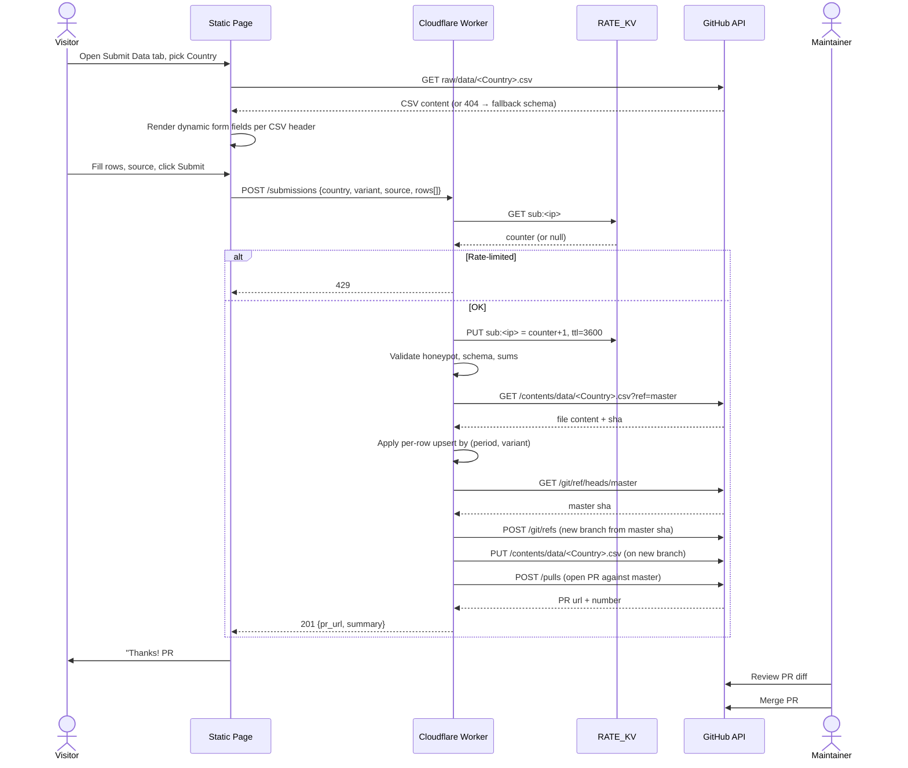
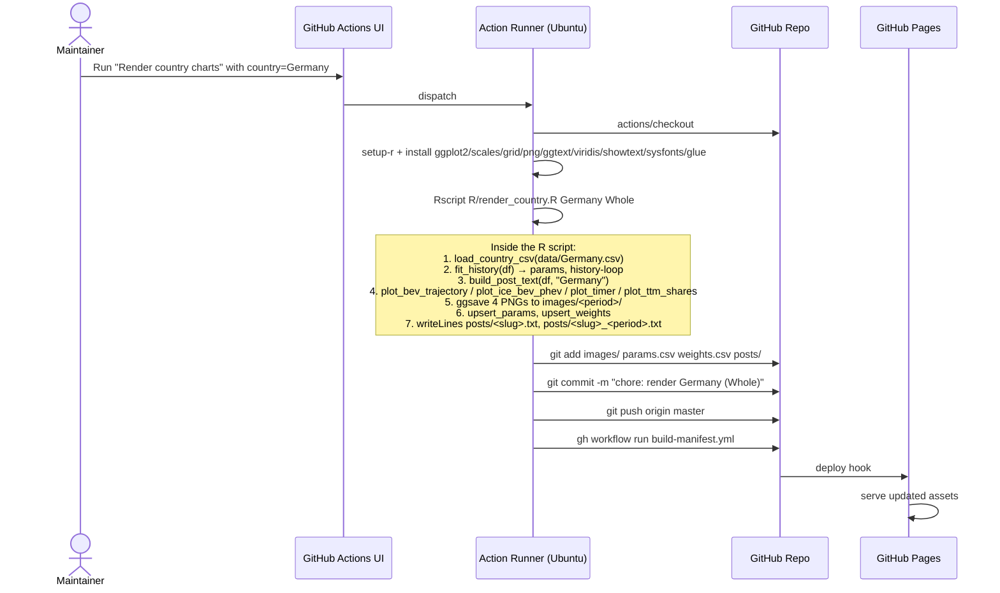
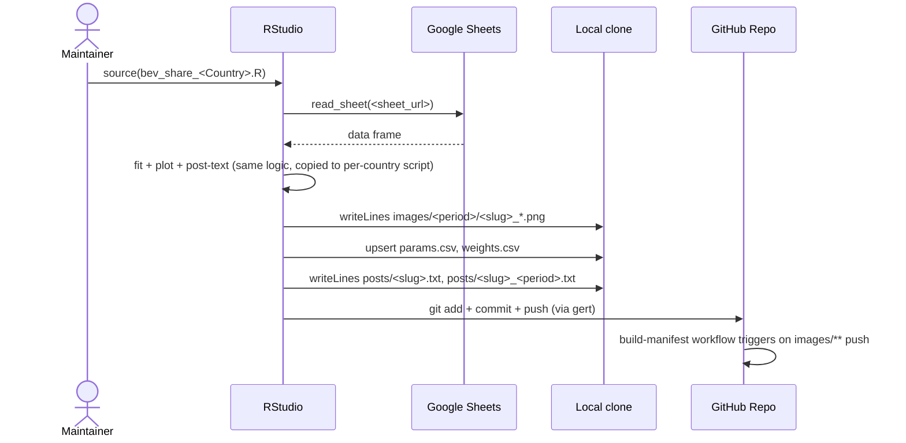
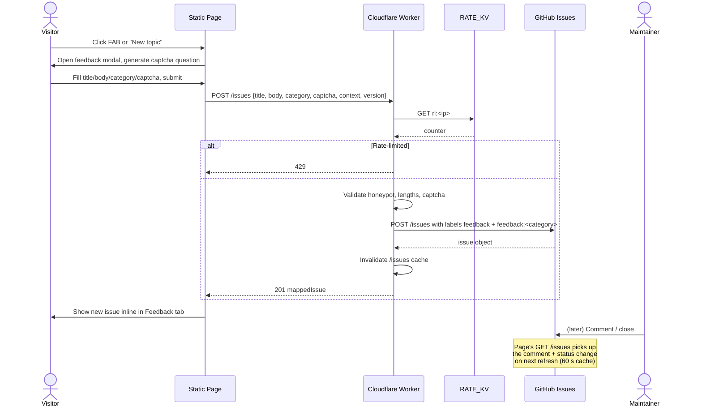
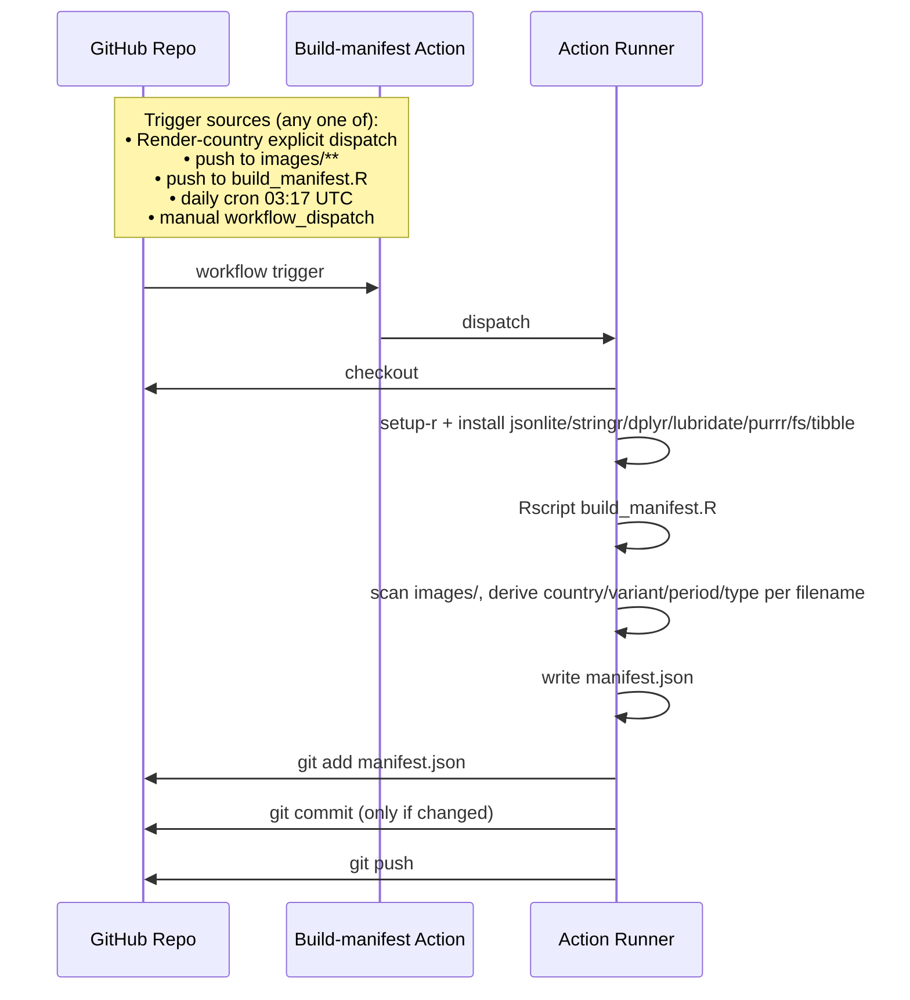
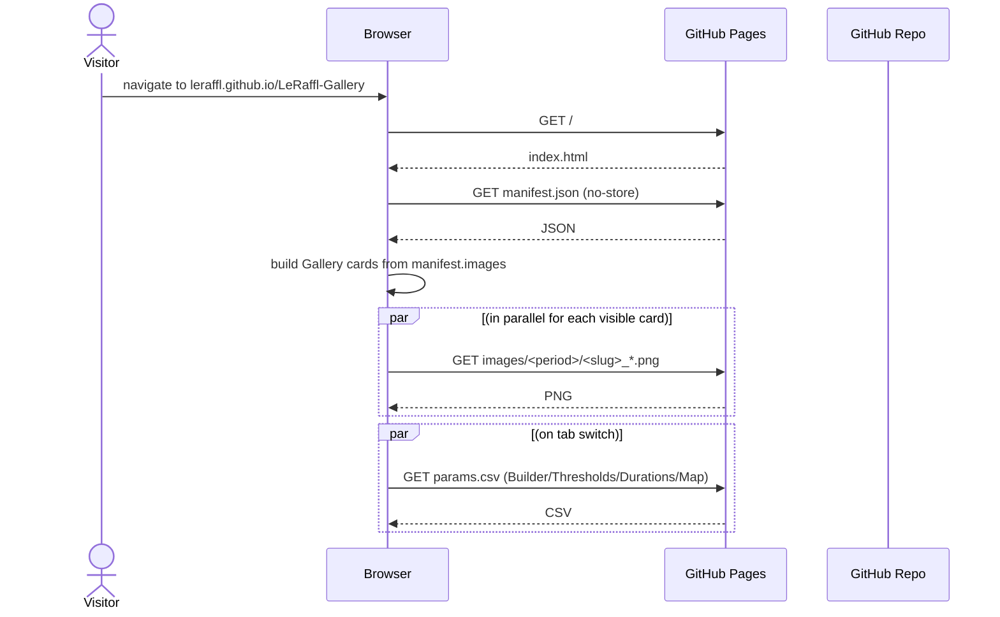
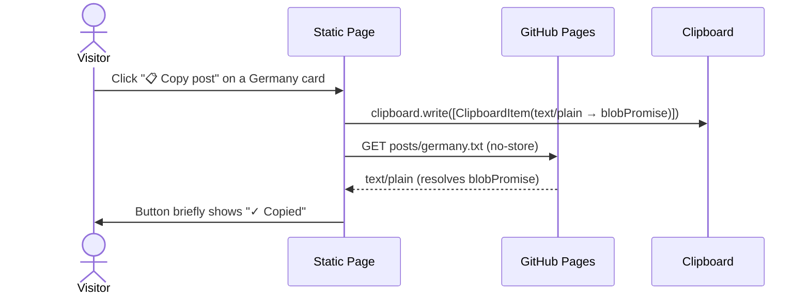
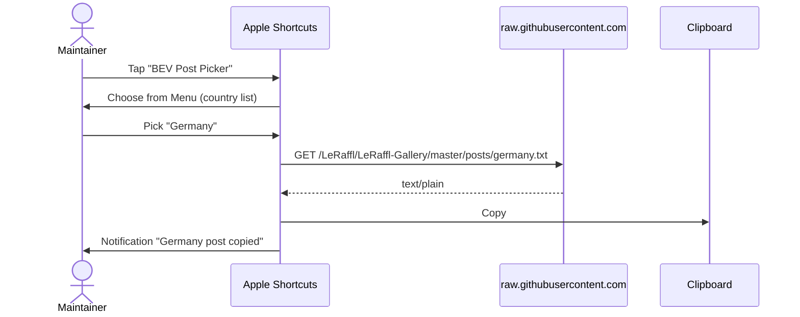
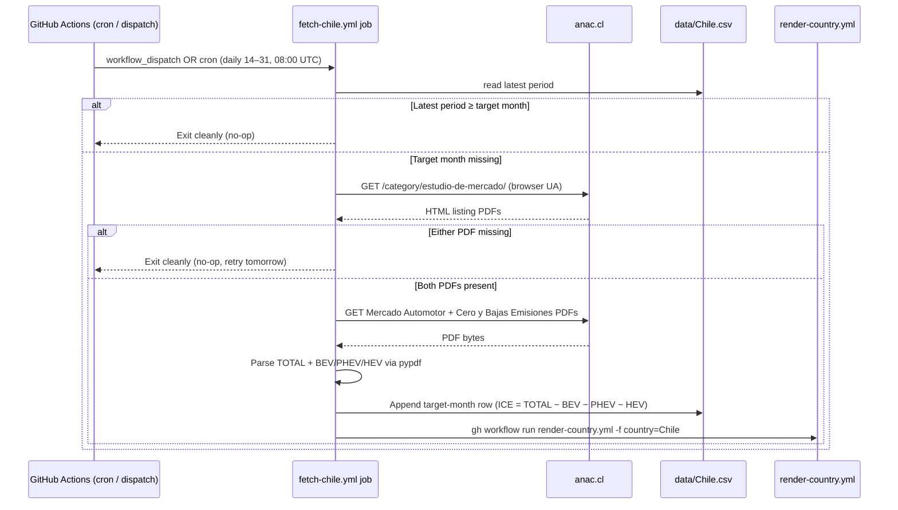

# 05 · Flows

End-to-end sequence diagrams for every meaningful user journey or background process. If you're adding a new flow, copy one of these as a template.

## Flow inventory

| # | Flow | Trigger | Outcome |
|---|---|---|---|
| A | [Public-submit a data point](#flow-a--public-submit) | Visitor fills Submit Data form | PR opened, awaiting maintainer review |
| B | [Render a country](#flow-b--render-a-country) | Maintainer triggers Render Action | New PNGs + posts + params row |
| C | [Local-render legacy](#flow-c--local-render-legacy) | Maintainer runs R in RStudio | Same outputs as Flow B, pushed directly to master |
| D | [Submit feedback / question](#flow-d--feedback-submit) | Visitor fills feedback modal | New GitHub Issue with labels |
| E | [Auto-rebuild manifest](#flow-e--manifest-rebuild) | Push to images/** or daily cron | Updated manifest.json |
| F | [Visitor reads gallery](#flow-f--gallery-read) | Page load on leraffl.github.io | Manifest + images displayed |
| G | [Copy post text](#flow-g--copy-post) | Click "📋 Copy post" or run Apple Shortcut | Text in clipboard |
| H | [Auto-ingest Brazil from ANFAVEA](#flow-h--anfavea-ingest) | Monthly cron (10th, 08:00 UTC) or manual dispatch | Updated `data/Brazil.csv` → triggers Flow B for Brazil |
| I | [Auto-ingest Chile from ANAC](#flow-i--anac-ingest) | Daily cron (14th–end of month, 08:00 UTC) or manual dispatch | Updated `data/Chile.csv` → triggers Flow B for Chile |

---

## Flow A — Public-submit



**After this flow:** the country's `data/<Country>.csv` on master has the new/corrected rows, but no new images yet. The maintainer triggers Flow B next to refresh PNGs and post text.

**Key constraints:**
- Worker has Contents+PRs scope but the only write the page can trigger is "open PR" — it cannot push directly to master (no permission was granted; even the API endpoints called are PR-only).
- Branch naming `submit/<slug>-<timestamp>` makes it easy to pick out submission PRs from regular dev branches.

---

## Flow B — Render a country



After this, Flow E (manifest rebuild) is explicitly dispatched by the Render-country workflow. Direct maintainer pushes to `images/**` still trigger Flow E through the path filter. The manifest commit then pushes to `master`, which GitHub Pages auto-deploys (Pages-from-branch; no separate Pages workflow exists or is needed).

**Performance notes:**
- Cold runner: ~2 min including R-package install
- Warm runner (cached binaries): ~30 s
- The R history-loop iterates `optim` once per data row × 2 (BEV + ICE). For Germany (~135 rows): ~3 s. For Norway (~250 rows): ~6 s.

---

## Flow C — Local-render legacy



**Why this exists at all (context for engineers):**
- Outputs are byte-compatible with Flow B — same filenames, same params row format, same posts format. So commits to master can come from either path without confusing downstream consumers.
- This path is being phased out as more data flows directly through Submit → PR → Render Action. Eventually Flow B becomes the only render path. Any new feature in `R/*.R` should be designed assuming Flow B is the canonical path.

---

## Flow D — Feedback submit



---

## Flow E — Manifest rebuild



---

## Flow F — Gallery read



This flow is intentionally trivial. **Any change that adds a backend dependency to the read path is a regression.** The page is read-side static; only the write side (Submit, Feedback) goes through the Worker.

---

## Flow G — Copy post

Two variants: in-page button, and Apple Shortcut. Both fetch the same URL.

### G.1 In-page



`clipboard.write()` is invoked synchronously inside the click handler — passing a `Promise<Blob>` to `ClipboardItem` lets the fetch resolve afterwards without losing Safari's user-gesture context. An older `await fetch(...) → clipboard.writeText(text)` chain throws `NotAllowedError` on Safari and iOS for exactly that reason.

### G.2 Apple Shortcut



**Why two paths to the same artefact:** the in-page button is for visitors and casual mobile/desktop use; the Shortcut is for the maintainer's posting workflow on iOS where launching Safari is more friction than tapping a Shortcut on the home screen.

## Flow H — ANFAVEA ingest

Brazil is the first country with an automated, source-side ingestion. ANFAVEA publishes one Excel workbook per year (`siteautoveiculos<YEAR>.xlsx`) covering production, registrations, exports, and employment. We only consume sheet "III. Emplacamento Combustível" — the cars + light-commercial fuel-split table.

```mermaid
sequenceDiagram
    participant Cron as GitHub Actions (cron / dispatch)
    participant Job as fetch-brazil.yml job
    participant Site as anfavea.com.br
    participant CSV as data/Brazil.csv
    participant Render as render-country.yml

    Cron->>Job: workflow_dispatch OR cron (10th 08:00 UTC)
    Job->>Site: GET /site/edicoes-em-excel/ (browser UA)
    Site-->>Job: HTML index
    Job->>Job: regex match siteautoveiculos<year>(-N)?.xlsx
    Job->>Site: GET /docs/siteautoveiculos<year>.xlsx
    Site-->>Job: xlsx bytes
    Job->>Job: Open sheet "III. Emplacamento Combustível"<br/>locate "Unidades" header → month row → fuel rows
    Job->>Job: Map Portuguese fuel labels → CSV columns<br/>(Elétrico→BEV, Híbrido Plug-in→PHEV, Híbrido→HEV,<br/>Gasolina→PETROL, Diesel→DIESEL, Flex Fuel→FLEXFUEL)
    Job->>Job: Skip months where all fuel values are 0
    Job->>CSV: Upsert by period; warn on >50% delta vs existing
    alt CSV changed
        Job->>Render: gh workflow run render-country.yml -f country=Brazil
    else No change
        Job-->>Cron: Exit cleanly, nothing committed
    end
```

**Where parsing lives:** [scripts/fetch_brazil.py](../../scripts/fetch_brazil.py). The module docstring is the authoritative reference for the parsing rules, column map, and how the script handles partial-year data.

**Why a browser User-Agent:** ANFAVEA's Apache returns HTTP 406 for `python-requests/*`. We send a Chrome desktop UA + standard `Accept` / `Accept-Language` headers on both calls.

**Why not the trucks/buses table:** sheet III has a second "Caminhões e Ônibus" block below the cars block. It uses a different fuel taxonomy (Elétrico/Gás/Diesel only) and isn't represented in `data/Brazil.csv`'s schema. The parser only walks the FIRST "Unidades" header and stops at the closing "Fonte:" marker, so the trucks table is naturally skipped.

**Adding more countries:** the pattern (`fetch-<country>.yml` → `scripts/fetch_<country>.py` → commit + dispatch render) is intentionally country-local rather than generic, because each statistics agency has its own URL scheme, file layout, and quirks. Duplicate and adapt rather than parameterise prematurely.

## Flow I — ANAC ingest

Chile follows the same `fetch-<country>` pattern as Brazil, with one twist: ANAC publishes **two** PDFs per month and they don't appear at the same time. The cron runs daily from the 14th onward and the script self-throttles via the CSV's latest period — most invocations are a no-op.



**Where parsing lives:** [scripts/fetch_chile.py](../../scripts/fetch_chile.py). The module docstring documents the regex patterns, the MHEV-into-ICE convention, and the no-partial-writes rule.

**Why two PDFs:** ANAC splits the headline market total (Mercado Automotor) from the alternative-drivetrain breakdown (Cero y Bajas Emisiones). Both are needed to fill one CSV row; partial writes would produce wrong charts because BEV/PHEV/HEV would default to 0 and inflate ICE.

**Why MHEV → ICE:** ANAC reports mild-hybrids (Microhíbridos) as a separate line that didn't exist historically and isn't in `data/Chile.csv`'s schema. Per maintainer's call we bucket them into ICE via the implicit subtraction (`ICE = TOTAL − BEV − PHEV − HEV − OTHERS`) rather than introducing a new column.

## See also

- [04-interfaces.md](04-interfaces.md) — request/response shapes for each Worker call shown above
- [02-components.md](02-components.md) — the boxes in the diagrams
- [08-deploy-ops.md](08-deploy-ops.md) — how to invoke Flow B, how to debug Flow A failures
