# 05 · Flows

End-to-end sequence diagrams for every meaningful user journey or background process. If you're adding a new flow, copy one of these as a template.

## Flow inventory

| # | Flow | Trigger | Outcome |
|---|---|---|---|
| A | [Public-submit a data point](#flow-a--public-submit) | Visitor fills Submit Data form | PR opened, awaiting maintainer review |
| B | [Render a country](#flow-b--render-a-country) | Maintainer triggers Render Action | New PNGs + posts + params row |
| C | [Local-render legacy](#flow-c--local-render-legacy) | Maintainer runs R in RStudio | Same outputs as Flow B, pushed directly to master |
| D | [Submit feedback / question](#flow-d--feedback-submit) | Visitor fills feedback modal | New GitHub Issue with labels |
| E | [Auto-rebuild manifest](#flow-e--manifest-rebuild) | Push to images/** or daily cron | Updated manifest.json |
| F | [Visitor reads gallery](#flow-f--gallery-read) | Page load on leraffl.github.io | Manifest + images displayed |
| G | [Copy post text](#flow-g--copy-post) | Click "📋 Copy post" or run Apple Shortcut | Text in clipboard |
| H | [Auto-ingest Brazil from ANFAVEA](#flow-h--anfavea-ingest) | Monthly cron (10th, 08:00 UTC) or manual dispatch | Updated `data/Brazil.csv` → triggers Flow B for Brazil |
| I | [Auto-ingest Chile from ANAC](#flow-i--anac-ingest) | Daily cron (14th–end of month, 08:00 UTC) or manual dispatch | Updated `data/Chile.csv` → triggers Flow B for Chile |
| J | [Auto-ingest Japan from JADA](#flow-j--jada-ingest) | Daily cron (1st–end of month, 08:00 UTC) or manual dispatch | Updated `data/Japan.csv` → triggers Flow B for Japan |
| K | [Auto-ingest multi-country from ACEA](#flow-k--acea-ingest) | Daily cron (16th–end of month, 08:00 UTC) or manual dispatch | Updated `data/<Country>.csv` for ≤21 countries → sequential Flow B for each |
| L | [Snapshot Builder curves](#flow-l--snapshot-builder) | Monthly cron (25th, 09:00 UTC) or manual dispatch | New `builder_history/<date>.csv` + updated `index.json` |
| L₂ | [Auto-ingest Uruguay from ACAU](#flow-l--acau-ingest) | Daily cron (1st–end of month, 08:00 UTC) or manual dispatch | Updated `data/Uruguay.csv` → triggers Flow B for Uruguay |
| M | [Auto-ingest Türkiye from TÜİK](#flow-m--tuik-ingest) | Daily cron (15th–end of month, 08:00 UTC) or manual dispatch with `press_id` | Updated `data/Türkiye.csv` → triggers Flow B for Türkiye |
| N | [Auto-ingest USA from ANL](#flow-n--anl-ingest) | Daily cron (10th–end of month, 10:00 UTC) or manual dispatch | Updated `data/USA.csv` (trailing 3-month window) → triggers Flow B for USA |
| O | [Auto-ingest Netherlands from RDW/Swing](#flow-o--rdw-swing-ingest) | Daily cron (1st–15th, 06:30 UTC) or manual dispatch | Updated `data/Netherlands.csv` / `Netherlands_Used.csv` / `Netherlands_HDV.csv` → per-variant Flow B |
| P | [Auto-ingest China from CPCA](#flow-p--cpca-ingest) | Daily cron (1st–end of month, 11:00 UTC) or manual dispatch | Updated `data/China.csv` (+ `China_Wholesale.csv`) → triggers Flow B for China |
| Q | [Auto-ingest Denmark from Statbank](#flow-q--statbank-ingest) | Daily cron (1st–15th, 05:15 UTC) or manual dispatch | Updated `data/Denmark.csv` and four variant CSVs → per-variant Flow B |
| R | [Auto-ingest Finland from PxWeb](#flow-r--pxweb-ingest) | Daily cron (1st–15th, 04:40 UTC) or manual dispatch | Updated `data/Finland.csv` and five variant CSVs → per-variant Flow B |
| S | [Auto-ingest Sweden from SCB](#flow-s--scb-ingest) | Daily cron (1st–15th, 05:50 UTC) or manual dispatch | Updated `data/Sweden.csv` → Flow B for Sweden |

---

## Flow A — Public-submit

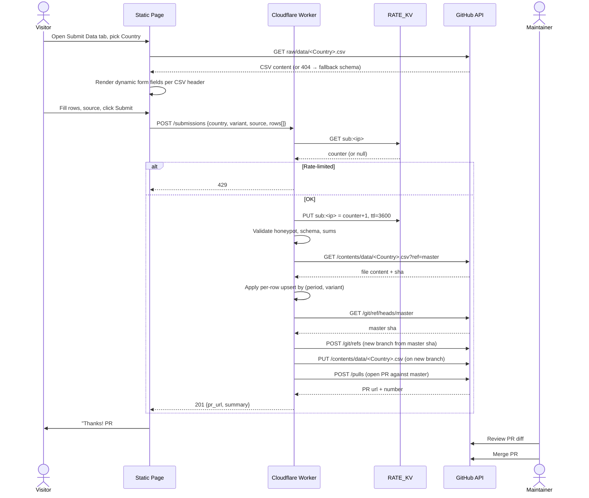

**After this flow:** the country's `data/<Country>.csv` on master has the new/corrected rows, but no new images yet. The maintainer triggers Flow B next to refresh PNGs and post text.

**Key constraints:**
- Worker has Contents+PRs scope but the only write the page can trigger is "open PR" — it cannot push directly to master (no permission was granted; even the API endpoints called are PR-only).
- Branch naming `submit/<slug>-<timestamp>` makes it easy to pick out submission PRs from regular dev branches.

---

## Flow B — Render a country

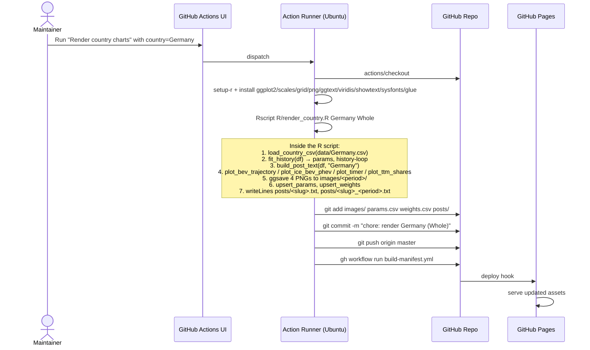

After this, Flow E (manifest rebuild) is explicitly dispatched by the Render-country workflow. Direct maintainer pushes to `images/**` still trigger Flow E through the path filter. The manifest commit then pushes to `master`, which GitHub Pages auto-deploys (Pages-from-branch; no separate Pages workflow exists or is needed).

**Performance notes:**
- Cold runner: ~2 min including R-package install
- Warm runner (cached binaries): ~30 s
- The R history-loop iterates `optim` once per data row × 2 (BEV + ICE). For Germany (~135 rows): ~3 s. For Norway (~250 rows): ~6 s.

---

## Flow C — Local-render legacy

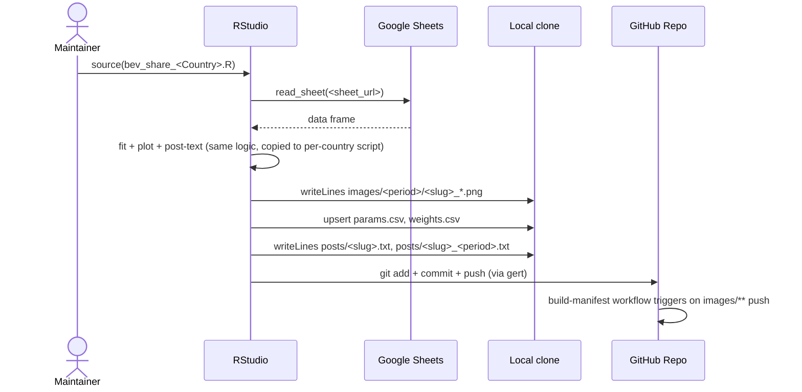

**Why this exists at all (context for engineers):**
- Outputs are byte-compatible with Flow B — same filenames, same params row format, same posts format. So commits to master can come from either path without confusing downstream consumers.
- This path is being phased out as more data flows directly through Submit → PR → Render Action. Eventually Flow B becomes the only render path. Any new feature in `R/*.R` should be designed assuming Flow B is the canonical path.

---

## Flow D — Feedback submit

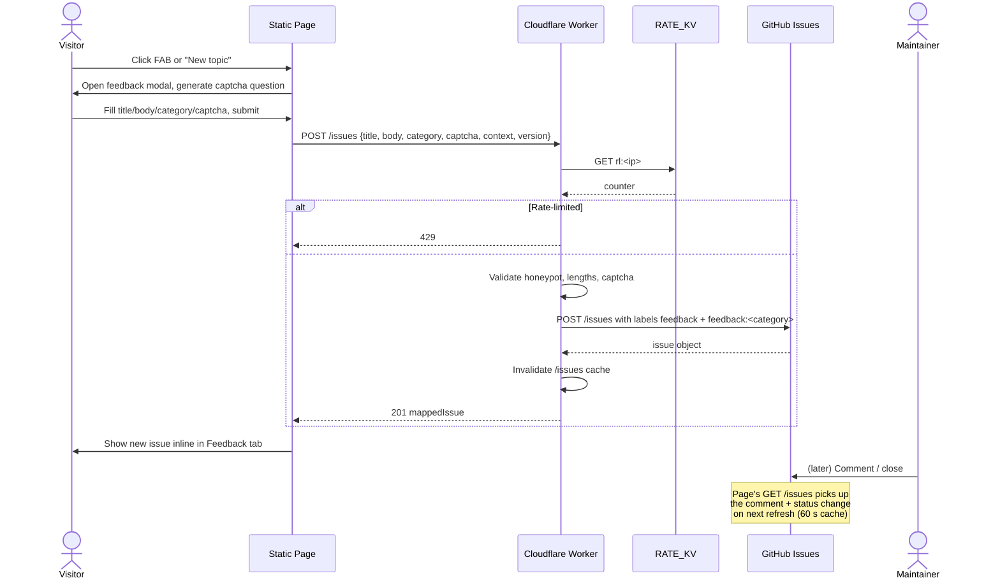

---

## Flow E — Manifest rebuild

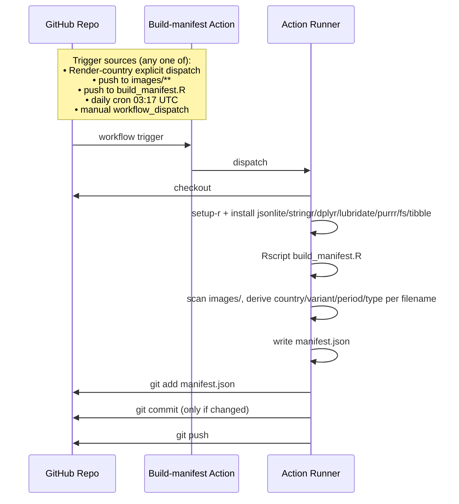

---

## Flow F — Gallery read

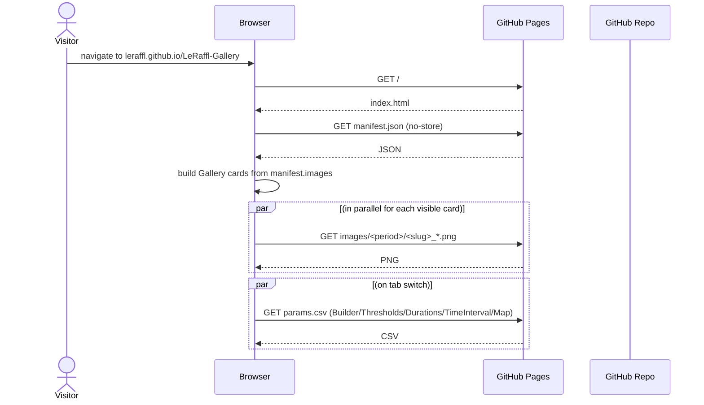

This flow is intentionally trivial. **Any change that adds a backend dependency to the read path is a regression.** The page is read-side static; only the write side (Submit, Feedback) goes through the Worker.

---

## Flow G — Copy post

Two variants: in-page button, and Apple Shortcut. Both fetch the same URL.

### G.1 In-page

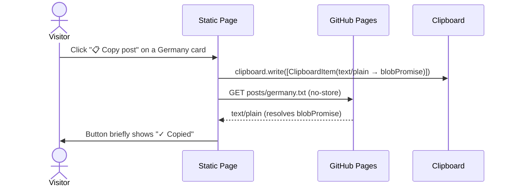

`clipboard.write()` is invoked synchronously inside the click handler — passing a `Promise<Blob>` to `ClipboardItem` lets the fetch resolve afterwards without losing Safari's user-gesture context. An older `await fetch(...) → clipboard.writeText(text)` chain throws `NotAllowedError` on Safari and iOS for exactly that reason.

### G.2 Apple Shortcut

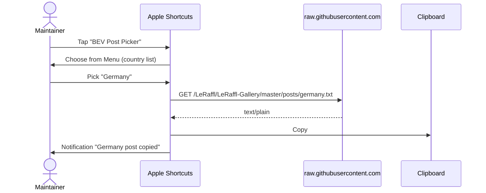

**Why two paths to the same artefact:** the in-page button is for visitors and casual mobile/desktop use; the Shortcut is for the maintainer's posting workflow on iOS where launching Safari is more friction than tapping a Shortcut on the home screen.

## Flow H — ANFAVEA ingest

Brazil is the first country with an automated, source-side ingestion. ANFAVEA publishes one Excel workbook per year (`siteautoveiculos<YEAR>.xlsx`) covering production, registrations, exports, and employment. We only consume sheet "III. Emplacamento Combustível" — the cars + light-commercial fuel-split table.

```mermaid
sequenceDiagram
    participant Cron as GitHub Actions (cron / dispatch)
    participant Job as fetch-brazil.yml job
    participant Site as anfavea.com.br
    participant CSV as data/Brazil.csv
    participant Render as render-country.yml

    Cron->>Job: workflow_dispatch OR cron (10th 08:00 UTC)
    Job->>Site: GET /site/edicoes-em-excel/ (browser UA)
    Site-->>Job: HTML index
    Job->>Job: regex match siteautoveiculos<year>(-N)?.xlsx
    Job->>Site: GET /docs/siteautoveiculos<year>.xlsx
    Site-->>Job: xlsx bytes
    Job->>Job: Open sheet "III. Emplacamento Combustível"<br/>locate "Unidades" header → month row → fuel rows
    Job->>Job: Map Portuguese fuel labels → CSV columns<br/>(Elétrico→BEV, Híbrido Plug-in→PHEV, Híbrido→HEV,<br/>Gasolina→PETROL, Diesel→DIESEL, Flex Fuel→FLEXFUEL)
    Job->>Job: Skip months where all fuel values are 0
    Job->>CSV: Upsert by period; warn on >50% delta vs existing
    alt CSV changed
        Job->>Render: gh workflow run render-country.yml -f country=Brazil
    else No change
        Job-->>Cron: Exit cleanly, nothing committed
    end
```

**Where parsing lives:** [scripts/fetch_brazil.py](../../scripts/fetch_brazil.py). The module docstring is the authoritative reference for the parsing rules, column map, and how the script handles partial-year data.

**Why a browser User-Agent:** ANFAVEA's Apache returns HTTP 406 for `python-requests/*`. We send a Chrome desktop UA + standard `Accept` / `Accept-Language` headers on both calls.

**Why not the trucks/buses table:** sheet III has a second "Caminhões e Ônibus" block below the cars block. It uses a different fuel taxonomy (Elétrico/Gás/Diesel only) and isn't represented in `data/Brazil.csv`'s schema. The parser only walks the FIRST "Unidades" header and stops at the closing "Fonte:" marker, so the trucks table is naturally skipped.

**Adding more countries:** the pattern (`fetch-<country>.yml` → `scripts/fetch_<country>.py` → commit + dispatch render) is intentionally country-local rather than generic, because each statistics agency has its own URL scheme, file layout, and quirks. Duplicate and adapt rather than parameterise prematurely.

## Flow I — ANAC ingest

Chile follows the same `fetch-<country>` pattern as Brazil, with one twist: ANAC publishes **two** PDFs per month and they don't appear at the same time. The cron runs daily from the 14th onward and the script self-throttles via the CSV's latest period — most invocations are a no-op.

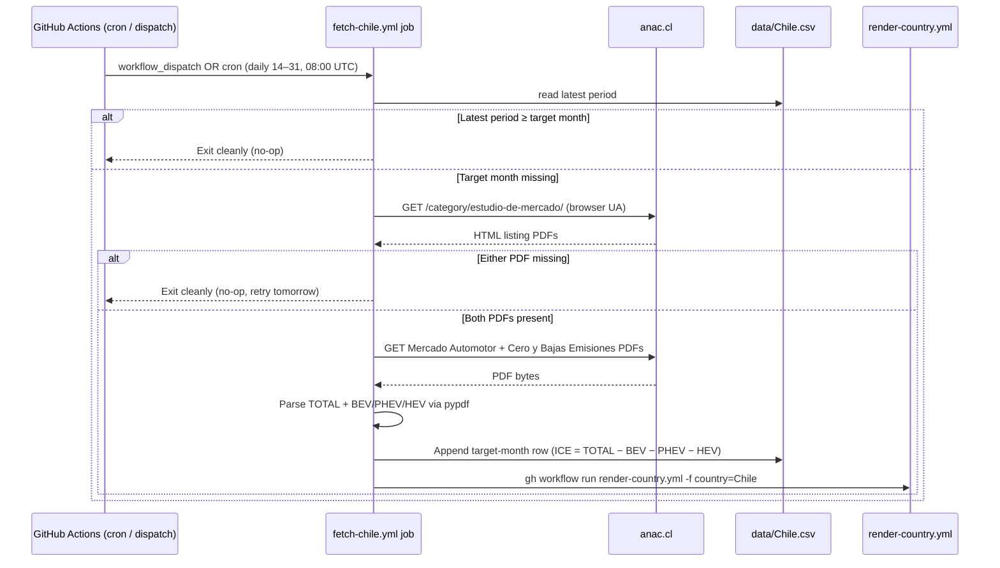

**Where parsing lives:** [scripts/fetch_chile.py](../../scripts/fetch_chile.py). The module docstring documents the regex patterns, the MHEV-into-ICE convention, and the no-partial-writes rule.

**Vehicle scope:** ANAC's "livianos y medianos" covers passenger cars + SUVs + pickups + light commercial vehicles up to 3.860 kg GVWR per DS N°241/2014 (light <2.7 t, medium 2.7–3.86 t). Camiones and buses are excluded. See [09-glossary.md § Vehicle scope per source](09-glossary.md#vehicle-scope-per-source) for the cross-country table.

**Why two PDFs:** ANAC splits the headline market total (Mercado Automotor) from the alternative-drivetrain breakdown (Cero y Bajas Emisiones). Both are needed to fill one CSV row; partial writes would produce wrong charts because BEV/PHEV/HEV would default to 0 and inflate ICE.

**Why MHEV → ICE:** ANAC reports mild-hybrids (Microhíbridos) as a separate line that didn't exist historically and isn't in `data/Chile.csv`'s schema. Per maintainer's call we bucket them into ICE via the implicit subtraction (`ICE = TOTAL − BEV − PHEV − HEV − OTHERS`) rather than introducing a new column.

### Issues hit in production

1. **ANAC hrefs sometimes carry a leading newline.** The April 2026 cron failed three days in a row with `requests.exceptions.ConnectionError: HTTPSConnectionPool(host='www.anac.cl%0ahttps', …)`. Root cause: on the category listing page, ANAC's CMS emits some `<a href>` values as `"\nhttps://www.anac.cl/wp-content/uploads/…pdf"` (literal leading newline). The discovery loop's `href.startswith("http")` returned False on the unstripped value, so the script prepended the host — producing `"https://www.anac.cl\nhttps://www.anac.cl/…"`. `requests` URL-encoded the newline (`%0a`) into the hostname and the connection bombed before any PDF was touched. Fix: `href = a["href"].strip()` before the prefix check. The earlier months (Enero/Febrero/Marzo 2026) were ingested manually as part of the bootstrap, so the bug only surfaced once the cron tried to discover its first month live. Pre-existing pattern: see the same `host_not_allowed` and User-Agent stories in Flow J / ACEA — ANAC's WordPress in particular is whitespace-loose in its emitted HTML and we should treat any href we don't control as needing `.strip()` before structural checks.

## Flow J — JADA ingest

Japan follows the same `fetch-<country>` pattern as Brazil and Chile, with two twists: (1) JADA publishes the data in **both** PDF and XLSX form — we prefer the XLSX because its cell layout is machine-readable; (2) each publication is a rolling **4-month rollup** (one sheet/page per month), not a single-month file. We extract the target month from whichever sheet matches and let older months pass through untouched. The cron runs daily from the 1st onward and the script self-throttles via the CSV's latest period — most invocations are a no-op until JADA publishes the file for the previous month (typically the first business week).

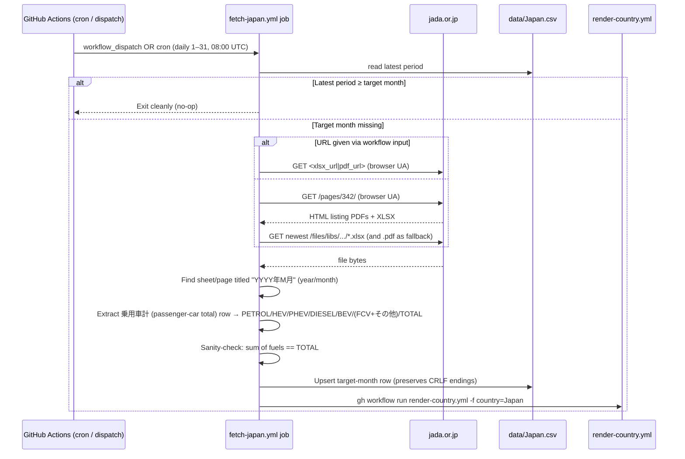

**Where parsing lives:** [scripts/fetch_japan.py](../../scripts/fetch_japan.py). The module docstring documents the column mapping, the FCV+その他 *(sonota, "other")* fold-in convention, and the no-partial-writes rule.

**Vehicle scope:** JADA page 342 covers 登録車 *(tōrokusha,* standard passenger cars: engine > 660 cc **or** length > 3.40 m / width > 1.48 m / height > 2.00 m; ≈ LDV / EU M1, almost all under 3.5 t — no formal weight cap*)* only. Kei cars (軽自動車 *kei jidōsha*: ≤ 660 cc **and** ≤ 3.40 × 1.48 × 2.00 m, typically 700-1000 kg, ~35-40 % of Japan's new-car market) are explicitly excluded by the file's footer "２．軽自動車は含みません。" *("2. Kei cars not included.")* — see [09-glossary.md § Vehicle scope per source](09-glossary.md#vehicle-scope-per-source). The pre-existing `data/Japan.csv` rows since 2020-02 follow the same scope (monthly totals 180–280k match 登録車-only volumes).

**Why XLSX preferred, PDF fallback:** both files carry the same payload but the XLSX has stable cell positions (A=row label, D=PETROL, F=HEV, …, R=TOTAL). The PDF text, when extracted with pypdf, is reordered column-by-column rather than row-by-row, which forced us into a line-based parser (see "Issues hit" below). We try XLSX first and only fall back to PDF if the XLSX URL was not supplied / not parseable for the target month. This also future-proofs us against JADA dropping one of the two formats.

**Why `OTHERS = ＦＣＶ + その他(*)`:** JADA reports fuel-cell vehicles (ＦＣＶ) and "other" (LPG etc., footnoted `*その他はＬＰＧ車等`) as two separate columns. The pre-existing `data/Japan.csv` collapses them into a single `OTHERS` column. Verified against three historical rows: e.g. 2026-01 OTHERS=80 in the CSV matches FCV=79 + その他=1 in the source. We follow the established CSV convention rather than introduce an `FCV` column.

**Why daily from the 1st:** unlike ANAC (Chile, publishes ~14th) and ANFAVEA (Brazil, publishes ~6th–10th), JADA tends to publish the previous month's file on the **first business day** of the following month — the April 2026 file in our sample was published 2026-05-11, which is on the late side; January 2026 was published 2026-02-05. Starting on day 1 keeps the first publication day in range; the self-throttle makes the empty days free.

### Design decisions

| Decision | Rationale |
|---|---|
| Duplicate Chile's structure rather than abstract a generic "fetch_country" runner | The project convention (Brazil flow notes) is to keep each fetcher country-local: each agency has its own URL scheme, file layout, and quirks. The shared shape sits in the workflow YAML (cron + dispatch + commit + render-trigger), not in the Python. |
| Take target month = previous calendar month by default | Mirrors Chile/Brazil and matches the maintainer's mental model. Any other month can be forced via `--year`/`--month` on the CLI or workflow_dispatch inputs. |
| Self-throttle by reading `latest_period` from the CSV before any HTTP call | A no-op invocation should cost nothing on JADA's side. We hit the index page only when there's a real chance the target month isn't yet in the CSV. |
| Preserve the existing CRLF line endings in `data/Japan.csv` | Detected at write time by sniffing the first 4 KiB of the file. Without this the very first ingest would rewrite all 172 rows from CRLF to LF and produce a noisy diff (we tripped over this during development; see "Issues hit"). |
| Sum check `PETROL+HEV+PHEV+DIESEL+BEV+OTHERS == TOTAL` before writing | The XLSX has both per-fuel columns and a 合計 (Total) column. If they disagree, the column mapping is wrong — fail loudly rather than write a bad row. Cross-checked exact for 12/12 months of 2022 and 3/3 months of 2026 against the existing CSV during development. |
| Manual `--xlsx-url` / `--pdf-url` overrides on the workflow | The maintainer noticed that JADA's hosting may block cloud IP ranges (we hit `HTTP 403, x-deny-reason: host_not_allowed` from the development sandbox). Manual URL inputs let the workflow run even if auto-discovery is blocked on Actions runners. The first scheduled CI run is what tells us whether discovery works from `ubuntu-latest`. |

### Issues hit during development

1. **JADA blocked the dev sandbox.** Initial `WebFetch` / `curl` against `https://www.jada.or.jp/pages/342/` returned `HTTP 403 x-deny-reason: host_not_allowed`. The maintainer uploaded two sample files to `master` (a 2026 monthly XLSX+PDF pair plus a 2022 full-year XLSX) and we developed the parser against those. We do not yet know whether the GitHub-hosted runner is also blocked — the first manual dispatch on the feature branch will tell us. If it is, the `--xlsx-url` / `--pdf-url` workflow inputs are the fallback.

2. **PDF parser shifted columns by one when ＦＣＶ was zero.** First version used a single multi-line regex anchored on the `構成比` (composition) row that always follows a data row. On months without an ＦＣＶ entry (2026-02, -03, -04) the regex over-matched: it picked up a `0` from the *previous* row's `構成比 … 0.1 100.0 --` line as PETROL and shifted every column to the right. Fix: switched to a line-based parser. Each `\n`-separated line is independently tokenised; only lines whose count tokens contain at least one comma-grouped integer (real fuel counts always do; `構成比` percentages never do) are kept. From those, the row with the largest TOTAL is the 乗用車計 row. After the fix, the PDF parser matches the XLSX parser byte-exact on all 16 validated months.

3. **First test rewrote all 172 rows.** End-to-end smoke test produced a diff of the entire file even though only one row was added. Cause: `data/Japan.csv` uses CRLF line endings (committed that way originally); `csv.DictWriter(lineterminator="\n")` rewrote it as LF. Fix: detect the existing file's line ending by reading its first bytes and feed it back to `DictWriter`. Chile.csv has the same CRLF convention, but `fetch_chile.py` has not yet hit this because Chile.csv was rewritten as part of the bootstrap commit; we still left a TODO for a follow-up to keep the two scripts consistent.

4. **Header order is ambiguous in the PDF.** pypdf's text-extraction emits the page header line as `合計ガソリン ＨＶ ＰＨＶ ディーゼル ＥＶ ＦＣＶ その他(*) 前年比`, which reads as if 合計 (Total) is the first column. It isn't — that's just two adjacent cells being concatenated by the extractor. The actual data row, e.g. `59,374 64.3 178,423 … 11,245 280.4 29 74.4 265,438 92.1` for 2026-03, confirms PETROL is first and 合計 is last. The XLSX confirms the same via cell coordinates. Documented inline in the script so the next reader doesn't get bait-switched by the header text.

### Validation

Parser was checked byte-exact against the existing `data/Japan.csv` rows:

| Sample file | Months validated | Result |
|---|---|---|
| `燃料別登録台数統計（2022年1月~12月）.xlsx` *("Registration counts by fuel type (Jan–Dec 2022)")*, full-year rollup | 2022-01 … 2022-12 | 12/12 EXACT match |
| `202605081028169165.xlsx` (May 2026 monthly rollup) | 2026-01, 2026-02, 2026-03 | 3/3 EXACT match |
| `202605081028169165.xlsx` — new row | 2026-04 | Sum check ✓ (parsed BEV/PHEV/HEV/PETROL/DIESEL/OTHERS sum to 223,369 = TOTAL) |
| `202605081027423166.pdf` (same publication, PDF format) | 2026-01 … 2026-04 | Matches XLSX byte-exact (after the line-based parser fix; see Issue 2 above) |

The XLSX layout has been stable from at least 2022 through 2026 — same column positions, same row label `乗用車計`, same footer notes. The sample files themselves are not in this branch; they live in `master` (committed by the maintainer as `Add files via upload`) and were pulled into the working tree only during development.

## Flow K — ACEA ingest

ACEA (European Automobile Manufacturers' Association) publishes one PDF press release per month covering ~25 European markets at once. We treat 21 of those markets as in-scope (16 always-list + 5 conditional-list — see "The two country lists" below); a single ACEA run can therefore touch up to 21 CSVs and needs both a multi-CSV upsert step and a multi-country render fan-out. We keep the `fetch-<source>` workflow shape but split the run into two jobs:

```mermaid
sequenceDiagram
    participant Cron as GitHub Actions (cron / dispatch)
    participant Fetch as fetch-acea.yml · fetch job
    participant Site as acea.auto
    participant CSVs as data/<Country>.csv (≤21 files)
    participant Render as fetch-acea.yml · render matrix (max-parallel=1)
    participant RC as render-country.yml (workflow_call)
    participant Manifest as build-manifest.yml

    Cron->>Fetch: workflow_dispatch OR cron (daily 16–31, 08:00 UTC)
    Fetch->>CSVs: read max(period) across always-list countries
    alt All always-list CSVs already at target month
        Fetch-->>Cron: Exit cleanly (no-op)
    else Target month missing somewhere
        Fetch->>Site: GET Press_release_car_registrations_<Month>_<Year>.pdf
        alt 403 / 404
            Fetch-->>Cron: Exit cleanly (no-op, retry tomorrow)
        else PDF bytes
            Site-->>Fetch: PDF bytes
            Fetch->>Fetch: pdfplumber extract_text() per-line parser (primary) or extract_tables() fallback
            Fetch->>Fetch: Identify MONTHLY page; read 14 ints per country line as 7 (curr, prev) pairs
            Fetch->>Fetch: For each in-scope country, parse (curr_year, prior_year) for BEV/PHEV/HEV/OTHERS/PETROL/DIESEL/TOTAL
            Fetch->>CSVs: Apply per-country write rules (always vs conditional, current vs previous-year)
            Fetch->>Fetch: Emit `changed_countries=[...]` to $GITHUB_OUTPUT
            Fetch->>CSVs: Single git commit for all modified CSVs
        end
    end
    Fetch->>Render: matrix.country = changed_countries, max-parallel=1
    loop one country at a time
        Render->>RC: workflow_call(country, variant=Whole)
        RC->>RC: setup-r → Rscript R/render_country.R → commit images/params/weights/posts
        RC->>Manifest: gh workflow run build-manifest.yml
    end
    Note over Manifest: build-manifest.yml has `concurrency: manifest-${{ github.ref }}, cancel-in-progress: true` so the ~16 fan-in triggers coalesce to a single final manifest build.
```

**Where parsing lives:** [scripts/fetch_acea.py](../../scripts/fetch_acea.py). The module docstring documents the column-position detection, the dash-glyph handling, and the per-row write rules.

**Vehicle scope:** ACEA's "new passenger car registrations" — M1 vehicles only. Light commercial vehicles are published in a separate ACEA press release that we don't ingest. See [09-glossary.md § Vehicle scope per source](09-glossary.md#vehicle-scope-per-source).

### Pre-design audit

Before drafting the per-country rules we read every existing `data/<Country>.csv` for the ACEA countries we initially considered and recorded the `source` column on the most recent monthly row. The audit drove the two-list split, surfaced four countries that needed to be removed from scope entirely, and exposed a handful of edge cases that needed explicit confirmation from the maintainer:

| Country | Most recent source | Notes |
|---|---|---|
| Belgium, Bulgaria, Croatia, Cyprus, Estonia, France, Greece, Iceland, Latvia, Lithuania, Romania, Slovakia, Slovenia | `ACEA` | Pure ACEA-sourced — natural fit for the always-list. |
| Czechia | `ACEA / sda-cia.cz` | Blended source. Always-list current-month overwrites it cleanly; prior-year correction skips it (source != exact `ACEA`). |
| Hungary | `Hungary` | Custom string. Maintainer confirmed in chat: this is a historical mislabel, the data is actually ACEA. Always-list overwrite is intended — we let the source converge to `ACEA` going forward and leave the past untouched. |
| Malta | `ACEA` | Always-list; last entry was `2025-05` — the file had a multi-month gap that this fetcher will close. |
| Spain | `ACEA / DGT / asierlizarraga` | Conditional — non-ACEA source means the manual blend stays untouched. |
| Luxembourg | `ACEA / lustat.statec.lu` | Conditional — same. |
| Poland | `ACEA / PZPM` | Conditional — same. |
| Norway | `ofv.no & ACEA` | Conditional — same. |
| Switzerland | `pxweb.bfs.admin.ch / ACEA` | Conditional — same. |
| ~~Denmark, Finland, Netherlands, Sweden~~ | — | **Out of scope.** All four are fed from national databases that also expose richer fuel/variant splits than ACEA (Private / Industry / Used / HDV / native HEV / flexifuel). The maintainer's preferred pipeline is the database, not the ACEA monthly headline, so the ACEA fetcher would only muddy the water. All four now have their own workflows: Denmark [Flow Q](#flow-q--statbank-ingest), Finland [Flow R](#flow-r--pxweb-ingest), Netherlands [Flow O](#flow-o--rdw-swing-ingest), Sweden [Flow S](#flow-s--scb-ingest). |

### Maintainer Q&A that shaped the rules

Four interactive decisions made via `AskUserQuestion` mid-design. Recording them here so the rationale survives future reviews:

| Question | Maintainer's call |
|---|---|
| For the conditional list, when does "schon was da" trigger — any row, or only rows already from ACEA? | "Skip nur wenn Quelle != ACEA". A pure-ACEA row gets overwritten; any blended/custom source is treated as manual curation and left alone. |
| Hungary is in the always-list but its CSV's source is `Hungary` — overwrite, treat as conditional, or remove from the list? | Overwrite with ACEA — the `Hungary` source string is itself a historical bug. |
| Previous-year corrections — same rule as conditional, always overwrite, or ignore? | Same as conditional, applied to both lists. If the existing source is empty (some old rows have no source) or non-ACEA, leave it for the maintainer's manual data-quality review later. |
| 16+ countries can change per run — sequential rendering, parallel via `gh workflow run`, or staggered dispatches? | Sequential, same workflow, max-parallel=1. |

### The two country lists

The maintainer maintains the gallery for a ~50-country roster; ACEA only covers part of it, and several of the countries ACEA *does* cover also have a "better" upstream source the maintainer (or community contributors) already feeds in. We split ACEA's covered countries into two buckets:

| Bucket | Countries | When ACEA writes |
|---|---|---|
| Always-list (16) | Belgium, Bulgaria, Croatia, Cyprus, Czechia, Estonia, France, Greece, Hungary, Iceland, Latvia, Lithuania, Malta, Romania, Slovakia, Slovenia | Always overwrites the current-month row, source becomes `ACEA`. |
| Conditional-list (5) | Luxembourg, Norway, Poland, Spain, Switzerland | Writes the current-month row only if the existing row's `source` is exactly `ACEA` or no row exists. Mixed-source rows (e.g. `ACEA / DGT / asierlizarraga`, `ofv.no & ACEA`) are left untouched — and today every conditional-list country sits on a blended source, so the practical effect is "never write". The branch is kept so a future maintainer reset of any of these CSVs to pure `ACEA` would let the fetcher resume writing it. |

ACEA's PDF also covers Austria, Germany, Ireland, Italy, Portugal, the United Kingdom, plus Denmark, Finland, Netherlands and Sweden — none are in this fetcher's scope. Austria/Germany/Ireland/Italy/Portugal/UK get their own (more granular) per-country workflows planned for later; Denmark/Finland/Netherlands/Sweden are fed from national databases that expose richer splits than ACEA (Private / Industry / Used / HDV / native HEV / flexifuel). All four now have their own workflows ([Flow Q](#flow-q--statbank-ingest), [Flow R](#flow-r--pxweb-ingest), [Flow O](#flow-o--rdw-swing-ingest), [Flow S](#flow-s--scb-ingest)). The ACEA fetcher script skips all of them silently regardless.

### Previous-year corrections

The MONTHLY table on page 3 of each press release carries the target month *and* the same month one year earlier (e.g. the March 2026 file gives both March 2026 and a refreshed March 2025 column). ACEA occasionally revises the prior-year figures when national agencies submit corrections, and the maintainer wants those corrections to land in our CSVs.

The rule for the prior-year row is the **conditional rule applied uniformly to both lists**: only overwrite if the existing row's source is exactly `ACEA`. If the source field is empty (some older imports lack a source) or carries a custom/blended source, the row is left alone for the maintainer to review by hand. This means:
* Belgium 2025-03 (source=`ACEA`) → gets the revised PHEV / HEV / OTHERS / PETROL values from the March 2026 publication.
* Czechia 2025-03 (source=`ACEA / sda-cia.cz`) → left untouched; the blended source is treated as "manually curated, don't clobber".
* Hungary 2025-03 (source=`Hungary`) → left untouched. The maintainer flagged that the `Hungary` source string is a historical mislabel — the data is actually ACEA — but per the project policy we don't rewrite the past; the next month's row will land with the correct `ACEA` source and over time the file converges.

### Sequential render fan-out

The maintainer's preference is for the countries to render one after another rather than all in parallel, both to avoid flooding GitHub Actions' concurrency limits and to keep the commit history readable. The simplest mechanism that satisfies this without writing a hand-rolled loop is a reusable workflow:

* [render-country.yml](../../.github/workflows/render-country.yml) was extended with a `workflow_call` trigger (the existing `workflow_dispatch` trigger is unchanged — the maintainer still uses the Run-workflow UI button day-to-day).
* [fetch-acea.yml](../../.github/workflows/fetch-acea.yml) declares a `render` job with `strategy.max-parallel: 1` whose matrix is built from the `changed_countries` JSON output of the fetch step. Each matrix entry `uses: ./.github/workflows/render-country.yml`.

The downstream build-manifest dispatches from each render aren't an issue: `build-manifest.yml` uses `concurrency: manifest-${{ github.ref }}` with `cancel-in-progress: true`, so all but the last fan-in trigger gets cancelled and exactly one manifest build runs at the end. Deployment is therefore never blocked by the fan-out — the maintainer's explicit concern that "die anderen actions die dranhängen wie z.B. deployment sollten sich nicht aufhängen".

**Alternatives considered:**

| Approach | Why we didn't go with it |
|---|---|
| Fan out `gh workflow run render-country.yml` calls in a loop (Brazil/Chile/Japan pattern) | Would dispatch 16 renders in parallel — each has its own per-country `concurrency` group, so they don't serialize. Fine for a single-country fetcher, wrong for a multi-country one. |
| Same as above with `sleep` between dispatches | Hides the parallelism but doesn't eliminate it; the dispatched runs still execute in parallel once the queue empties. Adds no real backpressure. |
| Inline the R rendering steps directly in `fetch-acea.yml` (no reusable workflow) | Duplicates the setup-r block, the package list, the EndBug commit, and the manifest dispatch. The matrix + `workflow_call` approach reuses every line of `render-country.yml` verbatim and stays consistent with the existing single-country flow. |
| `workflow_run` trigger on `build-manifest.yml` listening for ACEA commits | Couples the manifest build to the ACEA workflow lifecycle; an unrelated workflow modifying the same paths wouldn't trigger it. The existing `paths: ['images/**']` push trigger already covers all callers uniformly. |

### Why the 16th and not the 1st

ACEA's March 2026 release went out on **23 April 2026** (the embargo line on page 1 reads "EMBARGOED PRESS RELEASE 6.00 CEST (4.00 GMT), 23 April 2026"). Cross-checked against earlier months, ACEA reliably publishes between the 22nd and 25th of the following month. We cron daily from the 16th onward (vs. Chile's 14th and Japan's 1st) to keep the first plausible publication day in range without inflating the empty-day cost — most schedule fires before the 23rd are no-ops via the self-throttle and don't even touch the network.

### Design decisions

| Decision | Rationale |
|---|---|
| Single fetcher job, all CSVs in one commit | A `git commit` per country would create N commits in master and N pushes per scheduled run. One combined commit keeps history readable and the working tree consistent (`chore: update ACEA data (multi-country)`). |
| Sequential render matrix instead of parallel `gh workflow run` dispatches | The maintainer's preference; also bounds the runner pool usage (≤1 render at a time vs. up to 16) and keeps per-country render commits in the same chronological order they were dispatched. |
| Extend `render-country.yml` with `workflow_call` instead of inlining the render logic in `fetch-acea.yml` | DRY — the R rendering, the R-package install, and the EndBug commit step are unchanged for the ACEA flow. Adding a four-line `workflow_call` block to the existing workflow costs less than maintaining two copies. |
| Detect fuel-column positions from the header row instead of hard-coding offsets | Maintainer warned: "Es kann außerdem sein dass die spalten BEV, PHEV, HEV, PETROL, DIESEL, etc leicht anders angeordnet sind". Today the order on page 3 is BEV, PHEV, HEV, OTHERS, PETROL, DIESEL, TOTAL — which is **not** the order in our CSVs (OTHERS sits between DIESEL and TOTAL in the CSV schema). Header-driven mapping survives reorderings transparently. |
| pdfplumber instead of pypdf | pypdf concatenates table cells in reading-order, collapsing thousand-separated counts (e.g. Cyprus DIESEL `"184"` → `"18 4"`). The **primary** parser uses pdfplumber's `extract_text()` — one line per country, 14-integer contract — which survives both the historical PDF generator and the Word-generated format ACEA adopted from April 2026. `extract_tables()` is kept as a **fallback** for pre-April PDFs that still have explicit cell rules; it cannot run on Word-generated PDFs because Word's export does not emit the `LTRect` cell boundary objects pdfplumber relies on. |
| `is_acea_source(s) := s.strip().upper() == "ACEA"` (exact match) | Any blended string — `ACEA / DGT / asierlizarraga`, `ofv.no & ACEA` — signals manual curation; we treat it as "don't clobber". This is the simplest rule that gives the maintainer "skip if already curated, write if pure ACEA" semantics. |
| Self-throttle on `max(period)` across the always-list countries, not a single canary | Different national agencies sometimes back-fill old months at different times; using a canary like Belgium would over-throttle if a back-fill happened. Taking the *maximum* across the always-list means "if any always-list country still needs the target month, proceed", which is what we want. |
| Preserve original row order in the CSV (don't re-sort on write) | The historical CSVs (Belgium, France, …) have a handful of prior-year correction rows inserted out of period order (e.g. `2022-07` appears between `2023-07` and `2023-08` in Belgium.csv). Re-sorting on every write would create a noisy diff of moving those rows around. We preserve the on-disk order for known periods and append new periods sorted at the end. |
| Use floats for fuel counts (`13650.0`) to match existing CSV convention | Existing rows are floats (some carry interpolated/disaggregated values from older quarterly→monthly conversions, e.g. `1346.333333`). Writing `13650.0` instead of `13650` keeps the column type consistent and the diff against existing rows clean. |
| Tolerate sum != TOTAL with a warning, not a hard fail | Malta's March 2026 row reports `BEV+PHEV+HEV+OTHERS+PETROL+DIESEL = 581`, `TOTAL = 580` — a 1-unit discrepancy in ACEA's own source data. The same off-by-one appears in the existing Malta.csv rows. Hard-failing here would block every monthly run on a known-quirky cell. |

### Issues hit during development

1. **ACEA blocked the dev sandbox.** Initial `WebFetch`, `curl` with a desktop Chrome User-Agent, and even `web.archive.org` access all returned `HTTP 403 x-deny-reason: host_not_allowed` — the same pattern we saw with JADA. The maintainer uploaded the March 2026 PDF directly to `master` (`data/Press_release_car_registrations_March_2026.pdf`) and we developed the parser against that. Whether the GitHub-hosted runner is blocked too is an open question; if it is, the `--pdf-url` workflow input lets the maintainer paste in any working URL or local path. The downstream user-agent and `Referer: https://www.acea.auto/` headers in `HTTP_HEADERS` are the same trick that unblocked ANAC/JADA.

2. **First parser prototype with pypdf shifted columns.** Used pypdf's `extract_text()` and a row-token regex first. Whenever ACEA rendered a count with extra inter-glyph spacing the tokens split (Cyprus DIESEL `"184"` in the PDF read as `"18 4"` in extracted text, then again as `"18 4 3 -58.1"` after the next `43` joined it), shifting every later column by one. pdfplumber's `extract_tables()` recovers the actual table-cell grid; a fuel-section cell reads cleanly as `"18 43 -58.1"`. Trade-off: pdfplumber pulls in pdfminer.six + pypdfium2 + Pillow, heavier than pypdf, but the install on `ubuntu-latest` is ~20 s and stays well within the runner's disk budget.

3. **First test wrote a noisy diff for Belgium.** End-to-end smoke test against the March 2026 PDF moved three 2022 rows around in `data/Belgium.csv` even though the actual data change was a single corrected 2025-03 row. Cause: `write_csv` was sorting everything by period; Belgium had `2022-07/-08/-09` inserted out of order historically (during a prior batch import). Fix: capture the on-disk row order before mutating and pass it back to `write_csv` so unchanged rows stay where they were; new periods are sorted and appended.

4. **The `notes` column for previous-year corrections.** Each row writes the source URL into the `notes` column. For prior-year corrections this means a row originally noted "" or empty now carries the URL of the file that produced the correction. The maintainer is OK with this — the URL is a useful "what publication did this come from" pointer, and the existing rows the script *doesn't* touch (non-ACEA source) keep their original notes.

5. **YTD page vs MONTHLY page.** Page 4 carries a year-to-date version of the same table; the maintainer warned explicitly: "Pass außerdem auf dass du die richtige Tabelle hast". The parser disambiguates by inspecting row 1 of each candidate table — MONTHLY cells read `March\n2026`, YTD cells read `Jan-Mar\n2026`. We *only* read the monthly table because (a) the maintainer's CSVs are monthly, not YTD, and (b) the monthly table already exposes the same-month prior-year column we need for corrections, so the YTD page adds nothing.

6. **Page 4 (YTD) renders the header text letter-spaced.** Side observation while debugging the table-disambiguation: pdfplumber emits the YTD header as `"B A T T E R Y E L E C T R IC"` (each glyph separated) while the monthly header is the clean `"BATTERY ELECTRIC"`. The `_normalise_header` helper (`re.sub(r"\s+", "", s).rstrip("123").upper()`) handles both transparently, but it's a foot-gun if someone later writes a different header matcher without the whitespace-strip step.

### Issues hit in production

1. **GitHub Actions runner gets 403 from ACEA — silent no-op hid the failure.** The first cron run after merging returned HTTP 403 with no `x-deny-reason` header — ACEA's CDN/WAF blocked the `ubuntu-latest` runner the same way it blocked the dev sandbox. The original code treated 403 and 404 identically (silent no-op, "retry tomorrow"), so the CSV silently stayed stale with no red-check on the workflow. Fix: (a) distinguish 403 (`PDFAccessDenied` exception → `sys.exit()` so the workflow turns red) from 404 (silent no-op, retry tomorrow is legitimate); (b) use a `requests.Session()` that first GETs the ACEA homepage to pick up the WAF session cookie, then fetches the PDF — the same "session warmup" pattern that unblocked ANAC/JADA; (c) upgrade `HTTP_HEADERS` to a full Chrome 124 fingerprint including `Sec-Ch-Ua-*` and `Sec-Fetch-*` client-hints. When the runner is hard-blocked despite this, the `--pdf-url` workflow input accepts a local file path so the maintainer can download the PDF in a browser and re-dispatch.

2. **April 2026 PDF is Word-generated; `extract_tables()` returns nothing.** ACEA switched their PDF generator to Microsoft Word's export starting with the April 2026 release. Word's export does not emit explicit table cell rules (the `LTRect` objects pdfplumber relies on), so `extract_tables()` returns an empty list on the country pages. Fix: make `extract_text()` + line-by-line tokenisation the **primary** path (`_parse_via_text()`). The parser detects the MONTHLY page by the presence of `"BY MARKET AND POWER SOURCE"` + `"MONTHLY"` (not `"YEAR TO DATE"`), then for each line tries to match a country name prefix and tokenises the rest: drop tokens with `.` (percentages), treat dash glyphs as 0, require exactly 14 integers → 7 fuel-section `(current, prior)` pairs in documented PDF column order. The original `extract_tables()` path is kept as a **fallback** (`_parse_via_tables()`) so pre-April PDFs still work. The entry-point `parse_monthly_table()` tries text first, falls back to tables, and only dumps diagnostics + raises if both paths come up empty.

3. **Stale checkout SHA in the render matrix.** `actions/checkout@v4` without an explicit `ref:` uses `github.sha` — the dispatch-time commit, which is the commit *before* the fetch job's data commit. Every render matrix entry therefore checked out a tree missing exactly the CSVs it was supposed to render, and the push failed non-fast-forward because the fetch commit wasn't in the render's ancestors. Fix: `ref: ${{ github.ref_name }}` on the checkout step in `render-country.yml`. This pulls the latest branch tip (including the fetch commit and any earlier render commits in the serial chain), making the sequential renders fast-forward-clean.

4. **`workflow_dispatch` boolean inputs arrive as strings.** GitHub Actions sometimes serialises `boolean`-typed inputs as the string `'true'` / `'false'` rather than JSON `true` / `false`, depending on the caller path (UI vs API vs `workflow_call`). The expression `inputs.force_render == true` silently evaluated to `false` on the string form, so ticking the checkbox had no effect and the `--force-render` flag was never passed to the Python script. Fix: `(inputs.force_render == true || inputs.force_render == 'true') && '1' || ''` — accept both the JSON boolean and the string representation. Applied to both `force` and `force_render` inputs in `fetch-acea.yml`.

5. **Race condition: `build-manifest.yml` commits between sequential render checkouts.** Each render's `EndBug/add-and-commit` push triggers `build-manifest.yml` asynchronously. With `max-parallel: 1` the renders are serial, but the manifest run dispatched by render N completes and commits `manifest.json` to the branch while render N+1's R script is still running. When render N+1 then calls `EndBug/add-and-commit`, it tries to push its render outputs against a remote that has advanced past its checkout SHA — non-fast-forward error. The `concurrency: cancel-in-progress: true` group on `build-manifest.yml` only coalesces triggers; it doesn't prevent the manifest commit from landing before N+1 pushes. Fix: `pull: '--rebase --autostash'` on the `EndBug/add-and-commit@v9` step in `render-country.yml`. The add-and-commit action pulls and rebases before pushing, absorbing any intervening manifest commits cleanly. The final manifest is still built once after all renders complete.

### Validation

Parser was checked byte-exact against the existing CSV rows where applicable:

| Check | Result |
|---|---|
| `Press_release_car_registrations_March_2026.pdf` — 2026-03 column for all 21 in-scope countries | 21/21 current-month values match the existing `data/<Country>.csv` rows (where source = `ACEA`). Malta has a known 580 vs. 581 (sum-vs-TOTAL) off-by-one that appears identically in `data/Malta.csv` — the parser logs a `sanity Malta curr: components=581 TOTAL=580` warning and proceeds. |
| Same file — 2025-03 column (prior-year correction) | 9 countries with source=`ACEA` (Belgium, Bulgaria, Croatia, Cyprus, Iceland, Latvia, Lithuania, Slovakia, Slovenia) received the ACEA-revised values (e.g. Belgium 2025-03 PHEV: 3399 → 3244, HEV: 4455 → 4610, OTHERS: 349 → 348, PETROL: 17056 → 17057). Countries with non-`ACEA` source (Czechia `ACEA / sda-cia.cz`, Hungary, Spain, …) correctly left untouched. |
| Same file — Denmark, Finland, Netherlands, Sweden | Out of scope for the ACEA fetcher — script skips them silently. All four are fed by their own workflows ([Flow Q](#flow-q--statbank-ingest), [Flow R](#flow-r--pxweb-ingest), [Flow O](#flow-o--rdw-swing-ingest), [Flow S](#flow-s--scb-ingest)) which create `data/Denmark.csv` / `data/Finland.csv` / `data/Netherlands.csv` / `data/Sweden.csv`. |
| Re-run the script over the just-written tree | Idempotent: `Countries with CSV changes: []`, no diff against the previous write. |
| Re-run the script without `--force` | Short-circuits before any HTTP / PDF parse: `All always-list CSVs already at 2026-03 ≥ 2026-03 — nothing to do.` |
| Run the script against an off-target PDF (`--year 2026 --month 4` but `--pdf-url <March 2026 PDF>`) | Hard-fails with `PDF reports 'March 2026' but target is 'April 2026' — refusing to write mismatched data.` (sanity check added after spotting that `--pdf-url` overrides could otherwise silently scrape the wrong month). |
| `Press_release_car_registrations_April_2026.pdf` (Word-generated, no `extract_tables()` output) | `_parse_via_text()` parsed all 21 in-scope countries correctly. All 21 CSVs committed in a single fetch commit. The `_parse_via_tables()` fallback returns empty on this file by design — this is the canonical demonstration that the two-parser approach is necessary. |

The PDF's column layout (BEV, PHEV, HEV, OTHERS, PETROL, DIESEL, TOTAL) has been stable across the maintainer's recent reference period, but the script identifies columns by their header text rather than position, so a future reordering is a no-op as long as the labels themselves don't change.

## Flow L — Snapshot Builder

The Builder tab's aggregated curves (BEV / ICE / PHEV per group, weighted by `weights.csv`) are entirely derived from `params.csv` + `weights.csv`. To enable a future time-lapse of how the global bottom-up curve evolves, we periodically dump the curve to disk so each snapshot is a frozen, append-only artefact independent of future parameter changes.

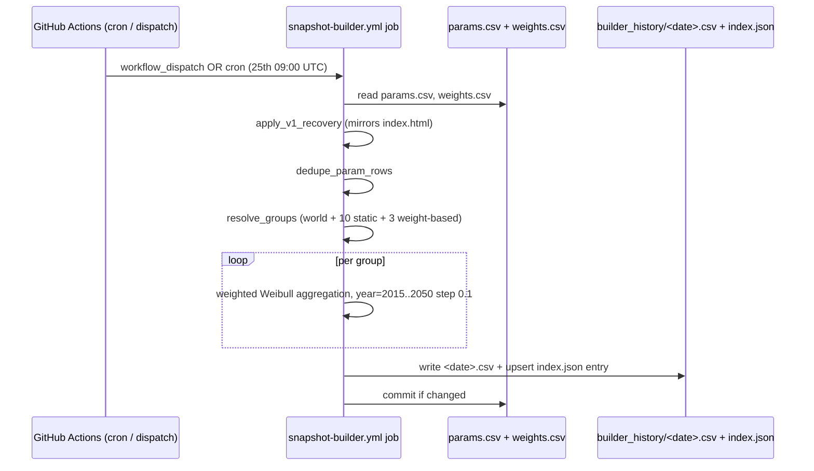

**Where the math lives:** [scripts/snapshot_builder.py](../../scripts/snapshot_builder.py). The module docstring documents the JS-quirk (Number('') === 0) that the in-page Builder relies on for missing `baseline_year` columns and that the Python script mirrors so the output is bit-equivalent to what the in-page Builder plots.

**Why monthly:** the underlying data (`params.csv`, `weights.csv`) is updated on a roughly monthly cadence per country. Daily snapshots would mostly duplicate themselves. Monthly snapshots match the natural update cadence and keep the repository footprint at ~200 KB per snapshot (~2.4 MB/year).

**Why bit-equivalent to the in-page Builder:** the static page is the canonical surface area for the curves. Anyone comparing a snapshot to the live page (e.g. validating a time-lapse frame against today's view) should see identical numbers. The cross-check is mechanical: a Node port of `bevShareIndex` / `getT0Years` / `baselineYearOf` over the same `params.csv` matches the Python script to four decimal places.

**Why no render re-trigger:** snapshots are downstream of `params.csv` — they don't feed back into any chart, post-text, or manifest. The workflow only commits the new file; the page is not yet a consumer.

## Flow L₂ — ACAU ingest

Uruguay follows the same `fetch-<country>` shape as Brazil / Japan / Chile. ACAU publishes one yearly "Compilado YYYY" xlsx (per-model rows, six sheets — AUTOS, SUV, MINIBUSES, UTILITARIO, CAMIONES, OMNIBUS) that gets edited in place with each new month's volumes. We aggregate AUTOS + SUV into a single passenger-car series. The cron runs daily from the 1st onward and the script self-throttles via the CSV's latest period — most invocations are a no-op until ACAU edits the previous month into the file (typically the first week of the following month, but with no published embargo date).

```mermaid
sequenceDiagram
    participant Cron as GitHub Actions (cron / dispatch)
    participant Job as fetch-uruguay.yml job
    participant Site as acau.com.uy
    participant CSV as data/Uruguay.csv
    participant Render as render-country.yml

    Cron->>Job: workflow_dispatch OR cron (daily 1–31, 08:00 UTC)
    Job->>CSV: read latest period
    alt Latest period ≥ target month
        Job-->>Cron: Exit cleanly (no-op)
    else Target month missing
        Job->>Site: GET / (browser UA)
        Site-->>Job: HTML with download links
        Job->>Job: Find <a>…</a> whose text matches /Compilado <year>/
        Job->>Site: GET panel/estadisticas/<random>.xlsx
        Site-->>Job: xlsx bytes
        Job->>Job: Parse AUTOS + SUV sheets; map Combustible code → BEV/PHEV/HEV/PETROL/DIESEL/OTHERS<br/>(E→BEV, PHEV→PHEV, H→HEV, N→PETROL, D→DIESEL, MHEV→OTHERS)
        Job->>Job: Cross-check per-sheet fuel sum against the sheet's bottom TOTAL row
        Job->>Job: Skip all-zero months (= unpublished months in the calendar year)
        alt Target month not yet in the file
            Job-->>Cron: Exit cleanly (no-op, retry tomorrow)
        else Target month present
            Job->>CSV: Upsert (new periods only, unless --force)
            Job->>Render: gh workflow run render-country.yml -f country=Uruguay
        end
    end
```

**Where parsing lives:** [scripts/fetch_uruguay.py](../../scripts/fetch_uruguay.py). The module docstring documents the fuel-code map, the AUTOS+SUV aggregation rule, the MHEV→OTHERS convention, and why we don't try to back-fill pre-2026 years.

**Vehicle scope:** AUTOS (turismos: sedans, hatchbacks, coupés) plus SUV. MINIBUSES, UTILITARIO (light commercial / pickups), CAMIONES (medium/heavy trucks) and OMNIBUS (buses) are explicitly out of scope — Uruguay has no HDV variant yet and the light-commercial / minibus categories don't map cleanly onto the existing CSV schema. See [09-glossary.md § Vehicle scope per source](09-glossary.md#vehicle-scope-per-source). CAMIONES is the most plausible future HDV candidate but adding it is gated on the project gaining an HDV variant convention more broadly.

**Why daily from the 1st:** the user's stated rule is "schauen ob der Vormonat von Heute noch nicht in den Daten is" — run daily until the previous month lands. The Compilado file has no published embargo date and we've observed it being refreshed at varying points in the first week of the following month, so starting on day 1 keeps the earliest plausible publication day in range. The self-throttle (`latest_period(csv) ≥ target_period`) makes the empty days free.

**Why `MHEV → OTHERS`:** ACAU breaks out Mild Hybrids (MHEV) as a distinct Combustible code starting in 2026. The maintainer's gut preference ranking was OTHERS > ICE > PETROL > DIESEL — OTHERS keeps the EV-share series clean and avoids inflating either HEV (which would mix full hybrids with 48V boost systems) or PETROL (which would over-state pure-ICE counts). Consequence: a one-time discontinuity in `data/Uruguay.csv` at the 2026-01 cutover, because the manually-curated 2025-and-earlier rows excluded MHEV from `TOTAL` entirely.

### Design decisions

| Decision | Rationale |
|---|---|
| Duplicate Chile/Japan structure rather than abstract a generic "fetch_country" runner | Project convention (Brazil flow notes) is country-local fetchers. ACAU's xlsx layout is different from any other source, and the year-format has already broken once between 2025 and 2026 (sheet names, column order, presence of PHEV column) — keeping the parser tightly coupled to one year's layout makes future format breaks loud rather than silent. |
| Discover the URL by scraping the homepage rather than guessing the filename | ACAU's filenames are HH_MM_SS-of-upload-time + "ar1.xlsx" — unpredictable. The homepage is small (~45 KB) and stable enough to scrape every run. |
| AUTOS + SUV summed into a single `variant=Whole` series | Matches the maintainer's request to treat passenger cars and SUVs as one passenger-vehicle aggregate, consistent with how Chile's "livianos y medianos" lumps them. Splitting them into two variants later is trivial — only the per-sheet aggregator would change. |
| MHEV → OTHERS (and one-time `--force` overwrite of 2026-01..03) | See "Why MHEV → OTHERS" above. The one-time force overwrite was the cleanest way to make the new automated series consistent with itself from 2026-01; the alternative (continue excluding MHEV) would have wasted the new structured ACAU data. |
| Don't try to back-fill pre-2026 from ACAU | The 2025 file has a fundamentally different layout (sheet names "MINI"/"UTIL" vs "MINIBUSES"/"UTILITARIO", abbreviated month headers "Ene"/"Feb"/…, per-brand subtotal rows breaking the simple iter-until-TOTAL pattern) and no PHEV breakdown (the maintainer was googling models manually). A 2025 parser is a separate workstream and the user explicitly scoped this one to 2026+. |
| Cross-check per-sheet fuel sum against the sheet's bottom "TOTAL" row, hard-fail on mismatch | The TOTAL row is computed by ACAU; if our per-fuel aggregate doesn't match, the parser missed rows. Hard-failing here surfaces format drift early. Confirmed exact match for AUTOS and SUV across all four published months of the 2026 reference file. |
| Skip months where AUTOS+SUV is all-zero | ACAU pre-fills the calendar year with zeros and overwrites month-by-month as new data lands. Without the skip we'd write 8 fake all-zero rows for the rest of 2026 on every run. |
| Without `--force`, never overwrite an existing period | The historical rows (2021-2025) were manually curated from a mix of sources; the script should never silently rewrite them. New months only. `--force` is the explicit opt-in. |

### Issues hit during development

1. **The existing `data/Uruguay.csv` had hand-curated 2026-01..03 rows that didn't match the parsed values.** Differences were:
   - TOTAL ≈ 320–370 lower (no MHEV included)
   - HEV +15–25 higher (some MHEV models reclassified to HEV)
   - PETROL +9–10 higher (some MHEV-Petrol models reclassified to PETROL)
   - PHEV −11 to −23 lower (slight reclassification)
   The user chose to `--force` overwrite the four published 2026 months for a clean reproducible series from 2026-01 onward, accepting the one-time discontinuity against 2025-12.

2. **The 2025 Compilado file has a different schema.** Inspecting `12_32_17ar1.xlsx` (Compilado 2025) showed: sheet names abbreviated (`MINI`/`UTIL` instead of `MINIBUSES`/`UTILITARIO`), header row uses "Empresa"/"Modelos" instead of "Nombre_Socio"/"Modelo", abbreviated month columns ("Ene"/"Feb"/...), per-brand "Total:" subtotal rows interleaved with model rows, no MHEV code in 2025 data. The parser raises a clear error if asked to process a 2025-shaped file rather than silently mis-reading it (the `month_to_col` lookup fails on the abbreviated headers).

3. **Combustible codes mix case.** Both `N`/`n`, `D`/`d`, `H`/`h`, `E`/`e` appear in the source — likely typing inconsistency between rows entered by different brand representatives. The parser normalises with `.upper()` before lookup. Unknown codes are folded into `OTHERS` with a console warning rather than dropped silently, so the per-sheet sanity check still balances.

4. **`max_row` is unreliable on the 2025 file.** openpyxl reported `max_row=1047953` (basically Excel's hard limit) because the sheet was zero-padded. We iterate `iter_rows` and stop at the `TOTAL` row instead — works for both 2025 and 2026 layouts even if the latter ever picks up the same padding.

5. **First end-to-end write rewrote all 42 rows of `data/Uruguay.csv`.** The historical CSV is CRLF-terminated; `csv.DictWriter(lineterminator="\n")` collapsed everything to LF, producing a 42-row diff for what should have been a 4-row change. Same gotcha as Japan — fixed by detecting the existing file's line ending (sniff the first 4 KiB for `b"\r\n"`) and feeding it back to `DictWriter`. After the fix the same `--force` re-run produces a clean 4-row diff.

### Validation

Parser was checked against the live ACAU 2026 Compilado file:

| Check | Result |
|---|---|
| `15_18_25ar1.xlsx` (Compilado 2026, fetched live from acau.com.uy) | All four published months (2026-01..04) parsed; per-sheet fuel sum exactly matches each sheet's bottom TOTAL row for AUTOS and SUV. |
| Re-run without `--force` | Short-circuits before any HTTP: `Latest period in CSV is 2026-04 ≥ 2026-04 — nothing to do.` |
| Re-run with `--force` | Re-parses and rewrites all four published rows; no other rows in the CSV touched. |
| Auto-discover from `acau.com.uy` | The homepage scrape finds the "Compilado 2026" link by text label and resolves the relative href to `https://www.acau.com.uy/panel/estadisticas/15_18_25ar1.xlsx`. |

The `Mercado YYYY` sibling xlsx (manufacturer-per-month totals) is *not* ingested; useful as a maintainer-side cross-check but adds no fuel-split data the Compilado doesn't already carry.

## Flow M — TÜİK ingest

Türkiye follows the same `fetch-<country>` shape as Brazil / Chile / Japan / Uruguay, but with two structural twists: (1) the TÜİK Veri Portalı is a React SPA so there is no scrapeable index page — auto-discovery of the bulletin Sayı is deferred and the maintainer dispatches the workflow with a `press_id` input once per month when the new bulletin appears; (2) the bulletin's fuel-breakdown table is embedded as a raster image, not text, so the parser shells out to `pdfimages` + `imagemagick` + `tesseract-ocr-tur` and uses three independent validation layers (narrative-vs-OCR Toplam, sum check with single-error auto-repair via Pay % cross-check, previous-year-same-month column cross-check) to guarantee byte-exact ingestion despite OCR noise.

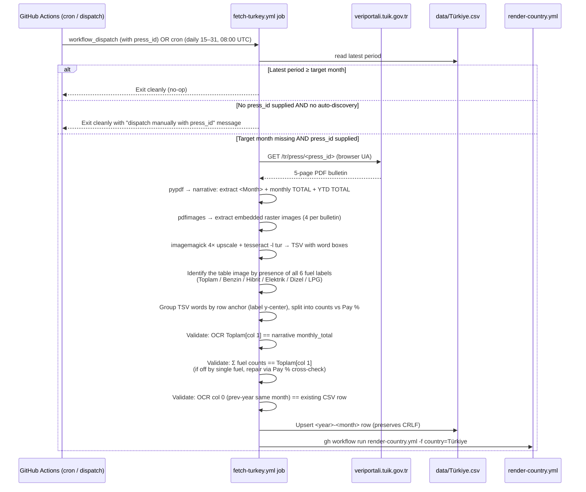

**Where parsing lives:** [scripts/fetch_turkey.py](../../scripts/fetch_turkey.py). The module docstring documents the fuel mapping, the OCR pipeline, the three validation layers, and the auto-discovery limitation.

**Vehicle scope:** Otomobil (passenger cars) only. The TÜİK bulletin reports all motor-land-vehicle categories (otomobil, motosiklet, kamyonet, traktör, kamyon, minibüs, otobüs, özel amaçlı taşıt — passenger car, motorcycle, light commercial pickup, tractor, truck, minibus, bus, special-purpose vehicle), but **only otomobil is broken down by fuel type**. The historical `data/Türkiye.csv` rows match this scope (monthly totals 30–110 k otomobile match the bulletin's "X bin Y adet otomobilin trafiğe kaydı yapıldı" sentence). The 14 % Renault / 7 % Toyota / … brand breakdown in the bulletin is for context only and isn't ingested.

**Fuel mapping:** Elektrik → BEV, Hibrit → HEV, Benzin → PETROL, Dizel → DIESEL, LPG → OTHERS, Toplam → TOTAL. `data/Türkiye.csv` carries no PHEV column — TÜİK reports a single combined "Hibrit" bucket (full + plug-in lumped together). See [09-glossary.md "Hybrid (capital, no qualifier)"](09-glossary.md) for the project-wide convention.

**Why daily from the 15th:** the bulletin embargo for the previous month is mid-month — Mart 2026 was published 16 April 2026 (Sayı 58041), Nisan 2026 on 18 May 2026 (Sayı 58042). The next bulletin's date is footnoted in each release (e.g. Nisan 2026 ends with "Bu konu ile ilgili bir sonraki haber bülteninin yayımlanma tarihi 16 Haziran 2026'dır"). Starting the cron on the 15th keeps the earliest plausible publication day in range; the self-throttle (`latest_period(csv) ≥ target_period`) makes the empty days free.

**Why no auto-discovery yet:** `https://veriportali.tuik.gov.tr/tr/press/<id>` returns a React SPA shell (`<div id="root"></div>` + `/assets/index-<hash>.js`); the bulletin data is hydrated client-side via an undocumented JSON API. Plain HTML scraping sees only the shell. Reverse-engineering the API would unlock fully-automated runs; until then the maintainer dispatches the workflow with the bulletin's Sayı (numeric, sequential across all TÜİK bulletins) once per month. The cron still exists because the per-month manual step is small; the cron's empty-day cost is one self-throttle check.

**Why OCR + three validation layers:** the bulletin PDF's narrative gives us the authoritative monthly TOTAL ("Nisan ayında 81 bin 907 adet otomobilin trafiğe kaydı yapıldı") but the per-fuel breakdown lives only in an embedded raster table image — pypdf / pdftotext skip it. We OCR the table, then cross-check:
1. **Toplam check** (hard fail): the OCR'd Toplam in the current-month column must equal the narrative-extracted monthly total. Catches column-shift bugs and corrupted PDFs.
2. **Sum check with auto-repair**: sum of the five fuel counts must equal Toplam. If off, we identify the wrong fuel by the largest deviation from its OCR'd Pay %, then set wrong_fuel = Toplam − sum(others) and verify the implied Pay % rounds to the OCR'd Pay %. Single-digit OCR misreads are recovered; multi-fuel mismatches hard-fail.
3. **Previous-year column check**: the OCR'd column 0 (e.g. Nisan 2025 in the Nisan 2026 bulletin) must match the corresponding row already in `data/Türkiye.csv`. Catches row-grouping bugs that would otherwise pass layers 1–2.

### Design decisions

| Decision | Rationale |
|---|---|
| Duplicate Brazil/Chile/Japan/Uruguay structure rather than abstract a generic "fetch_country" runner | Project convention (Brazil flow notes) is country-local fetchers. TÜİK's bulletin format is unlike any other source we ingest (narrative-only text + raster table images), so the parser is meaningfully different. |
| Defer auto-discovery; require press-id via workflow_dispatch | The Veri Portalı's React SPA blocks plain HTML scraping. Reverse-engineering the JSON API is a separate workstream; the cost of a one-line `press_id` dispatch once per month is small enough that this isn't a blocker. The cron infrastructure is in place so that once auto-discovery lands, it slots in without workflow changes. |
| Pull authoritative TOTAL from narrative, fuel breakdown from OCR | The narrative `"<Month> ayında X bin Y adet otomobilin trafiğe kaydı yapıldı"` extracts deterministically with a single regex and gives us a ground-truth Toplam. We use it as the canchor for all three validation layers, which lets OCR be lossy on individual digits without corrupting the CSV. |
| 4× upscale before tesseract | Some bulletins embed the fuel table as a ~98 dpi PPM (Mart 2026 sample) which tesseract misreads at native resolution (observed: "27 715" instead of "27 775" for Hibrit). 4× resize with the Mitchell filter pushed effective DPI high enough to fix this on every sample we have; the residual single-digit errors are caught by the sum check + auto-repair. |
| Sum-check auto-repair (single fuel only) | OCR digit-swaps are common but rarely multi-fuel on the same image. Repairing the single largest deviation lets the script handle the most common failure mode without human intervention; multi-fuel deviations hard-fail so a layout change can't silently mis-correct the data. |
| `source = "TUIK"`, `notes = https://veriportali.tuik.gov.tr/tr/press/<id>` for new rows | Matches the Brazil/Chile/Japan/Uruguay convention (short agency label in `source`, canonical source URL in `notes`). Historical rows use `data.tuik.gov.tr/` and are left untouched per the project rule of never rewriting historical rows. |
| OCR-alias list for row labels | Spotted in dev: tesseract sometimes misreads "Elektrik" as "Elekirik" / "Elekftrik" on low-res rasters. Maintaining an explicit alias list per canonical label means future label-OCR drift is a one-line fix instead of a hard failure. |

### Issues hit during development

1. **The Veri Portalı is a JS SPA.** Initial plan was to scrape the search page (`/tr/search?q=Motorlu+Kara+Ta%C5%9F%C4%B1tlar%C4%B1+<MonthTR>+<Year>&year=<Year>`) for the bulletin link. Saving the page source returned only the React shell (`<div id="root"></div>` + `<script>` for the index bundle); the JS hydrates the actual content via an undocumented JSON API. Decided to defer auto-discovery and ship with a manual `press_id` dispatch as the only entry point — see "Why no auto-discovery yet" above.

2. **Press-bulletin PDFs embed the fuel table as a raster image.** `pdftotext` (poppler) and `pypdf` both extract the bulletin's narrative paragraphs perfectly but produce no text where the table sits — `pdfimages -list` confirmed each bulletin has 3–4 embedded JPEG/PPM images including one ~700–820 px wide table image on page 4. Adding tesseract + Turkish language pack to the pipeline was the simplest path; the per-bulletin OCR work is ~2 s on `ubuntu-latest`.

3. **OCR digit-swap on a low-resolution sample.** The Mart 2026 bulletin's table image is a PPM at ~98 dpi (vs. Nisan 2026's ~120 dpi JPEG); tesseract misread Hibrit "27 775" as "27 715" — a single-digit swap (7 → 1). The sum check caught it (sum was off by 60), and the Pay % cross-check identified Hibrit as the culprit (its OCR Sayı/Toplam ratio was 34.49 % vs the OCR'd Pay % of 34.6 %, the largest deviation). The repair formula (Toplam − sum(others)) recovered 27 775 exactly, and the implied Pay % matched OCR's 34.6 % to within 0.05 %. This is now the canonical case for the auto-repair layer.

4. **`pdfimages -all` extracts as PPM when the source image isn't JPEG.** Forgot this at first and assumed all extracts would be JPEG; ended up with `.ppm` for the Mart sample and `.jpg` for Nisan. ImageMagick `convert` handles both transparently, so the only effect was a sanity-check on the file-glob in `find_table_image` (`img-*` not `img-*.jpg`).

5. **CRLF line endings on `data/Türkiye.csv`.** Same gotcha as Japan and Uruguay — the existing file is CRLF-terminated. `csv.DictWriter(lineterminator="\n")` would have rewritten all 123 rows from CRLF to LF on the first ingest, producing a noisy diff. Fix: sniff the existing file's line ending in the first 4 KiB and feed it back to `DictWriter`. Same code as the Japan/Uruguay fetchers — copied verbatim, not refactored into a shared helper because each fetcher is meant to stand alone (see the "duplicate rather than abstract" design decision in the Brazil flow notes).

6. **Trailing stray integer on one row.** Nisan 2026 Hibrit OCR'd 5 integer tokens instead of 4: `[24472, 28743, 98690, 99550, 275]`. The trailing `275` is a fragment of an adjacent label or border. Mitigation: cap each row's count list at the first 4 tokens — that's the correct column count for the table and trailing tokens are by construction noise.

### Validation

Parser was checked byte-exact against the existing `data/Türkiye.csv` and the user-supplied sample PDFs:

| Check | Result |
|---|---|
| `Motorlu Kara Taşıtları - Mart 2026 - Veri Portalı - TÜİK.pdf` (Sayı 58041) re-parsed with the existing 2026-03 row removed from the CSV | Output row matches the historical row byte-exact: `14532.0, 27775.0, 30927.0, 6441.0, 673.0, 80348.0` (BEV, HEV, PETROL, DIESEL, OTHERS, TOTAL). The Hibrit value required a one-line auto-repair (see Issue 3). |
| `Motorlu Kara Taşıtları - Nisan 2026 - Veri Portalı - TÜİK.pdf` (Sayı 58042) added as the new 2026-04 row | Sum check passes on the first parse: `16411 + 28743 + 30532 + 5312 + 909 = 81907 = OCR Toplam = narrative monthly total`. Previous-year cross-check against 2025-04 passes. |
| Self-throttle | After ingesting 2026-04, re-running with default args short-circuits before any HTTP/OCR: `Latest period in CSV is 2026-04 ≥ 2026-04 — nothing to do.` |
| Bulletin month vs target month mismatch | Passing `tuik_mart_2026.pdf` with `--month 4` (target Nisan) is refused: `Bulletin month is Mart (3) but target month is Nisan (4). Refusing to write.` |
| No-input default | Running with no `--press-id` / `--pdf-url` / `--pdf-path` and no target month covered prints the helpful "dispatch manually with press_id" message and exits 0 (so cron self-throttle paths don't fail the workflow). |

The sample PDFs (`data/tuik_mart_2026.pdf`, `data/tuik_nisan_2026.pdf`) are not in the feature branch — they're in `master` (committed by the maintainer as "Add files via upload") and were pulled into the working tree only during development.

## Flow N — ANL ingest

USA follows the same `fetch-<country>` pattern as the others, but with the one
structural difference that sets it apart from every other fetcher: **it
re-writes a trailing window of months instead of only appending the newest
one.** ANL publishes a single PDF that contains the *entire* monthly history
(Dec-2010 → latest) and silently revises the most recent ~2 months between
releases. To absorb those revisions the script rebuilds the last `--months`
(default 3) rows on every run; new months are appended and recently-revised
months are corrected in place. Everything older than the window is left alone.

```mermaid
sequenceDiagram
    autonumber
    participant Cron as fetch-usa.yml (10:00 UTC, 10th→EOM)
    participant Job as fetch-usa.yml job
    participant Site as anl.gov
    participant CSV as data/USA.csv

    Cron->>Job: schedule / workflow_dispatch
    Job->>Site: GET reference page (browser UA)
    Site-->>Job: HTML with "Total Sales for Website_<Month> <Year>.pdf" link
    Job->>Site: GET the PDF
    Site-->>Job: full-history table (Month, BEV, PHEV, HEV, Total LDV)
    Job->>Job: parse table → take last N periods ≤ cutoff
    Job->>CSV: upsert window; rewrite only if a value changed
    alt CSV changed
        Job->>Render: gh workflow run render-country.yml -f country=USA
    else nothing changed
        Job-->>Job: no-op (idempotent)
    end
```

**Where parsing lives:** [scripts/fetch_usa.py](../../scripts/fetch_usa.py). The
module docstring is the authoritative reference for the column map, the ICE
derivation, and the trailing-window rule.

**Vehicle scope:** Light-Duty Vehicles (passenger cars + light trucks). See
[09-glossary.md § Vehicle scope per source](09-glossary.md#vehicle-scope-per-source).

**Column map — no ICE column in the source:** ANL's table is
`Month | BEV | PHEV | HEV | Total LDV`. There is no gasoline/diesel/ICE column
and no FCV/other column. We map BEV/PHEV/HEV directly, take `Total LDV` → TOTAL,
set `OTHERS = 0`, and derive `ICE = TOTAL − BEV − PHEV − HEV − OTHERS` (same
implicit-subtraction convention as Chile). A negative computed ICE aborts the
run as a parser sanity-check.

**Why the trailing window (and why this differs from every other fetcher):**
the maintainer confirmed ANL routinely corrects the last ~2 months. The other
agencies either don't revise, or we deliberately freeze the past (ACEA only
revises the explicit prior-year column; Chile/Japan never touch older rows).
For USA the corrections are the norm, so freezing them would leave the chart's
most recent — and most-viewed — points permanently stale. `--months 3` gives
one month of headroom over the observed ~2-month revision horizon. Months that
ANL revises *outside* that window (it occasionally adjusts 2023–2025 too — see
Validation) stay at their original CSV values by design; we don't chase the
entire history on every run.

**Why change-detection instead of a period-based self-throttle:** the other
fetchers no-op by comparing the CSV's latest period to the target. That can't
work here because a correction-only release leaves the latest period unchanged
while still altering earlier rows. Instead `upsert_window` compares the numeric
fields of each windowed row against the CSV and only rewrites the file when at
least one value actually changed — so steady-state cron runs are still a no-op,
but a pure-correction release is picked up.

**Why 10:00 UTC:** every other fetcher crons at 08:00 UTC. On the 10th of the
month that slot already runs Japan + Uruguay (daily, 1st→EOM) and Brazil (10th
only). USA runs at 10:00 to avoid piling onto that slot. ANL's publication day
is irregular (the sample "updated through April 2026" file was provided
mid-May), so we cron daily from the 10th onward and let the change-detection
make the empty days free.

### Issues hit during development

1. **ANL blocked the dev sandbox.** `WebFetch` and `curl` (even with a desktop
   Chrome User-Agent) against the reference page returned `HTTP 403`, and the
   sandbox's egress proxy returned `Host not in allowlist` for `anl.gov` and for
   `apt`/`pip` mirrors. Same pattern as JADA/ACEA. The maintainer uploaded the
   PDF to `master` (`data/Total Sales for Website_April 2026.pdf`) and the parser
   was developed and validated against it offline. Whether the GitHub-hosted
   runner can reach `anl.gov` is an open question the first scheduled run will
   answer; if not, the `--pdf-url` workflow input accepts any URL or local path.

2. **No PDF library available offline.** The sandbox has neither `pypdf` nor a
   system `pdftotext`, and `pip`/`apt` were firewalled. `parse_table()` is
   therefore written to operate on already-extracted text (pypdf does the
   extraction in CI), and was validated by feeding it the PDF's text content
   transcribed verbatim — see Validation.

3. **Opposite CRLF decision to Japan.** `data/USA.csv` was committed CRLF
   (Excel-origin). Japan/Chile chose to *preserve* CRLF to keep diffs clean.
   For USA we deliberately **normalised to LF** instead: the script writes LF
   (like Brazil/Uruguay output), the other scraped CSVs are LF, and the first CI
   run would flip it anyway — so we took the one-time 185-line reformat now
   rather than leave a latent noisy diff for later. The functional change in that
   commit was only the 2026-02/2026-03 corrections.

### Validation

`parse_table()` was run against the verbatim text of
`data/Total Sales for Website_April 2026.pdf` and every parsed cell compared to
the pre-existing `data/USA.csv` (which was hand-maintained from older ANL
vintages, so it is *not* expected to match the new PDF on recently-revised
months — this is the point the maintainer flagged up front).

| Check | Result |
|---|---|
| Column mapping | **100 fields matched the CSV exactly**, including stable older rows (2011-01, 2020-03, 2022-12) and an unbroken 2023-02…2023-07 run. Exact matches across distinct rows prove BEV/PHEV/HEV/Total are read from the right columns. |
| Recent corrections (in-window) | 2026-03 BEV 88,582→76,058, HEV 198,534→203,512, TOTAL 1,403,623→1,388,654; 2026-02 BEV 72,896→58,284, TOTAL 1,197,916→1,178,786. These are now applied in the CSV. |
| Older ANL revisions (out-of-window) | ANL has also revised much of 2023–2025 (e.g. 2023-09 BEV +11,664, 2024-08 TOTAL −17,867). **Left untouched by design** — they fall outside the 3-month window. If the maintainer ever wants a full-history refresh, run `fetch_usa.py --year 2023 --month 12 --months 300 --force` (or similar) once. |
| Pre-existing CSV bug surfaced | 2025-08 HEV is `150,988` in the CSV — a copy of the Sep-25 value; the PDF correctly shows `181,048` (Δ +30,060). Out of window, so not auto-corrected; flagged here for a possible manual fix. |
| Pre-existing CSV typos surfaced | 2011-10 HEV `20,257` vs PDF `20,057`; 2014-08 PHEV `4,920` vs PDF `5,920`. Single-cell transcription artefacts in the original hand-entered data, far outside any window. |
| Legacy empty cell | 2025-11 has an empty `OTHERS` cell (vs `0.0` elsewhere). `_row_unchanged` treats empty as a mismatch, so the value normalises to `0.0` the next time that row enters the window. |
| Idempotency | Re-running the window against the same PDF reports `changed: []` and does not rewrite the file. |
| ICE derivation | `ICE = TOTAL − BEV − PHEV − HEV` verified non-negative for every windowed row (e.g. 2026-04: 1,361,970 − 64,517 − 18,309 − 209,456 = 1,069,688). |

The sample PDF (`data/Total Sales for Website_April 2026.pdf`) is in `master`
(committed by the maintainer as "Add files via upload"), not produced by the
branch.

## Flow O — RDW/Swing ingest

Netherlands is the first country with **three variants in one workflow** (Whole / Used Imports / HDV). Source is `duurzamemobiliteit.databank.nl`, a Swing 7.1 BI portal (ABF Research) that exposes RDW registration data. There is no documented public API; we drive three pre-saved Swing workspace permalinks the maintainer configured in the UI (one per variant). Each variant writes to its own CSV and triggers `render-country.yml` independently if it changed.

```mermaid
sequenceDiagram
    participant Cron as GitHub Actions (cron / dispatch)
    participant Job as fetch-netherlands.yml job
    participant Swing as duurzamemobiliteit.databank.nl
    participant CSVs as data/Netherlands{,_Used,_HDV}.csv
    participant Render as render-country.yml

    Cron->>Job: workflow_dispatch OR cron (daily 1–15, 06:30 UTC)
    loop per variant in {Whole, Used, HDV}
        Job->>Swing: GET /viewer?workspace_guid=<TEMPLATE>
        Swing-->>Job: HTML with WsGuid: "<session>"
        Job->>Swing: POST /viewer/Presentation/GetTableStart (session GUID)
        opt pivot longer than initial page
            Job->>Swing: POST /viewer/Presentation/GetTableRows
        end
        Swing-->>Job: pivot rows (HTML fragments)
        Job->>Job: Detect orientation (periods-in-rows vs fuels-in-rows)
        Job->>Job: Parse Dutch labels → BEV/PHEV/PETROL/DIESEL/OTHERS<br/>(Benzine→PETROL, FCEV+Overig→OTHERS, HEV blank)
        Job->>Job: Decode Dutch locale ("6.863"=6863, "&nbsp;"=0)
        Job->>CSVs: Upsert into per-variant file
    end
    Job->>Job: git diff each CSV → touched=[variants that changed]
    alt any touched
        Job->>CSVs: Single commit for the touched files
        loop per touched variant
            Job->>Render: gh workflow run render-country.yml -f country=Netherlands -f variant=<v>
        end
    else nothing touched
        Job-->>Cron: Exit cleanly (no-op, no commit)
    end
```

**Where parsing lives:** [scripts/fetch_netherlands.py](../../scripts/fetch_netherlands.py). Pipeline rationale, variant choices, template-GUID maintenance, and HEV/FCEV fold-in convention live in [10-source-netherlands.md](10-source-netherlands.md) — read that before changing the `TEMPLATES` constant.

**Vehicle scope:** Personenauto (passenger cars) for Whole + Used; Zware bedrijfsvoertuigen (heavy commercial > 3.5 t) for HDV. See [09-glossary.md § Vehicle scope per source](09-glossary.md#vehicle-scope-per-source).

**Why three variants in one workflow:** all three pivots ride on the same Swing session protocol, the same response shape, and the same fuel-label map. Splitting them into three workflows would triple the YAML for zero functional gain. Per-variant render dispatch lets a single-variant change still trigger only the right re-render.

**Why HEV is always blank:** RDW source data does not split full hybrids from PETROL/DIESEL — full hybrids fold into Benzine or Diesel upstream in the agency's classification. We leave the `HEV` column empty rather than guess; the page treats blank as "category unsupported for this country" rather than zero.

**Why a separate `Used Imports` variant:** the Dutch market includes a sizeable parallel-import stream (used cars imported from Germany/Belgium and re-registered). RDW publishes this as its own dimension; we surface it so the maintainer can compare the new-registration trajectory against the used-import trajectory in the gallery's variant picker.

**Why daily 1st–15th at 06:30 UTC:** RDW publishes the previous month sometime in the first half of the following month — exact day varies. We poll daily and the script self-throttles once the previous month's row exists in all three CSVs (no diff, no commit, no render trigger). 06:30 UTC sits clear of the 08:00 UTC slot used by Brazil/Chile/Japan/Türkiye/Uruguay/ACEA and most country-side timezones.

**Why Swing-permalinks instead of a documented API:** Swing 7.1 exposes only undocumented endpoints (`GetTableStart`, `GetTableRows`) that require a session GUID bootstrapped from the HTML response of the workspace permalink. Reverse-engineering and replaying this is the only path; the alternative is a once-a-month manual CSV download, which contradicts the project's automation goal.

**Known fragility:** the `TEMPLATES` constant in `scripts/fetch_netherlands.py` carries three Swing workspace GUIDs. If ABF/RDW rebuild the BI portal or invalidate saved workspaces, these GUIDs break. Recovery is a Swing-UI session: pick the source/dimension/period, share-icon → permalink, copy the new GUID into the script. See [10-source-netherlands.md § "If the GUIDs break"](10-source-netherlands.md) for the step-by-step.

## Flow P — CPCA ingest

China follows the same `fetch-<country>` pattern as Brazil/Chile/Japan/Uruguay/Türkiye, but with three structural twists: (1) CPCA reports both retail (零售) and wholesale (批发) in the same article, so the parser writes **two CSVs in one run** (`data/China.csv` for retail, `data/China_Wholesale.csv` for wholesale-only downstream model); (2) the retail-side BEV/PHEV/EREV breakdown is not in the article text — it's only on an embedded NEV-market slide JPG, so the parser shells out to `tesseract-ocr` for the retail split; (3) CPCA restates the previous month inside each new release, so the parser overwrites existing periods when their values move.

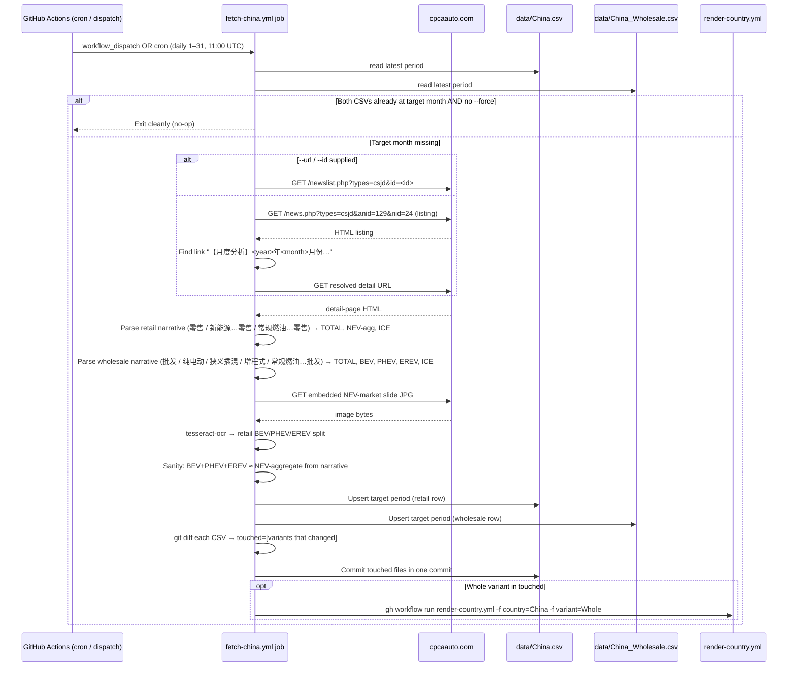

**Where parsing lives:** [scripts/fetch_china.py](../../scripts/fetch_china.py). The module docstring documents the two-track model (retail vs wholesale), the OCR slide pipeline, the `万辆 → unit` conversion (1 万 = 10,000), and the EREV→PHEV-fold convention used by `data/China.csv` (retail PHEV column carries narrow-PHEV + EREV combined).

**Vehicle scope:** Passenger cars (乘用车) only. Commercial vehicles, kei-equivalent NEVs, and exports are out of scope. See [09-glossary.md § Vehicle scope per source](09-glossary.md#vehicle-scope-per-source).

**Why retail + wholesale into two CSVs:** the existing `data/China.csv` has tracked retail since 2020; the wholesale series is a separate downstream model the maintainer wants kept distinct rather than blended. Two CSVs in one fetcher keeps the parsing pass single (one HTML fetch, one detail page) while preserving the schema separation.

**Why only retail (Whole) triggers a render:** the gallery's per-country pipeline is wired to `data/<Country>.csv`; `data/China_Wholesale.csv` is consumed by a separate offline model and isn't surfaced in the page yet. Dispatching `render-country.yml` for Wholesale would produce nothing useful today.

**Why OCR for the retail split:** CPCA publishes the article narrative with only an NEV-aggregate retail figure ("新能源乘用车市场零售 Y万辆"). The per-fuel BEV/PHEV/EREV breakdown for retail sits inside an embedded JPG (their NEV market-overview slide). pypdf-style extractors return nothing for raster content; tesseract on the slide is the only path to the per-fuel retail row without manual transcription. The eng language pack suffices — table data is Latin digits.

**Why daily from the 1st at 11:00 UTC:** CPCA's monthly analysis lands between the 8th and 11th of the following month (e.g. March 2026 was published 2026-04-09, April 2026 on 2026-05-09). Cron starts day 1 and the self-throttle makes empty days free. 11:00 UTC = 19:00 Beijing — well after CPCA's typical mid-morning publication slot — and clears the 08:00 UTC slot already crowded by Brazil/Chile/Japan/Türkiye/Uruguay/ACEA.

**Why overwrites for existing periods:** unlike Brazil/Chile/Japan (which never touch older rows once written), CPCA restates the prior month inside each new release. The parser writes any target period unconditionally; the change-detection step still ensures no-op runs don't commit.

**Known limitation:** auto-discovery falls back to a listing scrape (`news.php?types=csjd&anid=129&nid=24`) — if CPCA changes that page layout, the workflow inputs `detail_id` and `detail_url` are the manual override. The numeric `id` is visible in the detail-page URL once the maintainer opens the article in a browser.

## Flow Q — Statbank ingest

Denmark is fed from Statistics Denmark's public StatBank API (`api.statbank.dk`, table BIL53). One workflow fetches **five variants** in a single run: Whole, Private, Industry, HDV, Vans (see [03-data-objects.md § "Denmark (per-variant files)"](03-data-objects.md)). Unlike the Netherlands Swing portal, the Statbank API is documented and stable — one POST per variant, JSON-stat v1 response, no session handling.

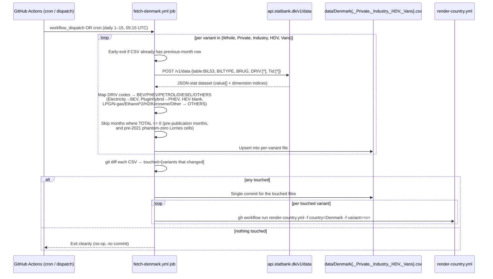

**Where parsing lives:** [scripts/fetch_denmark.py](../../scripts/fetch_denmark.py). API request shape, BILTYPE/BRUG/DRIV code tables, HEV gap, HDV-2021 quirk, Ethanol×2 quirk, backfill, fragility, and maintenance recipes live in [11-source-denmark.md](11-source-denmark.md) — read that before changing `VARIANT_CONFIG` or `DRIV_TO_COL`.

**Vehicle scope:** Passenger cars for Whole/Private/Industry, Lorries (`Lastbiler`, BILTYPE 4000103000) for HDV, Vans (`Varebiler`, BILTYPE 4000102000) for Vans. `OMRÅDE = "000"` (All Denmark) is pinned. Statbank also exposes Road Tractors and the full regional breakdown; not currently used.

**Why five variants in one workflow:** all five share the same Statbank API, the same DRIV-code map, and the same JSON-stat layout. Splitting them into five workflows would 5× the YAML for zero functional gain. Per-variant render dispatch lets a single-variant update still trigger only the relevant re-render.

**Why HEV is always blank:** Statbank does not split full hybrids — they fold into Petrol/Diesel upstream. Same convention as Netherlands. The renderer recovers ICE share from `(TOTAL − BEV − PHEV)`.

**Why pre-2018 backfill for Whole only:** Statbank's BIL53 propellant breakdown starts 2018-01. The maintainer's Google Sheet has Whole back to 2014-01 (manually compiled) but not the other four variants. Without the backfill, Denmark's Weibull `t0` would shift from 2014 to 2018. See [scripts/backfill_denmark_pre2018.py](../../scripts/backfill_denmark_pre2018.py).

**Why HDV starts 2021-01:** Statbank only started publishing the Lorries × propellant breakdown in 2021-01; pre-2021 cells in BIL53 are real zeros. The `TOTAL == 0` skip filters them.

**Why daily 1st–15th at 05:15 UTC:** Statbank publishes BIL53 between the 9th and 12th of the following month. Daily polling within that window catches the new data on publication day; per-variant early-exit makes post-publication days free. 05:15 UTC sits clear of fetch-netherlands (06:30) and the 08:00 UTC crowd.

**Known fragility:** if Statbank adds a new propellant (e.g. a synthetic-fuel split), the parser raises `RuntimeError("unmapped DRIV code …")` and aborts before commit — recovery is one line in `DRIV_TO_COL`. Larger schema shifts (BILTYPE / BRUG taxonomy changes) are detectable via the `/v1/tableinfo/BIL53` endpoint; see [11-source-denmark.md § "Known fragility"](11-source-denmark.md).

## Flow R — PxWeb ingest

Finland is fed from Statistics Finland's PxWeb API (`pxdata.stat.fi`, StatFin table 121d). One workflow fetches **six variants** in a single run: Whole, Private, Industry, HDV, Vans, Buses (see [03-data-objects.md § "Finland (per-variant files)"](03-data-objects.md)). The PxWeb API is documented and stable — one POST per query, JSON-stat2 response. Two structural twists distinguish it from the Denmark Statbank flow: Finland splits plug-in hybrids natively, and the **Industry slice is derived** (possessor Total − Private person) because there is no industry possessor bucket.

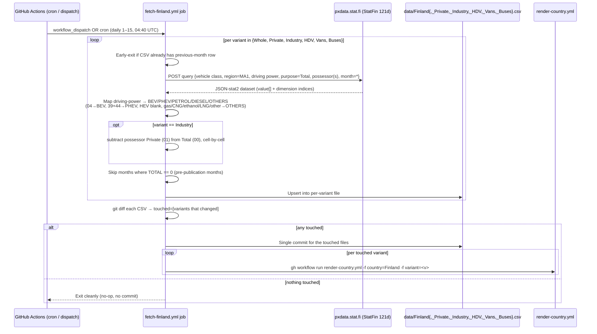

**Where parsing lives:** [scripts/fetch_finland.py](../../scripts/fetch_finland.py). PxWeb query shape, driving-power codes, Industry-derivation, the Åland exclusion, the legacy-to-automated migration, fragility, and maintenance recipes live in [12-source-finland.md](12-source-finland.md) — read that before changing `VARIANT_CONFIG` or `DRIV_TO_COL`.

**Vehicle scope:** Passenger cars for Whole/Private/Industry, Lorries > 3.5 t for HDV, Vans for Vans, Buses & coaches for Buses. Region pinned to `MA1` (Mainland Finland; Åland is not in table 121d). Purpose-of-use pinned to Total.

**Why six variants in one workflow:** all six share the same PxWeb API, the same driving-power map, and the same JSON-stat2 layout. Per-variant render dispatch lets a single-variant update trigger only the relevant re-render.

**Why Industry is derived:** Statistics Finland has no "industry" possessor; per the maintainer's definition Industry = Total − Private person, computed cell-by-cell so `Private + Industry = Whole` holds exactly and the per-fuel breakdown stays consistent.

**Why HEV is always blank:** Finland splits plug-in hybrids (39/44 → PHEV) but has no non-plug-in full-hybrid code — those fold into Petrol. Same blank-HEV outcome as Denmark/Netherlands; the renderer recovers ICE share from `(TOTAL − BEV − PHEV)`.

**Why no backfill:** table 121d starts 2014M01 and the maintainer has no pre-2014 Finland data, so there's no Google-Sheet backfill step (unlike Denmark/Netherlands). `t0` floors to 2013.

**Why daily 1st–15th at 04:40 UTC:** Statistics Finland publishes 121d around the 5th–8th of the following month. Daily polling within the window catches it; per-variant early-exit makes post-publication days free. 04:40 UTC sits between the ACEA 03:17 fallback and fetch-denmark (05:15), clear of the 06:30/08:00 crowd.

**Known fragility:** a new driving-power code raises `RuntimeError("unmapped driving-power code …")` and aborts before commit — recovery is one line in `DRIV_TO_COL`. Larger schema shifts are detectable via the table's GET metadata endpoint; see [12-source-finland.md § "Known fragility"](12-source-finland.md). Migration note: Finland previously rendered via the legacy local R pipeline with no committed data file; this flow supersedes that.

## Flow S — SCB ingest

Sweden is fed from Statistics Sweden's PxWeb API (`statistikdatabasen.scb.se`, table TK1001A/PersBilarDrivMedel a.k.a. TAB3277). It is the **simplest** database-fed flow: a single variant (Whole), one POST, one CSV — but with the **richest fuel granularity**, because SCB reports HEV (non-plug-in electric hybrid) and ethanol/flexifuel as their own fuel codes.

```mermaid
sequenceDiagram
    participant Cron as GitHub Actions (cron / dispatch)
    participant Job as fetch-sweden.yml job
    participant API as statistikdatabasen.scb.se (TK1001A)
    participant CSV as data/Sweden.csv
    participant Render as render-country.yml

    Cron->>Job: workflow_dispatch OR cron (daily 1–15, 05:50 UTC)
    Job->>Job: Early-exit if CSV already has previous-month row
    Job->>API: POST query {region=00, fuels=8 codes, month=all}
    API-->>Job: JSON-stat2 dataset (value[] + dimension indices)
    Job->>Job: Map fuel codes → BEV/PHEV/HEV/PETROL/DIESEL/FLEXFUEL/OTHERS<br/>(120→BEV, 130→HEV, 140→PHEV, 150→FLEXFUEL, 160+190→OTHERS)
    Job->>Job: Skip months where TOTAL == 0
    Job->>CSV: Upsert (refreshes SCB revisions of recent months)
    alt CSV changed
        Job->>CSV: Commit data/Sweden.csv
        Job->>Render: gh workflow run render-country.yml -f country=Sweden -f variant=Whole
    else unchanged
        Job-->>Cron: Exit cleanly (no-op)
    end
```

**Where parsing lives:** [scripts/fetch_sweden.py](../../scripts/fetch_sweden.py). API choice (v1 POST), fuel codes, the HEV/FLEXFUEL handling, the legacy-to-automated migration and CRLF→LF normalisation, fragility, and maintenance recipes live in [13-source-sweden.md](13-source-sweden.md).

**Vehicle scope:** Passenger cars only — table TK1001A has no vehicle-class or possessor dimension, hence the single variant. Region pinned to `00` (Sweden).

**Why HEV and FLEXFUEL are special:** Sweden is the first database-fed country to report a native HEV code (`130` electric hybrid) and a native ethanol/flexifuel code (`150`). The renderer gives both their own slices in the TTM stacked-shares plot and folds them into the brown ICE line for the BEV/PHEV/ICE three-curve (ICE = all minus BEV and PHEV/EREV) — so ethanol counts as ICE in the headline trajectory while staying visible in the fuel mix. No renderer change needed.

**Why no parallel-render push race:** only one variant means only one `render-country.yml` dispatch per run — the race Denmark and Finland hit (multiple variants pushing concurrently) cannot occur here.

**Why daily 1st–15th at 05:50 UTC:** SCB publishes the previous month early in the following month; daily polling catches it and the early-exit makes post-publication days free. 05:50 UTC sits between fetch-denmark (05:15) and fetch-netherlands (06:30).

**Known fragility:** a new fuel code raises `RuntimeError("unmapped fuel code …")` and aborts before commit — recovery is one line in `DRIV_TO_COL`. If SCB deprecates the v1 API, switch to the v2 endpoint (`statistikdatabasen.scb.se/api/v2/tables/TAB3277/data`); see [13-source-sweden.md § "Known fragility"](13-source-sweden.md). Migration note: Sweden previously rendered via the legacy local R pipeline; the data file was committed (CRLF), and this flow normalised it to LF.

## See also

- [04-interfaces.md](04-interfaces.md) — request/response shapes for each Worker call shown above
- [02-components.md](02-components.md) — the boxes in the diagrams
- [08-deploy-ops.md](08-deploy-ops.md) — how to invoke Flow B, how to debug Flow A failures
