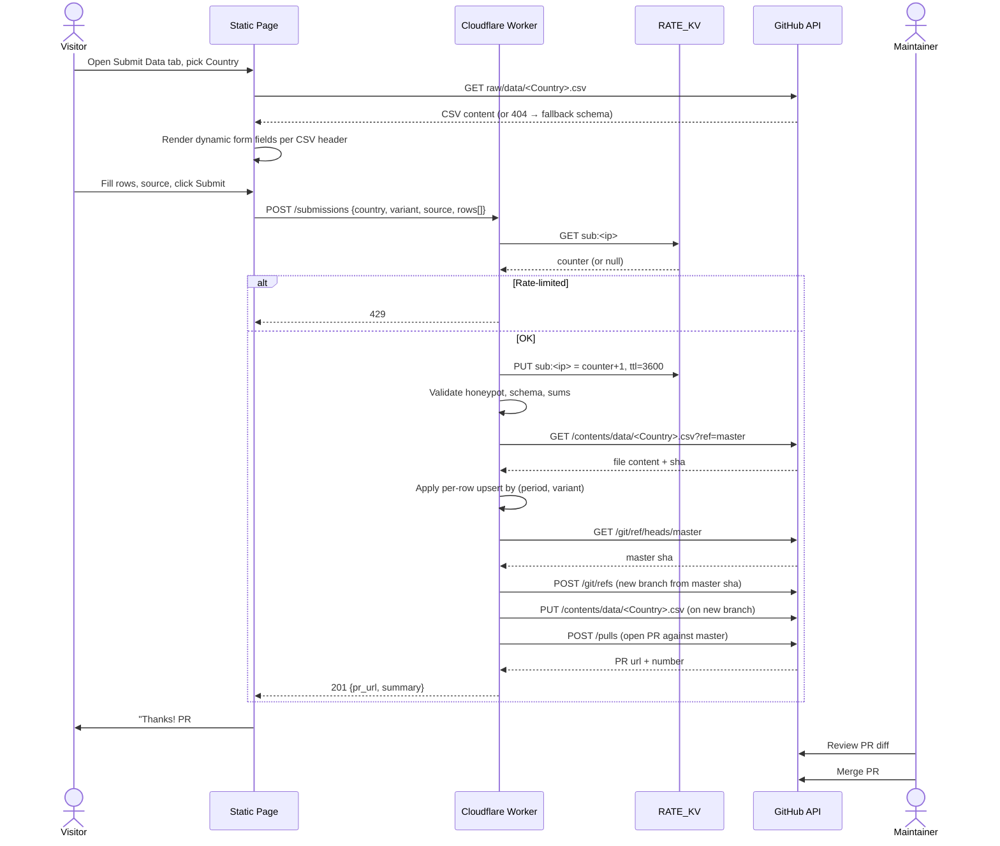
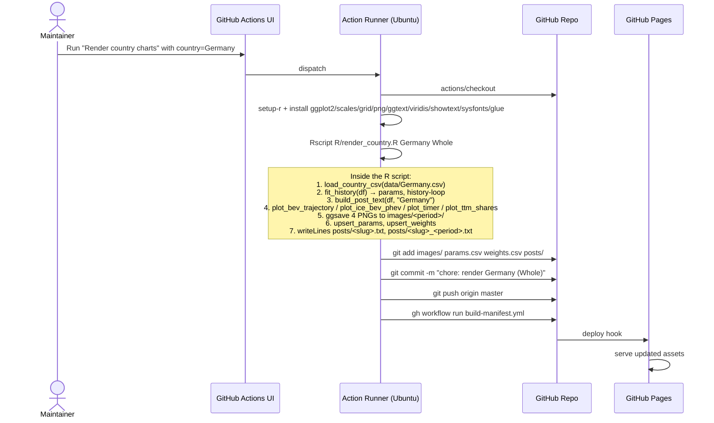
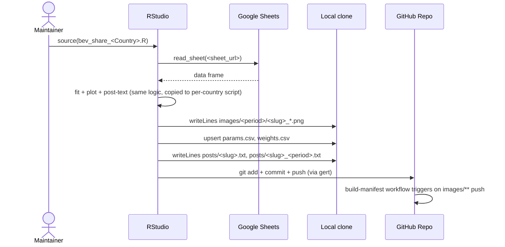
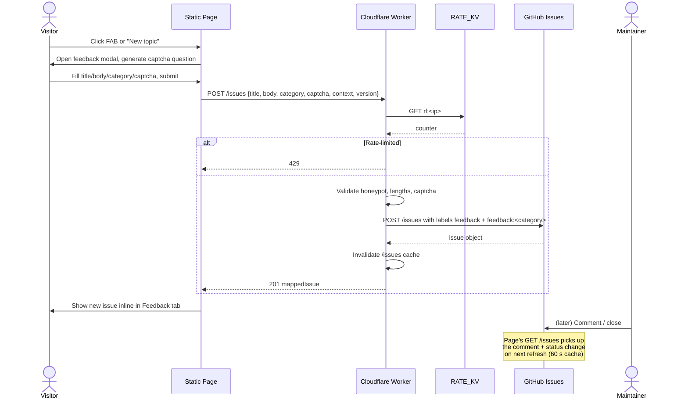
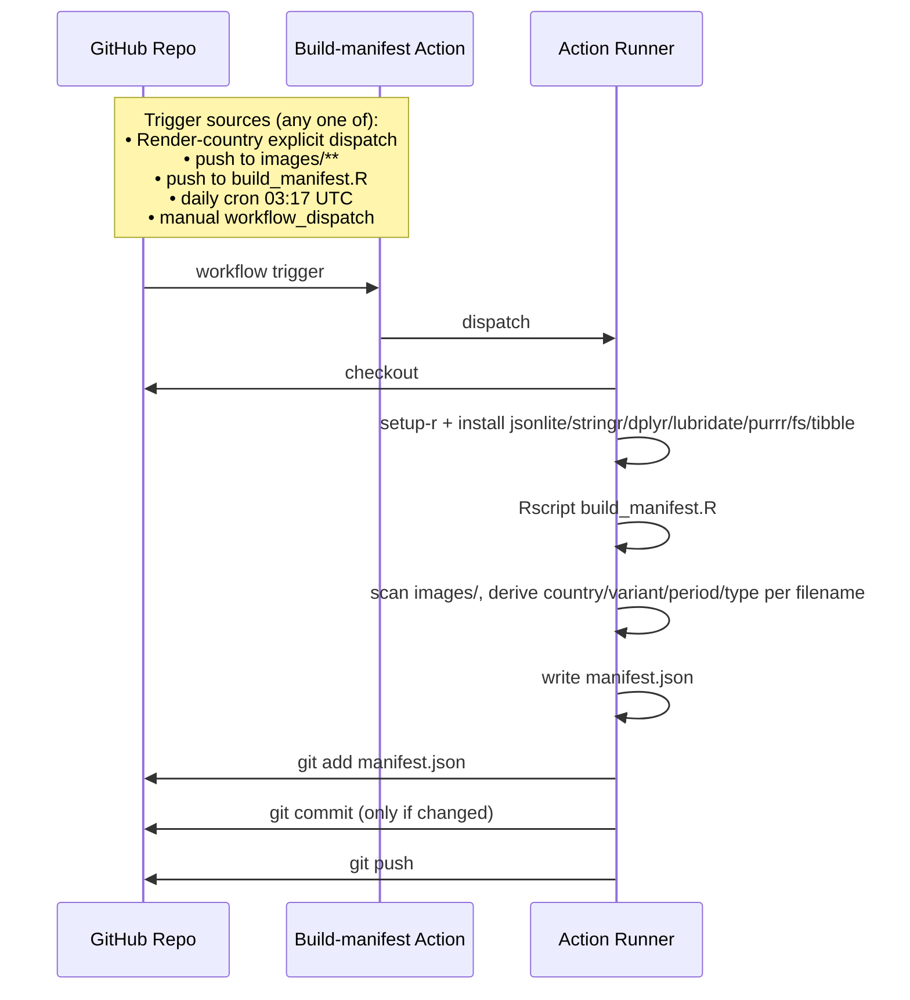
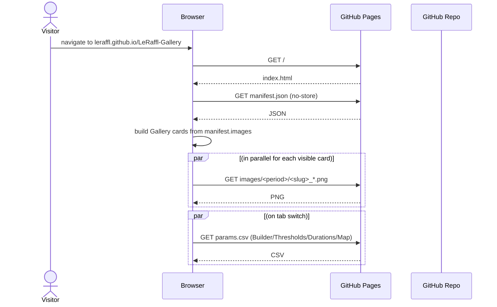
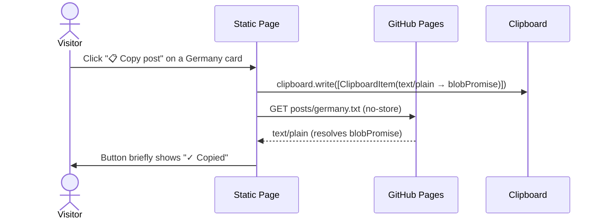
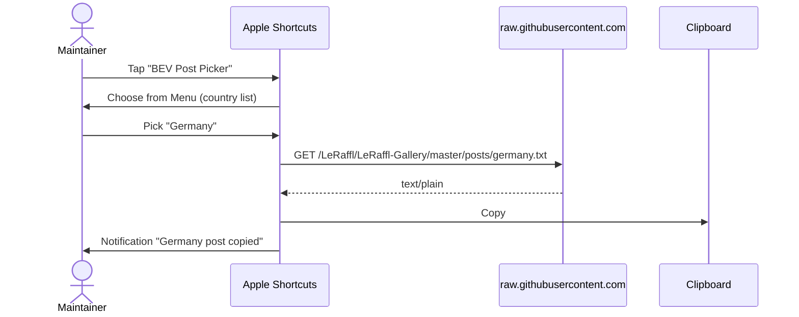
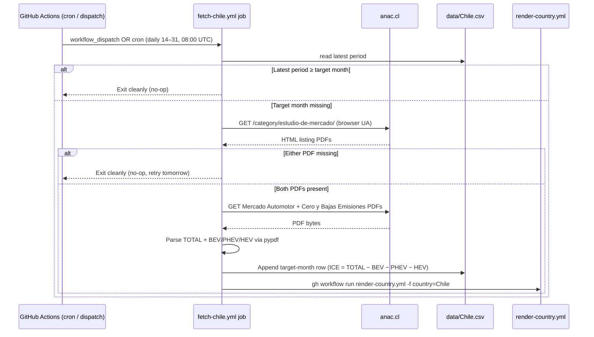
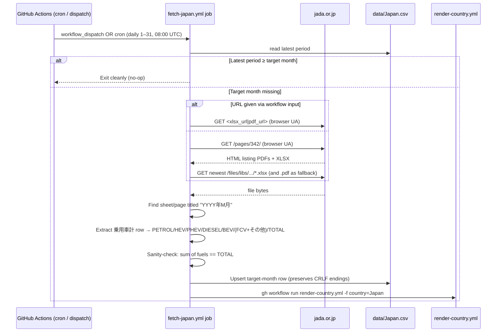

# 05 · Flows

End-to-end sequence diagrams for every meaningful user journey or background process. If you're adding a new flow, copy one of these as a template.

## Flow inventory

| # | Flow | Trigger | Outcome |
|---|---|---|---|
| A | [Public-submit a data point](#flow-a--public-submit) | Visitor fills Submit Data form | PR opened, awaiting maintainer review |
| B | [Render a country](#flow-b--render-a-country) | Maintainer triggers Render Action | New PNGs + posts + params row |
| C | [Local-render legacy](#flow-c--local-render-legacy) | Maintainer runs R in RStudio | Same outputs as Flow B, pushed directly to master |
| D | [Submit feedback / question](#flow-d--feedback-submit) | Visitor fills feedback modal | New GitHub Issue with labels |
| E | [Auto-rebuild manifest](#flow-e--manifest-rebuild) | Push to images/** or daily cron | Updated manifest.json |
| F | [Visitor reads gallery](#flow-f--gallery-read) | Page load on leraffl.github.io | Manifest + images displayed |
| G | [Copy post text](#flow-g--copy-post) | Click "📋 Copy post" or run Apple Shortcut | Text in clipboard |
| H | [Auto-ingest Brazil from ANFAVEA](#flow-h--anfavea-ingest) | Monthly cron (10th, 08:00 UTC) or manual dispatch | Updated `data/Brazil.csv` → triggers Flow B for Brazil |
| I | [Auto-ingest Chile from ANAC](#flow-i--anac-ingest) | Daily cron (14th–end of month, 08:00 UTC) or manual dispatch | Updated `data/Chile.csv` → triggers Flow B for Chile |
| J | [Auto-ingest Japan from JADA](#flow-j--jada-ingest) | Daily cron (1st–end of month, 08:00 UTC) or manual dispatch | Updated `data/Japan.csv` → triggers Flow B for Japan |

---

## Flow A — Public-submit



**After this flow:** the country's `data/<Country>.csv` on master has the new/corrected rows, but no new images yet. The maintainer triggers Flow B next to refresh PNGs and post text.

**Key constraints:**
- Worker has Contents+PRs scope but the only write the page can trigger is "open PR" — it cannot push directly to master (no permission was granted; even the API endpoints called are PR-only).
- Branch naming `submit/<slug>-<timestamp>` makes it easy to pick out submission PRs from regular dev branches.

---

## Flow B — Render a country



After this, Flow E (manifest rebuild) is explicitly dispatched by the Render-country workflow. Direct maintainer pushes to `images/**` still trigger Flow E through the path filter. The manifest commit then pushes to `master`, which GitHub Pages auto-deploys (Pages-from-branch; no separate Pages workflow exists or is needed).

**Performance notes:**
- Cold runner: ~2 min including R-package install
- Warm runner (cached binaries): ~30 s
- The R history-loop iterates `optim` once per data row × 2 (BEV + ICE). For Germany (~135 rows): ~3 s. For Norway (~250 rows): ~6 s.

---

## Flow C — Local-render legacy



**Why this exists at all (context for engineers):**
- Outputs are byte-compatible with Flow B — same filenames, same params row format, same posts format. So commits to master can come from either path without confusing downstream consumers.
- This path is being phased out as more data flows directly through Submit → PR → Render Action. Eventually Flow B becomes the only render path. Any new feature in `R/*.R` should be designed assuming Flow B is the canonical path.

---

## Flow D — Feedback submit



---

## Flow E — Manifest rebuild



---

## Flow F — Gallery read



This flow is intentionally trivial. **Any change that adds a backend dependency to the read path is a regression.** The page is read-side static; only the write side (Submit, Feedback) goes through the Worker.

---

## Flow G — Copy post

Two variants: in-page button, and Apple Shortcut. Both fetch the same URL.

### G.1 In-page



`clipboard.write()` is invoked synchronously inside the click handler — passing a `Promise<Blob>` to `ClipboardItem` lets the fetch resolve afterwards without losing Safari's user-gesture context. An older `await fetch(...) → clipboard.writeText(text)` chain throws `NotAllowedError` on Safari and iOS for exactly that reason.

### G.2 Apple Shortcut



**Why two paths to the same artefact:** the in-page button is for visitors and casual mobile/desktop use; the Shortcut is for the maintainer's posting workflow on iOS where launching Safari is more friction than tapping a Shortcut on the home screen.

## Flow H — ANFAVEA ingest

Brazil is the first country with an automated, source-side ingestion. ANFAVEA publishes one Excel workbook per year (`siteautoveiculos<YEAR>.xlsx`) covering production, registrations, exports, and employment. We only consume sheet "III. Emplacamento Combustível" — the cars + light-commercial fuel-split table.

```mermaid
sequenceDiagram
    participant Cron as GitHub Actions (cron / dispatch)
    participant Job as fetch-brazil.yml job
    participant Site as anfavea.com.br
    participant CSV as data/Brazil.csv
    participant Render as render-country.yml

    Cron->>Job: workflow_dispatch OR cron (10th 08:00 UTC)
    Job->>Site: GET /site/edicoes-em-excel/ (browser UA)
    Site-->>Job: HTML index
    Job->>Job: regex match siteautoveiculos<year>(-N)?.xlsx
    Job->>Site: GET /docs/siteautoveiculos<year>.xlsx
    Site-->>Job: xlsx bytes
    Job->>Job: Open sheet "III. Emplacamento Combustível"<br/>locate "Unidades" header → month row → fuel rows
    Job->>Job: Map Portuguese fuel labels → CSV columns<br/>(Elétrico→BEV, Híbrido Plug-in→PHEV, Híbrido→HEV,<br/>Gasolina→PETROL, Diesel→DIESEL, Flex Fuel→FLEXFUEL)
    Job->>Job: Skip months where all fuel values are 0
    Job->>CSV: Upsert by period; warn on >50% delta vs existing
    alt CSV changed
        Job->>Render: gh workflow run render-country.yml -f country=Brazil
    else No change
        Job-->>Cron: Exit cleanly, nothing committed
    end
```

**Where parsing lives:** [scripts/fetch_brazil.py](../../scripts/fetch_brazil.py). The module docstring is the authoritative reference for the parsing rules, column map, and how the script handles partial-year data.

**Why a browser User-Agent:** ANFAVEA's Apache returns HTTP 406 for `python-requests/*`. We send a Chrome desktop UA + standard `Accept` / `Accept-Language` headers on both calls.

**Why not the trucks/buses table:** sheet III has a second "Caminhões e Ônibus" block below the cars block. It uses a different fuel taxonomy (Elétrico/Gás/Diesel only) and isn't represented in `data/Brazil.csv`'s schema. The parser only walks the FIRST "Unidades" header and stops at the closing "Fonte:" marker, so the trucks table is naturally skipped.

**Adding more countries:** the pattern (`fetch-<country>.yml` → `scripts/fetch_<country>.py` → commit + dispatch render) is intentionally country-local rather than generic, because each statistics agency has its own URL scheme, file layout, and quirks. Duplicate and adapt rather than parameterise prematurely.

## Flow I — ANAC ingest

Chile follows the same `fetch-<country>` pattern as Brazil, with one twist: ANAC publishes **two** PDFs per month and they don't appear at the same time. The cron runs daily from the 14th onward and the script self-throttles via the CSV's latest period — most invocations are a no-op.



**Where parsing lives:** [scripts/fetch_chile.py](../../scripts/fetch_chile.py). The module docstring documents the regex patterns, the MHEV-into-ICE convention, and the no-partial-writes rule.

**Vehicle scope:** ANAC's "livianos y medianos" covers passenger cars + SUVs + pickups + light commercial vehicles up to 3.860 kg GVWR per DS N°241/2014 (light <2.7 t, medium 2.7–3.86 t). Camiones and buses are excluded. See [09-glossary.md § Vehicle scope per source](09-glossary.md#vehicle-scope-per-source) for the cross-country table.

**Why two PDFs:** ANAC splits the headline market total (Mercado Automotor) from the alternative-drivetrain breakdown (Cero y Bajas Emisiones). Both are needed to fill one CSV row; partial writes would produce wrong charts because BEV/PHEV/HEV would default to 0 and inflate ICE.

**Why MHEV → ICE:** ANAC reports mild-hybrids (Microhíbridos) as a separate line that didn't exist historically and isn't in `data/Chile.csv`'s schema. Per maintainer's call we bucket them into ICE via the implicit subtraction (`ICE = TOTAL − BEV − PHEV − HEV − OTHERS`) rather than introducing a new column.

## Flow J — JADA ingest

Japan follows the same `fetch-<country>` pattern as Brazil and Chile, with two twists: (1) JADA publishes the data in **both** PDF and XLSX form — we prefer the XLSX because its cell layout is machine-readable; (2) each publication is a rolling **4-month rollup** (one sheet/page per month), not a single-month file. We extract the target month from whichever sheet matches and let older months pass through untouched. The cron runs daily from the 1st onward and the script self-throttles via the CSV's latest period — most invocations are a no-op until JADA publishes the file for the previous month (typically the first business week).



**Where parsing lives:** [scripts/fetch_japan.py](../../scripts/fetch_japan.py). The module docstring documents the column mapping, the FCV+その他 fold-in convention, and the no-partial-writes rule.

**Vehicle scope:** JADA page 342 covers 登録車 (registered passenger cars) only. Kei cars (軽自動車) are explicitly excluded by the file's footer "２．軽自動車は含みません。" — see [09-glossary.md § Vehicle scope per source](09-glossary.md#vehicle-scope-per-source). The pre-existing `data/Japan.csv` rows since 2020-02 follow the same scope (monthly totals 180–280k match 登録車-only volumes).

**Why XLSX preferred, PDF fallback:** both files carry the same payload but the XLSX has stable cell positions (A=row label, D=PETROL, F=HEV, …, R=TOTAL). The PDF text, when extracted with pypdf, is reordered column-by-column rather than row-by-row, which forced us into a line-based parser (see "Issues hit" below). We try XLSX first and only fall back to PDF if the XLSX URL was not supplied / not parseable for the target month. This also future-proofs us against JADA dropping one of the two formats.

**Why `OTHERS = ＦＣＶ + その他(*)`:** JADA reports fuel-cell vehicles (ＦＣＶ) and "other" (LPG etc., footnoted `*その他はＬＰＧ車等`) as two separate columns. The pre-existing `data/Japan.csv` collapses them into a single `OTHERS` column. Verified against three historical rows: e.g. 2026-01 OTHERS=80 in the CSV matches FCV=79 + その他=1 in the source. We follow the established CSV convention rather than introduce an `FCV` column.

**Why daily from the 1st:** unlike ANAC (Chile, publishes ~14th) and ANFAVEA (Brazil, publishes ~6th–10th), JADA tends to publish the previous month's file on the **first business day** of the following month — the April 2026 file in our sample was published 2026-05-11, which is on the late side; January 2026 was published 2026-02-05. Starting on day 1 keeps the first publication day in range; the self-throttle makes the empty days free.

### Design decisions

| Decision | Rationale |
|---|---|
| Duplicate Chile's structure rather than abstract a generic "fetch_country" runner | The project convention (Brazil flow notes) is to keep each fetcher country-local: each agency has its own URL scheme, file layout, and quirks. The shared shape sits in the workflow YAML (cron + dispatch + commit + render-trigger), not in the Python. |
| Take target month = previous calendar month by default | Mirrors Chile/Brazil and matches the maintainer's mental model. Any other month can be forced via `--year`/`--month` on the CLI or workflow_dispatch inputs. |
| Self-throttle by reading `latest_period` from the CSV before any HTTP call | A no-op invocation should cost nothing on JADA's side. We hit the index page only when there's a real chance the target month isn't yet in the CSV. |
| Preserve the existing CRLF line endings in `data/Japan.csv` | Detected at write time by sniffing the first 4 KiB of the file. Without this the very first ingest would rewrite all 172 rows from CRLF to LF and produce a noisy diff (we tripped over this during development; see "Issues hit"). |
| Sum check `PETROL+HEV+PHEV+DIESEL+BEV+OTHERS == TOTAL` before writing | The XLSX has both per-fuel columns and a 合計 (Total) column. If they disagree, the column mapping is wrong — fail loudly rather than write a bad row. Cross-checked exact for 12/12 months of 2022 and 3/3 months of 2026 against the existing CSV during development. |
| Manual `--xlsx-url` / `--pdf-url` overrides on the workflow | The maintainer noticed that JADA's hosting may block cloud IP ranges (we hit `HTTP 403, x-deny-reason: host_not_allowed` from the development sandbox). Manual URL inputs let the workflow run even if auto-discovery is blocked on Actions runners. The first scheduled CI run is what tells us whether discovery works from `ubuntu-latest`. |

### Issues hit during development

1. **JADA blocked the dev sandbox.** Initial `WebFetch` / `curl` against `https://www.jada.or.jp/pages/342/` returned `HTTP 403 x-deny-reason: host_not_allowed`. The maintainer uploaded two sample files to `master` (a 2026 monthly XLSX+PDF pair plus a 2022 full-year XLSX) and we developed the parser against those. We do not yet know whether the GitHub-hosted runner is also blocked — the first manual dispatch on the feature branch will tell us. If it is, the `--xlsx-url` / `--pdf-url` workflow inputs are the fallback.

2. **PDF parser shifted columns by one when ＦＣＶ was zero.** First version used a single multi-line regex anchored on the `構成比` (composition) row that always follows a data row. On months without an ＦＣＶ entry (2026-02, -03, -04) the regex over-matched: it picked up a `0` from the *previous* row's `構成比 … 0.1 100.0 --` line as PETROL and shifted every column to the right. Fix: switched to a line-based parser. Each `\n`-separated line is independently tokenised; only lines whose count tokens contain at least one comma-grouped integer (real fuel counts always do; `構成比` percentages never do) are kept. From those, the row with the largest TOTAL is the 乗用車計 row. After the fix, the PDF parser matches the XLSX parser byte-exact on all 16 validated months.

3. **First test rewrote all 172 rows.** End-to-end smoke test produced a diff of the entire file even though only one row was added. Cause: `data/Japan.csv` uses CRLF line endings (committed that way originally); `csv.DictWriter(lineterminator="\n")` rewrote it as LF. Fix: detect the existing file's line ending by reading its first bytes and feed it back to `DictWriter`. Chile.csv has the same CRLF convention, but `fetch_chile.py` has not yet hit this because Chile.csv was rewritten as part of the bootstrap commit; we still left a TODO for a follow-up to keep the two scripts consistent.

4. **Header order is ambiguous in the PDF.** pypdf's text-extraction emits the page header line as `合計ガソリン ＨＶ ＰＨＶ ディーゼル ＥＶ ＦＣＶ その他(*) 前年比`, which reads as if 合計 (Total) is the first column. It isn't — that's just two adjacent cells being concatenated by the extractor. The actual data row, e.g. `59,374 64.3 178,423 … 11,245 280.4 29 74.4 265,438 92.1` for 2026-03, confirms PETROL is first and 合計 is last. The XLSX confirms the same via cell coordinates. Documented inline in the script so the next reader doesn't get bait-switched by the header text.

### Validation

Parser was checked byte-exact against the existing `data/Japan.csv` rows:

| Sample file | Months validated | Result |
|---|---|---|
| `燃料別登録台数統計（2022年1月~12月）.xlsx` (full-year rollup) | 2022-01 … 2022-12 | 12/12 EXACT match |
| `202605081028169165.xlsx` (May 2026 monthly rollup) | 2026-01, 2026-02, 2026-03 | 3/3 EXACT match |
| `202605081028169165.xlsx` — new row | 2026-04 | Sum check ✓ (parsed BEV/PHEV/HEV/PETROL/DIESEL/OTHERS sum to 223,369 = TOTAL) |
| `202605081027423166.pdf` (same publication, PDF format) | 2026-01 … 2026-04 | Matches XLSX byte-exact (after the line-based parser fix; see Issue 2 above) |

The XLSX layout has been stable from at least 2022 through 2026 — same column positions, same row label `乗用車計`, same footer notes. The sample files themselves are not in this branch; they live in `master` (committed by the maintainer as `Add files via upload`) and were pulled into the working tree only during development.

## See also

- [04-interfaces.md](04-interfaces.md) — request/response shapes for each Worker call shown above
- [02-components.md](02-components.md) — the boxes in the diagrams
- [08-deploy-ops.md](08-deploy-ops.md) — how to invoke Flow B, how to debug Flow A failures
