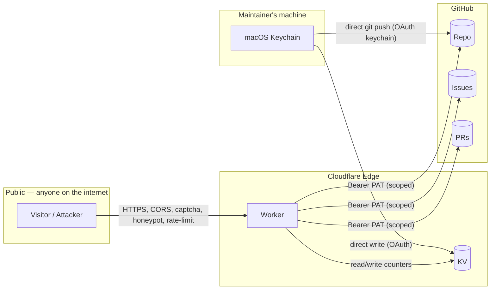

# 07 · Secrets and Trust

What can be done by whom. What an attacker can and cannot accomplish. Where credentials live. No tokens or IDs are reproduced in this file.

## Trust-boundary diagram

The five trust boundaries to reason about:

1. **Public ↔ Worker** — adversarial. Defended by CORS, captcha, honeypot, rate-limit, schema validation.
2. **Worker ↔ GitHub** — Worker holds a fine-grained PAT; constrained to PR-only writes for data, full R/W on issues.
3. **GitHub Actions ↔ Repo** — Actions hold the workflow-scoped GITHUB_TOKEN, can push to master.
4. **Maintainer ↔ Repo** — full write access via personal OAuth.
5. **Maintainer ↔ Cloudflare** — full account access via wrangler OAuth in macOS Keychain.

## Secret inventory

| Secret | Type | Where it lives | Scope / capability | Rotation |
|---|---|---|---|---|
| `GITHUB_TOKEN` (Worker) | Fine-grained PAT | Cloudflare Worker secret (set via `npx wrangler secret put GITHUB_TOKEN`) | Repo: `LeRaffl/LeRaffl-Gallery` only. Permissions: Issues R/W, Contents R/W, Pull requests R/W, Metadata R | Manual; no expiry currently set. Rotate by editing the PAT in GitHub settings; token value stays; if regenerated, re-`wrangler secret put`. |
| `GITHUB_TOKEN` (workflow) | GitHub-managed | Auto-injected by Actions per run | Repo-write within the workflow's run; ephemeral | Auto |
| Cloudflare API token | OAuth | macOS Keychain (via `npx wrangler login`) | Full account; covers Workers, KV, Pages | When `wrangler login` is re-run |
| Git push credentials | OAuth | macOS Keychain | The maintainer's GitHub identity (personal write) | When user revokes from GitHub Settings → Applications |
| Google Sheets OAuth | OAuth | Local R session, stored in `~/.cache/gargle` | Read-only access to specific sheets | Auto-refreshes; revoke from Google Account |
| `AUSTRIA_RELAY_TOKEN` (Worker) | Shared secret | Cloudflare Worker secret (`npx wrangler secret put AUSTRIA_RELAY_TOKEN`) | Gates the `GET /fetch` Austria relay; any random string. Low blast radius — `/fetch` is host-allowlisted to Statistik Austria (public open data) regardless | Manual; re-`wrangler secret put` and update the GH secret to match |
| `AUSTRIA_RELAY_TOKEN` (GH Actions) | Shared secret | GitHub Actions repo secret | Sent as `X-Relay-Token` by `fetch-austria.yml`; must equal the Worker's value | Same as above |
| `AUSTRIA_FETCH_RELAY` (GH Actions) | URL (not sensitive) | GitHub Actions repo secret | Relay base URL `https://<worker-host>/fetch?url=`. Stored as a secret only to keep the worker host out of the public repo | Update if the Worker host changes |
| `AUSTRIA_PROXY` (GH Actions, optional) | Proxy URL w/ creds | GitHub Actions repo secret | Fallback `http(s)://`/`socks5://` proxy if the relay egress is also blocked; may embed credentials | Rotate at the proxy provider |

**Tokens and IDs are never committed to the repo.** The `GITHUB_TOKEN` value lives only in Cloudflare's secret store; even the maintainer's local machine doesn't keep a long-lived copy after `wrangler secret put`. The Cloudflare account ID and KV namespace ID are in `wrangler.toml` but those are not secrets — they're public-bound identifiers, useless without the API token.

## What the Worker's PAT can and cannot do

**Can:**
- Read any file in the repo (Contents R)
- Create branches and commit changes to them (Contents W + Git Refs API)
- Open pull requests against master (Pulls W)
- Read issues, create issues, comment on issues (Issues R/W)

**Cannot:**
- Push directly to master (would require admin override; not granted)
- Force-push to any branch (no Force-push permission)
- Modify repo settings, secrets, or webhooks
- Read or modify other repos in the organisation
- Read repo secrets (no Secrets permission)

This is the architectural firewall: even if the Worker were fully compromised, the worst an attacker could do is open spam PRs (which the maintainer can close) or post spam issues (which can be auto-hidden by adding the `hidden` label). They cannot land code or data without human review.

## Threat model — Public Submit endpoint

| Threat | Mitigation |
|---|---|
| Spam submissions to drown the maintainer in PRs | KV rate-limit `sub:<ip>` ≥ 3 in 60 min returns 429. Honeypot field silently swallows bots that auto-fill all inputs. Schema validation rejects malformed rows immediately. |
| Submitting fake numbers to corrupt data | All submissions are PR-based; maintainer reviews before merge. PR diff shows exactly what changed, so subtle tampering is visible. |
| Submitting valid-looking but historically wrong data | Same — review gate. The maintainer cross-checks the submitted source URL with the cited number. |
| DoS via large payloads | `rows.length > 36` rejected. Each row's payload is bounded (`notes` ≤ 200 chars, `country/variant` ≤ 60/30 chars). |
| Submitting unsupported fuel column to crash the renderer | `ALLOWED_FUEL_COLS` allowlist rejects anything not on the canonical list. |
| Crafting `country` with `../` to write outside `data/` | The Worker URL-encodes `country` for the GitHub API path, so `../` becomes `..%2F`. Even if the encoding failed, the GitHub API itself doesn't expose paths outside the repo. |
| Race conditions between two simultaneous submissions for the same country | Each submission opens a new branch off whatever master is at the time. If a second submission lands while a first PR is open, the second PR's branch will diverge from the first; merging both produces a normal git merge resolution. The maintainer reviews each independently. |

## Threat model — Public Feedback endpoint

| Threat | Mitigation |
|---|---|
| Spam issue creation | Math captcha (3+4=?), honeypot, KV rate-limit `rl:<ip>` |
| Posting personally-identifying info publicly | Privacy notice in the modal warns the user; submission is irreversible from their side — they need to ask the maintainer to redact via a regular issue close+hide. |
| Phishing links in issue body | GitHub auto-renders URLs but not as clickable rich-text in many surfaces; users see raw URLs. The maintainer can `hidden`-label any issue in seconds. |

## Why the Worker is on the critical write path even though static-pages-direct would be simpler

A pure static-page can't talk to the GitHub API in a way that's safe — the PAT would be exposed in client JS. The Worker:
- Holds the PAT server-side
- Adds a CORS check (`Origin` must match `https://leraffl.github.io`) so other origins can't even reach the endpoint from a browser
- Adds rate-limiting that wouldn't be feasible client-side
- Adds schema validation that runs in a trusted context

Removing the Worker means either embedding a token in the page (no), implementing a different write strategy (e.g. GitHub Issue Forms, which has worse UX), or running a small backend somewhere else (same complexity).

## Cloudflare-side hardening

- `compatibility_date` pinned in `wrangler.toml` → runtime behaviour is reproducible
- `observability.enabled = true` and `logs.enabled = true` → tail logs visible in dashboard for debugging
- `preview_urls = false` → no public preview URL is exposed alongside production deployments
- KV namespace IDs are not secrets but are scoped to this Worker's namespace by binding name

## Rotation playbook

If the Worker's PAT leaks (Cloudflare logs exposed, secret accidentally printed):
1. Go to GitHub Settings → Personal access tokens → fine-grained → revoke `leraffl-gallery-feedback-worker`
2. Create a new fine-grained PAT with the same four scopes scoped to the repo
3. `cd worker && npx wrangler@latest secret put GITHUB_TOKEN` and paste the new value
4. Verify via `Test feedback submission` and `Test data submission` end-to-end
5. No code changes required

If the Cloudflare API token is suspected compromised:
1. Cloudflare dashboard → My Profile → API Tokens → revoke the OAuth session
2. `npx wrangler@latest login` again on the maintainer's Mac

## See also

- [04-interfaces.md § validation tables](04-interfaces.md) — exact validation rules
- [08-deploy-ops.md](08-deploy-ops.md) — operational steps to deploy/rotate
