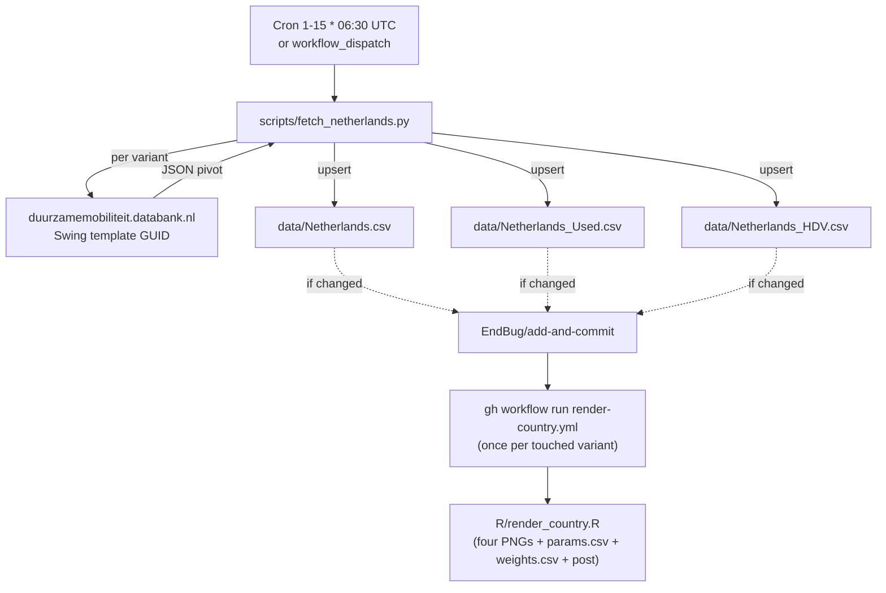

# 10 · Source: Netherlands (duurzamemobiliteit.databank.nl / RDW)

The Netherlands pipeline is more involved than most other countries because
the upstream data is served from a proprietary BI tool, not a static Excel
or open CSV. This document records what we built, why, and how to maintain
or extend it. Audience: future contributors and LLMs picking the work up
cold.

> The same playbook is the template for Denmark, Sweden, Finland, Norway
> (planned), which all expose their registration data via BI portals rather
> than flat files. Re-use the patterns; don't expect identical endpoints.

## TL;DR

```
Source:    duurzamemobiliteit.databank.nl (Swing 7.1, vendor: ABF Research)
           Underlying data: RDW (Rijksdienst voor het Wegverkeer)
Auth:      None required (anonymous session, server issues JIVE_AUTH cookie)
API:       Three saved Swing workspace templates → GetTableStart JSON
Variants:  Whole, Used, HDV   (three separate CSV files)
HEV:       Not split by RDW (folded into Benzine/Diesel upstream); no HEV column
FCEV:      Folded into OTHERS (~1 unit/month for Whole; ~30/month for Used)
Backfill:  Pre-2018 Whole rows from the maintainer's Google Sheet (one-off)
Schedule:  Daily cron 1st–15th, early-exit per variant once last month is in
Scripts:   scripts/fetch_netherlands.py   (monthly scraper)
           scripts/backfill_netherlands_pre2018.py  (one-off)
Workflow:  .github/workflows/fetch-netherlands.yml
```

## 1. Why this is hard

`duurzamemobiliteit.databank.nl` is a [Swing 7.1](https://www.abfresearch.nl/)
dashboard ("Swing" is ABF Research's product, formerly named "Jive" — both
strings appear in the URLs and JS bundles). It has no documented public API,
no OData/JSON-Stat endpoint, and no per-country CSV downloads at stable URLs.

The UI does expose a CSV export button per pivot, but the export is gated
behind a session-bound workspace handle that doesn't survive a fresh `curl`
unless you replay a specific sequence of dimension-selection calls. We tried
both paths:

| Approach | Verdict |
|---|---|
| Reverse-engineer the JSON endpoint and replay dimension-toggle calls | Works but ~12 HTTP calls per variant in a brittle ordering; breaks if Swing changes any one item code |
| Have the maintainer save a permalink per variant in the Swing UI and hit each one | Picked. ~2 HTTP calls per variant. The saved permalinks (`?workspace_guid=...`) are stable as long as nobody deletes them in the maintainer's Swing account |
| Use CBS Statline OData as an alternative source | Rejected — different granularity, ~6 week publication lag, and doesn't split Used / HDV the way we need |

## 2. The Swing endpoint flow

Each variant maps to one saved-permalink URL of the form:

```
https://duurzamemobiliteit.databank.nl/viewer?workspace_guid=<TEMPLATE_GUID>
```

That URL doesn't itself return data — it returns the JS shell of the viewer.
But the inline JavaScript on that page binds a server-side session to a
fresh **session GUID** that's needed for all subsequent data calls. The
bootstrap is:

```python
# 1. Hit the permalink with an empty cookie jar.
#    The server sets ASP.NET_SessionId, JIVE_AUTH, jive_elektrischvervoer
#    cookies, and embeds the session-bound workspace GUID in the HTML.
GET /viewer?workspace_guid=<TEMPLATE_GUID>
    → HTML containing  WsGuid: "<SESSION_GUID>"  in inline JS

# 2. Extract the session GUID and hit the data endpoint.
GET /viewer/Presentation/GetTableStart?workspaceGuid=<SESSION_GUID>
    → JSON pivot (first ~70 rows)

# 3. If the pivot is longer than the initial page, paginate.
GET /viewer/Presentation/GetTableRows
        ?workspaceGuid=<SESSION_GUID>
        &startRow=<n>&startCol=0&numRows=<m>&numCols=<cols>&tableId=0
    → JSON {tableId, rowData: [...]}
```

`scripts/fetch_netherlands.py::fetch_table` implements exactly this — see
the `WSGUID_RE` regex (matches `WsGuid: "<36-char-uuid>"`) and the
GetTableRows loop that fills in everything past the initial page.

**Important nuance**: the URL `?workspace_guid=...` parameter does *not*
survive into the session as-is. The server reads it, looks up the saved
template in the maintainer's account, and creates a *new* per-session
workspace whose GUID is the one embedded in the HTML. So if you log the
HTTP traffic, you will see two different GUIDs: the one in your request
URL (the template) and the one used in every subsequent call (the session).

## 3. The three variants and why we split them

| Variant | File | Display label | Swing pivot | Saved permalink |
|---|---|---|---|---|
| `Whole` | `data/Netherlands.csv` | Netherlands | Instroom Personenauto Nieuw | `a7d36cf5-9dd3-4eca-96e9-9e1b991af9ba` |
| `Used` | `data/Netherlands_Used.csv` | Netherlands (Used) | Personenauto Occasion import (sum of `> 90 dgn` and `<= 90 dgn`) | `ffaf2d83-0174-4b36-92b9-f7bd96ad4d89` |
| `HDV` | `data/Netherlands_HDV.csv` | Netherlands (HDV) | Zware bedrijfsvoertuigen Nieuw | `992eb09a-0828-4ef9-97b4-1577ebba3a21` |

### Why three CSV files instead of one with a `variant` column

The architecture (see [03-data-objects.md](03-data-objects.md)) anticipated
per-variant files but had not activated them. Netherlands is the first
country to use the new layout because the maintainer wanted Used and HDV
to feel like distinct entries in the gallery (separate ranking rows,
separate trajectory pages, separate post text), and because the previous
single-CSV approach had two practical pain points:

1. PR diffs touched all three slices even when only one variant updated.
2. The `render-country.yml` dropdown could pick a variant that didn't exist
   in the CSV, producing a confusing "no rows for variant 'Foo'" stop
   instead of the much clearer "missing data file: data/Foo_Bar.csv" stop.

[R/render_country.R](../../R/render_country.R) resolves
`data/<Country>_<Variant>.csv` first and falls back to
`data/<Country>.csv` so countries that haven't migrated yet still work.

### Why "Used" and not "Used Imports"

Earlier the variant was called "Used Imports" in `params.csv` (matching
the literal Dutch UI label "Occasion import"). The maintainer wanted the
shorter "Used" in the UI dropdown and in the gallery card title. The
variant key, the CSV filename, the `params.csv` row, the `weights.csv`
row, and the flag asset (`assets/flags/netherlands_used.png`) all carry
the short name. There is no override map keeping the long name alive
elsewhere — search-and-replace was the cleanest path.

### Why "HDV" maps to *Zware bedrijfsvoertuigen* and not *Vrachtauto*

"Heavy Duty Vehicle" has no perfect single-category equivalent in the RDW
taxonomy. The closest single bucket is *Zware bedrijfsvoertuigen* (heavy
goods vehicles, conceptually N-class trucks at ≥3500 kg). This is an
approximation: it under-counts a few edge categories (buses) and isn't
strictly aligned with the EU N-class definitions other country sources use.
For the gallery's cross-country HDV ranking the approximation is
acceptable. Revisit if a stricter definition becomes important.

## 4. Column mapping

Source columns (Swing pivot, Dutch labels) → canonical CSV columns:

| Swing label | Canonical column | Notes |
|---|---|---|
| `BEV` | `BEV` | |
| `PHEV` | `PHEV` | |
| `Benzine` | `PETROL` | Includes petrol-HEV (RDW doesn't split full hybrids out) |
| `Diesel` | `DIESEL` | Includes diesel-HEV |
| `Overig` + `FCEV` | `OTHERS` | FCEV folded — single-digit units/month for Whole, ~30/month for Used. Negligible effect on the ICE/BEV trajectory and the headline TTM stack. |
| (none) | `HEV` | **Always blank** — see "HEV gap" below |

### The HEV gap

RDW does not separately publish full-hybrid registrations. They land in the
`Benzine` or `Diesel` bucket. The downstream effect is that:

- The TTM stacked-shares plot for Netherlands has no HEV slice (correct —
  it really isn't reported).
- The social-media post text drops the "(of which X%p were HEV)" annotation.
  This is automatic via [`R/post_text.R::.pt_pp_if`](../../R/post_text.R)
  which only emits the parens when `extra_value > 0`.
- The headline ICE/BEV/PHEV trajectory is unaffected, because ICE share is
  computed as `(TOTAL - BEV - PHEV - EREV) / TOTAL` — the breakdown
  *within* ICE doesn't change the curve.

If RDW ever adds an HEV split, the scraper's `FUEL_MAP` and the
`to_csv_rows` function need one new entry and the post text starts emitting
the HEV line automatically.

### Number formatting

Dutch locale: `.` is the thousands separator (so `"6.863"` is six-thousand-
eight-hundred-sixty-three, not 6.863). Empty cells render as the HTML
entity `"&nbsp;"`. Both are handled by `parse_nl_number`.

## 5. Table orientations

Swing pivots can be returned in either orientation:

| Orientation | Returned for | `headRows` contains | `headCols` contains |
|---|---|---|---|
| Periods-in-rows | Whole, HDV | Period labels (`"31 januari 2018"` …) | Fuel labels (one level) |
| Fuels-in-rows | Used | Fuel labels (`BEV`, `FCEV`, `PHEV` …) | Period labels **and** sub-period categories (two levels — `> 90 dgn` and `<= 90 dgn` per period) |

`parse_table` detects which case applies by checking whether the first
`headRows` entry is in the known fuel-label set (`NL_FUELS`). For the
fuels-in-rows case it also walks the outer-level `headCols` propagating
the period label forward across the sub-columns it spans, then sums the
sub-columns per period.

## 6. Backfill: pre-2018 history

The Swing dataset only goes back to 2018-01 (a Swing-side configuration —
not all years are available in the public templates). The maintainer's
[Google Sheet](https://docs.google.com/spreadsheets/d/1tT_Ja3de_S528_JeSBkj74q-lfEIekE5-GRm9_pWgUo/)
has Whole monthly data back to 2011-01. Without backfilling, fitting the
regression on Swing-only data would shift the baseline year `t0` from
2010 to 2018 and visibly alter the published trajectory (the `t0` for
the BEV regression curve is `floor(min(year))`, see [R/fit.R:10](../../R/fit.R)).

[`scripts/backfill_netherlands_pre2018.py`](../../scripts/backfill_netherlands_pre2018.py)
is the one-off, idempotent merge:

- Reads the "Netherlands" tab as CSV via the
  `https://docs.google.com/spreadsheets/d/<ID>/gviz/tq?tqx=out:csv&sheet=<name>`
  endpoint (works because the sheet is shared as "anyone with the link can
  view").
- Filters to `period < 2018-01` (the cutoff matching the Swing dataset's
  start so backfill and live data never overlap).
- Existing `(period, "Whole")` rows in `data/Netherlands.csv` are left
  untouched; only the 84 missing pre-2018 rows are added.
- Pre-2018 rows have **only** `BEV`/`PHEV`/`TOTAL`; `PETROL`/`DIESEL`/`OTHERS`
  are blank (those splits weren't tracked at the time). The downstream BEV/
  PHEV/ICE math still works because ICE share is derived from TOTAL minus
  the EV columns. The TTM stacked-shares plot starts later (2019-01) because
  `compute_ttm_long` requires every present fuel column to have a complete
  12-month rolling window.

`Used` and `HDV` sheet tabs both start 2018-01 (same as Swing) so this
script does not touch those variants.

Run on-demand:
```sh
python scripts/backfill_netherlands_pre2018.py
```

Re-running is safe — adds 0 new rows on a no-op pass.

## 7. Schedule and idempotency

`fetch-netherlands.yml` runs:

- **Daily 1st–15th at 06:30 UTC** (`cron: '30 6 1-15 * *'`). RDW's monthly
  publication date isn't fixed — sometime in the first half of the month.
  Daily polling within that window catches the new data on the day it
  appears.
- **06:30 UTC** is chosen to clear `fetch-brazil.yml`'s 08:00 UTC slot.
- After day 15, the cron sleeps for the rest of the month.

The scraper's `previous_month_period()` + `csv_has_period` short-circuit:
once a variant's CSV already contains last month's row, that variant is
skipped without any HTTP call. On most days the run is a sub-second no-op.
Use `--force` to override (e.g. when RDW restates an older month and you
want it picked up the same day).

Change detection uses `git add -N` to make `git diff` include untracked
new files (so the first run when a CSV doesn't exist on master yet still
triggers renders). Only variants whose CSV actually changed get a
`render-country.yml` dispatch.

## 8. Workflow data flow



## 9. Plot palette alignment

The TTM stacked-shares plot and the ICE/BEV/PHEV three-curve plot use the
same color values as the Fleet tab on the gallery page so the static PNGs
and the live HTML plot read as one visual language. See `TTM_FUEL_COLORS`
and `TRAJ_COLORS` at the top of [R/plots.R](../../R/plots.R). The
ground-truth values are the `colorMap` and top-level `COLORS` constants
near lines 1765 and 4078 of [index.html](../../index.html). If those
change, mirror the change in plots.R.

## 10. Known fragility

| Failure mode | What happens | Diagnostic |
|---|---|---|
| GitHub Actions runner can't reach the host (transient `Network is unreachable` / `errno 101`) | `requests.Session` retries the connection up to 3× with exponential backoff (2 s → 4 s → 8 s); if all retries fail the job fails visibly | Re-run the workflow manually once the network recovers, or wait for the next scheduled run. The most recent confirmed occurrence was 2026-06-01. |
| Maintainer deletes a saved permalink in Swing | Scraper fails on that variant with `WsGuid not found in /viewer response` | Look at the failing variant's URL in the Action log; recreate the permalink in Swing UI; update `TEMPLATES` in `fetch_netherlands.py` |
| Swing upgrades to a version with a different inline-JS shape | `WSGUID_RE` regex stops matching | Update the regex to match the new JS pattern (look at the raw HTML response) |
| Swing changes the pivot JSON shape | Parser fails noisily; render aborts before commit | Inspect a fresh HAR; update `parse_table` / `_parse_periods_in_rows` / `_parse_fuels_in_rows` |
| RDW retroactively restates a month with values that differ >50% from what's in the CSV | Upsert prints `WARNING` to the action log but still commits the new values | Decide whether the restatement is real and revert with a manual edit if not |
| Google Sheet revoked from "anyone with the link" | Backfill script fails with a Google login HTML response | Re-share the sheet, or hardcode the pre-2018 history into a static CSV |
| The maintainer reconfigures a saved Swing template (e.g. drops a year, changes Aandrijfcategorie selection) | Scraper succeeds but produces wrong-shaped data | The "Captured caption" line in the action log doesn't match `Instroom Personenauto Nieuw - Nederland`. Re-save the workspace with the correct configuration. |

## 11. Maintenance recipes

### Rotate one of the three Swing template GUIDs

1. Open the existing permalink in a logged-in Swing UI session, click the
   pencil/edit icon to adjust the pivot (e.g. add a newly-available year).
2. Click the share icon (chain links). Swing saves the modified workspace
   and shows a new permalink URL with a new `?workspace_guid=...`.
3. Replace the corresponding entry in `TEMPLATES` in
   [`scripts/fetch_netherlands.py`](../../scripts/fetch_netherlands.py).
4. Commit. Next run uses the new GUID.

### Add a fourth variant (e.g. Buses, Motorcycles)

1. In Swing, set up the pivot with the desired `Voertuigsoort` /
   `Aanvoertype` / `Aandrijfcategorie` combination and full-year range.
2. Share-icon → permalink.
3. Add a new entry to both `TEMPLATES` and `CSV_PATHS` in the scraper.
4. Add the variant name to the `render-country.yml` choice list.
5. Add a flag asset at `assets/flags/netherlands_<lowercase variant>.png`.
6. Update this doc's variant table.

### Force-refetch an older month (RDW restated something)

```sh
python scripts/fetch_netherlands.py --variant whole --force
```

The `--force` flag skips the early-exit check; the scraper re-fetches all
available months and the upsert overwrites existing rows (logging a
WARNING for any cell that moved by >50%).

### Validate the bootstrap by hand

```sh
curl -s -c /tmp/c "https://duurzamemobiliteit.databank.nl/viewer?workspace_guid=a7d36cf5-9dd3-4eca-96e9-9e1b991af9ba" \
  | grep -oE 'WsGuid: "[a-f0-9-]+"'
# → WsGuid: "<some uuid>"

curl -s -b /tmp/c "https://duurzamemobiliteit.databank.nl/viewer/Presentation/GetTableStart?workspaceGuid=<that uuid>" \
  | python3 -m json.tool | head -40
# → JSON with "caption", "headCols", "headRows", "rowData"
```

If both steps succeed, the scraper will too. If step 1 returns no
match, the template GUID is broken. If step 2 returns HTML (a 302 to
`/Viewer/Error`), the cookies aren't being carried correctly.

## 12. What is **not** in this pipeline

- Authentication. JIVE_AUTH is a server-side anti-CSRF token, not a user
  credential. The whole flow works for any anonymous client. Do not commit
  the maintainer's logged-in cookies anywhere.
- A non-Swing fallback. If Swing is persistently unreachable, there is no
  automatic switch to CBS Statline or anywhere else. Transient connection
  errors are retried up to 3× with exponential backoff (see Known fragility
  above); a failure that survives all retries still fails the action.
- Real-time updates. The cron is daily, not hourly. There is no webhook
  from RDW or Swing.
- Backfill for Used/HDV before 2018. The maintainer's sheet doesn't have
  those slices that far back. They start 2018-01 in both the sheet and
  Swing.
