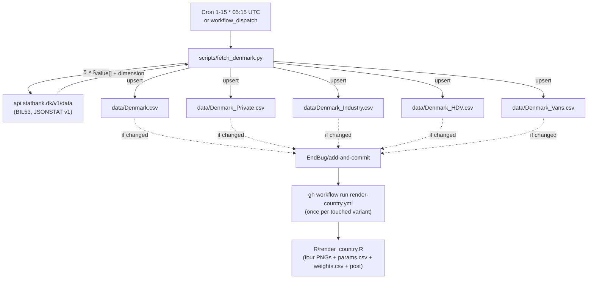

# 11 · Source: Denmark (api.statbank.dk / BIL53)

Statistics Denmark (Danmarks Statistik) publishes new-registration data
in StatBank table **BIL53** ("New registration of motor vehicles by
region, type of vehicle, terms of use, propellant and time") and exposes
it via a public JSON API at `https://api.statbank.dk/v1/data`. Compared
to the Netherlands pipeline this is straightforward — no session
handling, no saved templates, no pagination, one POST per variant.

## TL;DR

```
Source:    api.statbank.dk (table BIL53)
           Underlying data: Danmarks Statistik / Motorregistret
Auth:      None required
API:       POST https://api.statbank.dk/v1/data with JSON body
           (one request per variant; format=JSONSTAT)
Variants:  Whole, Private, Industry, HDV, Vans (5 separate CSV files)
HEV:       Not split by Statbank (folded into Petrol/Diesel upstream); no HEV column
Backfill:  Pre-2018 Whole rows from the maintainer's Google Sheet (one-off)
           (Private/Industry/HDV/Vans not in the sheet pre-2018; live data starts at API range)
Schedule:  Daily cron 1st–15th, 05:15 UTC; early-exit per variant once last month is in
Scripts:   scripts/fetch_denmark.py             (monthly fetcher)
           scripts/backfill_denmark_pre2018.py  (one-off)
Workflow:  .github/workflows/fetch-denmark.yml
```

## 1. The API

`api.statbank.dk` is the official, public REST endpoint. It accepts both
GET URLs with query parameters and POST with a JSON body — we use POST
because the body is easier to read in the script source than a
many-parameter URL.

The base discovery endpoint, `/v1/tableinfo/BIL53`, returns the full
list of valid dimension codes. Hit it any time the dimension layout
might have shifted:

```sh
curl -s 'https://api.statbank.dk/v1/tableinfo/BIL53?format=JSON&lang=en' \
  | python3 -m json.tool | less
```

Data requests look like:

```json
POST https://api.statbank.dk/v1/data
Content-Type: application/json

{
  "table":   "BIL53",
  "format":  "JSONSTAT",
  "lang":    "en",
  "variables": [
    {"code": "OMRÅDE",  "values": ["000"]},
    {"code": "BILTYPE", "values": ["4000101002"]},
    {"code": "BRUG",    "values": ["1000"]},
    {"code": "DRIV",    "values": ["20205","20210","20225","20232","20235", …]},
    {"code": "Tid",     "values": ["*"]}
  ]
}
```

Notes:

- The dimension code `OMRÅDE` contains a non-ASCII character (Å). Both
  Python's `requests.post(..., json=body)` and `curl --data` handle the
  UTF-8 encoding transparently; do **not** URL-encode it manually.
- `format: "JSONSTAT"` returns [JSON-stat v1](https://json-stat.org/format/).
  We use v1 not v2 because Statbank's v2 implementation seems incomplete
  (probe-testing returned an empty body for valid v2 requests).
- `lang: "en"` returns English labels. Codes are the same in both languages,
  so the script is unaffected; English just makes log output readable.

## 2. The five variants

| Variant | File | BILTYPE | BRUG | Notes |
|---|---|---|---|---|
| `Whole` | `data/Denmark.csv` | `4000101002` Passenger cars, total | `1000` Total | Default slice |
| `Private` | `data/Denmark_Private.csv` | `4000101002` | `1100` In households | |
| `Industry` | `data/Denmark_Industry.csv` | `4000101002` | `1200` In industries | |
| `HDV` | `data/Denmark_HDV.csv` | `4000103000` Lorries, total | `1000` | Pre-2021 cells are genuine zeros (see §4) |
| `Vans` | `data/Denmark_Vans.csv` | `4000102000` Vans, total | `1000` | |

Sanity check: `Private + Industry = Whole` per month. Verified against
random spot-checks across the full range; if a future fetch breaks this
invariant, Statbank changed the BRUG taxonomy.

`OMRÅDE = "000"` (All Denmark) is pinned for every variant. BIL53 also
exposes regional and per-municipality breakdowns; we don't use them.

### Why no `Road tractors` (BILTYPE `4000103030`) slice

The screen `BIL53 > Type of vehicle` lists `Road tractors, total` in
addition to `Lorries, total`. They are **disjoint** categories (Statbank
sums them into a fifth "Vehicles total" code, `4000100001`, so neither
is contained in the other). For Denmark we treat `HDV ≡ Lorries`, which
matches our other countries' HDV convention (heavy goods vehicles ≥ 3.5 t;
road tractors are a separate niche). Add a sixth variant if anyone wants
the road-tractor curve later.

## 3. Column mapping

Statbank propellant code (`DRIV`) → canonical CSV column:

| DRIV code | Statbank label | Canonical column |
|---|---|---|
| `20205` | Petrol | `PETROL` |
| `20210` | Diesel | `DIESEL` |
| `20225` | Electricity | `BEV` |
| `20232` | Pluginhybrid | `PHEV` |
| `20215` | LPG | `OTHERS` |
| `20220` | N-gas | `OTHERS` |
| `20230` | Kerosene | `OTHERS` |
| `20231` | Hydrogen | `OTHERS` |
| `20256` | Ethanol | `OTHERS` |
| `20258` | Ethanol | `OTHERS` |
| `20235` | Other propellant | `OTHERS` |
| (none) | — | `HEV` always blank — Statbank doesn't split full hybrids |

We deliberately ignore `DRIV=20200` ("Total propellant"). Our `TOTAL`
column is computed as the sum of the cells we actually wrote, which
guarantees `TOTAL = BEV+PHEV+PETROL+DIESEL+OTHERS` row-for-row. If
Statbank publishes a row where the breakdown doesn't sum to the
reported total, the script silently writes the breakdown sum (better
than disagreeing with the per-fuel cells).

### The Ethanol-x2 quirk

Statbank lists `Ethanol` **twice** under DRIV, with two different codes
(`20256` and `20258`). The labels are identical in both English and
Danish — the two codes appear to be E85 vs. ED95 (or two equally-marked
sub-categories), but Statbank does not expose the distinction in the
label text. For us both fold into `OTHERS`, so the ambiguity is moot.
If a future schema change splits them, `DRIV_TO_COL` in the script needs
no change.

### The HEV gap

Same as for Netherlands — Statbank does not separately publish full-hybrid
registrations; they land in `Petrol` or `Diesel`. The downstream TTM
stacked-shares plot for Denmark has no HEV slice, the post text drops
the "(of which X%p were HEV)" line, and the BEV/PHEV/ICE trajectory is
unaffected (ICE share is `(TOTAL − BEV − PHEV − EREV)/TOTAL`).

## 4. History and the HDV-2021 quirk

The `Tid` dimension exposes monthly data from `2018M01` onwards for the
table as a whole. **Per-variant** coverage differs:

| Variant | API range | After backfill |
|---|---|---|
| Whole | 2018-01 … current | **2014-01 …** current (see §5) |
| Private | 2018-01 … current | same |
| Industry | 2018-01 … current | same |
| Vans | 2018-01 … current | same |
| HDV | **2021-01 … current** | same |

For HDV, BIL53 cells before 2021-01 are reported as `0` — confirmed by
direct probes against the `20200` "Total propellant" code, not a
client-side filter artefact. Statbank only started tracking the Lorries
× propellant breakdown in 2021. Pre-2021 phantom-zero months are
filtered by the `to_csv_rows` skip-when-TOTAL=0 check.

## 5. Backfill: pre-2018 Whole history

`api.statbank.dk` only goes back to 2018-01 for the passenger-car
breakdown. The maintainer's
[Google Sheet](https://docs.google.com/spreadsheets/d/1n6QacQ7BIWMa9-vQpbDuuwkquSzYk7XIRbXzjcIsnyg/)
tracks Denmark passenger-car BEV/PHEV/ICE back to 2014-01 (assembled by
hand from older Statbank releases and ACEA press notes). Without the
backfill, the Weibull `t0 = floor(min(year))` for Denmark would be 2018
instead of 2014, distorting the published trajectory.

[`scripts/backfill_denmark_pre2018.py`](../../scripts/backfill_denmark_pre2018.py)
mirrors the Netherlands one-off backfill:

- Tab `registrations` → variant `Whole`, 48 monthly rows 2014-01..2017-12.
- The sheet only has `BEV / PHEV / ICE / OTHERS / TOTAL` (no Petrol/Diesel
  split). We write `BEV`, `PHEV`, `OTHERS`, `TOTAL`; `PETROL` / `DIESEL`
  / `HEV` / `FLEXFUEL` are blank. The renderer recovers ICE share from
  `(TOTAL − BEV − PHEV)` exactly like for Netherlands pre-2018.
- Idempotent: existing `(period, "Whole")` rows are left untouched.
- Source label is `"api.statbank.dk (BIL53) — pre-2018 via maintainer sheet"`
  so the pre-2018 rows are distinguishable from API rows in the CSV.

The `registrations_private` and `registrations_industry` tabs both start
2018-01 in the sheet (the maintainer didn't compile pre-2018 history for
those slices), so the backfill script only writes to `data/Denmark.csv`.

Run on-demand:

```sh
python scripts/backfill_denmark_pre2018.py
```

## 6. Schedule and idempotency

`fetch-denmark.yml` runs **daily on the 1st–15th at 05:15 UTC**
(`cron: '15 5 1-15 * *'`).

- Statbank's BIL53 publication date varies — somewhere between the 9th
  and 12th of the following month, usually. Daily polling catches the
  new data on publication day.
- `previous_month_period()` + `csv_has_period_for_variant` short-circuit:
  once a variant's CSV has last month's row, that variant is skipped
  without any HTTP call. After day 15 the cron sleeps until the next
  month's 1st.
- 05:15 UTC keeps us clear of fetch-netherlands (06:30), fetch-brazil/
  fetch-acea (08:00), and the ACEA 03:17 UTC fallback.
- `--force` overrides the early-exit if Statbank ever restates an older
  month and you want it picked up the same day.

## 7. Workflow data flow



## 8. Parallel-render push race (one-time stumble)

The first time `fetch-denmark.yml` ran, it dispatched five
`render-country.yml` runs back-to-back. The render workflow's
concurrency group is keyed by `country-variant`, so different variants
run in parallel — and each ends with a `git push` to the same branch.
Two of the five renders raced and got `[remote rejected] (cannot lock
ref … is at X but expected Y)` from the push.

This was resolved by serially re-dispatching the failed variants. The
race is rare in practice: monthly publication only produces five
near-simultaneous touched variants on the day BIL53 publishes; on every
other day the early-exit short-circuit means at most one variant gets
touched. If we want to remove the race entirely, switch the dispatch
loop to `gh workflow run ... && gh run watch <id>` so renders serialise
end-to-end — adds ~10 minutes to a once-monthly run, deemed not worth
it for now.

## 9. Known fragility

| Failure mode | What happens | Diagnostic |
|---|---|---|
| Statbank deprecates BIL53 or restructures its dimensions | POST returns 4xx, or the parser sees unfamiliar dimension IDs | Hit `/v1/tableinfo/BIL53?lang=en`, compare to the codes in `VARIANT_CONFIG` and `DRIV_TO_COL`, update accordingly |
| New DRIV code (e.g. a new alt-fuel) | Script raises `RuntimeError("unmapped DRIV code …")` and aborts before commit | Add the new code to `DRIV_TO_COL` (almost always under `OTHERS`) |
| Statbank restates an older month with >50% delta | Upsert prints `WARNING` to the action log but still commits the new values | Manually verify and revert with a CSV edit if not real |
| `OMRÅDE` URL/JSON encoding regresses in some HTTP client | API returns 400 / empty dataset | Stick with `requests`; the script passes the body via `json=` so encoding is automatic |
| Google Sheet revoked from "anyone with the link" | Backfill script fails with a Google login HTML response | Re-share the sheet, or hardcode pre-2018 history into a static CSV |

## 10. Maintenance recipes

### Add a sixth variant (e.g. Road tractors, Buses)

1. Look up the BILTYPE code via `/v1/tableinfo/BIL53` (the screen lists
   five BILTYPE values today).
2. Add an entry to `VARIANT_CONFIG` in `scripts/fetch_denmark.py` with
   the BILTYPE / BRUG / output-path combination.
3. Add the variant name to the `--variant` choices in the script and
   to the `render-country.yml` choice list.
4. Add a flag asset at `assets/flags/denmark_<variant>.png`.
5. Update this doc's variant table (§2).

### Force-refetch an older month (Statbank restated something)

```sh
python scripts/fetch_denmark.py --variant whole --force
```

### Validate the API by hand

```sh
curl -s -X POST 'https://api.statbank.dk/v1/data' \
  -H 'Content-Type: application/json' \
  -d '{"table":"BIL53","format":"JSONSTAT","lang":"en","variables":[
    {"code":"OMRÅDE","values":["000"]},
    {"code":"BILTYPE","values":["4000101002"]},
    {"code":"BRUG","values":["1000"]},
    {"code":"DRIV","values":["20225","20232"]},
    {"code":"Tid","values":["2026M03","2026M04"]}
  ]}' | python3 -m json.tool | head -40
```

Should return a `dataset.value` array of four numbers (BEV + PHEV × two
months) matching the Statbank UI at
<https://www.statbank.dk/statbank5a/SelectVarVal/Define.asp?MainTable=BIL53>.

## 11. What is **not** in this pipeline

- Authentication. The API is fully open. Don't add a Statbank API key —
  there isn't one.
- Sub-monthly data. BIL53 is published monthly, around the 10th of the
  following month. There's no daily or quarterly endpoint we use.
- Regional breakdowns. The full municipal hierarchy is in BIL53 but we
  pin `OMRÅDE = "000"` (All Denmark) to keep the CSV count manageable.
- Backfill for Private / Industry / HDV / Vans before the API range.
  The maintainer's sheet doesn't have those slices that far back. Add
  them to the sheet first if needed; the backfill script is then a
  ~20-line extension.
