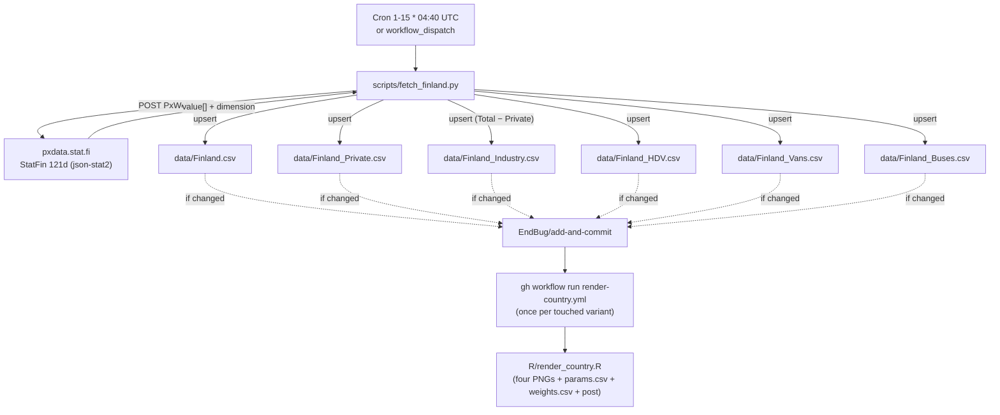

# 12 · Source: Finland (pxdata.stat.fi / StatFin 121d)

Statistics Finland (Tilastokeskus) publishes first-registration data in
StatFin table **121d** ("First registrations of cars by driving power,
purpose of use and by possessor, monthly") and exposes it via the public
PxWeb API. Like Denmark this is a clean JSON API — one POST per query,
no session handling — but with two structural twists: Finland splits
plug-in hybrids natively, and the "Industry" slice has to be derived
(Total − Private person) because there is no industry possessor bucket.

## TL;DR

```
Source:    pxdata.stat.fi (StatFin table 121d, vendor: PxWeb)
           Underlying data: Tilastokeskus / Traficom vehicle register
Auth:      None required
API:       POST <table>.px with a PxWeb JSON query (response: json-stat2)
           API guide: https://pxdata.stat.fi/api1.html
Variants:  Whole, Private, Industry, HDV, Vans, Buses (6 separate CSV files)
PHEV:      Split natively (driving-power 39 + 44)
HEV:       NO non-plug-in full-hybrid code — full hybrids fold into Petrol;
           HEV column left blank, same as Denmark/NL
Region:    MA1 "Mainland Finland" (broadest aggregate; Åland not in the table)
Industry:  Derived = possessor Total (00) − Private person (01), cell-by-cell
Backfill:  None — table starts 2014M01 and the maintainer has no pre-2014 data
Schedule:  Daily cron 1st–15th, 04:40 UTC; early-exit per variant once last month is in
Scripts:   scripts/fetch_finland.py
Workflow:  .github/workflows/fetch-finland.yml
```

## 1. Migration note: Finland was previously legacy-local

Before this pipeline, Finland existed in `params.csv` / `manifest.json`
(variants Whole, Private, Industry, HDV) rendered via the **legacy local
R pipeline** (§2.10 in [02-components.md](02-components.md)) from a data
file on the maintainer's Mac that was never committed to the repo — there
was no `data/Finland*.csv` on `master`. This pipeline migrates Finland to
the automated fetcher: it commits the `data/Finland*.csv` files, overwrites
the legacy `params.csv` rows with the automated source string
`pxdata.stat.fi (StatFin 121d)`, and adds two brand-new variants (Vans,
Buses). The automated fits matched the legacy fits to 3 significant figures
on the overlapping month, confirming the API data equals what the maintainer
had locally.

## 2. The API

PxWeb is the BI platform Statistics Finland (and many Nordic agencies) use.
The data endpoint is the table's `.px` URL; you POST a JSON query and get
back the format you ask for. We request `json-stat2`.

```
GET  https://pxdata.stat.fi/PxWeb/api/v1/en/StatFin/merek/statfin_merek_pxt_121d.px
     → table metadata (all dimension codes + value labels)

POST https://pxdata.stat.fi/PxWeb/api/v1/en/StatFin/merek/statfin_merek_pxt_121d.px
     {
       "query": [
         {"code":"Ajoneuvoluokka",  "selection":{"filter":"item","values":["01"]}},
         {"code":"Maakunta",        "selection":{"filter":"item","values":["MA1"]}},
         {"code":"Käyttövoima",     "selection":{"filter":"item","values":["01","02","04","39","44", …]}},
         {"code":"Käyttötarkoitus", "selection":{"filter":"item","values":["YH"]}},
         {"code":"haltija",         "selection":{"filter":"item","values":["00"]}},
         {"code":"Kuukausi",        "selection":{"filter":"all","values":["*"]}}
       ],
       "response": {"format":"json-stat2"}
     }
     → JSON-stat2: value[] flat array, dimension category indices, size[], id[]
```

Notes:

- **Variable codes are Finnish even on the `/en/` endpoint.** `Käyttövoima`
  (driving power), `Käyttötarkoitus` (purpose of use), `haltija` (possessor),
  `Ajoneuvoluokka` (vehicle class), `Maakunta` (region), `Kuukausi` (month).
  They contain non-ASCII (`ä`); `requests.post(..., json=body)` encodes them
  as UTF-8 automatically — don't URL-encode by hand.
- **json-stat2 layout** is row-major in `id` order with sizes in `size`.
  The parser computes strides from `size` and reads each `(driving, month)`
  cell for a fixed possessor index. The dimension category-index map (not the
  request order) determines which array position each code occupies — PxWeb
  returns driving-power codes in its own sorted order, not the order you asked.
- **PxWeb cell limit:** the public endpoint caps a single query (historically
  ~100k cells; our largest is 12 driving × 148 months × 2 possessors = 3,552
  for the Industry query — comfortably under). If the limit is ever hit,
  split the `Kuukausi` selection into chunks.

## 3. The six variants

| Variant | File | Vehicle class | Possessor | Notes |
|---|---|---|---|---|
| `Whole` | `data/Finland.csv` | `01` Passenger cars | `00` Total | Default slice |
| `Private` | `data/Finland_Private.csv` | `01` | `01` Private person | |
| `Industry` | `data/Finland_Industry.csv` | `01` | `00 − 01` (derived) | See below |
| `HDV` | `data/Finland_HDV.csv` | `03` Lorries > 3.5 t | `00` Total | |
| `Vans` | `data/Finland_Vans.csv` | `02` Vans | `00` Total | |
| `Buses` | `data/Finland_Buses.csv` | `04` Buses & coaches | `00` Total | New variant; very low volume |

`Maakunta = MA1` and `Käyttötarkoitus = YH` (purpose = Total) are pinned for
every variant.

### Why Industry is derived (Total − Private)

Statistics Finland's `haltija` (possessor) dimension has no "industry"
bucket — it splits into Private person, Enterprise, State, Municipality,
Private entrepreneur, and Unknown. Per the maintainer's definition,
**Industry = possessor Total (00) − Private person (01)**, i.e. "everything
that isn't a private individual". The subtraction is done **cell-by-cell**
(per driving power, per month) so the per-fuel breakdown stays internally
consistent and `Private + Industry = Whole` holds exactly. Negative results
are clamped to 0 (defensive; shouldn't occur). The alternative — summing
Enterprise + State + Municipality + Private entrepreneur + Unknown — would
give the same answer but is more fragile if Statistics Finland adds a
possessor category.

### Why only passenger cars get the Private/Industry split

Same convention as Denmark: the household-vs-industry distinction is most
meaningful for passenger cars. Vans, HDV (lorries), and Buses are each a
single Total slice. Buses are included even though volume is tiny (often
single digits/month, sometimes all-BEV) — the maintainer wanted the variant
on record.

## 4. Column mapping

Driving-power code (`Käyttövoima`) → canonical CSV column:

| Code | Label | Canonical column |
|---|---|---|
| `01` | Petrol | `PETROL` |
| `02` | Diesel | `DIESEL` |
| `04` | Electricity | `BEV` |
| `39` | Petrol/Electricity (plug-in hybrid) | `PHEV` |
| `44` | Diesel/Electricity (plug-in hybrid) | `PHEV` |
| `06` | Gas | `OTHERS` |
| `13` | Natural gas (CNG) | `OTHERS` |
| `38` | Petrol/CNG | `OTHERS` |
| `40` | Petrol/Ethanol | `OTHERS` |
| `65` | LNG | `OTHERS` |
| `67` | Diesel/LNG | `OTHERS` |
| `Y` | Other | `OTHERS` |
| `YH` | Total | (not fetched — we sum the per-fuel cells) |
| (none) | — | `HEV` always blank |

`TOTAL` is the sum of the fetched per-fuel cells, never the `YH` "Total"
code, so the written `TOTAL` always equals the breakdown.

### The HEV gap (different cause than Denmark, same outcome)

Finland **does** split plug-in hybrids (codes 39 and 44 → PHEV). But there
is **no driving-power code for a non-plug-in full hybrid** (a "self-charging"
HEV). Those vehicles are classified by their combustion fuel, i.e. they fold
into `Petrol` (01). So like Denmark and Netherlands, the `HEV` column stays
blank and the renderer recovers ICE share from `(TOTAL − BEV − PHEV)`. If
Statistics Finland ever adds a full-hybrid code, add it to `DRIV_TO_COL` and
the post text starts emitting the HEV line automatically.

### Region: MA1 excludes Åland

The `Maakunta` dimension's broadest aggregate is `MA1` ("Mainland Finland").
The Åland Islands (Ahvenanmaa, which would be region `MK03`) are **not in
table 121d at all** — there is no all-Finland-incl-Åland total available here.
Åland first registrations are a few hundred per year (immaterial to the
trajectory), but be aware the published "Finland" figure is mainland-only.
The other region values (`MK01`–`MK19` minus `MK03`, plus `MKTT` Unknown and
`MKUU` Foreign countries) are not used.

## 5. History

Table 121d starts at **2014M01** — that's the earliest the API offers, and
the maintainer has no pre-2014 Finland data to backfill, so all six variants
run 2014-01 onwards with no backfill step (unlike Denmark/Netherlands, which
have pre-API Google-Sheet history). The Weibull `t0 = floor(min(year))` is
therefore 2013 (floor of 2014).

## 6. Schedule and idempotency

`fetch-finland.yml` runs **daily on the 1st–15th at 04:40 UTC**
(`cron: '40 4 1-15 * *'`).

- Statistics Finland publishes 121d around the 5th–8th of the following
  month. Daily polling catches it on publication day.
- `previous_month_period()` + `csv_has_period_for_variant` short-circuit:
  once a variant's CSV has last month's row, that variant is skipped without
  any HTTP call. After day 15 the cron sleeps until the next month's 1st.
- 04:40 UTC sits between the ACEA 03:17 fallback and fetch-denmark (05:15),
  clear of the 06:30 (Netherlands) / 08:00 (Brazil/Chile/Japan/Türkiye/
  Uruguay/ACEA) crowd.
- `--force` overrides the early-exit for restatement runs.

## 7. Workflow data flow



## 8. Parallel-render push race

Same one-time stumble as Denmark (see [11-source-denmark.md § 8](11-source-denmark.md)):
the first run dispatched six `render-country.yml` jobs that race on the final
`git push` to the branch. The render workflow's concurrency group is keyed by
`country-variant`, so variants run in parallel; the losers report
`conflicting files: params.csv` and need a serial re-dispatch. On normal
monthly runs only the days BIL/121d actually publishes touch all six variants
at once; every other day the early-exit makes the dispatch set empty or tiny.

## 9. Known fragility

| Failure mode | What happens | Diagnostic |
|---|---|---|
| Statistics Finland renames table 121d or changes its dimension codes | POST returns 4xx, or the parser sees unfamiliar dimension IDs | Hit the GET metadata URL, compare to `DRIV_TO_COL` / `VARIANT_CONFIG`, update |
| New driving-power code (e.g. a hydrogen split) | Script raises `RuntimeError("unmapped driving-power code …")` and aborts before commit | Add the code to `DRIV_TO_COL` (most go under `OTHERS`; a real HEV split goes to a new `HEV` mapping) |
| PxWeb cell-limit error on a query | POST returns an error payload | Chunk the `Kuukausi` selection (e.g. fetch in 5-year blocks) |
| Statistics Finland restates an older month >50% | Upsert prints `WARNING` to the log but still commits | Verify and revert with a CSV edit if not real |
| Region taxonomy changes (MA1 renamed/split) | Query returns empty or errors | Re-check `Maakunta` values via the metadata endpoint |

## 10. Maintenance recipes

### Add a seventh variant (e.g. All automobiles, or a region)

1. Look up the relevant `Ajoneuvoluokka` / `Maakunta` / `haltija` code via
   the GET metadata URL.
2. Add an entry to `VARIANT_CONFIG` in `scripts/fetch_finland.py`.
3. Add the variant name to the `--variant` choices in the script and to the
   `render-country.yml` choice list.
4. Add a flag asset at `assets/flags/finland_<variant>.png`.
5. Update this doc's variant table (§3).

### Force-refetch an older month

```sh
python scripts/fetch_finland.py --variant whole --force
```

### Validate the API by hand

```sh
curl -s -X POST 'https://pxdata.stat.fi/PxWeb/api/v1/en/StatFin/merek/statfin_merek_pxt_121d.px' \
  -H 'Content-Type: application/json' \
  -d '{"query":[
    {"code":"Ajoneuvoluokka","selection":{"filter":"item","values":["01"]}},
    {"code":"Maakunta","selection":{"filter":"item","values":["MA1"]}},
    {"code":"Käyttövoima","selection":{"filter":"item","values":["04","39","44"]}},
    {"code":"Käyttötarkoitus","selection":{"filter":"item","values":["YH"]}},
    {"code":"haltija","selection":{"filter":"item","values":["00"]}},
    {"code":"Kuukausi","selection":{"filter":"item","values":["2026M03","2026M04"]}}
  ],"response":{"format":"json-stat2"}}' | python3 -m json.tool | head -60
```

Should return a `value` array (BEV + two PHEV codes × two months) matching
the table viewer at
<https://pxdata.stat.fi/PxWeb/pxweb/en/StatFin/StatFin__merek/statfin_merek_pxt_121d.px/>.

## 11. What is **not** in this pipeline

- Authentication. The PxWeb API is fully open; no key.
- Åland. Not in table 121d; the "Finland" figure is Mainland Finland.
- Purpose-of-use splits. We pin `Käyttötarkoitus = Total`; the per-purpose
  breakdown (private use / permit / driving school / rental / sales storage)
  is available but unused.
- Pre-2014 history. The table starts 2014M01 and there's no maintainer
  backfill, so no backfill script (unlike Denmark/Netherlands).
- Sub-monthly data. 121d is monthly.
