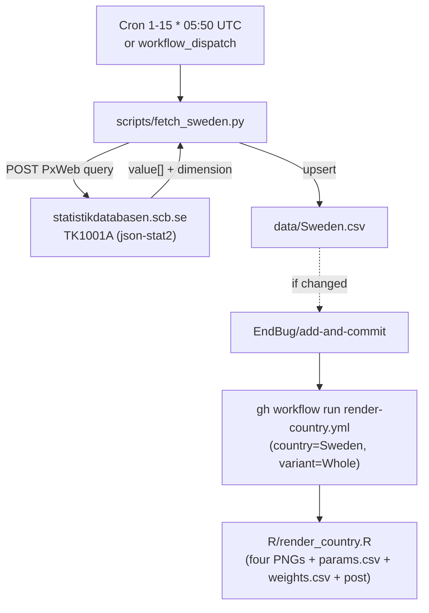

# 13 · Source: Sweden (statistikdatabasen.scb.se / PersBilarDrivMedel)

Statistics Sweden (SCB) publishes new passenger-car registrations by fuel in
table **TK1001A/PersBilarDrivMedel** (a.k.a. **TAB3277**, "New registrations
of passenger cars by region and by type of fuel") and exposes it via the SCB
PxWeb API. This is the simplest of the database-fed countries: one variant,
one CSV, one POST — but with the nicest fuel granularity, because SCB reports
both **HEV** (non-plug-in electric hybrid) and **ethanol/flexifuel**
separately.

## TL;DR

```
Source:    statistikdatabasen.scb.se (SCB PxWeb, table TK1001A / TAB3277)
Auth:      None required
API:       POST <table>.px (PxWeb v1) with a JSON query, response json-stat2
Variants:  Whole only — the table is passenger-cars-only with no possessor or
           vehicle-class split, so no Private/Industry/HDV/Vans/Buses
HEV:       Reported natively (fuel code 130 "electric hybrid")
FLEXFUEL:  Reported natively (fuel code 150 "ethanol/ethanol flexifuel") —
           own TTM slice, folds into ICE in the three-curve
Backfill:  None — table starts 2006M01 (2002–2005 excluded upstream)
Schedule:  Daily cron 1st–15th, 05:50 UTC; early-exit once last month is in
Scripts:   scripts/fetch_sweden.py
Workflow:  .github/workflows/fetch-sweden.yml
```

## 1. Migration note: Sweden was previously legacy-local

Before this pipeline, `data/Sweden.csv` was maintained by hand via the legacy
local R pipeline (§2.10 in [02-components.md](02-components.md)). The file was
committed (unlike Finland's, which had no committed data file) and already used
the `HEV` and `FLEXFUEL` columns. This pipeline migrates Sweden to the
automated fetcher; the data values are unchanged except for routine SCB
revisions of the most recent months (SCB restates the last month or two each
release). The migration also normalised the file from **CRLF to LF** line
endings (the legacy file used CRLF; all automated fetchers write LF), which
produced a one-time whole-file diff with no value changes on historical rows.

## 2. The API

SCB's PxWeb v1 API is the classic PxWeb platform (same family as Finland's
`pxdata.stat.fi`). We POST a JSON query to the table's `.px` endpoint and
request `json-stat2`.

```
GET  https://api.scb.se/OV0104/v1/doris/en/ssd/START/TK/TK1001/TK1001A/PersBilarDrivMedel
     → table metadata (all dimension codes + value labels)

POST https://api.scb.se/OV0104/v1/doris/en/ssd/START/TK/TK1001/TK1001A/PersBilarDrivMedel
     {
       "query": [
         {"code":"Region",    "selection":{"filter":"item","values":["00"]}},
         {"code":"Drivmedel", "selection":{"filter":"item","values":["100", … ,"190"]}},
         {"code":"Tid",       "selection":{"filter":"all","values":["*"]}}
       ],
       "response": {"format":"json-stat2"}
     }
     → JSON-stat2: value[] flat array, dimension category indices, size[], id[]
```

Notes:

- **Two API surfaces exist.** The viewer also offers a "PxWebApi 2.0" URL
  (`https://statistikdatabasen.scb.se/api/v2/tables/TAB3277/data?…`). We use
  the **v1 POST** endpoint because it's the documented classic PxWeb API and
  behaves identically to Finland's, keeping the two fetchers structurally
  the same. (The v2 GET URL needs a different output-format parameter and
  returned non-JSON in our probes; v1 POST with `json-stat2` just works.)
- **Dimension codes are stable:** `Region` (00 = Sweden), `Drivmedel` (fuel),
  `Tid` (month), `ContentsCode` (TK1001AA = Number, singleton).
- **json-stat2 layout** is row-major in `id` order with sizes in `size`; the
  parser computes strides and reads each `(fuel, month)` cell. The dimension
  category-index map determines array positions.

## 3. Single variant

| Variant | File | Region | Notes |
|---|---|---|---|
| `Whole` | `data/Sweden.csv` | `00` Sweden | The only variant |

The table's `Region` dimension has 315 values (national + counties +
municipalities) but no vehicle-class or possessor dimension. So unlike Denmark
and Finland there's no Private/Industry split and no HDV/Vans/Buses — Sweden is
a single whole-country passenger-car series. If a separate SCB table covering
vans/lorries/buses turns up, it can be added as its own variants later (the
maintainer flagged this as future work, not certain such a table exists).

## 4. Column mapping

Fuel code (`Drivmedel`) → canonical CSV column:

| Code | Label | Canonical column |
|---|---|---|
| `100` | petrol | `PETROL` |
| `110` | diesel | `DIESEL` |
| `120` | electricity | `BEV` |
| `130` | electric hybrid | `HEV` |
| `140` | plug-in hybrid | `PHEV` |
| `150` | ethanol/ethanol flexifuel | `FLEXFUEL` |
| `160` | gas/gas flex | `OTHERS` |
| `190` | other fuels | `OTHERS` |

`TOTAL` is the sum of all eight mapped cells.

### HEV and FLEXFUEL — the two specials

Sweden is the first database-fed country to report **HEV natively**: fuel code
`130` ("electric hybrid") is the non-plug-in full hybrid that Denmark, Finland
and the Netherlands all fold silently into petrol. So Sweden's `HEV` column is
populated, the TTM stacked-shares plot shows a real HEV slice, and the
social-media post text emits the "(of which X%p were HEV)" annotation
automatically.

**Ethanol/flexifuel** (`150`) maps to the dedicated `FLEXFUEL` column. The
renderer already treats `FLEXFUEL` correctly for the gallery's two relevant
outputs:

- **TTM stacked-shares plot:** `FLEXFUEL` is its own slice (it appears in
  `stack_order` in [R/data.R](../../R/data.R) with the brown-family colour
  `Flexfuel = "#6b4423"` in [R/plots.R](../../R/plots.R)).
- **BEV/PHEV/ICE three-curve:** ICE is computed as everything except BEV and
  PHEV(+EREV) — so `FLEXFUEL` **and** `HEV` fold into the brown ICE line
  (see the "3-curve rollup" comment in [R/data.R](../../R/data.R)). This is
  exactly the maintainer's intent: ethanol counts as ICE in the headline
  trajectory but stays visible as its own slice in the fuel-mix plot.

No renderer changes were needed — the standard column mapping does it all.

## 5. History

The table starts at **2006M01**. The Obs note on the table explains that
2002–2005 are excluded: the vehicle register lacked the second-fuel field then,
so hybrids couldn't be properly reported. We fetch all available months
(`Tid` filter `all`) from 2006M01; no backfill step. `t0 = floor(min(year))`
is 2005 (the legacy fits already used 2005).

## 6. Schedule and idempotency

`fetch-sweden.yml` runs **daily on the 1st–15th at 05:50 UTC**
(`cron: '50 5 1-15 * *'`).

- SCB publishes the previous month's new registrations early in the following
  month. Daily polling within the window catches publication day.
- `previous_month_period()` + `csv_has_period` short-circuit: once `data/Sweden.csv`
  has last month's row, the run is a no-op (no HTTP beyond nothing — the check
  is local) until the next month's 1st.
- 05:50 UTC sits between fetch-denmark (05:15) and fetch-netherlands (06:30),
  clear of the 08:00 crowd.
- SCB revises recent months; on a `--force` re-fetch the upsert overwrites
  existing rows (logging a WARNING only on >50% moves, which shouldn't happen
  for routine revisions).

## 7. Workflow data flow



Single variant means **no parallel-render push race** (the stumble Denmark and
Finland hit) — only one `render-country.yml` job is ever dispatched per run.

## 8. Known fragility

| Failure mode | What happens | Diagnostic |
|---|---|---|
| SCB renames the table or changes fuel codes | POST returns 4xx, or the parser sees unfamiliar fuel IDs | Hit the GET metadata URL, compare to `DRIV_TO_COL`, update |
| New fuel code (e.g. a hydrogen split) | Script raises `RuntimeError("unmapped fuel code …")` and aborts before commit | Add the code to `DRIV_TO_COL` (most go under `OTHERS`) |
| SCB v1 API deprecated in favour of v2 | POST to the v1 URL fails | Switch to the v2 endpoint (`statistikdatabasen.scb.se/api/v2/tables/TAB3277/data`); adjust the request/response handling |
| SCB restates an older month >50% | Upsert prints `WARNING` but still commits | Verify and revert with a CSV edit if not real |
| Line-ending regression | A future hand-edit re-introduces CRLF | The fetcher always rewrites the whole file as LF, so the next run normalises it |

## 9. Maintenance recipes

### Force-refetch (SCB restated something)

```sh
python scripts/fetch_sweden.py --force
```

### Validate the API by hand

```sh
curl -s -X POST 'https://api.scb.se/OV0104/v1/doris/en/ssd/START/TK/TK1001/TK1001A/PersBilarDrivMedel' \
  -H 'Content-Type: application/json' \
  -d '{"query":[
    {"code":"Region","selection":{"filter":"item","values":["00"]}},
    {"code":"Drivmedel","selection":{"filter":"item","values":["120","130","140","150"]}},
    {"code":"Tid","selection":{"filter":"item","values":["2026M03","2026M04"]}}
  ],"response":{"format":"json-stat2"}}' | python3 -m json.tool | head -60
```

Should return a `value` array (electricity / electric hybrid / plug-in hybrid /
ethanol × two months) matching the viewer at
<https://www.statistikdatabasen.scb.se/pxweb/en/ssd/START__TK__TK1001__TK1001A/PersBilarDrivMedel/>.

### Add a vans/lorries/buses table if one is found

Sweden's TK1001A is passenger-cars-only. If a sibling SCB table with the
heavy-vehicle breakdown is located, add a second fetcher (or extend this one
with a table/variant map à la Denmark/Finland) and the matching
`render-country.yml` variants.

## 10. What is **not** in this pipeline

- Authentication. The SCB PxWeb API is open; no key.
- Regional/municipal breakdowns. `Region` exposes 315 values; we pin `00`
  (Sweden).
- Vans / lorries / buses. Not in table TK1001A.
- Pre-2006 history. The table starts 2006M01 (2002–2005 excluded upstream).
- Sub-monthly data. The table is monthly.
