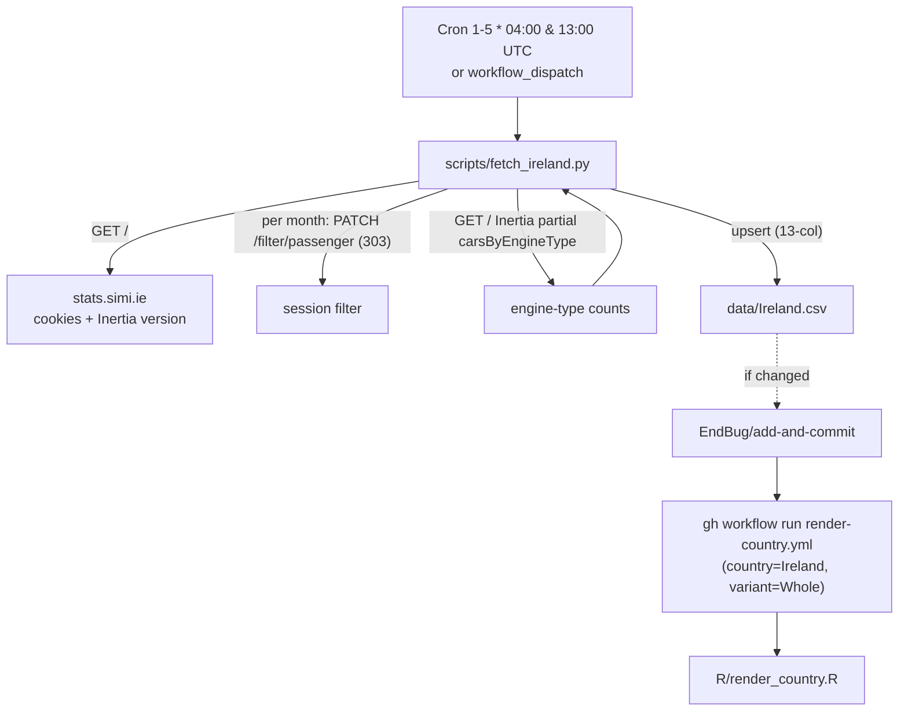

# 15 · Source: Ireland (stats.simi.ie / SIMI motorstats)

The Society of the Irish Motor Industry (SIMI) publishes new-registration data
through the **motorstats** dashboard at `stats.simi.ie`. Unlike Denmark/Finland/
Sweden (clean PxWeb/JSON APIs), SIMI has **no public REST API** — the dashboard
is a Laravel + Inertia.js single-page app whose data is driven by a server-side
**session filter**. The fetcher replays that filter flow over plain HTTP. This
is the most involved of the database-fed sources; read this before touching
`scripts/fetch_ireland.py`.

> A headless browser (Playwright) was used **once, to reverse-engineer** the
> request flow. The fetcher itself needs no browser — it runs with `requests`
> in GitHub Actions, same as the others.

## TL;DR

```
Source:    stats.simi.ie (SIMI / motorstats public dashboard)
           Stack: Laravel + Inertia.js SPA, no public REST API
Auth:      None (public dashboard). members.simi.ie is a separate gated portal — not used.
API:       Session-filter flow: GET / → PATCH /filter/passenger → GET / (Inertia partial)
Variants:  Whole only (passenger cars). LCV/HCV/Bus exist but are out of scope (see §8).
HEV:       Reported natively (Petrol/Diesel Electric (Hybrid)) — a large slice in Ireland
FLEXFUEL:  Reported natively (Ethanol/Petrol, Ethanol/Diesel)
Backfill:  Full history re-fetched from source (2010-01+); 2008-2009 remain legacy rows
Schedule:  Twice-daily cron on the 1st–5th (SIMI publishes very early in the month)
Scripts:   scripts/fetch_ireland.py
Workflow:  .github/workflows/fetch-ireland.yml
```

## 1. Migration note: Ireland was legacy-local with an old schema

Before this pipeline, `data/Ireland.csv` was maintained by the legacy local R
pipeline. The file was committed but used the **older 12-column schema without a
FLEXFUEL column**. This migration normalises it to the canonical 13 columns and
re-sources the data from SIMI directly. See §6 for the FLEXFUEL backfill gotcha
that this caused.

## 2. Why there's no clean API

`stats.simi.ie` is a Vite-built Laravel + Inertia.js app. There is no
query-param REST endpoint and no JSON-stat. We confirmed this by:

- The site root (`/`) is the **public passenger dashboard** (Inertia component
  `Public/Passenger`). Public routes (domain `stats.simi.ie`): `/` (passenger),
  `/lcv`, `/hcv`, `/bus`, `/filters/makes`, `/filters/models`, `/updating` —
  **all GET**.
- `members.simi.ie/stats/passenger` is a **separate, login-gated** portal
  (redirects to `/login`). We do **not** use it.
- The dashboard's numbers are **not** in the initial HTML and **not** drivable
  by GET query params. They load via Inertia **partial reloads** after a filter
  is stored server-side.

## 3. The session-filter flow (what the fetcher replays)

```
1. GET https://stats.simi.ie/
   → Set-Cookie: XSRF-TOKEN, <app>_session
   → HTML <div id="app" data-page="{...}"> embeds the Inertia asset "version"

2. PATCH https://stats.simi.ie/filter/passenger
   Headers: X-XSRF-TOKEN: <url-decoded XSRF-TOKEN cookie>
            Content-Type: application/json, X-Requested-With: XMLHttpRequest
   Body (JSON):
     {
       "years":[{"name":2026,"value":2026}],
       "month_from":{"name":"April","value":4},
       "month_to":  {"name":"April","value":4},
       "day_from":null,"day_to":null,
       "registration_type":{"name":"Total New Registrations","value":"new-total"},
       "sales_types":[],"makes":[],"models":[],"body_types":[],"transmissions":[],
       "engine_types":[],"engine_capacities":[],"colours":[],"segments":[],"counties":[]
     }
   → 303 (See Other) on success. Stores the filter in the session.

3. GET https://stats.simi.ie/
   Headers: X-Inertia: true
            X-Inertia-Version: <version from step 1>
            X-Inertia-Partial-Component: Public/Passenger
            X-Inertia-Partial-Data: carsByEngineType
   → JSON { props: { carsByEngineType: { years:[...], datasets:[{label, units:[{count,change}], shares:[...]}] } } }
```

### The two non-obvious quirks

1. **`month_from` / `month_to` must be OBJECTS** `{"name":"April","value":4}`,
   not bare integers. Sending an int returns **HTTP 500**. This single quirk
   was the hardest part to find — every int-based attempt 500'd.
2. **`X-Inertia-Version` must match** the asset version embedded in the page's
   `data-page`. A stale version returns **409** (Inertia version mismatch). The
   fetcher reads it fresh from the root HTML every run, so it self-heals when
   SIMI redeploys.

### Isolating a single month

Setting one `years` entry and `month_from == month_to` returns that single
calendar month. `carsByEngineType.datasets[*].units[0].count` is then that
month's count per engine type. Verified against the dashboard's
`totalRegistrationsTable` (e.g. 2026-04 engine-type sum = 10,087 = the table's
April total).

## 4. Column mapping

`carsByEngineType` dataset **label** → canonical column (Ireland reports HEV and
ethanol/flexifuel natively, like Sweden):

| SIMI engine-type label | Canonical |
|---|---|
| `Electric` | `BEV` |
| `Petrol Electric (Hybrid)` | `HEV` |
| `Diesel Electric (Hybrid)` | `HEV` |
| `Petrol/Plug-In Electric Hybrid` | `PHEV` |
| `Diesel/Plug-In Electric Hybrid` | `PHEV` |
| `Petrol` | `PETROL` |
| `Diesel` | `DIESEL` |
| `Ethanol/Petrol` | `FLEXFUEL` |
| `Ethanol/Diesel` | `FLEXFUEL` |
| `Gas`, `Petrol / Gas`, `Diesel / Gas`, `Hydrogen`, `Other` | `OTHERS` |

`TOTAL` is the sum of the mapped cells. The mapper raises `RuntimeError` on an
unknown label so a newly-introduced engine type is caught rather than dropped.
Like Denmark/Finland/Sweden, FLEXFUEL gets its own TTM stacked-shares slice and
folds into the brown ICE line of the BEV/PHEV/ICE three-curve; HEV is a large
slice in Ireland and renders distinctly.

## 5. Single variant; the commercial slices are out of scope

The dashboard also has `/lcv` (Light Commercial), `/hcv` (Heavy Commercial) and
`/bus`. For now Ireland is **passenger cars only** (`Whole`). If the commercials
are added later, the intended mapping (consistent with our other countries) is:

- **HCV → HDV.** Heavy Commercial ≈ goods vehicles > 3.5 t (EU N2/N3 — lorries,
  box vans, articulated tractor units). Matches the NL "Zware bedrijfsvoertuigen"
  and DK/FI "Lorries" HDV convention: freight, not people.
- **LCV → Vans.** Light Commercial ≈ vans/pickups (N1 ≤ 3.5 t).
- **Bus → Buses.**

Each would be its own variant CSV via the same flow against `/hcv`, `/lcv`,
`/bus` (component names `Public/Hcv`, `Public/Lcv`, `Public/Bus`).

## 6. Backfill & the FLEXFUEL completeness gotcha

The first migration only wrote FLEXFUEL on the trailing-window months it
fetched, leaving the legacy rows with an **empty** FLEXFUEL. That half-filled
column broke the TTM stacked-shares plot: `compute_ttm_long`
([R/data.R](../../R/data.R)) uses a **strict** rolling sum — a fuel column's
12-month window is only valid when *every* month in it is non-NA, and *every*
present column must have a complete window. A column that's empty for older
months but populated recently makes the strict window NA for the recent period
→ the whole plot is skipped ("nothing to plot").

**Fix:** re-fetch the **full source history** so every month carries the
complete engine-type split (`python scripts/fetch_ireland.py --since 2008-01`).
The SIMI dashboard has data from **2010-01**; months it returns as 0 are skipped
(`TOTAL == 0`), so:

- 2010-01 → present: FLEXFUEL populated (ethanol split out correctly, e.g.
  2010-12 = 18 — previously folded into OTHERS in the legacy data).
- 2008-2009: remain legacy rows with empty FLEXFUEL (SIMI has no data that far
  back). They're > 1 year before the plotted TTM window, so the TTM simply
  starts ~2011 and is unaffected.

**Lesson for future migrations:** when adding a new fuel column to a country
that already has history, populate it for the *entire* span you intend to plot,
not just the months you happen to touch — otherwise the strict TTM window
silently drops the plot.

## 7. Schedule and idempotency

`fetch-ireland.yml` runs **twice daily on the 1st–5th** (`cron: '0 4 1-5 * *'`
and `'0 13 1-5 * *'`). SIMI publishes the new month very early — usually on the
1st — so we poll early and often within that window; the early-exit makes runs
no-ops once the previous month is in the CSV.

Each active run re-fetches a **trailing window** of recent months
(`--months`, default 4) and upserts, so SIMI's routine revisions of recent
months are absorbed (the maintainer accepted backward corrections). The
`previous_month` early-exit stops the daily polling once the new month lands;
revisions to a month after it's locked are picked up in the next month's polling
window. `--since YYYY-MM` overrides the window for a one-off backfill;
`--force` skips the early-exit.

04:00 / 13:00 UTC are free slots (clear of the 03:17–11:00 fetch crowd).

## 8. Workflow data flow



Single variant ⇒ no parallel-render push race.

## 9. Known fragility

| Failure mode | What happens | Diagnostic / fix |
|---|---|---|
| SIMI redeploys (new asset version) | `X-Inertia-Version` mismatch → 409 | Self-heals: the fetcher reads the version fresh from `/` each run |
| `month_from`/`month_to` sent as int | PATCH 500 | Must be `{"name":<MonthName>,"value":<n>}` — already handled |
| SIMI adds a new engine type | mapper raises `RuntimeError("unmapped engine-type label …")` before commit | Add the label to `LABEL_TO_COL` |
| Inertia prop renamed (`carsByEngineType`) | partial returns null | Re-capture prop names from the live page (a Playwright network trace was how they were found) |
| `/filter/passenger` route/shape changes | PATCH 404/422/500 | Re-inspect the dashboard's filter PATCH (capture the real request in a browser) |
| SIMI restates recent months | upsert prints WARNING on >50% moves, still commits | Verify; revert manually if wrong |
| New FLEXFUEL/other column left half-filled | TTM plot skipped ("nothing to plot") | Backfill the column across the full plotted span (see §6) |

## 10. Maintenance recipes

### Force a full re-backfill

```sh
python scripts/fetch_ireland.py --since 2008-01    # skips the 2008-09 empty months
```

### Force-refetch just the recent window

```sh
python scripts/fetch_ireland.py --force --months 6
```

### Re-capture the request flow if SIMI changes the SPA

The flow was reverse-engineered with a headless Playwright trace:
1. Load `https://stats.simi.ie/`, log all non-asset XHR/fetch responses → reveals
   the Inertia partial prop names (`carsByEngineType`, `totalRegistrationsTable`, …).
2. Open the FILTERS panel, click "Apply Filters", capture the PATCH to
   `/filter/passenger` (method, body shape, 303 status).
3. Replicate with `requests` (cookies + `X-XSRF-TOKEN` + Inertia headers).

## 11. What is **not** in this pipeline

- members.simi.ie. The gated member portal is unused; everything comes from the
  public dashboard.
- LCV / HCV / Bus variants (passenger cars only for now — see §5).
- Pre-2010 history from SIMI (the dashboard has none; 2008-2009 are legacy rows).
- A browser at runtime (Playwright was reverse-engineering only).
