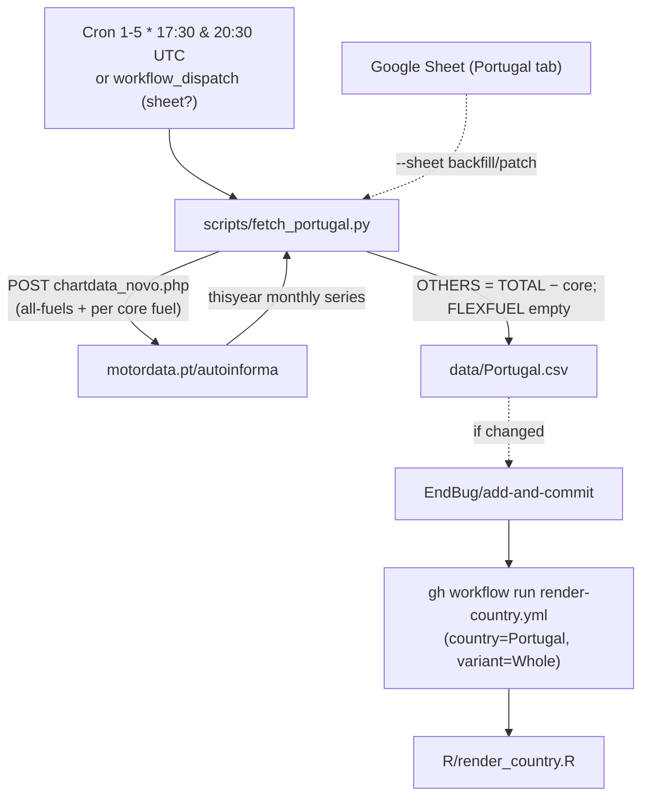

# 16 · Source: Portugal (ACAP / motordata.pt)

ACAP (Associação Automóvel de Portugal) publishes new-registration data on its
public "Dados" page (`acap.pt/pt/estatisticas/dados`), which embeds a chart
served by **motordata.pt / autoinforma**. There is no documented REST API, but
the chart's backend is a simple POST endpoint we can call directly. ACAP
publishes on the **1st of each month from ~17:00 Lisbon time** — the earliest
reliable source for the previous month.

## TL;DR

```
Source:    ACAP via motordata.pt/autoinforma (the acap.pt "Dados" page embeds it)
Auth:      None
API:       POST motordata.pt/autoinforma/chartdata_novo.php
           body: list_catveiculo=0 (passenger cars), list_combustivel=<code>
           → JSON { thisyear:[Jan..latest], lastyear:[...], result_table:[...] }
Variants:  Whole only (Ligeiros de Passageiros). LCV/HCV/Bus exist (out of scope, §5).
HEV:       Reported natively (HEV/Gasolina + HEV/Gasóleo)
FLEXFUEL:  Not reported by Portugal → column stays uniformly empty
OTHERS:    Residual = all-fuels TOTAL − (BEV+PHEV+HEV+PETROL+DIESEL)
Backfill:  Existing CSV (2010-01+) retained; --sheet patches from the Google Sheet
Schedule:  Twice-daily cron on the 1st–5th, 17:30 & 20:30 UTC
Scripts:   scripts/fetch_portugal.py
Workflow:  .github/workflows/fetch-portugal.yml
```

## 1. Migration note

`data/Portugal.csv` was previously maintained by the legacy local R pipeline in
the **old 12-column schema (no FLEXFUEL)**. This migration normalises it to the
canonical 13 columns and re-sources the current year from ACAP. Because Portugal
never reports ethanol/flexfuel, FLEXFUEL stays **uniformly empty** — so, unlike
Ireland, there is no half-filled-column TTM hazard (an all-empty column is
skipped by `compute_ttm_long`).

## 2. The endpoint

The acap.pt "Dados" page embeds `https://motordata.pt/autoinforma/charts1t.php`
(an AUTOINFORMA chart). Its data comes from:

```
POST https://motordata.pt/autoinforma/chartdata_novo.php
  (Referer: https://motordata.pt/autoinforma/charts1t.php)
  body (form-encoded):
    list_catveiculo  = 0        # 0 = LIGEIROS DE PASSAGEIROS (passenger cars)
    list_combustivel = <code>   # single fuel code, OR empty = all fuels
  → JSON {
      "thisyear":  ["<Jan>","<Feb>",...],   # current calendar year, published months only
      "lastyear":  [...],                    # same months, previous year (for comparison)
      "result_table": [{ "Marca":..., "Mensal":..., "Acumulado":... }, ...]
    }
```

**No year parameter.** `ano` / `year` / `list_ano` are all ignored — the endpoint
always returns the *current calendar year*. So the fetcher maintains the current
year's months; older history comes from the committed CSV or the Google Sheet
(`--sheet`).

`thisyear` contains only **published** months (e.g. in late May it is `[Jan, Feb,
Mar, Apr]`). Index `i` → month `i+1` of `date.today().year`.

## 3. Fuel mapping and the OTHERS residual

| Fuel code | Label | Canonical |
|---|---|---|
| `7` | Elétrico (BEV) | `BEV` |
| `14` | PHEV/Gasolina | `PHEV` |
| `15` | PHEV/Gasóleo | `PHEV` |
| `17` | HEV/Gasolina | `HEV` |
| `18` | HEV/Gasóleo | `HEV` |
| `1` | Gasolina | `PETROL` |
| `2` | Gasóleo | `DIESEL` |
| (all-fuels query) | — | `TOTAL` |
| — | — | `OTHERS = TOTAL − (BEV+PHEV+HEV+PETROL+DIESEL)` |
| — | — | `FLEXFUEL` always empty |

**Why OTHERS is a residual, not a sum of "other" codes:** the fuel dropdown is
**incomplete** — codes exist that it doesn't list (e.g. 20, 23 returned data in
probing). Summing the visible GNC/GPL/GNL codes therefore undercounts. The
all-fuels query (`list_combustivel=` empty) gives the authoritative TOTAL, and
OTHERS as the residual captures every gas/hydrogen/unlisted fuel exactly.
Verified against the maintainer's Google Sheet: 2026-04 OTHERS = 21595 − (5010
+ 3234 + 5731 + 5251 + 751) = 1618 = the sheet's value; HEV 17+18 = 5510 + 221
= 5731 = the sheet's HEV.

So each run issues 8 POSTs for the passenger category: one all-fuels (TOTAL) plus
BEV, PHEV×2, HEV×2, PETROL, DIESEL.

## 4. Cross-check against the Google Sheet

The maintainer keeps a Google Sheet (Portugal tab, gid `1007806052` in sheet
`1tT_Ja3de_S528_…`) with the full history in our exact schema (BEV/PHEV/HEV/
PETROL/DIESEL/OTHERS/TOTAL from 2010-01). It is kept current and matched
motordata's live values to within a few units (motordata is fractionally newer
on recent months — routine ACAP revision; motordata is the live truth). The
sheet is used for backfill / patching, not as the live source.

## 5. Vehicle categories (only passenger cars used)

`list_catveiculo` values: `0` Ligeiros de Passageiros (passenger cars) — used;
`1` Ligeiros de Mercadorias (light goods → **Vans**); `2` Pesados de Passageiros
(**Buses**); `3` Pesados de Mercadorias (heavy goods > 3.5 t → **HDV**, matches
our N2/N3 convention); plus mopeds/motorcycles. If the commercial variants are
added later, the mapping is HCV(3)→HDV, LCV(1)→Vans, Bus(2)→Buses, each via the
same flow with a different `list_catveiculo`.

## 6. The December year-boundary caveat

Because the endpoint only returns the *current* calendar year, **December data
(published Jan 1) can fall into a gap**: on Jan 1 the endpoint's "thisyear" rolls
to the new (still-empty) year, so December of the year just ended may not be
fetchable via motordata. Mitigations:

- The committed CSV already holds prior history.
- `python scripts/fetch_portugal.py --sheet` patches any month from the
  maintainer's Google Sheet (kept current, includes December).
- The workflow exposes a `sheet=true` dispatch input for the same.

If motordata turns out to keep showing the prior year until the new year has
data, December is captured normally and the `--sheet` fallback is just insurance.

## 7. Schedule and idempotency

`fetch-portugal.yml` runs **twice daily on the 1st–5th at 17:30 & 20:30 UTC**
(`'30 17 1-5 * *'`, `'30 20 1-5 * *'`). ACAP publishes from ~17:00 Lisbon
(WET = UTC, WEST = UTC+1), so both slots sit after publication in either season.
The `previous_month` early-exit makes runs no-ops once the new month is in the
CSV. Each active run re-fetches the whole current year and upserts, so ACAP's
routine revisions of recent months are absorbed (backward corrections are
acceptable). `--force` skips the early-exit; `--sheet` switches to the Google
Sheet source.

## 8. Workflow data flow



Single variant ⇒ no parallel-render push race.

## 9. Known fragility

| Failure mode | What happens | Diagnostic / fix |
|---|---|---|
| motordata changes the endpoint/param names | POST fails or returns unexpected JSON | Re-inspect `charts1t.php` (the `$.ajax` to `chartdata_novo.php` and its `postdata`) |
| A core fuel code is renumbered | core counts drop, OTHERS absorbs the difference silently | Cross-check BEV/PHEV/HEV against the Google Sheet; re-read the dropdown codes |
| December year-boundary | December not in motordata's "thisyear" | `--sheet` patch (see §6) |
| ACAP revises a month >50% | upsert prints WARNING, still commits | Verify; revert manually if wrong |
| Google Sheet un-shared | `--sheet` mode fails | Re-share "anyone with the link"; or rely on the live endpoint |

## 10. Maintenance recipes

```sh
# Normal recent-window refresh (current year)
python scripts/fetch_portugal.py --force

# Patch/backfill from the Google Sheet (e.g. to fill a December gap)
python scripts/fetch_portugal.py --sheet --force

# Validate the endpoint by hand (BEV, current year)
curl -s -X POST 'https://motordata.pt/autoinforma/chartdata_novo.php' \
  -e 'https://motordata.pt/autoinforma/charts1t.php' \
  --data 'list_catveiculo=0&list_combustivel=7' | python3 -m json.tool
```

## 11. What is **not** in this pipeline

- LCV / HCV / Bus variants (passenger cars only for now — §5).
- A year parameter / arbitrary historical fetch from motordata (current year only).
- The PDF on the ACAP page (it publishes a few hours later than the chart data —
  the live chart is the earlier source).
- FLEXFUEL (Portugal doesn't report ethanol/flexfuel).
