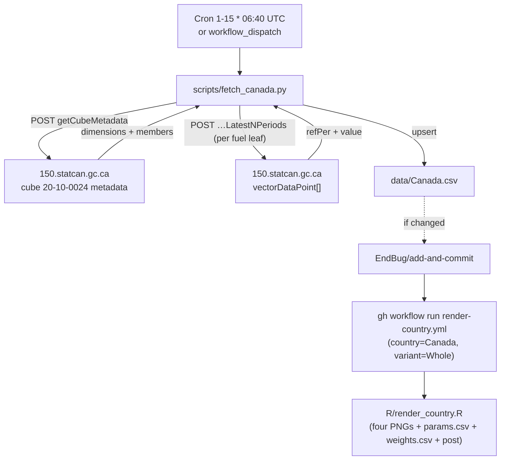

# 17 · Source: Canada (150.statcan.gc.ca / WDS cube 20-10-0024)

Statistics Canada (StatCan) publishes new motor-vehicle registrations by fuel
type in cube **20-10-0024 "New motor vehicle registrations"** (productId
`20100024`) and exposes it through the **Web Data Service (WDS)** REST API.
This is a database-fed country like Sweden/Finland: no PDF, no scraping — a
metadata call plus a data call, both unauthenticated JSON.

## TL;DR

```
Source:    150.statcan.gc.ca (StatCan WDS, cube 20-10-0024)
Auth:      None required
API:       POST getCubeMetadata + POST getDataFromCubePidCoordAndLatestNPeriods
Variants:  Whole only (Geography=Canada, Vehicle type=Passenger cars)
Cadence:   Quarterly -> stored under the quarter's MIDDLE month (Q1→02, Q2→05,
           Q3→08, Q4→11); time_interval=quarterly
HEV:       Reported natively (Hybrid electric, non-plug-in)
DIESEL:    ~0 for passenger cars in Canada (diesel car near-extinct) — the
           column is emitted but typically 0
Backfill:  None — WDS serves the full history; we pull the latest N quarters
Schedule:  Daily cron 1st-15th, 06:40 UTC; commit-gated (no early-exit)
Scripts:   scripts/fetch_canada.py
Workflow:  .github/workflows/fetch-canada.yml
```

## 1. Migration note: Canada was previously legacy-local

Before this pipeline, `data/Canada.csv` was maintained by hand from the StatCan
table viewer (the file's `source` column even records the viewer URLs for
`pid=2010002401` and `pid=2010002501`). This pipeline migrates Canada to the
automated WDS fetcher. Historical values are unchanged except for routine
StatCan revisions of the most recent quarters (StatCan restates recent periods
each release). The file is rewritten with LF line endings like every automated
fetcher.

## 2. The API

WDS is a plain REST/JSON service. We make two POSTs (no auth, no key):

```
POST https://www150.statcan.gc.ca/t1/wds/rest/getCubeMetadata
     [{"productId": 20100024}]
     → dimensions[], each with member[] (memberId, memberNameEn, parentMemberId)

POST https://www150.statcan.gc.ca/t1/wds/rest/getDataFromCubePidCoordAndLatestNPeriods
     [{"productId":20100024,"coordinate":"<10 dot-separated member IDs>","latestN":16}, …]
     → object.vectorDataPoint[] : {refPer, value, …}
```

Why metadata-first: a *coordinate* is ten member IDs in dimension-position
order (unused trailing positions = `0`). Rather than hard-code numeric IDs that
StatCan can renumber, `fetch_canada.py` reads the live metadata and resolves
members **by name**: Geography=`Canada`, Vehicle type=`Passenger cars`, the
"total"/"Units" member of every other dimension, and the **leaf** members of
the Fuel type dimension. It then fires one data request per fuel leaf in a
single batched POST.

## 3. Single variant

| Variant | File | Geography | Vehicle type | Notes |
|---|---|---|---|---|
| `Whole` | `data/Canada.csv` | `Canada` | `Passenger cars` | The only variant |

Canadian "passenger cars" (cars proper) have collapsed to a ~45-65k/quarter
minority as buyers moved to light trucks/SUVs — which is why the totals look
small and DIESEL is ~0. The cube also exposes "Trucks" and "Total, new motor
vehicles"; if a broader slice is ever wanted, pass `--vehicle-type` (and add a
variant) rather than changing the default, to keep continuity with history.

### No Vans / HDV / Buses variants (definition mismatch)

The other multi-variant countries (Denmark, Finland, Ireland, Portugal,
Netherlands) split commercial vehicles by **EU vehicle category**: `Vans` = N1
(≤ 3.5 t), `HDV` = N2/N3 (> 3.5 t), `Buses` = M2/M3. StatCan's registration
cube uses the **North American** split — Vehicle type is only `Passenger cars`
vs `Trucks` (plus the `Total`). That "Trucks" bucket is a catch-all dominated
by SUVs/pickups/minivans (which are M1 passenger vehicles in EU terms) lumped
together with real LCVs, heavy trucks and buses; it cannot be separated into
N1 / N2-N3 / M2-M3. So Canada **cannot** contribute `Vans`/`HDV`/`Buses`
variants consistent with the other countries, and a raw `Trucks` variant would
be definitionally misleading. Canada therefore stays **Whole-only**, like
Sweden. (Confirm the live Vehicle type members with
`python scripts/fetch_canada.py --list-members`.) The historical Google Sheet
likewise carries only the whole passenger-car series, so there is no
alternative variant source to fall back on for Canada.

## 4. Column mapping

Only **leaf** fuel members are summed; aggregate members ("All fuel types",
"Zero-emission vehicles", …) are parents and are skipped, so nothing is
double-counted. `TOTAL` is the sum of the mapped leaves.

| Leaf fuel member (substring) | Canonical column |
|---|---|
| `…battery electric…` | `BEV` |
| `…plug-in hybrid…` | `PHEV` |
| `…hybrid…` (non-plug-in) | `HEV` |
| `…gasoline…` / `…petrol…` | `PETROL` |
| `…diesel…` | `DIESEL` |
| `…other…` / `…fuel cell…` / `…hydrogen…` | `OTHERS` |

Order matters in `FUEL_RULES`: `plug-in hybrid` is tested before plain
`hybrid`, and the electric variants before generic words. An **unmapped leaf
raises** (like Sweden's `DRIV_TO_COL` guard) and prints the offending member
name, so a new StatCan fuel category aborts the run before commit instead of
silently dropping out.

## 5. Cadence and the quarter→middle-month convention

The cube is quarterly. The repo stores each quarter under its **middle month**,
matching the legacy file (`2011-02, 2011-05, 2011-08, 2011-11, …`). The middle
month is derived from the StatCan reference period with
`((month - 1) // 3) * 3 + 2`, which yields `02/05/08/11` regardless of whether
StatCan stamps a quarter with its first or last month. `time_interval` is
`quarterly`.

## 6. Schedule and idempotency

`fetch-canada.yml` runs **daily on the 1st-15th at 06:40 UTC**
(`cron: '40 6 1-15 * *'`), in the gap between fetch-netherlands (06:30) and the
08:00 crowd.

- StatCan releases the cube quarterly with a lag; daily polling in the window
  catches a release whenever it lands.
- There is no local early-exit: the script always re-fetches the latest N
  quarters (StatCan revises recent ones), but `EndBug/add-and-commit` only
  commits on a real change, so most runs are a no-op.
- On a revision >50% the upsert prints a `WARNING` but still commits.

## 7. Workflow data flow



Single variant means **no parallel-render push race** — only one
`render-country.yml` job is dispatched per run.

## 8. Known fragility

| Failure mode | What happens | Diagnostic |
|---|---|---|
| StatCan renumbers member IDs | None — the fetcher resolves members by name from live metadata each run | n/a (by design) |
| StatCan renames a dimension (e.g. "Fuel type") | `build_coordinates` can't classify it; Geography/Vehicle/Fuel lookups fail | Run with the WDS metadata (recipe below); adjust the name checks in `build_coordinates` |
| New fuel leaf (e.g. a hydrogen split) | Script raises `RuntimeError("unmapped fuel leaf …")` before commit | Add a rule to `FUEL_RULES` (most go to `OTHERS`) |
| "Passenger cars" member renamed | `_member_by_name` raises and prints the available members | Update `DEFAULT_VEHICLE_TYPE` or pass `--vehicle-type` |
| StatCan revises a quarter >50% | Upsert prints `WARNING` but still commits | Verify and revert with a CSV edit if not real |
| WDS endpoint/path changes | POST 4xx/5xx | Check the current WDS user guide; update `WDS_BASE`/path |

## 9. Maintenance recipes

### Dry-run (inspect what would be written)

```sh
python scripts/fetch_canada.py --dry-run
```

The run prints the resolved dimensions and the fuel-leaf → column mapping
before the per-quarter values, which is the fastest way to confirm StatCan
hasn't changed member names.

### List everything the cube exposes (e.g. to re-check Vehicle type granularity)

```sh
python scripts/fetch_canada.py --list-members
```

Prints every dimension and all its members (Vehicle type, Fuel type, …) and
exits without fetching data — the definitive answer to "does StatCan offer more
than Passenger cars?".

### Pull more history

```sh
python scripts/fetch_canada.py --latest-n 60   # ~15 years of quarters
```

### Validate the metadata by hand

```sh
curl -s -X POST 'https://www150.statcan.gc.ca/t1/wds/rest/getCubeMetadata' \
  -H 'Content-Type: application/json' \
  -d '[{"productId":20100024}]' | python3 -m json.tool | head -120
```

Look for the `Fuel type`, `Vehicle type`, and `Geography` dimensions and their
`memberNameEn` values; these are what `fetch_canada.py` matches against.

## 10. What is **not** in this pipeline

- Authentication. WDS is open; no key.
- Provincial/territorial breakdowns. `Geography` exposes provinces; we pin
  `Canada`.
- Trucks / total new vehicles. We pin Vehicle type = `Passenger cars` to match
  history (overridable via `--vehicle-type`). See §3 for why the `Trucks`
  bucket can't yield consistent Vans/HDV/Buses variants.
- Monthly data. Cube 20-10-0024 is quarterly.
- The separate ZEV cube **20-10-0025** (`pid=2010002501`, referenced in the
  legacy `source` column). 20-10-0024 already carries the BEV/PHEV/HEV split we
  need; 20-10-0025 remains available as a future cross-check.
