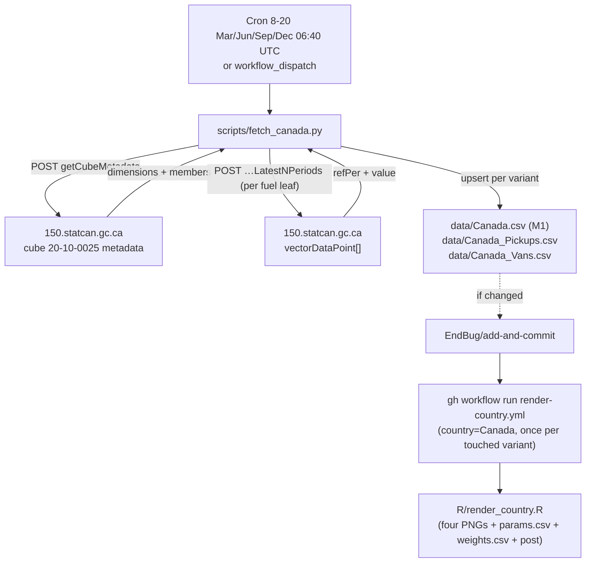

# 17 · Source: Canada (150.statcan.gc.ca / WDS cube 20-10-0025)

Statistics Canada (StatCan) publishes new motor-vehicle registrations by fuel
type in cube **20-10-0025 "New motor vehicle registrations"** (productId
`20100025`) and exposes it through the **Web Data Service (WDS)** REST API.
This is a database-fed country like Sweden/Finland: no PDF, no scraping — a
metadata call plus a data call, both unauthenticated JSON.

## TL;DR

```
Source:    150.statcan.gc.ca (StatCan WDS, cube 20-10-0025)
Auth:      None required
API:       POST getCubeMetadata + POST getDataFromCubePidCoordAndLatestNPeriods
Variants:  Whole = Passenger cars + Multi-purpose vehicles (EU M1) ;
           Pickups (Pickup trucks) ; Vans (minivans + cargo vans)
Coverage:  M1 (quarterly) from 2017-Q1; 2011-2016 kept as yearly rows
           (passenger-cars-only, period YYYY-06 — definition seam, see §1/§3)
Cadence:   Quarterly -> stored under the quarter's MIDDLE month (Q1→02, Q2→05,
           Q3→08, Q4→11); time_interval=quarterly
HEV:       Reported natively (Hybrid electric, non-plug-in)
DIESEL:    ~0 for passenger cars in Canada (diesel car near-extinct) — the
           column is emitted but typically 0
Backfill:  None — WDS serves the full history; we pull the latest N quarters
Schedule:  Daily days 8-20 in Mar/Jun/Sep/Dec, 06:40 UTC; commit-gated
Scripts:   scripts/fetch_canada.py
Workflow:  .github/workflows/fetch-canada.yml
```

## 1. Migration note: Canada was previously legacy-local

Before this pipeline, `data/Canada.csv` was maintained by hand from the StatCan
table viewer (the file's `source` column records the viewer URLs for
`pid=2010002401` **and** `pid=2010002501`). This pipeline migrates Canada to the
automated WDS fetcher and standardises on the **20-10-0025** cube — the
"by geographic level" table the legacy sheet's BEV/PHEV/HEV split was actually
based on (it is current through the latest quarter and carries the
zero-emission detail). The older **20-10-0024** cube was tried first but lags
(it ended at 2024-Q4) and reported a different hybrid breakdown, so it is not
used. The file is rewritten with LF line endings like every automated fetcher.

This migration also **changes the `Whole` definition** from passenger-cars-only
to EU **M1** (Passenger cars + Multi-purpose vehicles) from 2017 onward — see §3.
The pre-2017 history is kept as **yearly** rows (`time_interval=yearly`, period
`YYYY-06`, the annual figure at mid-year): those years are **passenger-cars-only**
(the M1/SUV split doesn't exist that far back) and carry a `notes` flag saying
so. This is a deliberate scope seam, but it is invisible in the fitted *share*
series — BEV share is ~0.5% on both sides of 2016→2017 (e.g. 2016 = 0.51%,
2017-Q1 = 0.54%), so only the absolute totals/weights differ. `fit.R` natively
mixes yearly + quarterly rows (it labels pre-`lastyearly` points "Yearly").

## 2. The API

WDS is a plain REST/JSON service. We make two POSTs (no auth, no key):

```
POST https://www150.statcan.gc.ca/t1/wds/rest/getCubeMetadata
     [{"productId": 20100025}]
     → dimensions[], each with member[] (memberId, memberNameEn, parentMemberId)

POST https://www150.statcan.gc.ca/t1/wds/rest/getDataFromCubePidCoordAndLatestNPeriods
     [{"productId":20100025,"coordinate":"<10 dot-separated member IDs>","latestN":16}, …]
     → object.vectorDataPoint[] : {refPer, value, …}
```

Why metadata-first: a *coordinate* is ten member IDs in dimension-position
order (unused trailing positions = `0`). Rather than hard-code numeric IDs that
StatCan can renumber, `fetch_canada.py` reads the live metadata and resolves
members **by name**: Geography=`Canada`, Vehicle type=`Passenger cars`, the
"total"/"Units" member of every other dimension, and the **leaf** members of
the Fuel type dimension. It then fires one data request per fuel leaf in a
single batched POST.

## 3. Variants and the M1 definition change

The cube is a **light-vehicle** cube. Its Vehicle type members and their StatCan
footnote definitions (confirmed live via `--list-members` and the table
footnotes) are:

| StatCan member | Footnote definition | EU class |
|---|---|---|
| `Passenger cars` | cars proper (no footnote) | M1 |
| `Multi-purpose vehicles` | "sport utility vehicles (SUVs) and Crossovers" | M1 |
| `Pickup trucks` | "GVWR 0–14,000 lb (classes 1, 2 and 3)" → up to ~6.35 t | N1 + part of N2 |
| `Vans` | "all minivans and cargo vans" | M1 (minivans) + N1 (cargo) |

No heavy trucks, no buses. We expose three variants:

| Variant | File | Vehicle type member(s) summed | Meaning |
|---|---|---|---|
| `Whole` | `data/Canada.csv` | `Passenger cars` + `Multi-purpose vehicles` | **EU M1** — comparable to every other country |
| `Pickups` | `data/Canada_Pickups.csv` | `Pickup trucks` | Canada-specific |
| `Vans` | `data/Canada_Vans.csv` | `Vans` | Canada-specific (minivans + cargo vans) |

### Whole = M1 (Passenger cars + Multi-purpose vehicles) — definition change

The gallery's canonical `Whole` is **EU class M1** ("passenger cars" as every
other country counts them, which **includes SUVs/crossovers** — a Tesla Model Y
is an M1 passenger car in Germany/Norway/Japan/Ireland). StatCan uniquely splits
SUVs/crossovers out as their own body type (`Multi-purpose vehicles`), so the
cube's `Passenger cars` member is the *narrow* North-American "cars proper"
(sedans/wagons) — which excludes exactly the segment where Canada's BEVs sit.

So `Whole` sums **Passenger cars + Multi-purpose vehicles** to reconstruct M1.
This is the same move Uruguay makes (`AUTOS + SUV`) and matches ACEA/Japan/
Ireland M1.

> ⚠️ **Definition change — SUVs counted from 2017 only.** Historically (legacy
> sheet / pre-automation) Canada's `Whole` was **passenger cars only**. This
> pipeline redefines it as **M1 = Passenger cars + Multi-purpose vehicles** from
> 2017-Q1 (where the MPV fuel split begins).
>
> **So the two eras count different vehicles:**
> - **2011–2016** (yearly rows, period `YYYY-06`): **passenger cars ONLY —
>   SUVs/crossovers are NOT included** (StatCan has no MPV fuel split that far
>   back). Each row's `notes` says so.
> - **2017 onward** (quarterly): **M1 — passenger cars PLUS SUVs/crossovers.**
>
> The resulting 2016→2017 scope seam is invisible in the fitted *share* series
> (BEV share ~0.5% on both sides: 2016 = 0.51%, 2017-Q1 = 0.54%), so only the
> absolute volumes/weights jump. `fit.R` handles the mixed yearly+quarterly
> cadence natively. The world map / cross-country rankings use the M1 series.
>
> This caveat is also surfaced **on the chart itself**: `footnotes.csv`
> (`country,variant,footnote`) carries a curated `Canada,Whole` note that
> `render_country.R` appends as a second caption line on the Whole PNGs. It is
> deliberately separate from the per-row `notes` CSV column, which is internal
> and not display-safe.

### Pickups and Vans — Canada-specific, not EU Vans/HDV

`Pickups` and `Vans` are exposed because the data is there and useful, but they
**do not** map onto the gallery's EU-anchored `Vans` (N1, ≤ 3.5 t) / `HDV`
(N2/N3): StatCan pickups run up to 14,000 lb (~6.35 t, into N2), and StatCan
`Vans` mixes minivans (M1) with cargo vans (N1). They are therefore documented
as **Canada-specific orphan variants** — they render their own trajectories but
do not join any cross-country `Vans`/`HDV` ranking and are not in the Builder
aggregation (the renderer is variant-name-agnostic; bespoke names like India's
`2-/3-/4-Wheelers` already exist). Re-confirm the live members and footnotes
anytime with `python scripts/fetch_canada.py --list-members`.

> **Why 20-10-0025 and not 20-10-0024 (the PHEV/HEV lesson).** The first live
> run hit the **20-10-0024** cube and came back with PHEV and HEV *swapped*
> relative to the legacy sheet on every quarter (PETROL/DIESEL/BEV/OTHERS
> matched). The mapping was correct by member name, so the two cubes simply
> report a different hybrid split — and 20-10-0024 was also stale (ended
> 2024-Q4). Checking the StatCan viewer confirmed the **20-10-0025** cube matches
> the legacy sheet *exactly, column for column* (e.g. Q4 2024 Passenger cars:
> Gasoline 37,291 · BEV 7,635 · Plug-in hybrid 1,767 · Hybrid electric 9,694 ·
> Total 56,391). So 20-10-0025 is authoritative and is what this fetcher uses;
> the sheet's PHEV/HEV labelling was right all along.

## 4. Column mapping

Only **leaf** fuel members are summed; aggregate members ("All fuel types",
"Zero-emission vehicles", …) are parents and are skipped, so nothing is
double-counted. `TOTAL` is the sum of the mapped leaves.

| Leaf fuel member (substring) | Canonical column |
|---|---|
| `…battery electric…` | `BEV` |
| `…plug-in hybrid…` | `PHEV` |
| `…hybrid…` (non-plug-in) | `HEV` |
| `…gasoline…` / `…petrol…` | `PETROL` |
| `…diesel…` | `DIESEL` |
| `…other…` / `…fuel cell…` / `…hydrogen…` | `OTHERS` |

Order matters in `FUEL_RULES`: `plug-in hybrid` is tested before plain
`hybrid`, and the electric variants before generic words. An **unmapped leaf
raises** (like Sweden's `DRIV_TO_COL` guard) and prints the offending member
name, so a new StatCan fuel category aborts the run before commit instead of
silently dropping out.

## 5. Cadence and the quarter→middle-month convention

The cube is quarterly. The repo stores each quarter under its **middle month**,
matching the legacy file (`2011-02, 2011-05, 2011-08, 2011-11, …`). The middle
month is derived from the StatCan reference period with
`((month - 1) // 3) * 3 + 2`, which yields `02/05/08/11` regardless of whether
StatCan stamps a quarter with its first or last month. `time_interval` is
`quarterly`.

## 6. Schedule and idempotency

`fetch-canada.yml` runs **daily on days 8-20 in March/June/September/December
at 06:40 UTC** (`cron: '40 6 8-20 3,6,9,12 *'`), in the gap between
fetch-netherlands (06:30) and the 08:00 crowd.

- StatCan releases this quarterly cube ~2.5 months after quarter-end, i.e.
  roughly mid-March/June/September/December (Q4 2025 landed 2026-03-12). The
  schedule polls daily through that window each quarter; the change-gated
  commit makes every poll a no-op until the new quarter lands.
- There is no local early-exit: the script always re-fetches the latest N
  quarters (StatCan revises recent ones), but `EndBug/add-and-commit` only
  commits on a real change, so most runs are a no-op.
- On a revision >50% the upsert prints a `WARNING` but still commits.

## 7. Workflow data flow



Like Denmark/Finland, a single commit can touch both variants; the workflow
detects which CSVs changed and dispatches `render-country.yml` **once per
touched variant**. Because the dispatches are sequential `gh workflow run`
calls and each render job pushes its own outputs, watch for the same
parallel-render push race those countries hit if both variants change in the
same run (the renders are independent jobs that both `git push`).

## 8. Known fragility

| Failure mode | What happens | Diagnostic |
|---|---|---|
| StatCan renumbers member IDs | None — the fetcher resolves members by name from live metadata each run | n/a (by design) |
| StatCan renames a dimension (e.g. "Fuel type") | `build_coordinates` can't classify it; Geography/Vehicle/Fuel lookups fail | Run with the WDS metadata (recipe below); adjust the name checks in `build_coordinates` |
| New fuel leaf (e.g. a hydrogen split) | Script raises `RuntimeError("unmapped fuel leaf …")` before commit | Add a rule to `FUEL_RULES` (most go to `OTHERS`) |
| A Vehicle type member renamed ("Passenger cars"/"Trucks") | `_member_by_name` raises and prints the available members | Update the `VARIANTS` map in `fetch_canada.py` |
| StatCan revises a quarter >50% | Upsert prints `WARNING` but still commits | Verify and revert with a CSV edit if not real |
| WDS endpoint/path changes | POST 4xx/5xx | Check the current WDS user guide; update `WDS_BASE`/path |

## 9. Maintenance recipes

### Dry-run (inspect what would be written)

```sh
python scripts/fetch_canada.py --dry-run
```

The run prints the resolved dimensions and the fuel-leaf → column mapping
before the per-quarter values, which is the fastest way to confirm StatCan
hasn't changed member names.

### List everything the cube exposes (e.g. to re-check Vehicle type granularity)

```sh
python scripts/fetch_canada.py --list-members
```

Prints every dimension and all its members (Vehicle type, Fuel type, …) and
exits without fetching data — the definitive answer to "does StatCan offer more
than Passenger cars?".

### Pull more history / seed the variants

```sh
python scripts/fetch_canada.py --latest-n 80                 # all variants, full history
python scripts/fetch_canada.py --variant Vans --latest-n 80  # just one variant
```

The default `--latest-n 16` only touches recent quarters; the M1 fuel split
starts ~2017-Q1, so the full series is ~32 quarters. To seed all three variants
(`Whole`/`Pickups`/`Vans`) on first run, dispatch the workflow with a large
`latest_n`.

### Validate the metadata by hand

```sh
curl -s -X POST 'https://www150.statcan.gc.ca/t1/wds/rest/getCubeMetadata' \
  -H 'Content-Type: application/json' \
  -d '[{"productId":20100025}]' | python3 -m json.tool | head -120
```

Look for the `Fuel type`, `Vehicle type`, and `Geography` dimensions and their
`memberNameEn` values; these are what `fetch_canada.py` matches against.

## 10. What is **not** in this pipeline

- Authentication. WDS is open; no key.
- Provincial/territorial breakdowns. `Geography` exposes provinces; we pin
  `Canada`.
- `Total, vehicle type`. `Whole` (M1) + `Pickups` + `Vans` already partition the
  cube's light vehicles, so we don't store a redundant Total variant.
- Heavy trucks and buses. They are **not in this cube** at all (it is
  light-vehicle only) — so there is no EU `HDV`/`Buses` data to extract for
  Canada, and `Pickups`/`Vans` are Canada-specific (not EU N1/N2/N3 — see §3).
- Monthly data. Cube 20-10-0025 is quarterly.
- The older **20-10-0024** cube (`pid=2010002401`). It lags (ended 2024-Q4) and
  reports a different hybrid split that did not match the legacy sheet, so we
  standardise on 20-10-0025 (`pid=2010002501`), which matches the sheet exactly.
  See the note in §3.
