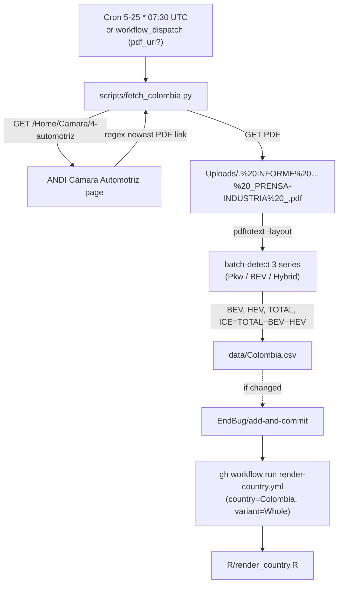

# 18 · Source: Colombia (ANDI/FENALCO Boletín — datos RUNT)

The joint **FENALCO + ANDI** monthly *Informe del Sector Automotor* PDF
(linked from ANDI's Cámara Automotriz page) is Colombia's accessible window
on the same data that powers ANDEMOS's gated dashboards: the underlying
figures come from **RUNT** (Registro Único Nacional de Tránsito — Colombia's
official vehicle registry). ANDI/FENALCO simply re-publishes the registry's
monthly aggregate as a free, public PDF.

This unblocks Colombia from the earlier "shelved" status (see
[14-data-source-gaps.md](14-data-source-gaps.md)): no login required, no
embedded dashboards to scrape, just a monthly PDF.

## TL;DR

```
Source:    ANDI Cámara Automotriz — joint with FENALCO, "Informe del Sector
           Automotor" PDF. Underlying data: RUNT (official Colombian registry).
Auth:      None — public PDF download.
API:       Discovery via the Cámara Automotriz HTML; PDF parsed with
           `pdftotext -layout` (poppler).
Variants:  Whole only (passenger cars). HDV ("vehículos de carga") is
           published as a single monthly total without fuel split — not
           ingestible into our schema; explicitly out of scope.
HEV split: NONE. "Híbridos" is a single combined bucket (HEV+PHEV+MHEV
           unsplit). → Türkiye/Georgia convention: combined hybrids go in
           the HEV column, labelled "Hybrid" in posts. PHEV is left empty.
ICE:       Reported as a derived residual: ICE = TOTAL − BEV − HEV.
           PETROL/DIESEL/FLEXFUEL/OTHERS are not separately reported.
History:   Each PDF carries the previous ~3 years of monthly series (e.g.
           the Dec 2025 boletín → 2023-01 … 2025-12 monthly). Older history
           via the annual "INFORME … A DICIEMBRE YYYY" PDFs (2018-2024) or
           maintainer's own backfill.
Schedule:  Daily cron 5th–25th, 07:30 UTC; early-exit once last month is in.
Scripts:   scripts/fetch_colombia.py
Workflow:  .github/workflows/fetch-colombia.yml
```

## 1. Why ANDI/FENALCO (and not ANDEMOS or RUNT directly)

- **RUNT** is the official source of truth, but its open-data portal is
  account-gated (signup wall) — see [14-data-source-gaps.md § Colombia](14-data-source-gaps.md).
- **ANDEMOS** publishes the same data via embedded Google Looker Studio
  dashboards (no clean download/API).
- **ANDI Cámara Automotriz** publishes a **joint FENALCO+ANDI boletín** as a
  free PDF every month, *also sourced from RUNT*. Same numbers, no wall.

The PDF carries less granularity than ANDEMOS's interactive dashboards
(combined hybrids only), but it has enough for the gallery's BEV/Hybrid/ICE
trajectory.

## 2. The endpoint

There is no REST endpoint. We:

1. GET the Cámara Automotriz page:
   `https://www.andi.com.co/Home/Camara/4-automotriz`
2. Regex the page HTML for the freshest PDF link matching the pattern:
   `/Uploads/<N>. INFORME SECTOR AUTOMOTOR <MMM>_PRENSA-INDUSTRIA <YYYY>_<ticks>.pdf`
   where `<N>` is the month-number prefix (1..12), `<MMM>` is the Spanish
   month abbreviation (ENE, FEB, …, DIC), `<YYYY>` is the year, and `<ticks>`
   is a per-upload .NET timestamp hash.
3. Sort candidates by (year, month) descending; pick the freshest.
4. Download the PDF and run `pdftotext -layout` on it.

The hash makes URLs unguessable; always scrape the listing.

## 3. The PDF and what we extract

Each monthly boletín (~18 pages) contains, near the back, **three bar
charts emitting one bar per month** for the previous ~3 calendar years:

- **Total passenger cars** monthly (the "Vehículos Nuevos" historical chart).
- **Vehículos eléctricos** (BEV) monthly.
- **Vehículos híbridos** (combined HEV+PHEV+MHEV) monthly.

A fourth chart, **Vehículos de transporte de carga**, gives heavy-goods totals
but **without** a fuel split — out of scope for our schema (no BEV share
computable from a single total).

`pdftotext -layout` linearises each bar's `mes-AA  value` label. The parser
collects every such match in document order and **groups them into batches by
(year, month) reset** — each PDF chart emits its bars chronologically, so a
month-year that's smaller than the previous one signals a new chart.

Order in the boletín is: Total → BEV → Hybrid → Carga (we use the first
three, by position). This is more robust than parsing chart titles, which
vary in capitalisation/whitespace.

### Spanish number format

Counts use **`.` as thousands separator** (`14.558` → 14558). No decimals in
counts. `parse_value(s) = int(s.replace(".", ""))`.

### A small known parsing gap

In some early-2023 months the BEV value is laid out on a line *separate* from
its month label (visual artefact of very small bars). Our regex requires the
value on the same line as the month-token, so those months get BEV=0 in the
CSV. The error is tiny in absolute terms (<500 units, <1 % of TOTAL for
those months), and ICE = TOTAL − BEV − HEV absorbs the difference. If exact
reconciliation ever matters, edit those cells manually.

## 4. Column mapping (Türkiye / Georgia "single Hybrid bucket" convention)

| Source line | Canonical column |
|---|---|
| Vehículos eléctricos | `BEV` |
| Vehículos híbridos *(combined, no PHEV split)* | `HEV` (labelled "Hybrid" in posts) |
| (TOTAL − BEV − HEV) | `ICE` |
| TOTAL passenger-cars | `TOTAL` |
| — | `PHEV`, `PETROL`, `DIESEL`, `FLEXFUEL`, `OTHERS` all empty |

If ANDEMOS/RUNT ever start publishing the PHEV split in a free format, the
parser can be extended; until then the combined Hybrid bucket is the cleanest
representation. See [09-glossary.md § Variant definitions](09-glossary.md) for
the convention.

## 5. Schedule and idempotency

`fetch-colombia.yml` runs **daily on the 5th–25th at 07:30 UTC**
(`cron: '30 7 5-25 * *'`). ANDI/FENALCO usually publishes the previous
month's boletín within the first three weeks of the following month — the
21-day polling window covers it comfortably. The `previous_month_period()` +
`csv_has_period` short-circuit makes runs after capture a no-op until the
next month's window opens. `--force` overrides the early-exit; `--pdf-url`
bypasses discovery (useful for backfill from an older PDF on the same
Camara page, e.g. the annual "INFORME … A DICIEMBRE 2022.pdf" if you want
pre-2023 history).

07:30 UTC sits clear of the existing cron crowd (03:17 / 04:00 / 04:40 /
05:15 / 05:50 / 06:30 / 08:00 / 09:00 / 10:00 / 11:00 / 12:00 / 13:00 /
17:30 / 20:30).

## 6. Workflow data flow



Single variant ⇒ no parallel-render push race.

## 7. Known fragility

| Failure mode | What happens | Diagnostic / fix |
|---|---|---|
| ANDI changes the Cámara Automotriz HTML / PDF filename pattern | `discover_latest_pdf` raises "No 'INFORME SECTOR AUTOMOTOR …' links found" | Inspect the page, update `PDF_FILENAME_RE` |
| The PDF layout reorders the three charts | `assemble_rows` may assign the wrong series to Pkw/BEV/Hybrid → sanity-check would fail (e.g. BEV > TOTAL) | Eyeball one month's values vs the PDF narrative; if reorder is needed, detect sections by header text instead of position |
| New layout breaks the `mes-AA  value` adjacency | parser silently drops some months (BEV defaults to 0 → ICE absorbs) | Run on a sample PDF, compare totals vs the PDF's narrative; tighten the parser if material |
| ANDI/FENALCO add a separate PHEV split | combined Hybrid bucket understates the distinction | Extend mapping to write PHEV alongside HEV |
| `poppler-utils` not installed (local run) | `pdftotext: command not found` | `brew install poppler` / `apt install poppler-utils` |

## 8. Maintenance recipes

```sh
# Force-refetch (current latest PDF)
python scripts/fetch_colombia.py --force

# Backfill from a specific older PDF (e.g. annual report for 2022)
python scripts/fetch_colombia.py --pdf-url \
  'https://www.andi.com.co/Uploads/INFORME%20DEL%20SECTOR%20AUTOMOTOR%20A%20DICIEMBRE%202022.pdf' \
  --force
# (Annual PDFs may have a different layout — verify the result before committing.)

# Manual eyeball: discover + dump the parsed series
python3 -c "
import sys; sys.path.insert(0,'scripts')
from fetch_colombia import discover_latest_pdf, download_pdf, pdf_to_text, extract_series
import requests; s=requests.Session(); s.headers.update({'User-Agent':'Mozilla/5.0'})
url,y,m = discover_latest_pdf(s)
print('PDF:',url,y,m)
batches = extract_series(pdf_to_text(download_pdf(url,s)))
for i,b in enumerate(batches[:4]):
    print(f'  batch {i}: {len(b)} months, first={b[0]} last={b[-1]}')
"
```

## 9. What is **not** in this pipeline

- PHEV vs HEV split (Colombia's free reporting combines them).
- Per-fuel split for petrol / diesel / gas (only TOTAL minus EVs is known).
- Cargo / HDV by fuel type (only total cargo volume in the PDF, unsplit).
- Pre-2023 monthly data from the same PDF (each monthly boletín covers ~3
  years; for older history use the annual PDFs via `--pdf-url`, or your own
  backfill).
- ANDEMOS / RUNT direct access (still gated; see [14-data-source-gaps.md](14-data-source-gaps.md)).
