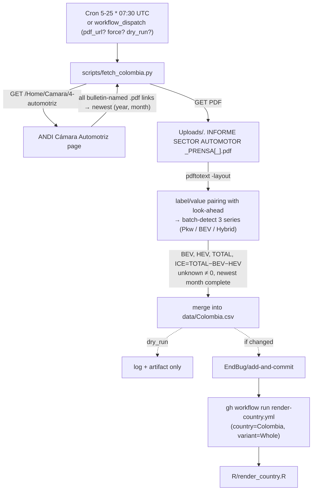

# 18 · Source: Colombia (ANDI/FENALCO Boletín — datos RUNT)

The joint **FENALCO + ANDI** monthly *Informe del Sector Automotor* PDF
(linked from ANDI's Cámara Automotriz page) is Colombia's accessible window
on the same data that powers ANDEMOS's gated dashboards: the underlying
figures come from **RUNT** (Registro Único Nacional de Tránsito — Colombia's
official vehicle registry). ANDI/FENALCO simply re-publishes the registry's
monthly aggregate as a free, public PDF.

This unblocks Colombia from the earlier "shelved" status (see
[14-data-source-gaps.md](14-data-source-gaps.md)): no login required, no
embedded dashboards to scrape, just a monthly PDF.

## TL;DR

```
Source:    ANDI Cámara Automotriz — joint with FENALCO, "Informe del Sector
           Automotor" PDF. Underlying data: RUNT (official Colombian registry).
Auth:      None — public PDF download.
API:       Discovery via the Cámara Automotriz HTML; PDF parsed with
           `pdftotext -layout` (poppler).
Variants:  Whole only (passenger cars). HDV ("vehículos de carga") is
           published as a single monthly total without fuel split — not
           ingestible into our schema; explicitly out of scope.
HEV split: NONE. "Híbridos" is a single combined bucket (HEV+PHEV+MHEV
           unsplit). → Türkiye/Georgia convention: combined hybrids go in
           the HEV column, labelled "Hybrid" in posts. PHEV is left empty.
ICE:       Reported as a derived residual: ICE = TOTAL − BEV − HEV.
           PETROL/DIESEL/FLEXFUEL/OTHERS are not separately reported.
History:   Each PDF carries ~31 months of monthly series (the Jul-2026
           boletín → 2024-01 … 2026-07). Older history via the annual
           "INFORME … A DICIEMBRE YYYY" PDFs (2018-2024) or maintainer's
           own backfill (the CSV runs from 2019-01).
Schedule:  Daily cron 5th–25th, 07:30 UTC; early-exit once last month is in.
Scripts:   scripts/fetch_colombia.py  (+ scripts/test_fetch_colombia.py)
Workflow:  .github/workflows/fetch-colombia.yml  (inputs: pdf_url, force, dry_run)
```

## 1. Why ANDI/FENALCO (and not ANDEMOS or RUNT directly)

- **RUNT** is the official source of truth, but its open-data portal is
  account-gated (signup wall) — see [14-data-source-gaps.md § Colombia](14-data-source-gaps.md).
- **ANDEMOS** publishes the same data via embedded Google Looker Studio
  dashboards (no clean download/API).
- **ANDI Cámara Automotriz** publishes a **joint FENALCO+ANDI boletín** as a
  free PDF every month, *also sourced from RUNT*. Same numbers, no wall.
  FENALCO mirrors the same report on `fenalco.com.co/blog/gremial-4/…`
  (not used — ANDI's page is the one with the stable link list).

The PDF carries less granularity than ANDEMOS's interactive dashboards
(combined hybrids only), but it has enough for the gallery's BEV/Hybrid/ICE
trajectory.

## 2. The endpoint and discovery

There is no REST endpoint. We:

1. GET the Cámara Automotriz page:
   `https://www.andi.com.co/Home/Camara/4-automotriz`
2. Take **every `href` ending in `.pdf`**, URL-decode + HTML-unescape it, and
   keep those whose basename contains `INFORME`, `SECTOR` and `AUTOMOTOR`.
3. Read the month from the first Spanish month token in the name
   (abbreviated `ENE…DIC`, four-letter `SEPT`, or full `ENERO…DICIEMBRE`) and
   the year from the first standalone four-digit `20YY`. The leading numeric
   prefix (`07.`) is only cross-checked — a mismatch is printed, the month
   token wins.
4. Sort by (year, month) descending, a monthly `_PRENSA` file above an
   annual `A DICIEMBRE` file for the same month; pick the first.
5. Download the PDF and run `pdftotext -layout` on it.

### Filename shapes seen so far

ANDI renames the file more or less every year. Discovery deliberately does
**not** pin a template — that is exactly what broke in 2026:

| Year | Example basename (decoded) |
|---|---|
| 2021 | `06. INFORME SECTOR AUTOMOTOR JUNIO 2021_PRENSA.pdf` |
| 2025 | `12. INFORME SECTOR AUTOMOTOR DIC_PRENSA-INDUSTRIA 2025_639034007525631477.pdf` |
| 2026 | `02. INFORME SECTOR AUTOMOTOR FEB2026_PRENSA.pdf`, `07. INFORME SECTOR AUTOMOTOR JUL2026_PRENSA_639237910436235821.pdf` |
| annual | `INFORME DEL SECTOR AUTOMOTOR A DICIEMBRE 2024.pdf` (different layout, backfill only) |

The `<ticks>` suffix is a per-upload .NET timestamp, present on some uploads
and not others; hrefs come both `%20`-encoded and with literal spaces, and
sometimes as absolute `https://andi.com.co/...` URLs. Always scrape the
listing — URLs are not constructible.

### The 2026 stall (postmortem)

From January to September 2026 the scheduled run was **green every day and
fetched nothing**: the old regex required `<MMM>_PRENSA-INDUSTRIA <YYYY>_<ticks>`,
the 2026 files are `<MMM><YYYY>_PRENSA…`, so the only match on the page
was the Dec-2025 file, which the run re-read and "updated" (33 rows, no
change) daily. Two side effects made it worse than a plain failure:

- the early-exit never triggered (the previous month was never in the CSV),
  so the stale PDF was re-applied on every run;
- the same-line-only value regex missed a few bars in that PDF, those months
  came back as BEV=0, and the upsert wrote the 0 over two cells the
  maintainer had corrected by hand (2023-11, 2025-07).

Three guards now exist for this class of failure: discovery prints the full
candidate list it found; a `::warning::` annotation fires when the newest
bulletin on the page is two or more months behind the CSV; and the merge
rule in § 4a never lets an unknown or a parsed 0 replace an existing value.

## 3. The PDF and what we extract

Each monthly boletín (~18 pages) contains, near the back, **three bar
charts emitting one bar per month** for the previous ~31 months:

- **Total passenger cars** monthly (the "Vehículos Nuevos" historical chart).
- **Vehículos eléctricos** (BEV) monthly.
- **Vehículos híbridos** (combined HEV+PHEV+MHEV) monthly.

A fourth chart, **Vehículos de transporte de carga**, gives heavy-goods totals
but **without** a fuel split — out of scope for our schema (no BEV share
computable from a single total).

`pdftotext -layout` linearises each bar's `mes-AA  value` label. The parser
walks the text line by line, pairs every month label with its value, then
**groups the pairs into batches by (year, month) reset** — each chart emits
its bars chronologically, so a month-year smaller than the previous one
signals a new chart.

Order in the boletín is: Total → BEV → Hybrid → Carga (we use the first
three, by position). This is more robust than parsing chart titles, which
vary in capitalisation/whitespace. A magnitude check (the first batch must
have the largest peak) fails the run if the order ever changes.

### Where the value sits

Normally on the label's line: `may-26   28.136`. For a few bars per chart
(mar-25, jul-26 in the BEV chart of the Jul-2026 file; ene-25 in the Hybrid
chart …) pdftotext emits the label alone and the value **six lines further
down**, behind blank lines and stray chart-title fragments:

```
                               jun-26                        4.935
                                jul-26
Variación acumulada : 231,2%


                                                              4.870
^L                                        0
```

`_value_for_label` takes the first number to the right of the label on the
same line, otherwise scans up to `VALUE_LOOKAHEAD_LINES` (12) lines below for
a **number-only** line with a number **right of the label column**, stopping
at the next month label or a form feed (page break = next chart). Column
position is what keeps the distractors out: YTD totals (`29.347` above
`(Ene-jul 2026)`) sit at column ~11, left of the labels at ~31; axis ticks
only occur at the top of a chart, after the form feed; the `231,2%` line has
letters and a `%` and is skipped.

### Spanish number format

Counts use **`.` as thousands separator** (`14.558` → 14558). No decimals in
counts. `parse_value(s) = int(s.replace(".", ""))`.

## 4. Column mapping (Türkiye / Georgia "single Hybrid bucket" convention)

| Source line | Canonical column |
|---|---|
| Vehículos eléctricos | `BEV` |
| Vehículos híbridos *(combined, no PHEV split)* | `HEV` (labelled "Hybrid" in posts) |
| (TOTAL − BEV − HEV) | `ICE` |
| TOTAL passenger-cars | `TOTAL` |
| — | `PHEV`, `PETROL`, `DIESEL`, `FLEXFUEL`, `OTHERS` all empty |

If ANDEMOS/RUNT ever start publishing the PHEV split in a free format, the
parser can be extended; until then the combined Hybrid bucket is the cleanest
representation. See [09-glossary.md § Variant definitions](09-glossary.md) for
the convention.

### 4a. Merge rules — unknown is not 0

`assemble_rows` leaves a cell `None` when a chart has no readable value for
a month. `merge_row` then decides per month:

| Parsed | CSV has | Result |
|---|---|---|
| value | nothing | row added |
| value | value | row updated (warning if a count moves by >50 %) |
| `None` | value | CSV value kept, `ICE` recomputed |
| `0` | non-zero value | CSV value kept, warning — a 0 over a real count is the parser gap in disguise |
| `None` | nothing | month **skipped** with a warning — a gap in the chart is honest, BEV=0 is not |

The **newest month in the PDF must be complete** (TOTAL, BEV and HEV all
read); otherwise the run fails with a pointer to `--dump-text`. That is the
month the whole run exists for, and it is also the bar most likely to be
displaced in the text.

## 5. Schedule and idempotency

`fetch-colombia.yml` runs **daily on the 5th–25th at 07:30 UTC**
(`cron: '30 7 5-25 * *'`). ANDI/FENALCO usually publishes the previous
month's boletín within the first three weeks of the following month — the
21-day polling window covers it comfortably. The `previous_month_period()` +
`csv_has_period` short-circuit makes runs after capture a no-op until the
next month's window opens. Because every bulletin re-carries ~31 months,
each successful read also absorbs any upstream revision of recent months.

Workflow inputs (all `workflow_dispatch` only):

| Input | Effect |
|---|---|
| `pdf_url` | Skip discovery, parse this PDF (backfill from an older bulletin on the same page). |
| `force` | Re-read the newest bulletin even if the previous month is already in the CSV. |
| `dry_run` | Discover + download + parse, print the candidate list, the batches and the would-be changes, dump the full `pdftotext -layout` text into the log — **write nothing, commit nothing**. The PDF and its text are also uploaded as the run artifact `colombia-bulletin` (7 days). |

`dry_run` is the tool for any parser or discovery work: the ANDI host is not
reachable from every sandbox, and a green run on a branch against the real
PDF is worth more than a fixture.

07:30 UTC sits clear of the existing cron crowd (03:17 / 04:00 / 04:40 /
05:15 / 05:50 / 06:30 / 08:00 / 09:00 / 10:00 / 11:00 / 12:00 / 13:00 /
17:30 / 20:30).

## 6. Workflow data flow


```mermaid
flowchart TD
    Cron["Cron 5-25 * 07:30 UTC<br/>or workflow_dispatch (pdf_url? force? dry_run?)"]
    Cron --> Fetch["scripts/fetch_colombia.py"]
    Fetch -->|"GET /Home/Camara/4-automotriz"| Cam["ANDI Cámara Automotriz page"]
    Cam -->|"all bulletin-named .pdf links → newest (year, month)"| Fetch
    Fetch -->|"GET PDF"| PDF["Uploads/<N>. INFORME SECTOR AUTOMOTOR <MMM><YYYY>_PRENSA[_<ticks>].pdf"]
    PDF -->|"pdftotext -layout"| Parser["label/value pairing with look-ahead<br/>→ batch-detect 3 series (Pkw / BEV / Hybrid)"]
    Parser -->|"BEV, HEV, TOTAL, ICE=TOTAL−BEV−HEV<br/>unknown ≠ 0, newest month complete"| Merge["merge into data/Colombia.csv"]
    Merge -.->|"dry_run"| Log["log + artifact only"]
    Merge -.->|"if changed"| GA["EndBug/add-and-commit"]
    GA --> Dispatch["gh workflow run render-country.yml<br/>(country=Colombia, variant=Whole)"]
    Dispatch --> Render["R/render_country.R"]
```

Single variant ⇒ no parallel-render push race.

## 7. Known fragility

| Failure mode | What happens | Diagnostic / fix |
|---|---|---|
| ANDI renames the bulletin again | Discovery still works as long as the name carries INFORME + SECTOR + AUTOMOTOR, a Spanish month and a year. If it does not, `discover_latest_pdf` raises "No 'INFORME SECTOR AUTOMOTOR' PDF links found" | Run `dry_run`, read the candidate list; add the new shape to `FILENAME_CASES` in the tests and adjust `classify_pdf_name` |
| ANDI keeps an old file as the newest link (or stops linking new ones) | Green run, `::warning:: Colombia discovery may be stale` when the page's newest bulletin is ≥ 2 months behind the CSV | Check the Cámara page by hand; `pdf_url` override if the file exists but is not linked |
| The PDF layout reorders the three charts | "Chart order looks off" — the first batch must have the largest peak | Eyeball one month's values vs the PDF narrative; if reorder is needed, detect sections by header text instead of position |
| A bar value drifts further than 12 lines from its label, or lands left of the label column | Month reported as "no value found" and treated as unknown; the run fails if it is the newest month, otherwise the existing CSV value stands / the month is skipped | `dry_run` + read the dump around the label; adjust `VALUE_LOOKAHEAD_LINES` or the column rule; add the snippet to `test_fetch_colombia.py` |
| ANDI/FENALCO add a separate PHEV split | combined Hybrid bucket understates the distinction | Extend mapping to write PHEV alongside HEV |
| andi.com.co drops connections / 500s | Retried 5× with backoff by the session adapter; a run still fails if the host stays down | Nothing to do — the next daily run picks it up |
| `poppler-utils` not installed (local run) | `pdftotext: command not found` | `brew install poppler` / `apt install poppler-utils` |

## 8. Maintenance recipes

```sh
# Regression tests (no network, no poppler — run before every parser change)
python scripts/test_fetch_colombia.py

# Dry run against the newest bulletin (needs poppler + reachability to andi.com.co;
# from a sandbox that cannot reach ANDI, dispatch the workflow with dry_run=true instead)
python scripts/fetch_colombia.py --dry-run --dump-text --debug-dir /tmp/colombia

# Force-refetch (current latest PDF)
python scripts/fetch_colombia.py --force

# Backfill from a specific older PDF (e.g. annual report for 2024)
python scripts/fetch_colombia.py --pdf-url \
  'https://www.andi.com.co/Uploads/INFORME%20DEL%20SECTOR%20AUTOMOTOR%20A%20DICIEMBRE%202024.pdf' \
  --force
# (Annual PDFs may have a different layout — use --dry-run first and verify before committing.)
```

## 9. What is **not** in this pipeline

- PHEV vs HEV split (Colombia's free reporting combines them).
- Per-fuel split for petrol / diesel / gas (only TOTAL minus EVs is known).
- Cargo / HDV by fuel type (only total cargo volume in the PDF, unsplit).
- Months older than the ~31 the current bulletin carries (each monthly
  boletín covers ~2.5 years; for older history use the annual PDFs via
  `--pdf-url`, or your own backfill).
- ANDEMOS / RUNT direct access (still gated; see [14-data-source-gaps.md](14-data-source-gaps.md)).
