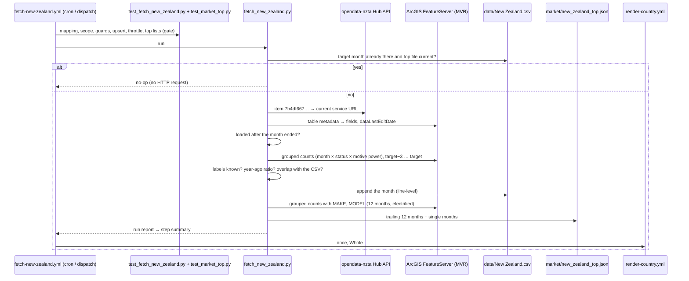

# 19 · Source: New Zealand (NZTA Motor Vehicle Register)

**Status: LIVE since 2026-10.** Fetcher `scripts/fetch_new_zealand.py` (+ tests
`scripts/test_fetch_new_zealand.py`), workflow `.github/workflows/fetch-new-zealand.yml`.
Replaces the transport.govt.nz fetcher, whose cron was switched off in 2026-06
when both of its endpoints went behind Imperva (Incapsula/Reese84); from then
until 2026-09 the maintainer entered each month by hand from the dashboard.

## TL;DR

```
Source:    NZTA open data, Motor Vehicle Register (ArcGIS feature service)
           resolved from Hub item 7b4df667d5014f1a93e6050b31d18407
Auth:      none (CC BY 4.0)
Query:     grouped counts (outStatistics) — no record download
Scope:     IMPORT_STATUS NEW + USED, CLASS MA/MB/MC/NA, by first NZ registration month
Variants:  Whole   data/New Zealand.csv
Columns:   BEV, PHEV, HEV, PETROL, DIESEL, OTHERS, TOTAL (no FLEXFUEL)
Top lists: market/new_zealand_top.json (BEV / PHEV / HEV, trailing 12 months + single months)
Schedule:  55 4,18 3-20 * *   (self-throttling; a no-op costs no HTTP request)
```

## 1. Why this source

The Ministry of Transport's light-vehicle statistics — the source of the whole
history — are read from the Motor Vehicle Register. NZTA publishes that
register itself as open data: one record per currently-registered vehicle,
refreshed monthly, with the year and month of its first registration in New
Zealand, whether it was new or a used import, its vehicle class, motive power,
make and model. So the register gives the same numbers as the Ministry, by a
route that is not behind a bot wall, and adds brands and models.

It clears the gallery's bar ([14](14-data-source-gaps.md)): registry-based (no
member-brand completeness gap), monthly, and with the same BEV / PHEV / HEV /
petrol / diesel split as the legacy series — no coarser hybrid bucket.

## 2. Scope — the legacy series, reproduced

The doc used to describe the series as "new light registrations". It never
was: the Ministry's figure, and so every row since 2012, counts **new and
used-import** light vehicles. The register settles it — with used imports in,
it matches the legacy rows in every column; without them it is 40 % short and
has half the hybrids.

| Register field | Kept | Why |
|---|---|---|
| `IMPORT_STATUS` | `NEW`, `USED` | first registrations; `RE-REG` and `SCRATCH` are not |
| `CLASS` | `MA`, `MB`, `MC`, `NA` | the Ministry's "light" = passenger vehicles + goods vehicles ≤ 3.5 t |
| month | `FIRST_NZ_REGISTRATION_YEAR` / `_MONTH` | the month the plates were issued |

Overlap with the legacy rows (register queried 2026-10-09, register − CSV):

| Month | BEV | PHEV | HEV | PETROL | DIESEL | TOTAL |
|---|---:|---:|---:|---:|---:|---:|
| 2025-09 | −4 | −5 | −91 | −111 | −68 | −279 (−1.3 %) |
| 2025-12 | −5 | −12 | −61 | −93 | −63 | −234 (−1.5 %) |
| 2026-01 | −9 | −3 | −54 | −70 | −59 | −195 (−1.0 %) |
| 2026-02 | −1 | −1 | −35 | −67 | −50 | −154 (−0.9 %) |
| 2026-03 | −17 | +4 | −65 | −64 | −76 | −218 (−0.9 %) |
| 2026-04 | −105 | −4 | −42 | −2,360 | −449 | −2,960 (−15.3 %) |
| 2026-09 | −41 | −6 | −8 | −798 | −753 | −1,606 (−6.1 %) |

Through 2026-03 the register is about 1 % below in every column — vehicles
deregistered since, and owners with a confidential listing whom NZTA leaves
out. The six months entered by hand from 2026-04 are another matter: BEV, PHEV
and HEV still agree, but petrol and diesel are several hundred to 2,360
vehicles higher every month. Those rows were read off the dashboard by hand after the
fetcher stopped (the 2026-04 row carries its URL). Why they differ is not
known — possibly a view that also counts re-registrations, which are almost
all petrol and diesel — but they are not the series the history is. See §7 for how they were handled.

Earlier months undercount more, because the register only lists vehicles
still registered: 2024 is about 4 % short, 2019 about 15 %, 2015 about 30 %.
That is why the fetcher writes each month once, right after it ends, and does
not rebuild the history (invariant 3).

## 3. Record → row

```
1. GET the Hub item → `url` = the current FeatureServer (fallback: the last
   known one, with a warning).
2. GET the service + table metadata → required fields present?
   dataLastEditDate = the date the register was loaded.
3. Is the load date after the target month ended?  no → no-op (error from the 20th).
4. Grouped count: where first-registration month in [target−3 … target] and the
   scope of §2, group by year, month, IMPORT_STATUS, MOTIVE_POWER.
5. Map MOTIVE_POWER → column (§4); TOTAL = the sum.
6. Checks (§5) → upsert the target month, line-level.
7. Top lists: the same scope over the 12 months to the target, electrified
   powertrains only, grouped by MAKE and MODEL as well (§6).
```

## 4. Motive power → column (`MOTIVE_MAP`)

| Register `MOTIVE_POWER` | Column |
|---|---|
| ELECTRIC | BEV |
| PLUGIN PETROL HYBRID, PLUGIN DIESEL HYBRID | PHEV |
| ELECTRIC [PETROL EXTENDED], ELECTRIC [DIESEL EXTENDED] | PHEV (EREV folded in) |
| PETROL HYBRID, PETROL ELECTRIC HYBRID, DIESEL HYBRID, DIESEL ELECTRIC HYBRID | HEV |
| PETROL | PETROL |
| DIESEL | DIESEL |
| LPG, CNG, ELECTRIC FUEL CELL HYDROGEN, PLUG IN FUEL CELL HYDROGEN HYBRID, OTHER, blank | OTHERS |

Light vehicles 2012-01 → 2026-09 by label: petrol 1.97 M, diesel 684k, petrol
hybrid 428k, electric 105k, plug-in petrol hybrid 53k, diesel hybrid 16k,
petrol electric hybrid 12k, EREV 925, LPG 249, hydrogen 38, plug-in diesel
hybrid 21, diesel electric hybrid 6, other 4, CNG 2.

**MHEV.** The register has no mild-hybrid label. Diesel hybrids are mostly
48 V mild-hybrid utes (Hilux, from 2024), registered as "DIESEL HYBRID"; they
count as HEV here, as they did in the Ministry's figures. A label the map does
not know goes to OTHERS with a warning, and stops the run above 1 % of a month
(`UNKNOWN_ABORT`).

## 5. Governance and validation

- **Schema:** the fields of §2/§4 plus MAKE and MODEL must exist, or the run stops.
- **Freshness:** a month is read only when the register's `dataLastEditDate`
  is after the month ended. Before that, a run is a no-op; from the 20th
  (`STALE_DAY`) it fails, because NZTA's refresh normally lands around the 5th.
- **Plausibility:** TOTAL within ×0.5–×2 of the same month a year earlier
  (`PLAUSIBLE`); outside stops the run (skip with `force`).
- **Overlap:** every run recounts the three months before the target and lists
  register − CSV per column in the step summary; above 5 % (`OVERLAP_WARN`) it
  is a warning. Rows from another source are never replaced without `force`.
- **Unknown labels:** listed; abort above 1 %.
- **No independent total:** the Ministry's dashboard is the only other
  publication and it is behind Imperva — the overlap check against the
  committed history stands in for it.

## 6. Brands and models (`market/new_zealand_top.json`)

The same scope and the same powertrain mapping, grouped by `MAKE` and `MODEL`
for BEV, PHEV and HEV, over the twelve months to the target, plus a ranking
per single month (`market_top.build_top_monthly`). Make and model are free
text typed by the entry certifier; `market_top.clean()` upper-cases them and
`strip_brand()` merges "BYD ATTO 3" with "ATTO 3". Because used imports are in
scope, used Nissan Leafs rank high in BEV. The refresh runs inside
`market_top.guarded()`: if it fails, the CSV is still committed and the run
shows a warning.

## 7. History

- **2012-01 → 2026-03:** compiled by Prof. Ray Willis from the Ministry of
  Transport's dashboard (`source = transport.govt.nz & Prof. Ray Willis`). Kept.
- **2026-04 → 2026-09:** were entered by hand from the dashboard after the
  fetcher stopped; petrol and diesel were inflated against the rest of the
  series (§2). They were rewritten from the register in the automation PR
  (`--since 2026-04 --force`), so the series has one definition from 2012 on;
  2026-04..06 carry an "undercount" note because they were counted a few
  months late.
- **2026-10 →:** written by the fetcher each month (`source = NZTA Motor
  Vehicle Register`).

## 8. Operations and debugging



- **Normal run:** about six small JSON requests (Hub item, service, table,
  one fuel query, one or two pages of make × model).
- **Dispatch inputs:** `period` (target month), `since` (backfill — only adds
  months the CSV lacks unless `force`; old months undercount, §2), `force`,
  `dry_run` (query and report, write and commit nothing).
- **Offline:** `python scripts/fetch_new_zealand.py --period 2026-09 --dry-run
  --save-json nz.json` saves the query result; `--from-json nz.json` replays it
  without the network (the tests use the same path).
- **Regression check after a change:** `--dry-run --period <a month the CSV
  holds>` must list that month as "identical".
- **After each monthly run:** read the step summary — the month's table, new
  vs used, the year-ago ratio, the overlap list, the top-file log line.

**If a run fails — where to look:**

| Symptom in the log | Cause | Fix |
|---|---|---|
| `::warning title=NZ register URL::Hub lookup failed` | Hub search API down or moved | harmless while the fallback service still answers; if NZTA has republished, update `FALLBACK_SERVICE` (open the dataset page, "View API resources") |
| `GET … failed after 4 tries: HTTP 403/5xx` | ArcGIS outage, or the service was deleted | re-run; if it persists, check the dataset page — a new item id means updating `ITEM_ID` and `HUB_ITEM` |
| `register schema changed — fields [...] missing` | NZTA renamed a field | read the table's `?f=json`, adapt `F_YEAR`/`F_MONTH`/`REQUIRED_FIELDS` and the queries |
| `register has no dataLastEditDate` | metadata changed | find another load-date field (`editingInfo.lastEditDate`, the item's `modified`) and adapt `layer_info()` |
| `the register snapshot (loaded …) does not cover … yet — and it is the 20th` | NZTA's monthly refresh is late, or the Hub item now points at an old copy | check the dataset page's "updated" date; wait, or point `ITEM_ID` at the new item |
| `unmapped MOTIVE_POWER label(s) … above 1%` | NZTA added a motive power | decide the column (glossary: EREV → PHEV, MHEV → its fuel or HEV as the history does, hydrogen → OTHERS), add it to `MOTIVE_MAP` and `LABEL_CASES` in the test |
| `TOTAL … is ×N the same month a year earlier` | a real shock (a tax or rebate change, like the Clean Car Discount's end in 2023-12) or a wrong scope | look at the step summary's new/used split; dispatch with `force` if genuine |
| overlap warning `register differs from the CSV by …` | a scope drift (a new class code, a new import status) or a revised history | compare the classes in a grouped query (§3 step 4, grouped by CLASS); adapt `CLASSES`/`STATUSES` only if the definition really moved |
| `::warning title=top brands/models not refreshed` | make × model query failed | the CSV was committed; re-run, or check the query in the log |
| `New Zealand.csv: unexpected header` | someone changed the CSV's columns | restore the 12-column header (no FLEXFUEL) |

## 9. Not built (yet)

The register's class and import status would make further variants nearly free:
`Used` (used-import passenger cars), `Vans` (NA new), `HDV` (NB + NC new) and
`Buses` (MD/ME new). Their history can only be counted from today's register,
so it would undercount the earlier years (§2) — a decision for a later PR. A
new-cars-only M1 series would be the EU-anchored alternative to Whole.
