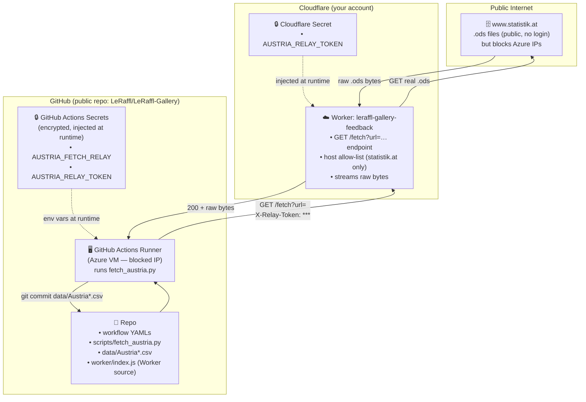
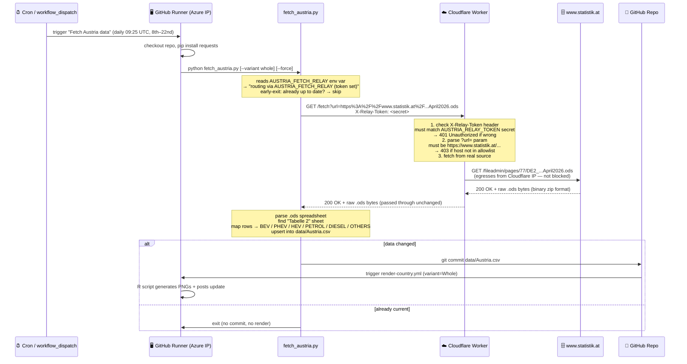
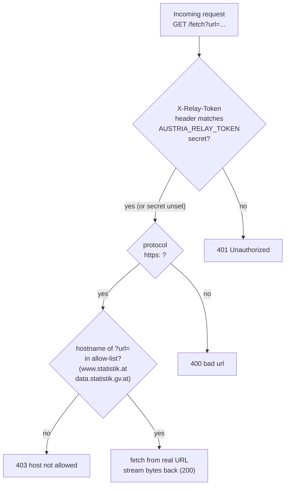
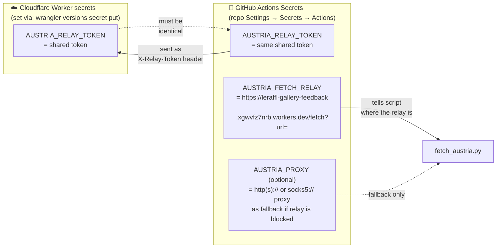
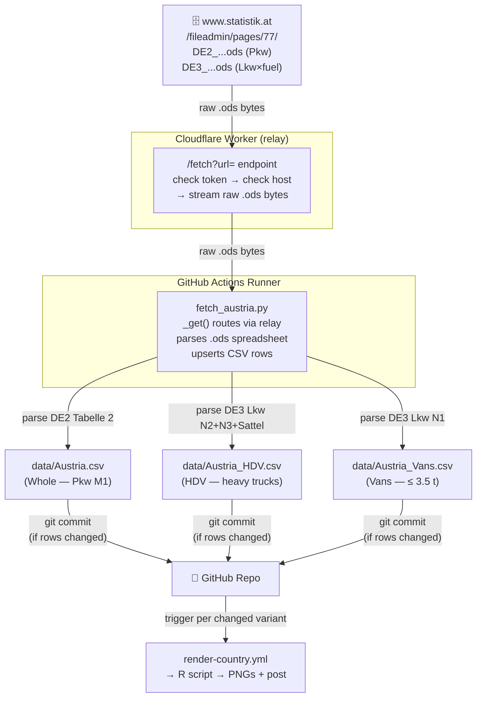

# 20 · Source: Austria (Statistik Austria DE2 / DE3 .ods via Cloudflare relay)

Statistik Austria publishes new-registration data as monthly **.ods**
spreadsheets on `www.statistik.at`. Three variants are derived from two file
families (DE2 for cars, DE3 for the vehicle-class × fuel matrix). Austria is the
only source in this repo that cannot be fetched directly from a GitHub Actions
runner — **Statistik Austria silently blocks GitHub's datacenter IP ranges** —
so every request goes through the project's Cloudflare Worker as a relay.

## TL;DR

```
Source:    www.statistik.at .ods publications (DE2 + DE3), /fileadmin/pages/77/
Auth:      None on the source — but the source BLOCKS datacenter IPs
Reach:     Runner → Cloudflare Worker /fetch relay → www.statistik.at
           (relay egresses from a non-blocked IP; raw bytes streamed back)
Variants:  Whole (Pkw M1) · HDV (Lkw N2+N3+Sattelzug) · Vans (Lkw N1)
PHEV/HEV:  Split for Whole (DE2 "darunter Plug-In" rows); HDV/Vans lumped → HEV
Backfill:  Whole from 2012-01 · HDV/Vans 2024 annual + 2025-01 onward
Schedule:  Daily cron 8th–22nd, 09:25 UTC; per-variant early-exit
Script:    scripts/fetch_austria.py
Workflow:  .github/workflows/fetch-austria.yml
Secrets:   AUSTRIA_FETCH_RELAY, AUSTRIA_RELAY_TOKEN (GitHub Actions)
           AUSTRIA_RELAY_TOKEN (Cloudflare Worker) ← same value, two locations
```

---

## 1. The players — who and what is involved

Before diving into flows and diagrams, here's a plain-language description of
every system that participates.

| System | What it is | Who controls it |
|---|---|---|
| **Statistik Austria** (`www.statistik.at`) | Austrian statistics authority. Publishes monthly `.ods` spreadsheets with vehicle registration data. No login needed — but they block datacenter IPs. | Austrian government |
| **GitHub Actions** | CI/CD service built into GitHub. Runs automated scripts on a schedule (cron) or manually. Free for public repos. | GitHub / Microsoft |
| **GitHub Actions Runner** | The actual virtual machine (VM) that executes the workflow. Hosted by GitHub in Microsoft Azure datacenters. Has a "datacenter IP" that Statistik Austria blocks. | GitHub |
| **Cloudflare Worker** (`leraffl-gallery-feedback.xgwvfz7nrb.workers.dev`) | A small JavaScript program that runs on Cloudflare's global network — not in a datacenter, so its outgoing IP is not blocked. Acts as a relay: receives a request from the runner, fetches the real file from Statistik Austria, streams the bytes back. | Cloudflare account owner (you) |
| **GitHub Repo** (`LeRaffl/LeRaffl-Gallery`) | The repository that stores everything: workflow YAMLs, the Python script, the output CSVs, and this documentation. | You |
| **GitHub Actions Secrets** | Encrypted key-value store for sensitive config. Values are injected into the runner as environment variables at runtime and never appear in logs. | You (via repo Settings) |
| **Cloudflare Secrets** | Encrypted key-value store on the Worker side. Values are injected into the Worker at runtime and are never visible in the dashboard or logs. | You (via `wrangler secret put`) |

---

## 2. The problem — why not just download directly?

Statistik Austria's servers **silently drop TCP connections from Azure IP
ranges**. This is not an HTTP error — the SYN packets are dropped at the network
level, so the runner hangs until the connection attempt times out (~20 seconds),
then fails. There is no "403 Forbidden" or helpful error message.

Both Austria-related hosts are affected:

| Host | What's there | From a GitHub runner |
|---|---|---|
| `www.statistik.at` | the `.ods` files we need | ⛔ silent timeout |
| `data.statistik.gv.at` | the OGD open-data API (alternative) | ⛔ same block, same host |
| `data.gv.at`, `data.europa.eu` | open-data catalog metadata only | ✅ reachable — but the actual file links point back to the blocked host |

The "open-data API" workaround does not help: the files are served from the same
blocked infrastructure, and the DE2 PHEV/HEV split we depend on is only in the
original `.ods`, not the OGD exports.

The only fix is to fetch from a **non-blocked IP**. Cloudflare's egress IPs are
not in the blocked range, so the existing Worker can act as a pass-through relay.

---

## 3. System overview

All the pieces, how they connect, and where secrets live:



**Key design decisions:**

- The Worker source code (`worker/index.js`) is in the public repo — anyone can
  read it. Security comes from the *token*, not from hiding the code.
- The relay Worker is also used for the feedback/submissions feature (the same
  `leraffl-gallery-feedback` Worker). The `/fetch` endpoint is just one route
  added to it.
- Cloudflare Workers Builds auto-deploys the Worker when changes are pushed to
  `worker/**`. Manual deploy via `npx wrangler@latest deploy` is also possible.

---

## 4. What happens during a workflow run — step by step



**Notes on the early-exit:**
The script checks whether the CSV already contains a row for the current year's
latest period before fetching the `.ods`. If yes, it exits immediately — making
the daily cron runs that happen *after* the data is already current essentially
free (no download, no write). Pass `--force` (or check "Skip early-exit" in
`workflow_dispatch`) to bypass this and re-fetch unconditionally.

---

## 5. The relay endpoint — how the Worker gates access

The relay is deliberately locked down so it cannot be abused as a general-purpose
open proxy. Two mechanisms protect it:



- If `AUSTRIA_RELAY_TOKEN` is **not set** on the Worker, the token check is
  skipped (allow-list still applies). Setting the token is strongly recommended.
- The allow-list is hardcoded in `worker/index.js` as
  `['www.statistik.at', 'data.statistik.gv.at']`. Adding hosts requires a code
  change and redeploy.
- The Worker only proxies bytes — it does not log URLs or payloads to any
  external system.

---

## 6. Secrets — the keys and locks

### Where each secret lives



### What each secret does

| Secret | Where | What it does |
|---|---|---|
| `AUSTRIA_RELAY_TOKEN` | **Cloudflare Worker** | The token the Worker checks against the `X-Relay-Token` request header. Blocks anyone who knows the relay URL but not the token. |
| `AUSTRIA_RELAY_TOKEN` | **GitHub Actions** | Injected into the runner as an env var. The script reads it and sends it as the `X-Relay-Token` header with every relay request. |
| `AUSTRIA_FETCH_RELAY` | **GitHub Actions** | The base URL of the relay: `https://<worker-host>/fetch?url=`. The script appends the URL-encoded target to this and makes the request. |
| `AUSTRIA_PROXY` | **GitHub Actions** (optional) | A real `http(s)://` or `socks5://` proxy as a fallback if the Cloudflare relay itself is also blocked. Only used if `AUSTRIA_FETCH_RELAY` is unset. |

### The critical invariant

`AUSTRIA_RELAY_TOKEN` **must be the same value** in both places (Worker + GitHub
Actions). If they differ, every relay request returns `401 Unauthorized`. There
is no automatic synchronization — if you rotate the token, update both.

To rotate the token:
```sh
cd worker
NEW=$(openssl rand -hex 32)
echo "$NEW"  # ← copy this, you'll need it for GitHub
echo "$NEW" | npx wrangler@latest versions secret put AUSTRIA_RELAY_TOKEN
npx wrangler@latest versions deploy
# then update AUSTRIA_RELAY_TOKEN in GitHub repo Settings → Secrets
```

---

## 7. What is public, what is private

A common question: given that the repo is public and logs are visible, what can
a random person see?

| Asset | Who can see it | Notes |
|---|---|---|
| `data/Austria.csv` and the other CSVs | **Everyone** | Public repo. The output data is intentionally public. |
| `scripts/fetch_austria.py` | **Everyone** | Public repo. Shows exactly what URLs are fetched and how data is parsed. |
| `worker/index.js` | **Everyone** | Public repo. The relay code is readable — security comes from the token, not from hiding the code. |
| `.github/workflows/fetch-austria.yml` | **Everyone** | Public repo. Shows how the workflow is triggered and what secrets it uses (by name, not value). |
| **GitHub Actions run logs** | **Everyone** | Public repo. The relay URL host is logged as `https://<host>/fetch?url=` (masked). Secret *values* never appear — GitHub replaces them with `***`. |
| The relay endpoint URL (`...workers.dev/fetch`) | **Anyone who reads wrangler.toml or logs** | The URL is not secret — it's in `wrangler.toml`. But it's useless without the token (you get `401`). |
| `AUSTRIA_RELAY_TOKEN` value | **Only repo admins** (GitHub Settings) and **Cloudflare account owner** | Never visible in logs. Can only be read back by someone with admin access to the repo or Cloudflare account. |
| `AUSTRIA_FETCH_RELAY` value | **Only repo admins** (GitHub Settings) | The full URL with host. Not sensitive in itself, but kept private as a secret anyway. |
| Cloudflare dashboard (metrics, logs, deployments, secrets) | **Only Cloudflare account owner** | No public access. |

**Bottom line:** Anyone can read the code and understand *how* it works. Nobody
outside your GitHub admin list or Cloudflare account can *use* the relay (token
required) or modify secrets.

---

## 8. The three data variants

| Variant | Output file | Source file family | Vehicle classes |
|---|---|---|---|
| `Whole` | `data/Austria.csv` | DE2 — "Fahrzeug-Neuzulassungen" Tabelle 2 | Pkw Klasse M1 (passenger cars) |
| `HDV` | `data/Austria_HDV.csv` | DE3 — class × fuel matrix | Lkw N2 + N3 + Sattelzugfahrzeuge (heavy trucks) |
| `Vans` | `data/Austria_Vans.csv` | DE3 — class × fuel matrix | Lkw N1, ≤ 3.5 t (light commercial vehicles) |

**PHEV/HEV split:** For `Whole`, DE2 has explicit "darunter Plug-In" rows that
let us separate PHEV from HEV. For `HDV` and `Vans`, DE3 lumps all hybrids
together in the Lkw rows — so PHEV is left blank and HEV holds the combined
lump.

### Column mapping

**Whole** (DE2 Pkw Tabelle 2):

| CSV column | Source label |
|---|---|
| `BEV` | Elektro |
| `PHEV` | "darunter Plug-In" (Benzin/Elektro) + (Diesel/Elektro) |
| `HEV` | (Benzin/Elektro hybrid) − Plug-In + (Diesel/Elektro hybrid) − Plug-In |
| `PETROL` | Benzin |
| `DIESEL` | Diesel |
| `OTHERS` | Pkw insgesamt − Σ above (sweeps Erdgas / LPG / Wasserstoff) |

**HDV / Vans** (DE3 class × fuel matrix):

| CSV column | Source label |
|---|---|
| `BEV` | Elektro |
| `PHEV` | _(blank — not available at Lkw row level)_ |
| `HEV` | Benzin/Elektro (hybrid) + Diesel/Elektro (hybrid) _(lumped)_ |
| `PETROL` | Benzin |
| `DIESEL` | Diesel |
| `OTHERS` | Erdgas + Flüssiggas + bivalent + Wasserstoff |
| `TOTAL` | sum of the above |

---

## 9. End-to-end data flow



---

## 10. Operations

### Re-rotating the shared token

```sh
cd worker
NEW=$(openssl rand -hex 32)
echo "New token: $NEW"   # ← copy this for GitHub

# Set on Worker (creates a new version):
echo "$NEW" | npx wrangler@latest versions secret put AUSTRIA_RELAY_TOKEN
npx wrangler@latest versions deploy   # deploy the new version to production

# Then update in GitHub:
# Settings → Secrets and variables → Actions → AUSTRIA_RELAY_TOKEN → Update
```

### Manually triggering the workflow

GitHub → Actions → "Fetch Austria data" → Run workflow:

| Field | Typical values |
|---|---|
| Branch | `master` (for production) |
| variant | `whole` / `hdv` / `vans` / `all` |
| year | leave blank for current year; set e.g. `2024` to re-fetch a specific year |
| force | check to skip the "already current" early-exit |

### Verifying the relay is reachable by hand

```sh
TOKEN="<your AUSTRIA_RELAY_TOKEN>"
RELAY="https://leraffl-gallery-feedback.xgwvfz7nrb.workers.dev"

curl -s -o /dev/null -w "%{http_code}" \
  -H "X-Relay-Token: $TOKEN" \
  "$RELAY/fetch?url=https%3A%2F%2Fwww.statistik.at%2Fstatistiken%2Ftourismus-und-verkehr%2Ffahrzeuge%2Fkfz-neuzulassungen"
# expect: 200
```

A `401` means the token is wrong. A `403` means the host is not in the
allow-list. A `502` means the Worker reached the source but got an error.

---

## 11. Troubleshooting

| Symptom in logs | Cause | Fix |
|---|---|---|
| `[net] WARNING: no relay/proxy set` | `AUSTRIA_FETCH_RELAY` secret missing from GitHub Actions | Add the secret (Settings → Secrets → Actions) |
| `relay returned 401 Unauthorized` | Token mismatch: Worker token ≠ GitHub secret | Rotate token (§10) or check both values match |
| `relay returned 403 host not allowed` | Bug in `RELAY_ALLOW_HOSTS` or wrong target URL | Check `worker/index.js` line ~323; redeploy if needed |
| `relay returned 404 Not found` | Wrong Worker URL in `AUSTRIA_FETCH_RELAY` (wrong host, missing `/fetch`) | Check the secret value ends with `/fetch?url=` |
| `ConnectTimeout` directly (no relay) | `AUSTRIA_FETCH_RELAY` unset, direct fetch attempted | Set the secret |
| `ConnectTimeout` via relay | Cloudflare's egress is also blocked (rare) | Set `AUSTRIA_PROXY` to a real EU proxy as fallback |
| `RuntimeError: no .ods found` | Statistik Austria renamed the file | Update `FILE_RE_*` regexes in `fetch_austria.py` |
| `Touched variants: <none>` | Data already up to date (normal most days) | Not a problem; re-run with `force: true` to confirm |

---

## 12. What is deliberately NOT here

- **A direct runner→source path.** Blocked at the IP level; the relay is
  mandatory in CI.
- **The OGD open-data API** (`data.statistik.gv.at`). Runs on the same blocked
  infrastructure and lacks the DE2 PHEV/HEV split.
- **An open proxy.** The `/fetch` endpoint is host-allowlisted and token-gated —
  it will not relay arbitrary URLs.
- **Binary mangling.** The relay passes `.ods` bytes through verbatim. The
  zip-based `.ods` format is preserved byte-for-byte so the Python parser works
  unchanged.
- **Pre-2024 HDV/Vans data.** Statistik Austria does not publish DE3 monthlies
  before 2024. Only annual 2024 and monthly 2025-01 onward are available.
