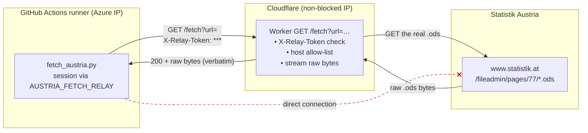
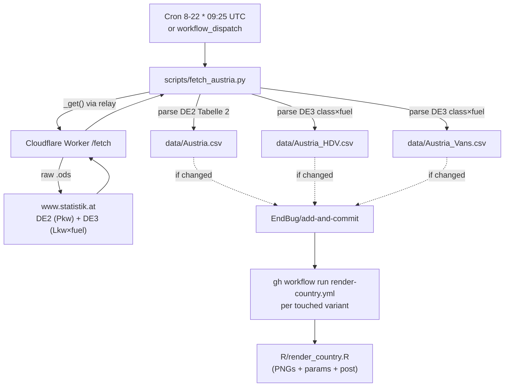

# 20 · Source: Austria (Statistik Austria DE2 / DE3 .ods via Cloudflare relay)

Statistik Austria publishes new-registration data as monthly **.ods**
spreadsheets on `www.statistik.at`. Three variants are derived from two file
families (DE2 for cars, DE3 for the vehicle-class × fuel matrix). The wrinkle
that makes Austria different from every other source in this repo: **Statistik
Austria blocks GitHub Actions' datacenter IPs**, so the runner cannot reach the
source directly — it goes through the project's Cloudflare Worker as a fetch
relay.

## TL;DR

```
Source:    www.statistik.at .ods publications (DE2 + DE3), /fileadmin/pages/77/
Auth:      None on the source — but the source BLOCKS datacenter IPs
Reach:     Runner → Cloudflare Worker /fetch relay → www.statistik.at
           (the relay egresses from a non-blocked IP; raw bytes streamed back)
Variants:  Whole (Pkw M1) · HDV (Lkw N2+N3+Sattelzug) · Vans (Lkw N1)
PHEV/HEV:  Split for Whole (DE2 "darunter Plug-In" rows); for HDV/Vans the
           source lumps hybrids, so PHEV is blank and HEV holds the lump
Backfill:  Whole from 2012-01 (pre-existing) · HDV/Vans 2024 annual + 2025-01→
Schedule:  Daily cron 8th–22nd, 09:25 UTC; per-variant early-exit
Scripts:   scripts/fetch_austria.py
Workflow:  .github/workflows/fetch-austria.yml
Secrets:   AUSTRIA_FETCH_RELAY, AUSTRIA_RELAY_TOKEN (GH Actions);
           AUSTRIA_RELAY_TOKEN (Cloudflare Worker)
```

## 1. Why the relay exists (the blocker)

Statistik Austria's edge silently **drops TCP connections from datacenter /
cloud IP ranges** (Azure, where GitHub-hosted runners live). The symptom is not
an HTTP 403 — it's a *connection timeout*: the SYN packets are dropped, so the
runner hangs for the full connect timeout and then fails. Both relevant hosts
are affected:

| Host | What's there | From a GitHub runner |
|---|---|---|
| `www.statistik.at` | the .ods publications we parse | ⛔ connect timeout |
| `data.statistik.gv.at` | the OGD open-data CSVs (alternative) | ⛔ connect timeout |
| `data.gv.at`, `data.europa.eu` | catalog **metadata** only (link back to the blocked host) | ✅ reachable, but no file bytes |

So switching to the "open-data API" does **not** help — the OGD files live on
the same blocked host. The only fix is to fetch from a **non-blocked IP**. We
reuse the project's existing Cloudflare Worker for that: a thin, host-restricted
`GET /fetch?url=…` relay. Cloudflare's egress IPs are not in the blocked range,
so the Worker can fetch the .ods and stream the raw bytes back to the runner.

### How a request reaches the source



The dashed red line is what the workflow used to do (and why it failed): a
direct runner→source connection is dropped. Everything now goes via the Worker.

`fetch_austria.py` builds the relayed URL by url-encoding the real target onto
the relay base (`_get()` / `_configure_network()`):

```
https://<worker-host>/fetch?url=https%3A%2F%2Fwww.statistik.at%2F…%2FDE2_…ods
```

If `AUSTRIA_FETCH_RELAY` is unset it falls back to `AUSTRIA_PROXY` (a real
http(s)/socks5 proxy), then to a direct connection (local dev on an unblocked
network). See the module docstring for the precedence.

## 2. End-to-end workflow data flow



## 3. The three variants

| Variant | File | Source family | Vehicle classes |
|---|---|---|---|
| `Whole` | `data/Austria.csv` | DE2 Pkw Tabelle 2 | Pkw Klasse M1 |
| `HDV` | `data/Austria_HDV.csv` | DE3 class × fuel | Lkw N2 + N3 + Sattelzugfahrzeuge |
| `Vans` | `data/Austria_Vans.csv` | DE3 class × fuel | Lkw N1 (≤ 3.5 t) |

Column mapping, the PHEV/HEV "darunter Plug-In" derivation, and the OTHERS
residual are documented in the `fetch_austria.py` header and inline comments
(unchanged by the relay work — the relay only changes *how the bytes arrive*,
not how they're parsed).

## 4. Setup / operations

### One-time setup

1. **Deploy the Worker** with the new `/fetch` endpoint:
   ```sh
   cd worker && npx wrangler@latest deploy
   ```
2. **Set the relay secret on the Worker** (gates `/fetch`):
   ```sh
   npx wrangler@latest secret put AUSTRIA_RELAY_TOKEN   # pick any random string
   ```
3. **Set the two GitHub Actions repo secrets** (Settings → Secrets and
   variables → Actions):
   - `AUSTRIA_FETCH_RELAY` = `https://<your-worker-host>/fetch?url=`
     (the worker host is shown by `wrangler deploy`, e.g.
     `https://leraffl-gallery-feedback.<subdomain>.workers.dev`).
   - `AUSTRIA_RELAY_TOKEN` = the **same** value you set on the Worker.

### Verify

Dispatch the workflow (`workflow_dispatch`) and check the logs for
`[net] routing via AUSTRIA_FETCH_RELAY` followed by successful `[fetch] …`
lines. To sanity-check the relay by hand:

```sh
curl -H "X-Relay-Token: <token>" \
  "https://<worker-host>/fetch?url=https%3A%2F%2Fwww.statistik.at%2Fstatistiken%2Ftourismus-und-verkehr%2Ffahrzeuge%2Fkfz-neuzulassungen" \
  | head -c 300
```

### Fallback if Cloudflare's egress is also blocked

Cloudflare egress IPs are *expected* to be outside the blocked range, but if a
run shows the relay itself timing out against the source, switch to a real
proxy instead: set `AUSTRIA_PROXY` (GH Actions secret) to an
`http(s)://`/`socks5://` proxy on a non-blocked (ideally EU) IP. The script
prefers the relay when both are set, so unset `AUSTRIA_FETCH_RELAY` to force the
proxy path.

## 5. Known fragility

| Failure mode | What happens | Diagnostic |
|---|---|---|
| Source IP block changes / tightens | connect timeout via relay too | confirm Cloudflare egress is blocked; switch to `AUSTRIA_PROXY` |
| Worker not deployed / wrong host | `[net]` shows relay, then 404/`Not found` | re-deploy, fix `AUSTRIA_FETCH_RELAY` host |
| Token mismatch | relay returns `401 Unauthorized` | align `AUSTRIA_RELAY_TOKEN` on Worker and GH |
| No secret set at all | fast failure, `[net] WARNING: no relay/proxy set` | set the relay secrets |
| Statistik Austria renames .ods files | discover finds nothing → `RuntimeError` | update the `FILE_RE_*` regexes in the script |

## 6. What is **not** here

- A direct runner→source path. Blocked; the relay is mandatory in CI.
- The OGD open-data API. Same blocked host (`data.statistik.gv.at`); offers no
  advantage and would lose the DE2 PHEV/HEV split.
- An open proxy. `/fetch` is host-allowlisted and token-gated.
- Binary mangling. The relay streams `.ods` bytes verbatim (no readability
  transform), so the zip-based .ods parsing works unchanged.
```
