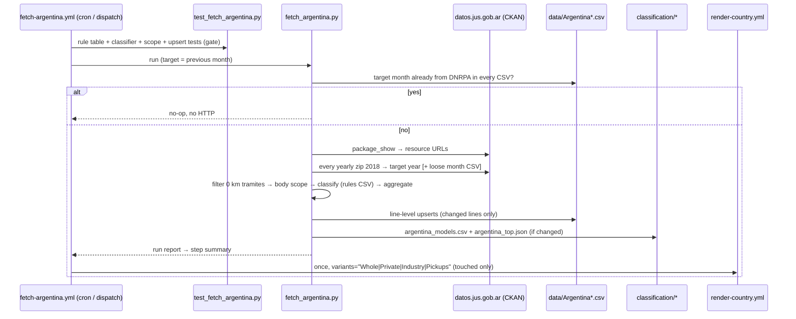

# 39 · Source: Argentina (DNRPA open microdata)

**Status: LIVE since 2026-09.** Fetcher `scripts/fetch_argentina.py` (+ tests
`scripts/test_fetch_argentina.py`) and `.github/workflows/fetch-argentina.yml`.
Argentina was shelved in 2026-05 ([14-data-source-gaps.md](14-data-source-gaps.md))
because the only electrified-segment report (ACARA/SIOMAA *Informe de
Electromovilidad*) is paid and asks for a national ID number per download. The
registry publishes something better for free: every first registration as a
record.

The facts below were established by a temporary probe workflow
(`probe-argentina.yml` / `probe_argentina.py`, runs of 2026-09-23; since
removed): the dev sandbox cannot reach Argentine hosts, the runners can.

## TL;DR

```
Source:    DNRPA "Inscripciones iniciales de autos" on the Ministerio de
           Justicia CKAN portal (datos.jus.gob.ar). One record per first
           registration: date, tramite type, body type, brand, model
           designation, use, owner type (física/jurídica), province, …
Auth:      None. No login, no ID number, CSV.
API:       CKAN package_show → resource URLs (ids change on re-upload, so
           never hard-code them). Yearly zip (one CSV member per month) +
           the newest month as a loose CSV.
Timing:    Month M lands ~11th of M+1 (2026-08: 2026-09-11 ~17:30 UTC).
           Past years get re-uploaded too (2025 zip refreshed 2026-08-12).
History:   2018-01 → today, record level.
Fuel:      NOT in the records. Classified from the model designation by
           classification/argentina_rules.csv (§4); every designation's
           class + deciding rule in classification/argentina_models.csv.
           Validated against ACARA: BEV exact, HEV/PHEV within 0.4 %.
Variants:  Whole (≈M1) · Private · Industry · Pickups.
Not here:  Vans / HDV / Buses (no weight or seat count), quadricycles
           (EU L-category), classic cars, auctions.
```

## 1. Why this source clears the bar

The gallery's rule ([14](14-data-source-gaps.md)): direct from the registry or
its recognised body, complete for the market, obtainable without paying or
handing over an ID. DNRPA *is* the registry. It is complete by construction —
BYD, JMEV, Arcfox and every other Chinese import under the 2025 zero-duty
quota (Decreto 49/2025) are in it — and since 2026-03 ACARA's own monthly
market report is co-signed "DNRPA-ACARA", i.e. built on the same records.
Cross-check: DNRPA H1-2026 = 297,811 records (all body types) vs ACARA's
headline 294,181.

## 2. Record → CSV row

| Field | Use |
|---|---|
| `tramite_fecha` | period (`YYYY-MM`) |
| `tramite_tipo` | keep only `INSCRIPCION INICIAL NACIONAL` / `…IMPORTADO` (0 km). Dropped: `AUTO CLASICO`, `FORM. 05` (auctions), `X DICTAMEN/OFICIO/CERTIF.ANT.` (late/court-ordered) |
| `automotor_tipo_descripcion` | variant scope (§3) |
| `automotor_marca_descripcion` + `automotor_modelo_descripcion` | powertrain (§4) |
| `titular_tipo_persona` | Private (Física) / Industry (Jurídica) |

CSV columns: `BEV, PHEV, EREV, HEV, MHEV, ICE, TOTAL`. `ICE` = everything the
classifier does not identify as electrified; no `PETROL`/`DIESEL` columns
exist because the designations do not give a reliable split (invariant 4 —
no fabricated fuel split). `source` = `DNRPA`. Rows are written with
line-level upserts (invariant 2); a row whose `source` is not `DNRPA` is never
overwritten without `--force`.

## 3. Scope and variants

| Variant | DNRPA body types (`automotor_tipo_descripcion`) | EU anchor |
|---|---|---|
| `Whole` | SEDAN 2/3/4/5 PUERTAS, RURAL (3/4/5 puertas), TODO TERRENO, COUPE, DESCAPOTABLE, CONVERTIBLE, CABRIOLET, ROADSTER, FAMILIAR, AUTOMOVIL, … | ≈ M1 |
| `Private` | Whole ∧ `titular_tipo_persona = Física` | M1 sub-slice |
| `Industry` | Whole ∧ `titular_tipo_persona = Jurídica` (companies, state, fleets) | M1 sub-slice; `Private + Industry = Whole` exactly |
| `Pickups` | PICK-UP, PICK-UP CABINA SIMPLE / DOBLE / Y MEDIA, PICK-UP CARROZADA | Argentina-specific (Canada/Indonesia precedent); overwhelmingly N1 |

**Deliberately not published.** `FURGON`, `FURGONETA`, `UTILITARIO`, `CHASIS
…`, `CAMION`, `TRACTOR`, `TRANS.DE PASAJEROS`, `MINIBUS`, `MIDIBUS`: the records
carry no gross weight or seat count and these body types mix classes (a
Sprinter 314 van is N1, a 517 is N2; a Kia Carnival under TRANS.DE PASAJEROS
is M1, a Hiace Commuter M2), so Vans / HDV / Buses cannot be anchored to EU
classes honestly (invariant 5). Quadricycles (`CUADRICICLO … L6/L7`, Coradir
Tita, Sero, XEV Yoyo) are EU L-category, not M1. Trailers and off-road buggies
are out as well.

**Scope vs ACARA.** ACARA's "Autos" is a slightly narrower passenger-car
definition: June 2026 Whole = 31,069 vs ACARA Autos 30,106 (+3 %).

## 4. Powertrain classification — the method in full

This is the first gallery country whose fuel split is **derived by us**
rather than reported by the source, so this section is deliberately
exhaustive. The public version of it (with the live rule table and the full
mapping) is the **"How each registration gets its powertrain"** section of
the Argentina source page (`sources/argentina.html`, generated — see §6).

### 4.1 Why we classify at all

DNRPA's record has brand (`automotor_marca_descripcion`) and the exact model
designation (`automotor_modelo_descripcion`, e.g. `COROLLA CROSS XEI HEV 1.8
ECVT`), but **no fuel or propulsion field**. There is no free official
catalogue to join against (the Israel approach, [34](34-source-israel.md)):
the Secretaría de Energía's vehicle-label dataset exists but uses different
model names and was not needed — Argentine designations are unusually
explicit. So the class is read off the designation.

### 4.2 The pipeline, step by step

For every record that passed the scope filter (§3):

1. **Normalise** brand and designation: upper-case, strip accents (NFKD),
   collapse whitespace (`norm()` in the fetcher). `Híbrida` → `HIBRIDA`.
2. **Walk the rule table** `classification/argentina_rules.csv` from row 1
   down. A rule matches when its `brand` regex matches the brand (empty =
   any brand) **and** its `pattern` regex matches the designation
   (`re.search`, i.e. anywhere in the string unless anchored with `^…$`).
3. **First match wins** — its `class` is the record's class and its `id` is
   recorded as the deciding rule.
4. **No match → `ICE`**, rule id `default-ice`.
5. The class feeds the CSV columns: `BEV`, `PHEV`, `EREV`, `HEV`, `MHEV`,
   `ICE`; `TOTAL` is every in-scope record. In the gallery's 3-curve chart
   EREV folds into PHEV and HEV/MHEV/ICE are "ICE" (glossary).

Classification is per **designation**, not per record, and deterministic:
the same brand + designation always gets the same class. That is what makes
the mapping table (§5.2) a complete, reviewable statement of every decision.

### 4.3 The rule table (`classification/argentina_rules.csv`)

**This CSV is the classifier's source of truth and the only hand-edited file
in `classification/`.** The fetcher loads it at start-up; the tests validate
it; the source page renders it. Columns:

| column | meaning |
|---|---|
| `order` | evaluation order, 1..N with no gaps, equal to the file order (tested) |
| `id` | stable slug, e.g. `phev-changan-cs55plus`. Written into the mapping next to every designation it decides — never rename casually; if you must, it is a pure rename (history is re-derived on the next forced run) |
| `class` | `BEV` \| `PHEV` \| `EREV` \| `HEV` \| `MHEV` \| `ICE` (an `ICE` rule is an explicit exclusion that must beat a later token) |
| `brand` | regex on the normalised brand; empty = any brand. Anchor it (`^VOLVO$`) |
| `pattern` | regex on the normalised designation |
| `kind` | `exclusion` · `token` · `brand-code` · `model` · `brand-all` — see 4.4 (validated set) |
| `reason` | why the rule exists, in plain language (shown on the public page; required) |
| `evidence` | how it was verified: spec sheet / launch article / ACARA figure (required) |
| `example_brand`, `example_model` | a **real** designation this rule decides. The tests assert the example is classified **by this very rule** — if an earlier rule starts stealing it, CI fails (shadowed rule). Empty = *anticipatory* rule (written before the first registration) |

At the 2026-08 snapshot: **59 rules** (27 BEV, 19 PHEV, 6 MHEV, 5 HEV, 1 EREV,
1 ICE exclusion); 13 anticipatory. Of **5,008** designations registered
2018–2026 in scope, **307** are classified electrified.

### 4.4 The five kinds of rule — and the risk each carries

| kind | what it is | share of electrified registrations decided (2018–2026-08) | risk |
|---|---|---:|---|
| `token` | a generic word any brand might use: `EV`, `BEV`, `ELECTRICO`, `PHEV`, `DM-I`, `REEV`, `MHEV`, `48V`, `HEV`, `HYBRID`, `HIBRIDO`, `E-POWER` … | **76.9 %** | a word that *means something else* for one brand — hence the exclusions and brand overrides placed **before** the token rules |
| `brand-code` | a brand's own naming code: Volvo `T8`, BMW `330E`, Lexus `300H`/`450H+`, Mercedes `300 E`, Toyota `HV`, Suzuki/Stellantis/Renault `HYBRID` = mild | 13.9 % | brand changes its naming scheme |
| `model` | one specific model: Changan `CS55 PLUS`, DFSK `E5`, BAIC `BJ30`, SWM `EDI`, Q5 gen-3 exact strings, BYD `SHARK` … | 8.8 % | the importer adds a different powertrain under the same name (e.g. a petrol CS55 Plus) |
| `brand-all` | "every remaining model of this brand is a BEV" (BYD, Leapmotor, Deepal, JMEV, Arcfox, Xiaomi, Tesla …) | 0.3 % | **highest**: a new non-EV model of such a brand is silently a BEV. Found once already: `BYD SHARK GS` (a PHEV pickup without the DM marker) — fixed by `phev-byd-shark` above it. Every new designation of these brands is listed in the monthly report (§7.1) |
| `exclusion` | an explicit `ICE` rule for a known false positive (`PACK ELECTRICO`) | — | none; keeps a token honest |

**Precedence is the design.** The file is grouped top to bottom as:
exclusions → EREV → PHEV (tokens, then brand codes and models) → MHEV
(tokens, then brand codes; the Renault full-hybrid exception sits just above
the Renault mild rule) → HEV (tokens, then brand codes/models) → BEV (tokens,
then brand codes/models) → `brand-all` last. Two orderings matter most:

* **Plug-in and mild-hybrid rules before the generic `HYBRID` → HEV token**,
  because `TIGGO 7 PRO HYBRID 1.5T PHEV` and `…HYBRID 1.5T MHEV`,
  `FIAT 600 HYBRID`, `ARKANA E-TECH HYBRID` all contain "HYBRID".
* **`brand-all` strictly last**, so it only ever sees what every specific
  rule left over.

### 4.5 Decision log — every non-obvious mapping

Verified against Argentine spec sheets / launch coverage, not the model's
name in other markets. The `evidence` column carries the same references.

| designation(s) | class | rule | why (evidence) |
|---|---|---|---|
| Renault `ARKANA E-TECH HYBRID ESPRIT ALPINE` | **MHEV** | `mhev-renault-hybrid` | Argentine Arkana is the 1.3 TCe 140 with a 12 V belt starter-generator, not the European 1.6 E-Tech full hybrid (Renault AR launch, 2025-04). ACARA also counts it as MHEV. Was HEV in the first draft — the ACARA cross-check exposed it (≈1,000 units in H1-2026). |
| Renault `KOLEOS … FULL HYBRID E-TECH` | HEV | `hev-renault-full-hybrid` | genuine full hybrid; must sit above the Renault mild rule |
| Suzuki `SWIFT HYBRID`, `ACROSS HYBRID` | **MHEV** | `mhev-suzuki-hybrid` | 12 V SHVS (Across: 1.5 + 12 V battery, 2.35 CV assist — Suzuki AR, 2026-08) |
| Fiat `600 HYBRID`, Citroën `C4 HYBRID`, DS `3/4 … HYBRID`, Fiat `500 … HYBRID`, future Peugeot `T200 HYBRID` | **MHEV** | `mhev-stellantis-hybrid` | Stellantis 48 V / 12 V systems; ACARA counts Fiat 600 Hybrid as MHEV. Stellantis *plug-ins* say `HYBRID4`, `PLUG-IN`, `E-TENSE` or `HYBRID 180/225/300` and are caught above |
| Changan `CS55 PLUS` | **PHEV** | `phev-changan-cs55plus` | only the iDD plug-in (18.4 kWh, 125 km) is sold in AR (changan.com.ar); first registered 2025-11; 1,309 units — without this rule the PHEV total was ~1,000 short of ACARA |
| DFSK `E5` | **PHEV** | `phev-dfsk-e5` | every Argentine E5 / E5 Plus is a plug-in (autoweb 2025-09-24) |
| SWM/Shineray `G03F EDI` | **PHEV** | `phev-swm-edi` | EDi = plug-in (48 km EV range); plain `G03F` is petrol and stays ICE |
| BAIC `BJ30E`, `BJ30` | **HEV** | `hev-baic-bj30` | BJ30 Hybrid, no plug (BAIC AR); ACARA's H1-2026 figure 3,702 = ours |
| Toyota `COROLLA HV`, `COROLLA CROSS … HV`, `RAV4 HV`, `C-HR HV`, `CAMRY HV`, `PRIUS` | HEV | `hev-toyota-hv` | Toyota Argentina's older hybrid badge "HV" (2019–2023); newer strings say `HEV` |
| Nissan `X-TRAIL EPOWER` | HEV | `hev-token` | e-Power is a series hybrid without plug |
| Ford `MAVERICK … FHEV`, `TERRITORY … HIBRIDA`, `KUGA … HIBRIDO` | HEV | `hev-token` | full hybrids; ACARA Territory HEV 4,903 = ours |
| BYD `SHARK GS` | **PHEV** | `phev-byd-shark` | the Shark is a DM-o plug-in pickup; this string lacks "DMO" and fell to "BYD = BEV" — found by the per-rule review (2026-09) |
| Deepal `L07` (brand `DEEPAL`) | BEV | `bev-pure-ev-brands` | Deepal appears as its own brand from 2026-08; its range-extenders are labelled `REEV` (`DEEPAL S07 REEV`) and caught first. First caught by the new-designation report |
| Audi `Q5 ADVANCED`, `Q5 ADVANCED PLUS`, `Q5 SPORTBACK ADVANCED`, `Q5 SPORTBACK S LINE`, `SQ5 SPORTBACK` | **MHEV** | `mhev-audi-q5-gen3` | 3rd-gen Q5 (AR from 2025-11): every version 48 V (Audi AR launch). Exact strings only — old-gen strings carry "45 TFSI" |
| Toyota `HILUX … PACK ELECTRICO` | ICE | `ice-hilux-pack-electrico` | electric-windows pack on a 2.5 TDI |
| DS `4 PERFORMANCE LINE 215 A T8` | ICE | (no rule) | "T8" = 8-speed; the Volvo T8 rule is brand-scoped |
| BAIC `X55` | ICE | (no rule) | petrol X55 II. The **X55 II Hybrid** (AR from 2026-08; series hybrid, 1.8 kWh, no plug) will say `HYBRID` → HEV via `hev-token`, which is correct |
| Porsche `MACAN`, `MACAN T/S/GTS/TURBO` | ICE (**unresolved**) | — | ambiguous across the petrol and electric generations (~80 units since 2024); only `MACAN 4/4S/ELECTRIC` → BEV |
| Audi new-gen `A5 …` | ICE (**unverified**) | — | 48 V not confirmed for the Argentine trims |
| Acura `NSX` | ICE (**unresolved**) | — | 7 units; hybrid only for the 2016+ generation, not distinguishable |

### 4.6 Validation

ACARA (dealers' association) publishes electrified totals built on the same
DNRPA registry. ACARA-comparable scope = Whole + Pickups + the handful of
electrified vans/quadricycles ACARA also counts.

| H1 2026 | this classifier | ACARA | Δ |
|---|---:|---:|---:|
| BEV | 3,877 | 3,877 | 0 |
| HEV | 23,226 | 23,222 | +0.02 % |
| PHEV (+EREV) | 9,019 | 8,979 | +0.4 % |
| MHEV | 6,316 | 6,160 | +2.5 % |

Model-level: Ford Territory HEV 4,903, Corolla Cross HEV 4,098, BAIC BJ30
3,702, BYD Atto 2 2,554, Song Pro 2,502, Yaris Cross HEV 2,237 — all equal to
ACARA's published ranking. Monthly: July 2026 hybrids 6,275 vs 6,265; August
6,964 vs 6,991. Full-year 2025: HEV 20,128 vs ≈20,240 (76 % of 26,632), BEV
1,265 vs ≈1,330, PHEV 650 vs ≈530 (2 %, rounded) — **MHEV 3,600 vs ≈4,530**
(2025 mild hybrids that no designation marks are counted as ICE — the known
limitation, ICE-side in every chart).

How the classifier converged (kept because it shows what the checks catch):
first draft HEV +1,000 / MHEV −1,400 → Arkana is a mild hybrid; PHEV −1,000 →
Changan CS55 Plus is a plug-in; BEV −240 → JMEV and Arcfox are EV-only
brands; MHEV −400 → gen-3 Audi Q5.

**To re-validate** after ACARA publishes a new electrified report: sum
`classification/argentina_models.csv` rows (Whole + Pickups) by class for the
same months — or re-run the offline harness with `--from-agg` — and compare.
Deviations beyond ~3 % on BEV/PHEV/HEV mean a missing rule.

### 4.7 Known limitations

* **MHEV is a lower bound** (see 4.6). It never affects the BEV/PHEV curves.
* **No petrol/diesel split** — the combustion remainder is one `ICE` column.
* **Designation-level ambiguity** — where one designation covers two
  powertrains (Porsche Macan across generations) the rule picks the safe
  side (ICE) and the case is listed in 4.5.
* **Old model years** — 0.2–1.1 % of in-scope first registrations per year
  carry a model year ≥ 2 years older than the registration (mostly unsold
  stock registered late, e.g. HR-V 2021 registered in 2023; a few classics
  imported through the ordinary 0 km procedure). They are genuine first
  registrations and stay in.
* **Reading the fitted curve.** Electrified registrations only took off with
  the 2025 zero-duty import quota (Decreto 49/2025: 50,000 electrified units a
  year): BEV was ≈0.1 % of Whole until mid-2025 and 2–3 % by mid-2026, PHEV 0 →
  ~6 %. The first render (2026-08) therefore fits about a year of steep,
  policy-driven signal and extrapolates an ICE 80→20 % time of ~1 year, in the
  same aggressive range as the other early-stage markets (Uruguay 1.15 y,
  Indonesia 1.35 y). That is the model's documented early-stage volatility
  (README, "Uncertainty"), not a data defect, and it will settle as history
  builds. It also reflects a quota: if the quota is capped or ends, the
  curve describes a policy step rather than an organic S-curve (compare
  Ethiopia in [14](14-data-source-gaps.md)). If a fit ever degenerates, the
  lever is `skip_plots.csv`.

## 5. Outputs

### 5.1 Data CSVs

`data/Argentina.csv`, `_Private`, `_Industry`, `_Pickups` — see §2/§3.

### 5.2 `classification/argentina_models.csv` (generated — never hand-edit)

Every designation ever registered in scope, one row per (brand, designation,
scope), sorted by brand/designation. Rewritten on every real run (only if
its content changed), committed with the data:

| column | meaning |
|---|---|
| `brand`, `model` | normalised brand and designation |
| `scope` | `Whole` or `Pickups` |
| `class`, `rule` | the classification and the id of the deciding rule (`default-ice` = no rule matched) |
| `units_total` | first registrations since 2018-01 |
| `units_last_12m` | … in the 12 months ending with the target month |
| `first_seen`, `last_seen` | first / last month with a registration |

Because it is regenerated from the current rules on every run, **its git diff
is the audit trail**: a new designation appears as an added line; a rule
change shows as `class`/`rule` edits on the affected lines.

### 5.3 `classification/argentina_top.json` (generated) — generic schema

```json
{"country": "Argentina", "variant": "Whole", "source": "DNRPA",
 "as_of": "2026-08", "window": {"from": "2025-09", "to": "2026-08", "months": 12},
 "total_registrations": 371304,
 "unit": "registrations (designation = exact DNRPA model string)",
 "classes": {
   "BEV":  {"units": 5680, "share_of_market": 0.0153,
            "brands": [{"brand": "BYD", "units": 4089, "share_of_class": 0.72}, …],
            "models": [{"brand": "BYD", "model": "DOLPHIN MINI EV GS", "units": 2857, "share_of_class": 0.503}, …]},
   "PHEV": {…}, "EREV": {…}, "HEV": {…}, "MHEV": {…}}}
```

Top 10 brands and top 15 designations per class; ICE is omitted. The schema
is country-neutral on purpose (see §6).

### 5.4 Run report (step summary)

Every real run prints — and appends to the GitHub Actions **step summary**
of the "Fetch & update Argentina CSVs" step — the target month per variant,
**every designation first registered in the target month** with its class and
rule (⚠️ on ICE rows of brands with electrified models), the 25 largest
ICE-classified designations of those brands, and the rules that decide
nothing yet.

## 6. Frontend — what the reader sees

`scripts/build_source_pages.py` has two **generic, opt-in** sections, switched
on by front-matter keys (this doc's front-matter is the first user):

* `market_breakdown: <path to top json>` → **"Who sells the electrified
  cars"**: share tiles per class, then for BEV and PHEV (open) and EREV / HEV
  / MHEV (collapsed) the top brands and top designations with units and share.
* `classification: {rules, mapping, intro}` → **"How each registration gets
  its powertrain"**: the plain-language method (`intro` paragraphs), stat
  tiles, **the full rule table in evaluation order** (class, id, kind, brand
  scope, pattern, reason, evidence, example, registrations decided), a
  **searchable table of every electrified designation** (rule ids link to
  their rule row), the 40 largest ICE designations of brands that also sell
  electrified cars (collapsed — where a missed EV would hide), download links
  for both CSVs, and a "report a misclassification" link.

The page is regenerated by `build-source-pages.yml`, which now also triggers
on `classification/**`. Missing files degrade to a "not generated yet" note.

**Adopting this for another country** (the user asked for top brands/models
everywhere eventually): have the country's fetcher write a
`classification/<slug>_top.json` in the §5.3 schema and add
`market_breakdown:` to its front-matter — nothing else. The `classification:`
block is only for countries whose powertrain is derived like Argentina's.
Any fetcher that sees model-level records (Spain DGT, Israel, Netherlands
RDW) can produce the top file.

## 7. Runbook — keeping the classification right

### 7.1 Every month, after the fetch commit (≈ 5 minutes)

1. Open the latest **Fetch Argentina data (DNRPA)** run → step summary.
2. Read **"New designations first registered in …"**. For every **⚠️** row
   (combustion from a brand that sells electrified cars) and every row of a
   `brand-all` brand (BYD, Leapmotor, Deepal, JMEV, Arcfox, …), confirm the
   powertrain on the importer's Argentine site / a launch article.
3. Skim **"Largest ICE-classified designations of new-energy brands"** for
   anything that grew suddenly.
4. If all correct: nothing to do. If not: 7.2.

### 7.2 Fixing a misclassification or adding a model

1. Decide the rule kind (4.4). Prefer the **narrowest** rule that is true:
   `model` (brand-scoped, specific pattern) over `brand-code` over `token`.
   Never widen a `brand-all` rule to fix one model — add a specific rule
   above it.
2. Insert a row in `classification/argentina_rules.csv` **at the right
   position** (above any rule that would otherwise catch the designation —
   e.g. a new BYD hybrid goes above `bev-pure-ev-brands`; a mild hybrid
   named "HYBRID" goes above `hev-token`). Renumber `order` 1..N.
3. Fill `reason` and `evidence` (URL or source + date) — the public page
   shows both. Put the real designation into `example_brand/example_model`.
4. Add the designation to `CLASSIFY_CASES` in
   `scripts/test_fetch_argentina.py` if it is a trap worth pinning.
5. `python scripts/test_fetch_argentina.py` — the shadowing test proves every
   rule still decides its own example.
6. Commit, then run **Fetch Argentina data (DNRPA)** manually with
   **force = true** → full re-derivation: every past month is re-classified,
   the data CSVs change only on the affected lines, the mapping diff shows
   exactly which designations moved, and the render is dispatched.
7. Add a line to the decision log (4.5).

Worked example (the BYD Shark fix, 2026-09): the per-rule review showed
`BYD | SHARK GS` decided by `bev-pure-ev-brands`. Rule added above it:
`phev-byd-shark, PHEV, ^BYD$, \bSHARK\b, model, …, example BYD | SHARK GS`.
Effect: Pickups 2026-01 moved 2 units BEV → PHEV; nothing else changed.

### 7.3 Things that should make you suspicious

* A `brand-all` brand launches anything with "HYBRID", "DM", "PLUS" or a new
  family name → verify.
* An importer reuses an existing name for a new powertrain (CS55 Plus petrol,
  X55 hybrid, Arkana full hybrid) → the `model` rule needs narrowing.
* ACARA's monthly electrified numbers drift more than ~3 % from the mapping
  totals for BEV, PHEV or HEV → a missing rule.
* A rule's "Decides" count on the source page drops to 0 after having been
  > 0 → it is being shadowed (the tests catch this for rules with examples).

### 7.4 Reports from readers

The source page links to GitHub issues ("Spotted a misclassified model?").
Treat each like 7.2; answer with the rule id that fixed it.

## 8. Operations



- **Cron:** `15 9,21 8-25 * *`. Self-throttle: if every CSV already has the
  target month from `DNRPA`, the run exits without HTTP.
- **What a real run downloads:** every yearly zip from 2018 (~100 MB, a few
  minutes) plus, if the target month is not in the zip yet, the loose
  monthly CSV. Full re-derivation keeps the CSVs, the mapping and the rules
  consistent by construction; only changed lines are rewritten.
- **Completeness guard:** a newly published month whose Whole TOTAL is below
  40 % of the trailing-12 median is treated as a partial upload and not
  written (`--force` overrides; backfills skip it — 2020-04 really was ~10 %).
- **Tests gate the fetch:** `test_fetch_argentina.py` runs first (rule table
  well-formed, every example decided by its own rule, ~100 pinned real
  designations, scope filter, owner split, upsert, mapping/top/report).
- **Render:** touched variants → one `render-country.yml` dispatch. A run that
  only changes `classification/*` commits without rendering; the source page
  rebuilds via `build-source-pages.yml`.
- **Offline:** `--from-agg <csv>` reads a pre-aggregated
  `(month, tramite, tipo, marca, modelo, persona, n)` file instead of
  downloading — how the classifier was developed from the sandbox.
