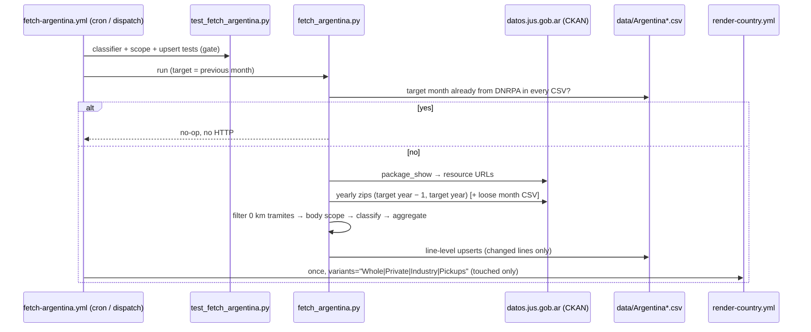

# 39 · Source: Argentina (DNRPA open microdata)

**Status: LIVE since 2026-09.** Fetcher `scripts/fetch_argentina.py` (+ tests
`scripts/test_fetch_argentina.py`) and `.github/workflows/fetch-argentina.yml`.
Argentina was shelved in 2026-05 ([14-data-source-gaps.md](14-data-source-gaps.md))
because the only electrified-segment report (ACARA/SIOMAA *Informe de
Electromovilidad*) is paid and asks for a national ID number per download. The
registry publishes something better for free: every first registration as a
record.

The facts below were established by a temporary probe workflow
(`probe-argentina.yml` / `probe_argentina.py`, runs of 2026-09-23; since
removed): the dev sandbox cannot reach Argentine hosts, the runners can.

## TL;DR

```
Source:    DNRPA "Inscripciones iniciales de autos" on the Ministerio de
           Justicia CKAN portal (datos.jus.gob.ar). One record per first
           registration: date, tramite type, body type, brand, model
           designation, use, owner type (física/jurídica), province, …
Auth:      None. No login, no ID number, CSV.
API:       CKAN package_show → resource URLs (ids change on re-upload, so
           never hard-code them). Yearly zip (one CSV member per month) +
           the newest month as a loose CSV.
Timing:    Month M lands ~11th of M+1 (2026-08: 2026-09-11 ~17:30 UTC).
           Past years get re-uploaded too (2025 zip refreshed 2026-08-12).
History:   2018-01 → today, record level.
Fuel:      NOT in the records. Classified from the model designation
           (§4). Validated against ACARA: BEV exact, HEV/PHEV within 0.4 %.
Variants:  Whole (≈M1) · Private · Industry · Pickups.
Not here:  Vans / HDV / Buses (no weight or seat count), quadricycles
           (EU L-category), classic cars, auctions.
```

## 1. Why this source clears the bar

The gallery's rule ([14](14-data-source-gaps.md)): direct from the registry or
its recognised body, complete for the market, obtainable without paying or
handing over an ID. DNRPA *is* the registry. It is complete by construction —
BYD, JMEV, Arcfox and every other Chinese import under the 2025 zero-duty
quota (Decreto 49/2025) are in it — and since 2026-03 ACARA's own monthly
market report is co-signed "DNRPA-ACARA", i.e. built on the same records.
Cross-check: DNRPA H1-2026 = 297,811 records (all body types) vs ACARA's
headline 294,181.

## 2. Record → CSV row

| Field | Use |
|---|---|
| `tramite_fecha` | period (`YYYY-MM`) |
| `tramite_tipo` | keep only `INSCRIPCION INICIAL NACIONAL` / `…IMPORTADO` (0 km). Dropped: `AUTO CLASICO`, `FORM. 05` (auctions), `X DICTAMEN/OFICIO/CERTIF.ANT.` (late/court-ordered) |
| `automotor_tipo_descripcion` | variant scope (§3) |
| `automotor_marca_descripcion` + `automotor_modelo_descripcion` | powertrain (§4) |
| `titular_tipo_persona` | Private (Física) / Industry (Jurídica) |

CSV columns: `BEV, PHEV, EREV, HEV, MHEV, ICE, TOTAL`. `ICE` = everything the
classifier does not identify as electrified; no `PETROL`/`DIESEL` columns
exist because the designations do not give a reliable split (invariant 4 —
no fabricated fuel split). `source` = `DNRPA`. Rows are written with
line-level upserts (invariant 2); a row whose `source` is not `DNRPA` is never
overwritten without `--force`.

## 3. Scope and variants

| Variant | DNRPA body types (`automotor_tipo_descripcion`) | EU anchor |
|---|---|---|
| `Whole` | SEDAN 2/3/4/5 PUERTAS, RURAL (3/4/5 puertas), TODO TERRENO, COUPE, DESCAPOTABLE, CONVERTIBLE, CABRIOLET, ROADSTER, FAMILIAR, AUTOMOVIL, … | ≈ M1 |
| `Private` | Whole ∧ `titular_tipo_persona = Física` | M1 sub-slice |
| `Industry` | Whole ∧ `titular_tipo_persona = Jurídica` (companies, state, fleets) | M1 sub-slice; `Private + Industry = Whole` exactly |
| `Pickups` | PICK-UP, PICK-UP CABINA SIMPLE / DOBLE / Y MEDIA, PICK-UP CARROZADA | Argentina-specific (Canada/Indonesia precedent); overwhelmingly N1 |

**Deliberately not published.** `FURGON`, `FURGONETA`, `UTILITARIO`, `CHASIS
…`, `CAMION`, `TRACTOR`, `TRANS.DE PASAJEROS`, `MINIBUS`, `MIDIBUS`: the records
carry no gross weight or seat count and these body types mix classes (a
Sprinter 314 van is N1, a 517 is N2; a Kia Carnival under TRANS.DE PASAJEROS
is M1, a Hiace Commuter M2), so Vans / HDV / Buses cannot be anchored to EU
classes honestly (invariant 5). Quadricycles (`CUADRICICLO … L6/L7`, Coradir
Tita, Sero, XEV Yoyo) are EU L-category, not M1. Trailers and off-road buggies
are out as well.

**Scope vs ACARA.** ACARA's "Autos" is a slightly narrower passenger-car
definition: June 2026 Whole = 31,069 vs ACARA Autos 30,106 (+3 %).

## 4. Powertrain classification (the part to be careful with)

Argentine designations usually spell the drivetrain out — `DOLPHIN MINI EV
GS`, `ATTO 2 DM-I GS`, `COROLLA CROSS XEI HEV 1.8 ECVT`, `TIGGO 7 PRO HYBRID
1.5T MHEV`. `classify()` is a first-match table (`RULES` in the fetcher):
generic tokens first (REEV → EREV; PHEV/DM-i/i-DM → PHEV; MHEV/48V → MHEV;
HEV/HYBRID/HÍBRIDO/e-Power → HEV; EV/ELÉCTRICO/e-tron/EQ → BEV), with
brand-scoped rules for everything a token does not say, and for the traps
where it lies:

| Trap | Rule |
|---|---|
| "HYBRID" on a mild hybrid | Suzuki (Swift, Across: 12 V), Stellantis (Fiat 600, Citroën C4, DS 3/4 Hybrid, Peugeot T200 Hybrid: 12/48 V), **Renault Arkana E-Tech Hybrid** (the Argentine one is the 1.3 TCe 12 V; ACARA counts it as MHEV too) → MHEV. Only Renault "FULL HYBRID" (Koleos) is HEV. |
| Plug-ins without "PHEV" | Volvo T8 / T5 Twin Engine, BMW `330E`/`X1 XDRIVE25E`, Mercedes `300 E`, Land Rover `P400E`, Lexus `450H+`, Jeep `4XE`, Porsche `E-HYBRID`, Ferrari SF90/296, Changan CS55 Plus (iDD — the only CS55 Plus sold in AR), DFSK E5 (every Argentine E5), SWM/Shineray G03F `EDI` → PHEV |
| Full hybrids without "HEV" | BAIC `BJ30E` (BJ30 Hybrid), Lexus `250H`/`300H`, Toyota Prius, Forthing `T5HEV` → HEV |
| BEVs without "EV" | whole brands (BYD non-DM, Leapmotor non-REEV, JMEV, Arcfox, Xiaomi, Tesla, Zeekr …), `MACH-E`, `SPARK EUV`, Volvo `EX30`/`C40`, BMW `IX2`, Geely `EX5`, ORA, Dongfeng `BOX`, Renault `E-TECH` (non-hybrid) → BEV |
| False positives | `HILUX … PACK ELECTRICO` (electric windows), `S10 … ELECTRONIC`, DS `… A T8` (8-speed gearbox), Jaguar `E-TYPE`, Volvo `P1800E`, old Audi Q5 `45 TFSI` → ICE |
| MHEV hidden in a trim | 3rd-gen Audi Q5/SQ5 (AR from 2025-11, all 48 V; exact designations) → MHEV |

**Validation against ACARA** (ACARA-comparable scope = Whole + Pickups + the
few electrified vans/quadricycles ACARA also counts):

| H1 2026 | this classifier | ACARA | Δ |
|---|---:|---:|---:|
| BEV | 3,877 | 3,877 | 0 |
| HEV | 23,226 | 23,222 | +0.02 % |
| PHEV (+EREV) | 9,019 | 8,979 | +0.4 % |
| MHEV | 6,316 | 6,160 | +2.5 % |

Model-level spot checks match exactly: Ford Territory HEV 4,903, Corolla Cross
HEV 4,098, BAIC BJ30 3,702, BYD Atto 2 2,554, Song Pro 2,502, Yaris Cross HEV
2,237. Monthly: July 2026 hybrids 6,275 vs ACARA 6,265; August 6,964 vs
6,991. Full-year 2025: HEV 20,128 vs ≈20,240 (76 % of 26,632), BEV 1,265 vs
≈1,330, PHEV 650 vs ≈530 (2 %, rounded) — **MHEV 3,600 vs ≈4,530**: 2025 mild
hybrids that no designation marks are counted as ICE. That is the known
limitation; it does not touch the BEV/PHEV curves (MHEV is ICE-side in every
chart).

**Known unresolved designations** (low volume, left ICE): Porsche `MACAN`
(plain/T/S/GTS/Turbo are ICE or electric depending on generation; only
`MACAN 4`/`4S`/`ELECTRIC` are ruled BEV), Acura `NSX`, new-gen Audi A5 (48 V
not verified for the Argentine trims).

### Adding a rule when a new model lands

Every run prints *"Review — models of new-energy brands classified ICE"*: the
top ICE designations of Chinese and premium brands for the target year. A new
electrified designation that no rule catches shows up there the month it is
first registered. To fix: add a `(fuel, brand, pattern)` tuple to `RULES` in
the right precedence block, add the real designation to `CLASSIFY_CASES` in
`scripts/test_fetch_argentina.py`, then run the workflow with `force` +
`backfill` to re-derive history under the new rule. Verify the model's
powertrain from the importer's Argentine spec sheet, not from its name in
other markets (the Arkana and Across both say "Hybrid" and are mild hybrids
here; the CS55 Plus says nothing and is a plug-in).

## 5. Operations



- **Cron:** `15 9,21 8-25 * *`. Self-throttle: if every CSV already has the
  target month from `DNRPA`, the run exits without HTTP.
- **What a real run downloads:** the target year's and the previous year's
  zip (~9 + 13 MB); if the target month is not in the zip yet, the loose
  monthly CSV. Both years are re-derived and upserted, so DNRPA corrections
  land; only changed lines are rewritten.
- **Completeness guard:** a newly published month whose Whole TOTAL is below
  40 % of the trailing-12 median is treated as a partial upload and not
  written (`--force` overrides; backfills skip it — 2020-04 really was ~10 %).
- **Tests gate the fetch:** `test_fetch_argentina.py` runs before the fetch
  (classifier on ~100 real designations, scope filter, owner split, upsert).
- **Render:** touched variants → one `render-country.yml` dispatch.
- **Offline:** `--from-agg <csv>` reads a pre-aggregated
  `(month, tramite, tipo, marca, modelo, persona, n)` file instead of
  downloading — how the classifier was developed from the sandbox.
