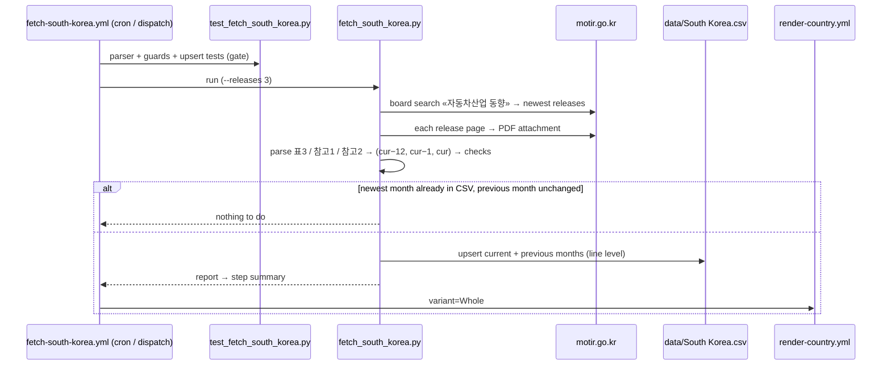

# 43 · Source: South Korea (MOTIR «자동차산업 동향»)

**Status: AUTOMATED since 2026-09** (was entered by hand 2017-01 → 2026-06).
Fetcher `scripts/fetch_south_korea.py` (+ tests
`scripts/test_fetch_south_korea.py`) and
`.github/workflows/fetch-south-korea.yml`.

The facts below come from temporary probe workflows on the development
branch (2026-09-25, since removed): the dev sandbox cannot reach
`motir.go.kr` or `data.go.kr`, the GitHub runners can. The finished fetcher
was run online end to end on a runner (list → PDFs → parse → write →
second run self-throttles).

## TL;DR

```
Source:    MOTIR (산업통상부) press release «YYYY년 M월 자동차산업 동향», board
           «보도·참고자료» on motir.go.kr; one release a month, PDF + HWPX.
Auth:      None.
Tables:    표 3 내수 판매량 (total domestic sales)  → TOTAL
           참고 2 친환경차 차종별 내수: 하이브리드 → HEV, 전기차 → BEV,
                  플러그인 하이브리드 → PHEV, 수소차 → OTHERS
           ICE = TOTAL − 친환경차 내수
Columns:   each table: same month a year earlier · previous month · current
           month (labels read from the header).
Timing:    ~13th–20th of M+1, 11:00 KST (Aug 2026 → 17 Sep 2026).
Scope:     domestic SALES, all vehicle types, domestic makers + KAIDA imports.
Checked:   every release 2025-01 → 2026-08 in the current format vs the
           hand-entered rows: equal to MOTIR's revised figures, except two
           transcription errors (now corrected).
```

## 1. Why this source

It is the source the hand-entered series always came from (the rows carry
`motir.go.kr`), published by the ministry, free, no login. Automating it
keeps the 2017 → history continuous and makes the numbers checkable — the
previous source-page stub said "no public source link yet".

**Alternatives looked at (2026-09):**

| Source | What it has | Why not (now) |
|---|---|---|
| KOTSA «자동차종합정보 신규등록정보» API on data.go.kr (dataset 15059401) | Registrations 2015 →, monthly; filters: vehicle type (1 = 승용 passenger car), fuel, model code (차명코드), region, use, owner sex/age, displacement, domestic/import | Returns **one count per query** (no group-by). Fuel codes have **no plug-in value** (only 하이브리드(휘발유+전기) / (CNG+전기)). Needs a data.go.kr service key (account; whether a foreigner can register without Korean identity verification is unconfirmed). The model-code table has 63,939 trim-level codes without a brand column, so brand/model tables would need thousands of calls a month. Best candidate for a future **passenger-car (M1) registration series** — see §7. |
| KAIDA import statistics | Imports by brand × model × fuel | Behind a data-membership login; imports only (~20 % of the market). |
| KAMA | Domestic makers | No machine-readable powertrain table found. |
| MOLIT registration statistics (stat.molit.go.kr) | Registered **stock** by fuel | Stock, not new registrations. |

## 2. Release → CSV rows

The parser reads the text pdfplumber extracts from the PDF:

- **참고 2 «친환경차 차종별 내수 판매 현황»** — the line
  `친환경차 내수 N N N …` and the four rows below it, stopping at the
  footnote (`* 출처 …`), because the export table right after repeats the same
  row labels.
- **표 3 «자동차 생산, 내수, 수출량»** — `내수 판매량 N N N …`; the company
  table (참고 1) `내 수 N N N …` must agree. Quarterly releases
  («1분기») have only the 참고 1 line.
- **Months come from the table header** (`구 분 ‘25.8월 '26.7월 '26.8월 …`),
  never from the title, and must be (current − 12, current − 1, current).

Written per run: the **current** and the **previous** month (MOTIR revises
the previous month in the next release — e.g. 2026-05 BEV 35,416 → 35,455;
the newest publication wins). The **year-earlier** column is only compared
with the CSV and reported: MOTIR occasionally revises a year later too
(2024-09, 2024-10), but history is not rewritten (invariant 3).

A month with no release of its own is filled by the next release's
previous-month column (2026-07: no «7월» release on the board as of
2026-09-25 — its figures came in with the August release).

Columns: `BEV, PHEV, HEV, OTHERS, ICE, TOTAL` (the existing layout); `OTHERS`
is hydrogen fuel-cell cars. `source` = `motir.go.kr`, the same string as the
hand-entered rows, so revisions of the latest two months overwrite them.
Line-level upserts; a row whose numbers are unchanged is left byte-for-byte
(the hand-entered rows are integers, the fetcher writes `.1f`).

## 3. Scope (read this before comparing)

- **All vehicle types.** 내수 판매량 is domestic sales of passenger cars *and*
  commercial vehicles (e.g. Hyundai Porter / Kia Bongo light trucks, buses,
  vans; the release does not state their share). `Whole` is therefore **not**
  EU M1, and the BEV share mixes both segments (the commercial one has BEV
  light trucks too). Documented deviation, like Chile's light + medium scope.
- **Sales, not registrations**, as reported by KAMA (domestic makers) and
  KAIDA (imports) — imports are counted as KAIDA reports them.
- **Import coverage — Tesla missing before 2024.** KAIDA counts its
  members; Tesla was not in its statistics until it added Tesla (and Iveco)
  with 2024 data. Check for 2023-08: KAMA five makers 106,591 + KAIDA
  passenger imports «테슬라 미포함» 23,350 = 129,941 vs MOTIR 내수 130,667 —
  the 726 residual is imported commercial vehicles, no room for Tesla. From
  2024 the imports close: 2026-08 MOTIR imports 31,039 vs KAIDA passenger
  imports 29,817 incl. Tesla 10,400 and BYD 3,002. So **BEV and TOTAL are
  too low up to 2023-12** by Tesla's volume (≈ 12–18k a year 2020–2023, i.e.
  ~10 % of BEV in 2021–2023, more in 2020) and the BEV share steps up at
  2024-01. Left as published (invariant 3); backfill decision: issue #257.
- **Hybrids**: KAIDA's hybrid count for imports includes **mild hybrids**
  (MOTIR footnote «수입차는 MHEV 포함»); domestic makers' mild hybrids are not
  counted as hybrids.
- **No petrol/diesel split** — `ICE` = total − eco-friendly cars; `PETROL` /
  `DIESEL` columns do not exist (invariant 4).

## 4. Governance — what every run checks

| Check | On failure |
|---|---|
| Release list parses; the release has a PDF attachment that is a PDF | abort |
| Eco table and total found; header yields three months = (cur − 12, cur − 1, cur) | abort ("schema drift") |
| 하이브리드 + 전기차 + 플러그인 + 수소차 = 친환경차 내수 (± 2) | abort |
| 내수 판매량 (표 3) = 내 수 (참고 1) when both are present | abort |
| ICE ≥ 0 | abort |
| Newest month ≥ 25 % of the trailing-12 median TOTAL | not written (`force` overrides) |
| Changes against the CSV and year-earlier differences | listed in the step summary |
| Parser regression tests (`test_fetch_south_korea.py`) | workflow stops before fetching |

## 5. Validation against the hand-entered history

All 14 releases in the current PDF format (2025-03 … 2026-08, incl. two
quarterly ones) were parsed and compared with `data/South Korea.csv`:

- **Previous-month columns** (MOTIR's revised figures): equal to the CSV for
  every month — the hand-entered rows always took the revised number.
- **Year-earlier columns**: equal for 12 of 14 months; 2024-09 and 2024-10
  differ slightly (MOTIR re-revised them a year later) — left as they are.
- **Two transcription errors** in the hand-entered rows, corrected by the
  backfill (both confirmed by two releases each):

| Month | Column | Hand-entered | MOTIR | |
|---|---|---:|---:|---|
| 2025-09 | HEV | 41,973 | **51,973** | 10,000 short — ICE was 10,000 too high |
| 2026-04 | HEV | 50,782 | **50,872** | transposed digits; H2 revised 500 → 540 |

Releases before 2025 hold the eco table as a graphic or in a different
layout (pdfplumber finds no text row); those months stay as entered.
Annual totals 2017–2025: 1.63–1.89 M vehicles, BEV 0.8 % (2017) → 12.9 %
(2025) → 24.4 % (Jan–Aug 2026).

## 6. Operations and debugging



- **Schedule:** `35 3,9 12-25 * *`. A run reads the board and three PDFs
  (~1 min); MOTIR drops connections from datacenter IPs now and then, so
  every request retries five times with back-off.
- **Rebuild a stretch:** dispatch with `releases = 12` (or more).

| Symptom in the log | Cause | Fix |
|---|---|---|
| `No «자동차산업 동향» release on the MOTIR list` | board URL / search / markup changed | open `LIST_URL`; adjust `list_releases()` |
| `no PDF attachment` / `attachment is not a PDF` | attachment markup changed, or HWPX only | adjust `release_pdf()`; if only HWPX is published, convert (`hwpx` is zip + XML) |
| `eco-car domestic table … not found` / `rows missing` | table wording changed (e.g. a row renamed) | read the PDF text (`pdfplumber`), update `ECO_ROWS` / the regexes, add the new text to the tests |
| `header months … are not (cur−12, cur−1, cur)` | new column layout | map the new header in `header_months()` |
| `eco parts sum … ≠ 친환경차 내수` | a row mis-read, or a new category (e.g. EREV) | inspect the table; add the category |
| `내수 판매량 … ≠ 내 수` | the two tables disagree in the release itself | check the PDF; `force` if MOTIR's own tables differ |
| `Remote end closed connection` after 5 retries | MOTIR blocking | re-run later; if persistent, route through the Worker relay (Austria pattern) |

## 7. Not done (yet)

- **Brand / model tables.** MOTIR's release ranks passenger-car models only
  as a chart image and not by powertrain; no free source gives brand × model
  × powertrain for Korea. The KOTSA API could give model counts for a
  curated list of BEV model codes (a few hundred calls a month), but needs a
  data.go.kr service key.
- **A passenger-car (M1) registration series** from the KOTSA API
  (vehicle type 승용 × fuel), as a cross-check of the sales series and a
  proper M1 `Whole` — same key requirement; it has no plug-in split. Would
  also remove imported mild hybrids from HEV and include Tesla throughout.
  Tracked in issue #258 (brand/model tables too).
- **Tesla before 2024** — backfill or leave; issue #257.
