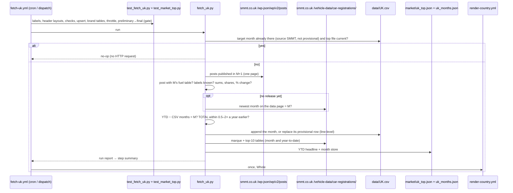

# 50 · Source: UK (SMMT monthly release, from DVLA data)

**Status: LIVE since 2026-10 (automated).** Fetcher `scripts/fetch_uk.py`
(+ tests `scripts/test_fetch_uk.py`) and `.github/workflows/fetch-uk.yml`.
The UK — about two million new cars a year, the largest market the gallery
still maintained by hand — had been transcribed from SMMT's monthly release
since 2015. The fetcher reads the same release, so the series continues
without a break: run over every release that has HTML tables (2024-11 →
2026-09, 23 months), it reproduces each hand-entered row **exactly**.

The facts below were established on 2026-10-04 from the dev sandbox, which
reaches `smmt.co.uk` directly (no probe workflow was needed).

## TL;DR

```
Source:    SMMT monthly new-car release (a news post on smmt.co.uk), from DVLA data
Find it:   GET https://www.smmt.co.uk/wp-json/wp/v2/posts
               ?after=<M+1>-01T00:00:00&before=<M+2>-01T00:00:00
               &per_page=100&_fields=id,date,link,content
           → the post whose single-month fuel table is headed by month M
Fallback:  GET https://www.smmt.co.uk/vehicle-data/car-registrations/
           (always the newest month; also the brand table for market/)
Auth:      None. No login, no key.
Timing:    month M at 09:00 UK time in the first working days of M+1
           (2026: Jan 6, Feb 5, Mar 5, Apr 7, May 6, Jun 4, Jul 6, Aug 5, Sep 4, Oct 2)
           An early release is "SMMT preliminary figures … subject to
           change"; "full and final figures" follow days later (Sep 2026:
           Oct 2 → Oct 5) → provisional row, replaced automatically (§2.1)
Scope:     new cars (M1), all brands → Whole. Vans are a separate release.
Fuel:      BEV → BEV; PHEV → PHEV; HEV → HEV; PETROL (incl. MHEV) → PETROL;
           DIESEL (incl. MHEV) → DIESEL; TOTAL; OTHERS = residual (0)
History:   2015-01 → 2026-09 hand-entered from the same releases (source
           "SMMT"); automated from the October 2026 release on.
Checked:   all 23 releases 2024-11 → 2026-09 reproduce the CSV byte for byte
           (fuel columns); YTD − earlier months = month within 3 cars.
```

## 1. Why this source

The gallery's bar ([14](14-data-source-gaps.md)): direct from the registry
or its recognised body, complete for the market, free.

- **It is the registry's count.** SMMT compiles new registrations from DVLA's
  register for every brand — members or not (BYD, Chery/Jaecoo, Leapmotor are
  all in the brand table). It is the figure the UK government, the press and
  ACEA quote.
- **Free and reachable.** The release is a public web page; the site's
  WordPress REST API answers without a key, from the sandbox and from runners.
- **Why not DfT/DVLA directly:** the Department for Transport's vehicle
  licensing statistics (`VEH1153` new registrations by body type, fuel and
  keepership; `VEH0181` plug-ins by model) are published in quarterly
  updates — a lag of up to a quarter for a monthly chart (probed 2026-09-28,
  [03](03-data-objects.md) §3.16).
- **Why not ACEA:** ACEA's monthly press release carries the UK too, but it
  is a secondary copy of SMMT's figures, published about two weeks later;
  `fetch_acea.py` skips the UK on purpose.

## 2. Release → CSV row

The release (and the vehicle-data page) carries, in this order: the fuel
table for the month, the same table year-to-date, private / fleet / business
for the month and year-to-date, the top-10 models (month, year-to-date) and
the top-10 battery-electric models. The data page adds the marque table
(month and year-to-date). Only the single-month fuel table goes into the
CSV:

| Column of SMMT's table | Used for |
|---|---|
| this year | the CSV row |
| last year (restated) | report only (§5) |
| % change | check: recomputed from the two counts |
| market share this year | check: recomputed from count / TOTAL |
| market share last year | — |

CSV columns: `BEV, PHEV, HEV, PETROL, DIESEL, OTHERS, TOTAL, notes`;
`source` = `SMMT` (the same string the hand-entered rows carry, so the
self-throttle treats them as "already have it"); `notes` = the release URL.
Integers, as the recent hand-entered rows. A new month is appended; an
existing month is never replaced without `--force` (invariant 3) — except a
provisional one (§2.1).

### 2.1 Preliminary → final

SMMT sometimes releases a month early with preliminary figures and publishes
the final ones a few days later. September 2026 is the first case seen: the
release of 2 October (2nd working day) and the data page carried, under every
table, *"SMMT preliminary figures are subject to change. Full and final
figures published Monday 5 October, 9am."* The final figures replace the
preliminary ones in the same post and on the data page; there is no second
post. (The release posts' `modified` timestamps show SMMT editing them days
after publication — August 2026's was published 4 Sep, modified 9 Sep.)

The fetcher handles it without a human:

| Release says | CSV row for the month | Result |
|---|---|---|
| preliminary (`PRELIM_RE` matches) | none | appended, `notes` = `provisional: SMMT preliminary figures; <url>` |
| preliminary | provisional | replaced if the numbers changed, else left alone |
| final | provisional | replaced — final numbers, `notes` = the URL only — **no `--force` needed** |
| preliminary | final | kept (a final row is replaced only with `--force`) |

A provisional row does **not** satisfy the self-throttle, so the twice-daily
runs keep re-reading the release (and refreshing `market/uk_top.json`, which
has the same preliminary/final timing) until the final figures are in — the
cron window (1st–15th) covers the gap. The `provisional:` prefix follows the
repo-wide convention ([03](03-data-objects.md), Spain's DGT daily rows) and
keeps the URL in `notes`, so the source page's "newest stored month was read
from this exact document" link still works. 2026-09 was entered from the
preliminary release and is marked provisional by hand in this PR; the run on
5 October replaces it.

## 3. Discovering the release

SMMT's posts are all in the category *News* and carry no tag for the
registration release, and its URL is a headline
(`record-electric-car-market-powers-bumper-september`). `find_release()`
lists the posts published between the 1st of M+1 and the 1st of M+2 (10–25
posts, one API page) and parses each post containing "BEV":

- the post whose single-month fuel table is for M is the release;
- two matches: the larger TOTAL wins (should a van release ever carry the
  same table — the car market is always bigger), and between equal totals
  (a re-issue) the newest post; the others are logged. Final figures are an
  in-place edit of the same post (§2.1), so this tie-break does not decide
  between preliminary and final;
- a fuel-shaped table that does not parse aborts with the post's URL (schema
  drift, not "someone else's post");
- no match: the vehicle-data page is tried; still nothing → "not published
  yet", exit 0 — until the 10th; from the 11th the run fails with
  `::error title=UK release not found` (SMMT has never been that late).

**The month of the table** comes from its header ("September"), tolerant of
SMMT's typos ("Feburary", 2025-02) and abbreviations. Two releases print no
month above the table at all (2025-08, 2026-06); there the month is the
publication window's (M, for a post published in M+1), accepted only when
the table's year column agrees, and the step summary says so.

## 4. Row labels (`FUEL_LABELS`)

| SMMT label | → | Seen |
|---|---|---|
| BEV | BEV | every release |
| PHEV | PHEV | every release |
| HEV | HEV | every release |
| PETROL | PETROL | every single-month table |
| DIESEL | DIESEL | every single-month table |
| ALL PETROL / ALL DIESEL | PETROL / DIESEL | year-to-date tables of 2024-11 and 2026-08 |
| MHEV PETROL / MHEV DIESEL | PETROL / DIESEL | SMMT's pre-2024 image tables (kept for a layout change back) |
| TOTAL | TOTAL | every table |

Any other label aborts the run (`unknown SMMT fuel row(s)`). Rows are matched
by label, never by position (HEV and PHEV swap places between releases).
When two labels sum into one column, their printed percentages are not
checked (they describe the rows).

## 5. Governance and validation

Every real run (the self-throttle exits before any HTTP request when the
CSV has the month from `SMMT`, not provisional, and `market/uk_top.json` is
current):

- **Schema drift aborts:** a fuel table without a year header, a missing
  BEV/PHEV/HEV/PETROL/DIESEL/TOTAL row, a non-numeric count, an unknown
  label, a month-less table without a matching publication window.
- **Sums:** BEV + PHEV + HEV + PETROL + DIESEL ≤ TOTAL; the residual is
  OTHERS (0 in every release so far).
- **Column-shift checks:** the year columns must be consecutive years; each
  printed market share and % change must match the counts within 0.25 pp —
  a column inserted or swapped fails here (test `test_swapped_year_columns`).
- **Year-to-date check:** the release's YTD TOTAL minus the CSV's January …
  M−1 must equal this month's TOTAL; above 1 % a warning, above 5 % the run
  aborts (wrong month, or a heavy SMMT revision — check by hand, then
  `force`). Over 2024-11 → 2026-09 the largest difference was 3 cars
  (per fuel, HEV/PETROL reclassifications of up to ~5,000 cars over the
  year show up in the summary — they are SMMT restating earlier months).
- **Plausibility:** TOTAL must be between 0.5× and 2× the same month a year
  earlier (plate months make a trailing median useless here); outside it the
  month is held back until dispatched with `force`.
- **Year-ago column:** SMMT's restated figure for M−12 is compared with the
  CSV row and printed; never written. Typical restatements: 2024-01 HEV
  18,744 → 17,896 (PETROL +848); 2025-09 TOTAL 312,891 → 312,793.

**Validation of the automation** (2026-10-04): `--backfill --dry-run` online
found exactly one release for each of the 23 months 2024-11 → 2026-09, and
every one reproduced the hand-entered row's BEV, PHEV, HEV, PETROL, DIESEL
and TOTAL exactly. Removing 2026-09 from a copy of the CSV and running the
fetcher added the line back byte-identical, apart from OTHERS written as `0`
where the hand entry had left it empty (most hand-entered rows say `0`).

## 6. Reading the fit

The UK's BEV share of new cars: 1.6 % (2019), 6.6 % (2020), 11.6 % (2021),
16.6 % (2022), 16.5 % (2023), 19.6 % (2024), 23.4 % (2025) and 26.2 % in
January–September 2026 (September 28.3 %, a record 99,199 cars). The
ZEV mandate (22 % of each maker's sales in 2024, 28 % in 2025, 33 % in 2026,
with flexibilities) is why manufacturers discount BEVs; plug-in hybrids
(14.1 % in 2026) count towards the mandate's flexibilities and grow fast.
Full hybrids (13.8 %) count as ICE. The plate months make single months
lumpy — September 2026 had 350,518 registrations, August 94,236.

## 7. Outputs

- `data/UK.csv` (Whole), monthly, 2015-01 →, rendered.
- `market/uk_top.json` — brand ranking of new cars plus SMMT's top-10 models,
  class `ALL` (every powertrain — [03](03-data-objects.md) §3.16): SMMT's
  brand table has no fuel split, so the source page's section is "Who sells
  the new cars". The **headline is January → newest month**, from SMMT's own
  year-to-date marque table and top 10 (exact, as for Austria); each brand
  table's "Grand Total" must equal brands + "Other British" + "Other
  Imports" and the fuel table's TOTAL exactly, else the refresh is skipped
  with a warning (the CSV is still committed — `market_top.guarded`).
- `market/uk_months.json` — month store: each month's brand and top-10 model
  counts, as seen on the data page (which only ever shows the newest month),
  so the single-month picker grows from 2026-09 on. Brand rows have an empty
  model, model rows a model; both go through `market_top.splice_models`.

## 8. Operations and debugging



- **Schedule:** `25 10,16 1-15 * *` (an hour after SMMT's 09:00 UK release in
  summer, 1h25 in winter; afternoon retry). A no-op costs nothing.
- **Normal run:** one posts-API page (≈ 0.1–0.3 MB with the post bodies) +
  the data page (≈ 0.25 MB).
- **Backfill:** dispatch with `backfill = true` — reads every release from
  2024-11 and adds the months the CSV lacks (none today); differences to
  existing rows are listed, never written.
- **Offline:** save a release (`curl -A Mozilla/5.0 <post URL>`) or the data
  page and run `python scripts/fetch_uk.py --from-html FILE [--period M]` —
  it parses, runs every check against `data/UK.csv` and prints the line it
  would write. `--dry-run` with `--period` re-reads a committed month online:
  it must say "identical to the CSV" (the regression test for a parser change).
- **After each monthly run:** read the step summary — the month's table, the
  year-ago restatement, the YTD line, the plausibility ratio, the top-file
  log line.

**If a run fails — where to look:**

| Symptom in the log | Cause | Fix |
|---|---|---|
| `::error title=UK release not found` (from the 11th) | SMMT changed the post format so the fuel table is no longer an HTML table (an image again), or moved the release off the WordPress posts API | open SMMT's news page; if the table is an image, transcribe by hand for now (as before 2026-10) and adapt the parser or fall back to the data page; if the API moved, adapt `find_release()` |
| `GET … failed: HTTP 403` | the site started blocking runners (WAF) | re-run; if it persists, check from a browser and consider the Cloudflare relay ([08](08-deploy-ops.md) §8.4) |
| `unknown SMMT fuel row(s) [...]` | SMMT added or renamed a row | decide the column (glossary conventions: MHEV → its fuel; EREV → PHEV; hydrogen → OTHERS), add it to `FUEL_LABELS` and `LABEL_CASES` in the test |
| `fuel table lacks [...]` / `without a year header` | layout change | `--from-html` on the saved post; adapt `parse_fuel_table()` and add the layout to the tests |
| `single-month fuel table without a month in its header` | a month-less table on the data page (no hint there) | wait for / point at the release post; or `--from-html FILE --period M` |
| `printed share … columns shifted?` | a column inserted before the counts, or SMMT's own typo in a share | look at the table; if it is SMMT's typo, `force` for that month and note it |
| `year-to-date check off by …` | SMMT revised earlier months heavily, or the table is for another month | compare the release with the CSV; `force` if the month is right |
| `TOTAL … is ×N the same month a year earlier` | a real shock (tax change, pull-forward) or a wrong table | check the release text; `force` if genuine |
| `::warning title=top brands/models not refreshed` | marque table changed (Grand Total ≠ fuel TOTAL, renamed rows) | the CSV was committed; adapt `parse_marque()` / `build_uk_top()` |
| `… differs from the CSV … kept unless --force` | the release for an existing month disagrees with the stored row | normally nothing to do (invariant 3); `force` only for a transcription error |
| a row still `provisional:` after the 15th | SMMT never dropped its "preliminary" caption, or changed its wording | check the release; if final, adapt `PRELIM_RE` or dispatch with `force` |

## 9. Not built (yet)

- **Vans (`UK_Vans`):** SMMT's monthly LCV release has a BEV split
  ([33](33-expansion-candidates.md) variant leads). Its 2024 posts carried
  the fuel table as an image; the current layout was not checked in this
  session. If it is HTML now, the same parser (a second variant keyed on the
  van release) would cover it.
- **Battery-electric brand ranking:** SMMT names only the top-10 BEV models
  per month in the release; brand totals by fuel are in SMMT's paid data
  products, not on the open site.
- **Private / Fleet slices:** the release's sales-type table (private /
  fleet / business) has no fuel split, so it cannot feed a `Private` variant.
