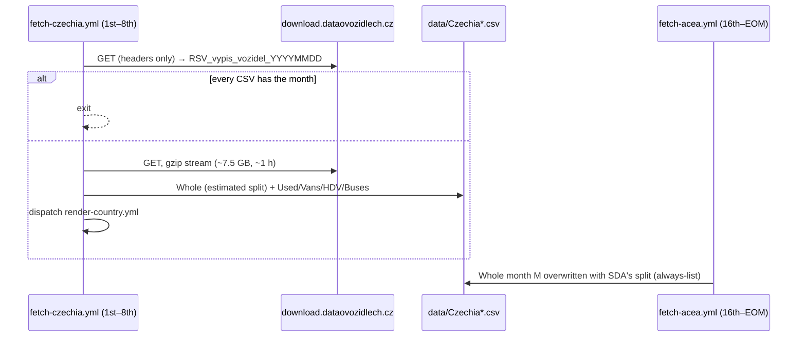

# 51 · Source: Czechia (RSV vehicle register, open data)

**Status: LIVE since 2026-10.** Fetcher `scripts/fetch_czechia.py` (+ tests
`scripts/test_fetch_czechia.py`), workflow `.github/workflows/fetch-czechia.yml`.
Writes every Czechia CSV; for `Whole` ACEA (SDA's numbers) still has the last word.

## TL;DR

```
Source:    https://download.dataovozidlech.cz/vypiszregistru/vypisvozidel
           → RSV_vypis_vozidel_<YYYYMMDD>.csv, the whole register, one row per
           vehicle (~19.4 M rows, 79 columns), regenerated on the 1st.
           ~7.5 GB with gzip (~25 GB raw); built on the fly — no
           Content-Length, no range requests, cannot resume.
Auth:      None.
Timing:    the extract of 1 Oct holds September complete (and a few
           hundred cars of 1 Oct, ignored). ACEA publishes the same month
           around the 20th; SDA's press release ~6th.
Variants:  Whole · Used · Vans · HDV · Buses
Whole:     register row on the 1st–3rd (BEV/PHEV/OTHERS/TOTAL exact,
           HEV/PETROL/DIESEL estimated) → replaced by ACEA (always-list).
Check:     TOTAL M1 2025-06..2026-08 within 0.0–0.9 % of SDA/ACEA (mostly
           0.0–0.3 %), BEV within a few cars a month; Sept 2026: 19,078 vs
           SDA's 19,095. PHEV 2022–2026 +0.8 % in sum (§4).
Run:       ~60–70 min streaming, once a month; nothing stored.
```

## 1. Why this source, and why not alone

Before 2026-10 every Czechia CSV came from ACEA: `Whole` from the monthly car press
release (an "always" country in `fetch_acea.py`), `Vans`/`HDV`/`Buses` from the quarterly
commercial-vehicle release with BEV and PHEV merged. ACEA is three weeks late and has **no
July release** — the 2026-07 row had to be derived by hand from year-to-date sums.

ACEA's Czech figures are SDA's (Svaz dovozců automobilů), and SDA counts the register.
SDA's own monthly tables (`portal.sda-cia.cz/stat.php`, HTML under
`htmlV2/<YYYY-MM>/<YYYY-MM>.<table>.CZ.html`) are members-only except October–December;
its monthly press PDF prints year-to-date prose whose content changes month to month
(the August 2026 one has no fuel paragraph at all). Neither clears the bar in
[14](14-data-source-gaps.md) as a monthly source.

The Ministry of Transport's open-data extract of the register itself does: free, no key,
record-level, the EU category on every record, out on the 1st. Its one gap is the hybrid
split (§3): SDA classifies full and mild hybrids from its own type catalogue, and the
register's hybrid flag is filled for part of the cars only — mild hybrids almost never.
So for `Whole` the register writes the month early, and ACEA's release replaces it.

The ministry's API (`api.dataovozidlech.cz/api/vehicletechnicaldata/v2`) is a per-vehicle
lookup by VIN / TP / ORV with a personal key (27 requests a minute) — no use for counts.

## 2. Record → CSV row

| Column | Use |
|---|---|
| `Datum 1. registrace` | first registration anywhere |
| `Datum 1. registrace v ČR` | first Czech registration — the month a vehicle is counted in |
| `Kategorie vozidla` | EU category (M1, M1G, N1, …) → variant |
| `Palivo` | fuel line P.3, tokens joined by `+` (BA, NM, EL, LPG, CNG, VODÍK, E 85, BA SMĚS, BIO NM) |
| `Třída hybridního vozidla` | free text: OVC-HEV / NOVC-HEV and ~40 spellings of them |
| `CO2 město /mimo město/kombinované [g.km-1]` | the last number is the combined value |
| `Tovární značka`, `Typ`, `Varianta`, `Verze` | type-approval variant (the plug-in fallback) |
| `Obchodní označení` | trade name (top-model lists) |
| `Zařazení vozidla` | RSV (counted) vs RHSV (historic vehicles, not counted) |

**New vs used** is the register's own pair of dates: equal → new; different → used import.
About 25 cars a month were first registered abroad in the same month as in Czechia
(short pre-registrations) — they count as used, as the register files them.

## 3. Variants and columns

| Variant | Filter | Columns |
|---|---|---|
| `Whole` | new ∧ M1/M1G | BEV, PHEV, HEV, PETROL, DIESEL, OTHERS (SDA's definition) |
| `Used` | used ∧ M1/M1G | BEV, PHEV, PETROL, DIESEL, OTHERS |
| `Vans` | new ∧ N1/N1G | same |
| `HDV` | new ∧ N2/N2G/N3/N3G | same |
| `Buses` | new ∧ M2/M2G/M3/M3G | same |

M1 + M1G together is what SDA counts (M1 alone is 4–7 % short). Campers and special
vehicles of category M1 are included, as at SDA.

**Fuel.** `EL` alone → BEV. Any gas/hydrogen/ethanol token → OTHERS (`BA + LPG` is SDA's
"Benzin + LPG", in OTHERS). Petrol/diesel + `EL` → the plug-in test:

1. hybrid class OVC-HEV → PHEV; NOVC-HEV → not a plug-in;
2. combined CO2 ≤ 60 g/km → PHEV;
3. otherwise the majority of the explicit classes recorded for the same
   (make, type, variant, version) anywhere in the register; none → not a plug-in.

Not-plug-in petrol/diesel-electric cars go to PETROL/DIESEL. Step 1 matters from 2026:
under Euro 6e-bis a plug-in's official CO2 rose well above 60 g/km, but by then the class
is filled for most of them. Step 3 settles ~70–100 cars a month.

**Why no HEV.** Measured against SDA's HEV (via ACEA), 2022-01..2026-08:

| register reading of "hybrid" | HEV vs SDA |
|---|---|
| the hybrid flag / class on the record | −77 % |
| propagated to the type-approval variant | −40 % (and +10 % in 2026) |

SDA's December 2025 hybrid table lists 701 Toyota Corollas as hybrids; the register flags
about 300 of them. Mild hybrids (Volvo B4, Škoda e-TEC, Suzuki) carry no flag at all. HEV
is therefore not written from the register.

**Whole's register row.** BEV, PHEV, OTHERS and TOTAL are the register's. The remainder
(its PETROL + DIESEL, hybrids included) is split into HEV / PETROL / DIESEL in the
proportions of the newest month that came from ACEA/SDA, so the row sums and the TTM chart
keeps its window ([05](05-flows.md): an empty fuel column would blank every 12-month
window containing it). The note says so:

```
register count (BEV/PHEV/OTHERS/TOTAL); HEV/PETROL/DIESEL estimated from the
2026-08 ACEA split — replaced by ACEA's figures when they are published
```

**Posts.** The estimate is good enough to keep the stacked TTM chart whole, not to be
quoted: while the newest row carries that note, `R/post_text.R` leaves HEV out of both
generated posts (`.pt_hev_estimated()` — ICE includes HEV, no HEV band, peak or crossing).
The re-render after ACEA's overwrite brings HEV back.

Czechia stays on `fetch_acea.py`'s always-list, which overwrites the current month
unconditionally — so ACEA's release replaces the row, source and all.
`latest_period_across()` (ACEA's self-throttle) counts only ACEA rows, so a register row
written weeks earlier does not make ACEA skip its run.

## 4. Calibration

Register extract of 2026-10-01 against the CSV (SDA, via ACEA):

**Whole TOTAL (M1 + M1G, new)**

| period | CSV | register | Δ |
|---|---|---|---|
| 2025-06 | 22,208 | 22,192 | −0.1 % |
| 2025-09 | 21,370 | 21,361 | −0.0 % |
| 2025-12 | 21,667 | 21,538 | −0.6 % |
| 2026-03 | 23,916 | 23,704 | −0.9 % |
| 2026-06 | 26,398 | 26,387 | −0.0 % |
| 2026-08 | 17,718 | 17,714 | −0.0 % |
| 2026-09 | 19,095 (SDA press release) | 19,078 | −0.1 % |

Year ends 2011–2024: within ±2.3 % (2021/2022 −2 %; most years under 1 %).

**BEV** agrees within 0–4 cars in every month of 2025–2026. **OTHERS** likewise.
**PHEV** with the test above: 2022-01..2026-08 +0.8 % in sum; single months 2025–2026
between −4.4 % and +0.5 %; 2020–2021 within ±6 %.

**Commercial vehicles** (quarters of ACEA's CV release):

| variant | TOTAL | BEV |
|---|---|---|
| Buses | ±0–3 vehicles a quarter | equal |
| HDV | −0.2 … −3.3 % (≈ −1 %) | equal ±2 |
| Vans | −1.3 … −6.3 % (≈ −2.5 %) | 2025-H2: 701 vs 928 |

The van gap is near-new imports: 164 electric vans with a foreign first registration
entered the register in 2025-H2 — SDA counts most of them as new, the register as used.

## 5. Month and revisions

A month is complete in the first extract generated after it (the 1 October extract holds
September). Each run writes the months after the CSV's newest row (normally one), counted
by first Czech registration date. A written row is never revised (invariant 3); `--force`
rewrites the fetcher's own rows, never another source's. `Whole` is written only from
2026-09 (`WHOLE_FROM`) — its history stays SDA/ACEA.

`--backfill` writes every month a CSV lacks from 2016-01 (Whole: from 2026-09). A
missing CSV is backfilled automatically.

## 6. Governance

| Check | Action |
|---|---|
| a required column missing | abort (schema drift) |
| fewer than 15 M rows read | treated as a truncated stream → restart (4 attempts) |
| gzip stream ends early / connection drops | restart from the top after 1 / 3 / 10 min |
| Whole month < 50 % of its trailing-12 median | not written (`--force` overrides) |
| unknown fuel strings > 0.5 % of the month's Whole | abort; listed in the log |
| fuels ≠ TOTAL | assertion — never written |

Step summary: the newest month of every variant. Top lists (`market/czechia_top.json`,
`market/czechia_used_top.json`) are refreshed behind `market_top.guarded()`.

## 7. Operations

* **Cron** `25 5,13 1-8 * *` (UTC). One real run a month (~1 h), every other run is one
  header request. `concurrency: fetch-czechia` keeps a scheduled poll from starting a second
  stream; nothing else waits on it. Job timeout 330 min.
* **Dispatch inputs:** `variant`, `backfill`, `force`.
* **Offline:** `python scripts/fetch_czechia.py --from-file RSV_vypis_vozidel_20261001.csv.gz`
  (the date comes from the file name, or `--snapshot YYYY-MM-DD`).

### Debugging runbook

| Symptom | Likely cause | What to do |
|---|---|---|
| `required columns missing` | the ministry renamed a column | compare the header (first line of the stream) with `REQUIRED`; update the constants |
| restarts every attempt, `only N rows` | the server cuts long transfers | rerun later; if persistent, raise `DOWNLOAD_ATTEMPTS` or move the run to another hour |
| run ends "nothing to do" on the 2nd | the extract was not regenerated yet (header date still last month) | the next poll catches it |
| `looks incomplete` | a partial extract | check the extract date and the month's count; rerun with `force` only if real |
| `unknown fuel strings` | a new token in `Palivo` | add it to `GAS_TOKENS` / `TOKEN_ALIASES` + a test case |
| PHEV off vs ACEA by > 5 % | new hybrid-class spellings, or CO2 ≥ 60 plug-ins without class | `hybrid_class()` cases in the tests; check the class strings of that month |
| ACEA did not run for the month | throttle saw an ACEA row ≥ target | `latest_period_across` must only count `source == ACEA` |

## 8. Sequence


