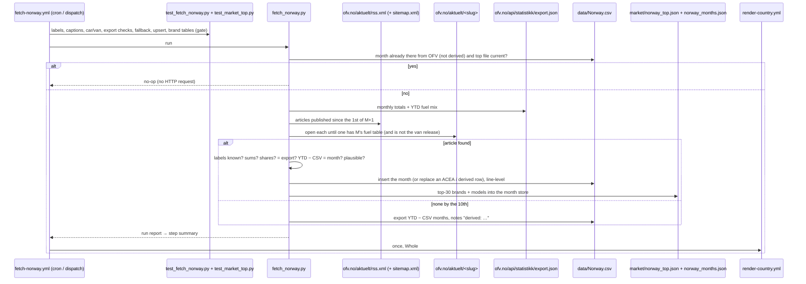

# 54 · Source: Norway (OFV monthly release, from the Statens vegvesen register)

**Status: LIVE since 2026-10 (automated).** Fetcher `scripts/fetch_norway.py`
(+ tests `scripts/test_fetch_norway.py`) and `.github/workflows/fetch-norway.yml`.
Norway — about 130,000–180,000 new cars a year and the most-watched market of
the gallery — had always been OFV's figures: transcribed by hand to 2026-03,
then ACEA's copy of them, which arrives three to four weeks later and in July
2026 not at all. The fetcher reads OFV's own release instead.

The facts below were established on 2026-10-09 from GitHub runners (the dev
sandbox cannot reach `ofv.no`).

## TL;DR

```
Source:    OFV monthly new-car release (an article on ofv.no/aktuelt),
           from the Statens vegvesen vehicle register
Find it:   GET https://ofv.no/aktuelt/rss.xml   (newest 30 articles)
           → every item with pubDate ≥ 1st of M+1; fallback: sitemap.xml
           → the article whose "Fordeling per drivstoff i <måned> <år>"
             table is for month M and whose brand table is not "varebil…"
Check:     GET https://ofv.no/api/statistikk/export.json  (CC BY 4.0)
           month Total = export monthly[M]; article YTD = export fuelMix
Auth:      None. No login, no key. robots.txt allows the articles and the
           export (the rest of /api/ is disallowed and not used).
Timing:    month M early on the first working day of M+1
           (September 2026: 1 October 05:37 UTC; vans the next day)
Scope:     new passenger cars (M1), all brands → Whole.
Fuel:      Elektrisitet → BEV; Bensin/Diesel plugin hybrid → PHEV;
           Bensin/Diesel hybrid → HEV; Bensin → PETROL; Diesel → DIESEL;
           rare fuels → OTHERS; Total → TOTAL
History:   2005-01 → 2026-03 hand-entered OFV figures ("ofv.no & ACEA"),
           2026-04 → 2026-08 ACEA (OFV's figures, republished);
           automated from the October 2026 release (September 2026 data).
Checked:   OFV's 2026 year-to-date (Jan–Sep) reproduces the stored
           Jan–Aug rows + the fetched September to ±1 car per fuel;
           11 of 17 monthly totals 2025-01 → 2026-09 identical.
```

## 1. Why this source

The gallery's bar ([14](14-data-source-gaps.md)): direct from the registry
or its recognised body, complete for the market, free.

- **It is the register's count.** OFV compiles Norway's registration
  statistics from Statens vegvesen's vehicle register for every brand; it is
  the figure the government, the press, Elbilforeningen and ACEA quote.
  ACEA's Norway column *is* OFV's number, three weeks later.
- **Free, licensed and machine-readable.** The release is a public web page
  with HTML tables (since the September 2026 release), and OFV publishes an
  open JSON export of the same statistics under CC BY 4.0, which its
  `robots.txt` explicitly allows.
- **Why not SSB (Statistics Norway):** table 14020 is monthly from 1995 and
  free through PxWeb, but has only four fuel groups — *electric*, *fossil*,
  *hybrid* (plug-in and non-plug-in together) and *other*. A coarser hybrid
  split than the series already has is not acceptable (the gallery's rule:
  a new source must extend the history in the same categories).
- **Why not the OFV API portal / OFV Statistikk:** both are paid
  subscriptions (API keys); the free release and export carry everything the
  chart needs.
- **Why not ACEA alone:** a secondary copy, three to four weeks late, with
  gaps (no July 2026 release; the gallery's July row had to be derived).
  ACEA stays as the fallback writer: `fetch_acea.py` keeps Norway on its
  *conditional* list, so it fills a month only when the row is missing or
  already ACEA's, and never overwrites an OFV row.

## 2. Release → CSV row

The passenger-car article carries three tables: the top-30 brands of the
month, the top-30 models of the month, and the fuel table:

| Column of OFV's fuel table | Used for |
|---|---|
| month: Antall | the CSV row |
| month: Andel | check: recomputed from count / Total |
| year to date: Antall | checks: vs export.json fuel mix, and YTD − stored months = month |
| year to date: Andel | — |

CSV columns: `BEV, PHEV, HEV, PETROL, DIESEL, OTHERS, TOTAL, notes`;
`source` = `OFV`; `notes` = the article URL. Integers. A new month is
inserted in period order; every other line is written back byte for byte
(including the one historical line that ends in LF instead of CRLF). An
existing month is replaced only when it is **ACEA's** (OFV's own figure,
republished) or a **derived** row of this fetcher (§2.1); any other row is
kept unless the run is dispatched with `force` (invariant 3).

### 2.1 No article — the export fallback

If no release article can be found by the 10th of M+1 (OFV changed its
layout back to images, or moved the release), the fetcher derives the month
from the JSON export: the export's fuel mix covers January to the last
complete month, so month M = export year-to-date − the CSV's January … M−1,
fuel by fuel. The row is written with `notes` starting
`derived: OFV year-to-date fuel mix …` (the repo's convention for estimated
rows, invariant 6) and a `::warning`. It is only as good as the stored
earlier months — OFV's small refreshes of them land in this month — and the
derived TOTAL must match the export's own figure for the month within 1 %
(or 30 cars), else the run fails. A derived row does not satisfy the
self-throttle: as soon as an article for the month turns up, its figures
replace the derived ones without `force`.

## 3. Discovering the release

OFV's articles have headline slugs
(`sterk-vekst-i-nybilregistreringene-i-september-opp-30-prosent`) and no tag
for the registration release. `find_article()` reads the RSS feed (30 newest
items, about 2 per working day) and opens every item published since the 1st
of M+1; if none matches it reads the sitemap and opens every `/aktuelt/` URL
modified since then. An article matches when

- it has a table whose caption (or header) says *Fordeling per drivstoff i
  `<måned>` `<år>`* for month M, and
- its brand ranking is not about vans — OFV's van release of the next day
  (`rekordhoy-elbilandel-for-varebiler-i-september`) has the same three
  tables, captioned *De 22 mest solgte **varebil**merkene …*; it is logged
  and skipped.

A fuel-shaped table that does not parse aborts the run with the article's
URL (schema drift, not "someone else's article"). No match before the 11th:
"not published yet", exit 0; from the 11th the fallback of §2.1, and if that
is impossible too (the export is not at month M yet, or the CSV lacks an
earlier month) `::error title=Norway release not found`.

## 4. Fuel rows (`FUEL_LABELS`)

| OFV label | → | Seen |
|---|---|---|
| Elektrisitet | BEV | every release |
| Bensin plugin hybrid | PHEV | every release |
| Diesel plugin hybrid | PHEV | cars |
| Bensin hybrid | HEV | cars |
| Diesel hybrid | HEV | cars (1 car January–September 2026) |
| Bensin | PETROL | every release |
| Diesel | DIESEL | every release |
| Hydrogen, Gass, Biogass, Parafin, Annet (drivstoff) | OTHERS | not in 2026 — mapped ahead, as ACEA files them |
| Total | TOTAL | every release |

Any other label aborts the run (`unknown OFV fuel row(s)`), in the article
and in the export alike. Rows are matched by label, never by position (OFV
sorts them by size, so the order changes from month to month).

**Is the hybrid split the same as before?** Yes. The history's HEV and PHEV
columns are OFV's (by hand) and ACEA's (which takes OFV's). OFV's 2026
year-to-date per fuel, compared with the stored January–August rows plus
the fetched September: BEV 112,826 vs 112,825, PHEV 625 vs 625, HEV 708 vs
709, PETROL 186 vs 186, DIESEL 852 vs 851 — one car of drift per fuel, from
OFV's refreshes. No category is merged or split differently.

## 5. Validation against the history

Done on 2026-10-09 with the export's monthly totals for 2025 and 2026
(`previous` / `current`) against `data/Norway.csv`:

| | months | identical | largest difference |
|---|---|---|---|
| 2025 (hand-entered OFV) | 9 (Jan–Sep) | 6 | 2025-09: 14,414 stored vs 14,329 today (−85, OFV's later refresh) |
| 2026 (hand/ACEA) | 8 (Jan–Aug) | 5 | ±8 in April (ACEA) and July (derived), 1 in February |

No stored row fails its own sum (fuels = TOTAL in all 261 rows), so there was
no typo to correct. The differences are revisions, kept as first published
(invariant 3); the April/July pair is explained in the source page's caveats.
September 2026, the first month the fetcher wrote, was run online on a GitHub
runner: the article and the export agreed exactly, the year-to-date check was
−0.01 % (one car), and the line was appended byte-clean.

## 6. Governance

Every real run (the self-throttle exits before any HTTP request when the CSV
has the month from `OFV`, not derived, and `market/norway_top.json` is
current):

- **Schema drift aborts:** a fuel table without a month in its caption, no
  `Elektrisitet` or `Total` row, an unknown label, a non-numeric count.
- **Sums:** the rows must add up to the Total, in the month and the
  year-to-date column.
- **Column-shift check:** each printed *Andel* must match count / Total
  within 0.06 pp.
- **export.json, exact:** the month's Total must equal the export's monthly
  series (`personbiler.monthly`), and the article's year-to-date column the
  export's `fuelMix`, fuel by fuel, when it covers the same month. Two OFV
  publications drifting apart stops the run. An unreadable export is a
  warning only.
- **Year-to-date check:** YTD Total minus the CSV's January … M−1 must equal
  the month: above 1 % a warning, above 5 % the run aborts (`force` after
  checking).
- **Plausibility:** the Total must be 0.15–4× the same month a year earlier.
  Wide on purpose: Norway's tax changes on 1 January are violent — January
  2023 and January 2026 were ×0.24 of the year before, January 2024 ×2.72,
  December 2025 ×2.57 — and the exact export check is the real guard.

## 7. Operations and debugging



- **Schedule:** `10 7,15 1-12 * *` — two hours after OFV's early-morning
  release on the first working day, afternoon retry; a no-op costs nothing.
- **Normal run:** the RSS feed (≈ 30 kB), the export (≈ 7 kB) and one or two
  articles (≈ 250 kB each).
- **Offline:** save an article (`curl -A Mozilla/5.0 <url>`) and the export
  and run `python scripts/fetch_norway.py --from-html FILE --export FILE` —
  it parses, runs every check against `data/Norway.csv` and prints the line
  it would write. `--dry-run --period M` re-reads a committed month online:
  it must say "identical to the CSV".
- **After each monthly run:** read the step summary — the month's table, the
  export line, the YTD line, the plausibility ratio, the top-file log line.

**If a run fails — where to look:**

| Symptom in the log | Cause | Fix |
|---|---|---|
| `::warning title=Norway month derived from export.json` | no article with the month's fuel table by the 10th — OFV published it as an image again, or changed the caption | open OFV's news page; if the table is an image, the derived row stands (it is replaced automatically if an HTML table appears); if the caption changed, adapt `is_fuel_table()` / `month_year()` and add the layout to the tests |
| `::error title=Norway release not found` | no article, and the export cannot stand in (its fuel mix is not at month M yet, or the CSV lacks an earlier month of the year) | wait a day and re-run; if OFV is late, dispatch again later; if months are missing, fill them first (ACEA fills Norway gaps on its own) |
| `GET … failed: HTTP 403` | OFV started blocking runners | re-run; if it persists, check from a browser and consider the Cloudflare relay ([08](08-deploy-ops.md) §8.4) |
| `unknown OFV fuel row(s) [...]` / `export.json: unknown fuel` | OFV added or renamed a fuel | decide the column (glossary conventions: EREV → PHEV; hydrogen → OTHERS; mild hybrid → its fuel's hybrid row as ACEA does), add it to `FUEL_LABELS` and `LABEL_CASES` in the test |
| `fuel table without a month in its caption` / `fuel table lacks [...]` | layout change | `--from-html` on the saved article; adapt `parse_fuel_table()` and the tests |
| `printed share … columns shifted?` | a column inserted before the counts | look at the table; adapt the column indices in `parse_fuel_table()` |
| `export.json has N new cars for M, the article N'` / `article year-to-date ≠ export.json fuel mix` | the two OFV publications disagree — one was refreshed and the other not yet | re-run later; if it persists, compare by hand and dispatch with `force` (the disagreement is then a warning in the summary; the sums and share checks still apply) |
| `year-to-date check off by …` | OFV revised earlier months heavily, or the table is for another month | compare the article with the CSV; `force` if the month is right |
| `TOTAL … is ×N the same month a year earlier` | a real shock (tax change, pull-forward) or a wrong table | check the article text; `force` if genuine |
| `::warning title=Norway brand/model tables unreadable` / `top brands/models not refreshed` | ranking tables changed (caption, month, more cars than the month) | the CSV was committed; adapt `parse_ranking()` / `month_units()` |
| `… differs from the CSV … kept unless --force` | the article for a month that has a non-ACEA row disagrees with it | normally nothing to do (invariant 3); `force` only to correct a known error |

## 8. Reading the fit

Norway's BEV share of new cars: 5.2 % (2013), 16.7 % (2015), 30.3 % (2018),
53.0 % (2020), 78.4 % (2022), 88.1 % (2024), 95.9 % (2025) and 97.9 % in
January–September 2026 (September: 98.8 %, a record). Plug-in hybrids peaked
at 21 % in 2021 and are at 0.5 % in 2026; hybrids peaked at 13 % in
2017–2019. December 2022 (39,518) and December 2025 (35,188) were
pull-forwards ahead of tax changes on 1 January. The
fitted S-curve is at its ceiling; Norway is the reference for what the end of
the transition looks like, and its last per cent (four-wheel-drive, towing,
some fleet diesels) moves slowly.

## 9. Outputs

- `data/Norway.csv` (Whole), monthly, 2005-01 →, rendered.
- `market/norway_top.json` — OFV's top-30 brands and top-30 models of each
  month, class `ALL` (every powertrain — [03](03-data-objects.md) §3.16):
  the brand table has no fuel split, so the source page's section is "Who
  sells the new cars"; brands and models are ranked separately and spliced
  (`market_top.splice_models`, as for the UK). What the top 30 do not list is
  the unranked rest.
- `market/norway_months.json` — the month store (an article lists one month
  only), so the headline grows from 2026-09 to a trailing twelve months.

## 10. Not built (yet)

- **Vans from OFV (`Norway_Vans`):** OFV's van release has the same three
  HTML tables (September 2026: 2,036 new vans, 74.6 % battery-electric, with a
  BEV / PHEV split). Today's `Norway_Vans` is ACEA's quarterly Commercial
  Vehicle figure with BEV and PHEV merged. Switching to OFV's monthly series
  changes the definition (monthly, split), so — following the gallery's rule —
  the ACEA series would become `Norway_Vans` *Legacy* and the OFV series
  start fresh; with only one month of HTML tables available (2026-09) that
  series is not fittable yet. The fetcher already recognises the van article;
  writing it is a small change once a year or so of months has accumulated,
  or once OFV's export carries a van history (its `varebiler` block has the
  year's monthly totals and fuel mix today).
- **HDV, motorcycles, campers:** behind OFV's paid subscription
  ("krever tilgang").
- **Used imports:** OFV reports them (bruktimport), but not in a free table.
