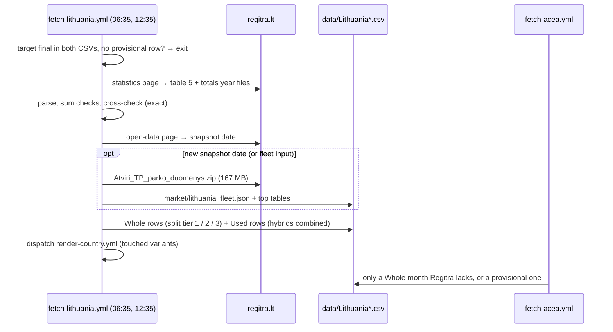

# 55 · Source: Lithuania (Regitra)

**Status: LIVE since 2026-10.** Fetcher `scripts/fetch_lithuania.py` (+ tests
`scripts/test_fetch_lithuania.py`), workflow `.github/workflows/fetch-lithuania.yml`.
Regitra writes Whole and Used from 2024-01; ACEA (`fetch_acea.py`) moved Lithuania from its
always-list to the conditional list and now only fills a Whole month Regitra has not written,
or replaces a provisional one.

## TL;DR

```
Source:    regitra.lt/paslaugos/duomenu-teikimas/statistika/
             5-Pirma-karta-iregistruotu-Lietuvoje-M1-...-pagal-degalu-rusi-<YYYY>...xlsx
                 table 5: Nauja / Naudota × fuel field × month (2024+)
             Pirma-karta-Lietuvoje-iregistruotu-transporto-priemoniu-skaicius-<YYYY>...xlsx
                 monthly totals (cross-check)
           regitra.lt/imone/atviri-duomenys/ → Atviri_TP_parko_duomenys.zip
                 register snapshot, ~2.5 M rows, about quarterly (PHEV/HEV, brands)
Auth:      None. A full browser User-Agent is needed for the zip (a short UA
           gets an HTML page back).
Timing:    a month's year file is up in the first ten days of the next month;
           ACEA publishes Lithuania around the 20th.
Variants:  Whole (Nauja) · Used (Naudota). Vans/HDV/Buses stay ACEA CV.
Split:     Whole: PHEV/HEV from ACEA's split → snapshot share → provisional (§5).
           Used: one combined hybrid number in HEV, no PHEV column (§5).
Check:     table 5 = Regitra's totals table, 64/64 exact. vs ACEA 2024-01..
           2026-06: −0.2 % total, every month within ±0.6 % (§4).
```

## 1. Why this source clears the bar

Lithuania was an ACEA "always" country: ACEA's monthly press release was the only source,
three weeks after month end, and one month (2026-07) had to be derived from year-to-date
sums. A Regitra entry in `country_source_stubs.yaml` recorded the register as unreachable (a
CAPTCHA, probed 2026-09-28). From GitHub's runners in October 2026 the statistics page, the
year files and the open-data zip all answer without one.

Regitra keeps the register ACEA's figure is built from (via the Lithuanian car dealers'
association), so it reproduces ACEA's totals and by-fuel numbers (§4) — the rule that a new
source extends the legacy series in the same categories holds. It adds what ACEA does not
have: the **used-import market**, about 3.6 times the new one in 2026 (118,622 against
32,655 cars, 55 % diesel), with the same fuel breakdown.

What it lacks is a PHEV/HEV split in the monthly table — §5 says how that is filled and how
exact each tier is.

## 2. Record → CSV row

Table 5 is one XLSX per year, restated with every new month. Rows are the fuel field
(`DEGALAI`) within a status block, columns are the months:

| Layout | Month header | Block | Block sum | Grand total |
|---|---|---|---|---|
| 2025, 2026 | `YYYY-MM` strings | `Nauja` / `Naudota` | "… suma" | `Bendroji suma` |
| 2024 | integers 1–12 (year from the title "2024 m.") | same | "… viso" | `IŠ VISO` |

`parse_fuel_table()` reads both; the month header is taken from the first row with at least
six months (an earlier version mistook a data row holding a single 1 for the header — the
block-sum check caught it). The totals file has one row per Lithuanian month name; new M1 is
column 5, used M1 column 3 (`parse_totals_table()`).

| Variant | File | Filter |
|---|---|---|
| `Whole` (`data/Lithuania.csv`) | table 5 | status `Nauja` |
| `Used` (`data/Lithuania_Used.csv`) | table 5 | status `Naudota` |

Table 5's "M1" is M1 + M1G (off-road M1) — the same scope ACEA's passenger-car figure has,
which is why the totals match (§4).

## 3. Fuel mapping

The fuel field lists components separated by "/". First match wins (`fuel_class()`):

| DEGALAI | Column |
|---|---|
| `Elektra` | BEV |
| contains `Vandenilis` (hydrogen) | OTHERS (fuel cell, as ACEA) |
| any other combination with `Elektra` (`Benzinas/Elektra`, `Dyzelinas/Elektra`, `Benzinas/Suskystintos naftos dujos/Elektra`, …) | hybrid → PHEV + HEV (§5) |
| `Benzinas` | PETROL |
| `Dyzelinas` | DIESEL |
| anything else (`Benzinas/Suskystintos naftos dujos` LPG, `…/Gamtinės dujos` CNG, `Etanolis`, `Nenurodyta` not stated, …) | OTHERS |

A component the fetcher does not know (`KNOWN_COMPONENTS`) is still mapped by these rules,
but is listed as a workflow warning; above 2 % of a month the run stops. The column set
(`BEV, PHEV, HEV, PETROL, DIESEL, OTHERS`) is exactly the legacy ACEA set — no coarser
category is introduced.

## 4. Validation

### 4.1 Against Regitra's own totals (every run)

Table 5's block sums equal the separate monthly totals publication for all 64 month × status
pairs 2024-01 … 2026-08. A mismatch stops the run (`--force` overrides).

### 4.2 Against ACEA (the legacy series)

Whole, Regitra minus the ACEA row it replaced:

| Year | Total | BEV | PHEV | HEV | Petrol | Diesel | Others |
|---|---|---|---|---|---|---|---|
| 2024 | −53 (−0.18 %) | −17 | −8 | −65 | +24 | +20 | −7 |
| 2025 | −62 (−0.15 %) | −9 | −15 | −66 | +23 | +5 | 0 |
| 2026 (Jan–Aug) | −247 (−0.75 %) | −12 | −52 | −182 | +25 | +7 | −33 |

Every month from 2024-01 to 2026-06 is within ±0.6 % (largest −22 cars, 2025-05). The two
2026 outliers are ACEA's: 2026-07 (−134) was derived from year-to-date sums, and 2026-08
(−89) is Regitra's first count of the month — the year file is restated, and a later run
picks up late registrations. PHEV and HEV follow ACEA's split (§5), so their small gaps are
the hybrid total's.

### 4.3 The register snapshot's bias

The snapshot of 2026-07-03 holds only cars registered on that day. Its count of a month's
first registrations falls short of table 5 by 0.5 % (2026-05) … 28 % (2025-06, new) and
22–29 % for used imports throughout — Lithuania re-exports many cars. Hybrids leave more
often than plug-ins, so the snapshot's plug-in share is too high for older months:

| Month | ACEA PHEV | snapshot share × Regitra hybrids |
|---|---|---|
| 2024 (monthly) | 95–209 | +3 … +24 |
| 2025-03 … 2025-10 | 220–514 | +51 … +83 |
| 2026-03 … 2026-05 | 454–569 | +1 … +13 |

Hence the order of the tiers in §5: ACEA's counted split where it exists, the snapshot only
for months near its date.

## 5. The PHEV/HEV split

**Used is not split.** No counted PHEV/HEV split exists for used imports (ACEA covers new
cars only), and the register snapshot is a poor stand-in: it misses the 22–29 % of used
imports re-exported since — hybrids more often than plug-ins (§4.3) — has no hybrid
category for about 40 % of used hybrids, and so far there is one snapshot for the whole
history. So `split_hybrids()` returns every used hybrid as `HEV` and
`data/Lithuania_Used.csv` has no `PHEV` column — the combined-hybrid convention of
Türkiye and Ukraine ([09](09-glossary.md) "Hybrid"; the trajectory draws no PHEV curve,
`has_phev_split`). The Used brand table ranks the same combined class, including the
hybrids without a category. (Until 2026-10 the Used rows carried a snapshot split; they
were rewritten combined in the PR that built this source.)

For **Whole**, `split_hybrids()` evaluates on every run, best first:

1. **ACEA** (Whole only). The share from ACEA's PHEV and HEV for the month, taken from the
   ACEA row in the CSV or, once Regitra has replaced it, from the note `ACEA PHEV a / HEV b`
   the fetcher leaves in that row. PHEV = round(H × a / (a + b)).
2. **Register snapshot.** OVC-HEV / (OVC-HEV + NOVC-HEV) among the month's first
   registrations in the snapshot (store `market/lithuania_fleet.json`, `months` →
   `"YYYY-MM|new"`; the `"|used"` counts are kept for diagnostics only), if at least 20
   categorised hybrids. Hybrids without a category (`UNK`) are left out. Months after the
   last full month of the snapshot are not used.
3. **Provisional.** The pooled share (ΣPHEV / Σhybrids) of the three final months before it
   (tier 1 or 2).
   The row's `source` is `Regitra (provisional)`; `fetch_acea.py` may replace it with ACEA's
   figure (`PROVISIONAL_NATIONAL_SOURCES`), and this fetcher re-derives it on its next run.

If none applies (no earlier month either), the month is not written (`NoSplit`). The `notes`
column of every row names its tier and the counts behind it.

## 6. Interplay with fetch-acea

| Row in `data/Lithuania.csv` | Written by |
|---|---|
| ≤ 2023-12 | ACEA (unchanged) |
| ≥ 2024-01, Regitra has the month | Regitra, ACEA's split in the note |
| Regitra provisional, ACEA publishes | ACEA overwrites it; the next Regitra run writes Regitra counts with ACEA's split |
| Regitra has not reached the month, ACEA has | ACEA (conditional), replaced by Regitra later |

Lithuania is in `CONDITIONAL_COUNTRIES` in `scripts/fetch_acea.py`. Vans, HDV and Buses are
untouched (`fetch_acea_cv.py`); Regitra's table 1 has monthly vans and lorries but no fuel,
the snapshot has fuel but only the cars still registered — not enough for a count series yet.

## 7. Outputs

| File | What |
|---|---|
| `data/Lithuania.csv` | Whole, Regitra rows from 2024-01 |
| `data/Lithuania_Used.csv` | Used, from 2024-01 — no `PHEV` column, hybrids combined in `HEV` |
| `market/lithuania_fleet.json` | snapshot date + per-month OVC/NOVC/UNK counts (tier 2 store, generated) |
| `market/lithuania_top.json` | Whole: top BEV/PHEV/HEV brands and models, last 12 full months of the snapshot (generated by `market_top.py`) |
| `market/lithuania_used_top.json` | Used: top BEV and Hybrid (combined) brands and models, same window — shown as its own section via `market_breakdown_extra` with `class_names: {HEV: Hybrid}` |

The brand tables are written only when a new snapshot is read, and their scope check
(`check_scope`, counted vs CSV) warns above 15 % — expected here because of re-exports
(§4.3) — and aborts only above 40 %.

## 8. Operations and debugging

* **Cron** `35 6,12 * * *` (UTC). A run makes no HTTP request when the target month (last
  month) is a final Regitra row in both CSVs and no provisional row is left (only Whole
  rows can be provisional).
* **Dispatch inputs:** `variant` (all / Whole / Used), `period` (YYYY-MM), `backfill`
  (every year file from 2024), `fleet` (download the snapshot even if its date is
  unchanged), `force` (skip throttle, completeness, cross-check and foreign-row guards).
* **Offline:** `python scripts/fetch_lithuania.py --from-dir DIR --fleet-file Atviri_TP_parko_duomenys.zip --dry-run`
  with `fuel_<YYYY>.xlsx` and `totals_<YYYY>.xlsx` in `DIR`.
* The run's step summary lists every written row with its tier and the change against the
  previous row.

### Debugging runbook

| Symptom | Likely cause | What to do |
|---|---|---|
| `No fuel-table year files found on the statistics page` | Regitra renamed the files or moved the page | open the page, compare the link text with `find_year_files()` (it looks for "pagal-degalu-rusi" + a year); update the pattern |
| `fuel table: no month header row` / `no Nauja/Naudota rows` | a new layout of the year file | open the XLSX; extend `_month_header()` / the status labels, add the layout to `test_fuel_table` |
| `Consistency check failed` (a block ≠ its sum line) | a row mis-read as header, a new subtotal label | the message names the month; check `parse_fuel_table()` against that sheet |
| `Cross-check … failed` | the totals file was restated later than table 5 (or the reverse) | rerun the next day; if it persists, compare both files by hand — never `force` without knowing which is right |
| `::warning New fuel label` | a new DEGALAI combination | add its components to `KNOWN_COMPONENTS` and a `test_fuel_class` case once the mapping is confirmed |
| `<variant> <month>: not written — no ACEA split, no register snapshot month …` | no ACEA row, no snapshot month and no earlier split | backfill order problem; run with `backfill` so earlier months exist |
| `register snapshot link not found` / `missing columns` / non-zip download | open-data page or snapshot changed, or a short User-Agent | the CSVs are still written (tier 1 / 3); check `find_fleet()` and the `UA` header |
| provisional Whole rows never upgrade | ACEA has not published the month (and no newer snapshot) | wait for ACEA; a provisional row older than two months means fetch-acea is failing |
| scope warnings above tolerance on the brand tables | re-exports (§4.3) | expected up to ~30 %; investigate only above 40 % (abort) |

## 9. Sequence


