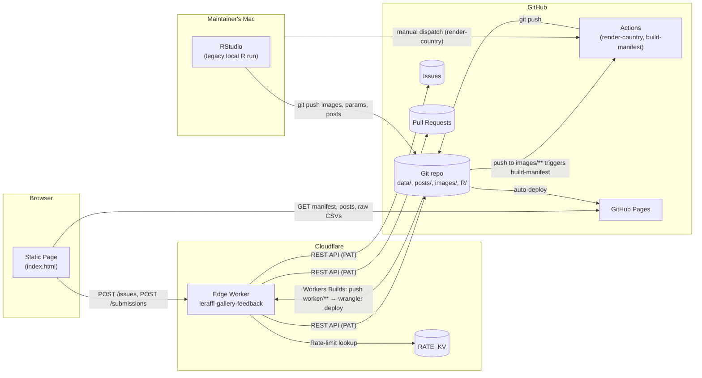

# Architecture Handbook

This folder is the reference manual for the LeRaffl Gallery project. It is written for two audiences:

- **Humans** (you, future contributors) who need a fast way to understand or revisit how something works without reading source code.
- **LLMs** (Claude sessions, Copilot, Cursor) that need grounded context to make sensible suggestions.

It is **not** a tutorial. It documents what exists, why it was built that way, and where to look. Every change to a component, an interface, a secret, an external integration, or a data flow should land in the same PR as the code change that introduces it.

## Index

| # | File | What's in it |
|---|---|---|
| 0 | [README.md](README.md) | This file. The map. |
| 1 | [01-overview.md](01-overview.md) | Project purpose, capabilities, actors, ArchiMate layer view |
| 2 | [02-components.md](02-components.md) | Application components — what each one does, where it lives, why it exists |
| 3 | [03-data-objects.md](03-data-objects.md) | All persistent data — schema, owner, lifecycle, where stored |
| 4 | [04-interfaces.md](04-interfaces.md) | Endpoint contracts and external API surfaces used |
| 5 | [05-flows.md](05-flows.md) | Sequence diagrams for every meaningful end-to-end flow |
| 6 | [06-tech-stack.md](06-tech-stack.md) | Languages, runtimes, package matrix |
| 7 | [07-secrets-trust.md](07-secrets-trust.md) | Secrets, trust boundaries, threat model, rate-limits |
| 8 | [08-deploy-ops.md](08-deploy-ops.md) | Operational runbook: deploys, triggers, common breakage |
| 9 | [09-glossary.md](09-glossary.md) | Domain jargon (TTM, EREV, slug, variant, …) |
| 10 | [10-source-netherlands.md](10-source-netherlands.md) | Per-country source playbook for Netherlands (Swing/RDW). Template for other BI-portal sources (Sweden/Norway) when those land. |
| 11 | [11-source-denmark.md](11-source-denmark.md) | Per-country source playbook for Denmark (api.statbank.dk, table BIL53). |
| 12 | [12-source-finland.md](12-source-finland.md) | Per-country source playbook for Finland (pxdata.stat.fi PxWeb, StatFin table 121d). |
| 13 | [13-source-sweden.md](13-source-sweden.md) | Per-country source playbook for Sweden (statistikdatabasen.scb.se PxWeb, table TK1001A / TAB3277). |

## Big picture in one diagram

## Mental model in one paragraph

The project is a **publication pipeline**. Country registration data lives in versioned CSVs in the repo. R turns CSVs into PNG charts and parameter rows. A static page renders those PNGs from a JSON manifest. Updates flow either from the maintainer's local R run (legacy, fast iteration) or from public submissions that go through a Cloudflare Worker → PR → review → merge → GitHub Action re-render. Every persistent artefact is a file in Git; the only non-Git state is rate-limit counters in Cloudflare KV.

## Known gotchas worth knowing about

- **Indonesia `v1=0` corruption** in `params.csv` — fast-adoption fits round to zero on CSV round-trip by external tools. Defence is layered (frontend `applyV1Recovery`, backend `heal_v1_zero_rows`). Long-form runbook: [08-deploy-ops.md § "Indonesia v1=0 corruption"](08-deploy-ops.md#indonesia-v10-corruption). Schema note: [03-data-objects.md § 3.2](03-data-objects.md#known-fragility--indonesia-style-v10-corruption).

## When to update these docs

Update the matching chapter in the same PR if your change introduces or modifies:
- A new application component or runtime → [02-components.md](02-components.md), [06-tech-stack.md](06-tech-stack.md)
- A new file under `data/`, `posts/`, `images/`, a CSV column, a JSON shape → [03-data-objects.md](03-data-objects.md)
- A new endpoint, request/response shape, or external API call → [04-interfaces.md](04-interfaces.md)
- A new user journey or background job → [05-flows.md](05-flows.md)
- A new secret, scope, or trust boundary → [07-secrets-trust.md](07-secrets-trust.md)
- A new deploy/operate step the maintainer needs to remember → [08-deploy-ops.md](08-deploy-ops.md)
- New jargon → [09-glossary.md](09-glossary.md)

If you're not sure where it goes, put it in [01-overview.md](01-overview.md) and we'll re-home it later.
