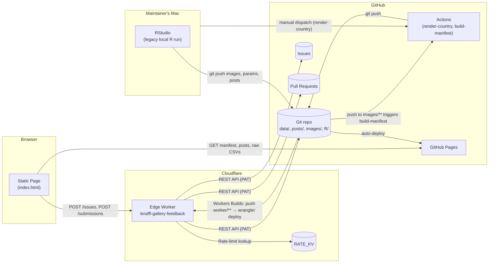

# Architecture Handbook

This folder is the reference manual for the LeRaffl Gallery project. It is written for two audiences:

- **Humans** (you, future contributors) who need a fast way to understand or revisit how something works without reading source code.
- **LLMs** (Claude sessions, Copilot, Cursor) that need grounded context to make sensible suggestions.

It is **not** a tutorial. It documents what exists, why it was built that way, and where to look. Every change to a component, an interface, a secret, an external integration, or a data flow should land in the same PR as the code change that introduces it.

## Index

| # | File | What's in it |
|---|---|---|
| 0 | [README.md](README.md) | This file. The map. |
| 1 | [01-overview.md](01-overview.md) | Project purpose, capabilities, actors, ArchiMate layer view |
| 2 | [02-components.md](02-components.md) | Application components — what each one does, where it lives, why it exists |
| 3 | [03-data-objects.md](03-data-objects.md) | All persistent data — schema, owner, lifecycle, where stored |
| 4 | [04-interfaces.md](04-interfaces.md) | Endpoint contracts and external API surfaces used |
| 5 | [05-flows.md](05-flows.md) | Sequence diagrams for every meaningful end-to-end flow |
| 6 | [06-tech-stack.md](06-tech-stack.md) | Languages, runtimes, package matrix |
| 7 | [07-secrets-trust.md](07-secrets-trust.md) | Secrets, trust boundaries, threat model, rate-limits |
| 8 | [08-deploy-ops.md](08-deploy-ops.md) | Operational runbook: deploys, triggers, common breakage |
| 9 | [09-glossary.md](09-glossary.md) | Domain jargon (TTM, EREV, slug, variant, …) |
| 10 | [10-source-netherlands.md](10-source-netherlands.md) | Per-country source playbook for Netherlands (Swing/RDW). Template for other BI-portal sources (Sweden/Norway) when those land. |
| 11 | [11-source-denmark.md](11-source-denmark.md) | Per-country source playbook for Denmark (api.statbank.dk, table BIL53). |
| 12 | [12-source-finland.md](12-source-finland.md) | Per-country source playbook for Finland (pxdata.stat.fi PxWeb, StatFin table 121d). |
| 13 | [13-source-sweden.md](13-source-sweden.md) | Per-country source playbook for Sweden (statistikdatabasen.scb.se PxWeb, table TK1001A / TAB3277). |
| 14 | [14-data-source-gaps.md](14-data-source-gaps.md) | Countries investigated but **not** added, and why — Latin America (Argentina/Mexico/Colombia + the zemo-la aggregator) and Africa (Ethiopia's 100 %-EV import mandate over a used-import market, + the South Africa/Morocco candidates). The "why isn't X on the map?" reference. |
| 15 | [15-source-ireland.md](15-source-ireland.md) | Per-country source playbook for Ireland (stats.simi.ie SIMI/motorstats — Inertia.js session-filter flow, no public API). |
| 16 | [16-source-portugal.md](16-source-portugal.md) | Per-country source playbook for Portugal (ACAP via motordata.pt — current-year POST endpoint, OTHERS residual). |
| 17 | [17-source-canada.md](17-source-canada.md) | Per-country source playbook for Canada (StatCan WDS, cube **20-10-0025** — metadata-driven coordinates, quarterly→middle-month). `Whole` is EU M1 (passenger cars + multi-purpose vehicles); documents why 20-10-0024 was rejected. |
| 18 | [18-source-colombia.md](18-source-colombia.md) | Per-country source playbook for Colombia (ANDI/FENALCO Boletín PDF — RUNT-sourced, single Hybrid bucket). |
| 18 | [18-source-italy.md](18-source-italy.md) | Per-country source playbook for Italy (UNRAE "struttura del mercato" PDF). Whole/Rental/NonRental from one passenger PDF (Rental = Whole − NonRental); Vans percentage-derived from the separate LCV press release. Shares the `18-` prefix with Colombia. |
| 19 | [19-source-new-zealand.md](19-source-new-zealand.md) | Per-country source playbook for New Zealand (transport.govt.nz). **Auto-fetch disabled since 2026-06** — both upstream endpoints are behind Imperva, so months are entered by hand. |
| 20 | [20-source-austria.md](20-source-austria.md) | Per-country source playbook for Austria (Statistik Austria DE2/DE3 .ods). **Source blocks GitHub IPs** → fetched via the Cloudflare Worker `/fetch` relay. |
| 21 | [21-source-luxembourg.md](21-source-luxembourg.md) | Per-country source playbook for Luxembourg (lustat.statec.lu SDMX, dataflow DF_D6122). Clean SDMX-CSV; Whole/Vans/HDV variants. Template for other .Stat Suite sources. |
| 22 | [22-source-poland.md](22-source-poland.md) | Per-country source playbook for Poland (PZPM eRegistrations XLSX from CEP). Page-scraped workbook, "Ogółem" sheet only; Whole/Vans/HDV/Buses; OTHERS residual. Takes Poland over from ACEA. |
| 23 | [23-source-malaysia.md](23-source-malaysia.md) | Per-country source playbook for Malaysia (data.gov.my parquet, individual registration events, combined hybrid bucket). |
| 24 | [24-source-china.md](24-source-china.md) | Per-country source playbook for China (CPCA monthly analysis). The only **OCR-dependent** source: the retail BEV/PHEV/EREV split is read from a slide image via `tesseract -l chi_sim+eng`, with a ws-proportional fallback. Includes the May-2026 mis-OCR postmortem and the post-band ICE% quirk. |
| 25 | [25-source-uruguay.md](25-source-uruguay.md) | Per-country source playbook for Uruguay (ACAU Compilado XLSX). Whole/Vans/HDV/Buses; documents the 2024-vs-2026 workbook-layout differences. |
| 26 | [26-source-singapore.md](26-source-singapore.md) | Per-country source playbook for Singapore (lta.gov.sg **M03 PDF**, "New Registration of Cars by Make"). The only **PDF-table-parsed** source: positional `pdfplumber` extraction summed per fuel type. Documents the data.gov.sg (frozen 2025-05) / SingStat (no fuel split) dead-ends and the R. Andrew credit. |
| 27 | [27-source-albania.md](27-source-albania.md) | Per-country source playbook for Albania (DPSHTRR Open Data). The only **headless-browser** source: Playwright drives the public Looker Studio report and intercepts its own `batchedDataV2` responses, differencing the month filter to recover single months. Documents the new+used-registration caveat and the LPG-into-OTHERS bucketing. |
| 28 | [28-source-spain.md](28-source-spain.md) | Per-country source playbook for Spain (DGT monthly matriculaciones microdata — registry-direct, canonical, removed from ACEA). Fixed-width layout, `Whole` = turismos+todoterrenos (~2% above ACEA: M1 people movers included), EREV column (China convention), variants Rental/NonRental/Used/Vans/HDV/Buses/2-Wheelers with an "in which variant is X?" reference, Asier Lizarraga attribution for the pre-Oct-2015 history. |
| 29 | [29-source-thailand.md](29-source-thailand.md) | Per-country source playbook for Thailand (TAI/AIU member portal, `taiapi.thaiauto.or.th:3000` JSON API — cookie-session login, `raw_rows`). Whole/HDV/Buses/3-Wheelers from one call. Documents the pickups-bundled-into-Whole caveat, the Whole rebase + `Thailand_legacy.csv` archive, the 3-Wheelers high-BEV/tiny-volume (not no-transition) quirk, and the port-3000 egress note. |
| 30 | [30-source-indonesia.md](30-source-indonesia.md) | Per-country source playbook for Indonesia (GAIKINDO wholesales PDF from the ProjectSend portal `files.gaikindo.or.id`, client login, no captcha). Model-level sheets at 1.56 pt parsed positionally with pdfplumber; Whole = GAIKINDO Passenger Car (Sedan+4x2+4x4+LCGC) continuing the R. Andrew series, plus Pickups/HDV/Buses variants. Documents the wholesales-not-registrations semantics, the TOTAL-label-in-fuel-band trap, split-number/wrapped-row handling, the layered checksum validation, and the yearly-file backfill option. |
| 31 | [31-proposal-country-source-pages.md](31-proposal-country-source-pages.md) | The content model behind the public country source pages: the front-matter fields each source doc carries, the stub registry, and what `scripts/build_source_pages.py` renders from them. |
| 32 | [32-source-nepal.md](32-source-nepal.md) | Per-country source playbook for Nepal (Department of Customs Foreign Trade Statistics XLSX, `customs.gov.np`). Cumulative FYTD workbooks parsed into monthly deltas from HS 8703; **imports, not registrations** (no domestic production); Whole (cars/jeeps/vans ≈ M1) + 3-Wheelers (auto-/e-rickshaws). Documents the three-hop discovery, the Bikram-Sambat fiscal-month→Gregorian labelling, the single Hybrid bucket, and — in § 7 — **why the pre-2020 tail can't be backfilled** (coarse/corrupted 8703.80 electric codes that can't split cars from e-rickshaws). |
| 33 | [33-expansion-candidates.md](33-expansion-candidates.md) | July-2026 expansion investigation: viable new-country candidates (Israel ✅ built, India, Morocco ❌ login-walled, South Africa ✅ verified) with sources, CI reachability probes and open verification points; shelved regions (Gulf, Jordan, Egypt, Sub-Saharan Africa minus SA); variant leads for existing countries (KBA/SMMT/SDES/OFV/Vahan 2W-3W). |
| 34 | [34-source-israel.md](34-source-israel.md) | Per-country source playbook for Israel (data.gov.il MoT registry, CKAN datastore). Whole + Vans from one run; stock-snapshot-derived monthly counts (unpadded month keys, P/M scope), and THE trap: regular HEVs are coded as plain petrol — recovered via the WLTP model-catalogue join (trim-level key, majority-vote fallback). Validated against I-VIA and R. Andrew's mirror. |
| 35 | [35-proposal-raw-data-tab.md](35-proposal-raw-data-tab.md) | **Backend built, tab specced.** A **"Raw Data" tab**: the 51 `Whole` country CSVs drawn as stacked bars, absolute or relative, each bar a **rolling trailing window** of N months. No model, no `params.csv`. Two halves. The **category contract** — per-row split-ICE vs aggregate-ICE resolution (Chile/Colombia carry vestigial petrol/diesel columns), the combined-hybrid bucket via the existing `hev_note`, a reported `0` read as a measurement rather than a blank, the unnamed remainder read as combustion, and band folding where a source only split a category out partway through. And the **backend spec** (§ 4): `scripts/build_series.py` stage by stage, every exception with the country that forced it, the emitted schema and its two invariants, `--check`, and a change-one-check-the-other table. Also: granularity as a property of the (column, period) pair, a row alone in its cycle read as that cycle, and the `#tab?query` deep-link change. |
| 35b | [35b-raw-data-quality-todo.md](35b-raw-data-quality-todo.md) | **Generated** per-country data-quality checklist — rewritten by `scripts/build_series.py` on every `data/**` build, so `git diff` on it is the progress report. Tier 1 is what costs bars (negative counts, absent rows, rows that do not close to `TOTAL`, incomplete cycles) with the visible chart gap named as the symptom; tier 2 records the shape of each file (a coarse figure written across finer rows, `time_interval` disagreeing with the row spacing) so nobody re-discovers it as a bug. |
| 36 | [36-source-france.md](36-source-france.md) | Per-country source playbook for France (**SDES** motorisations série VP — registry-derived, replaces the ACEA aggregate). Full énergie split incl. a real HEV column back to **2011**; `Whole` = EU M1 (SUVs in; Vans/HDV/Buses are fast-follow variants). Also the cross-source **reconciliation** — one **SIV** registry behind ACEA/SDES/AAA, the **raw-vs-CVS-CJO** trap (June 2026: 188 482 raw vs 142 100 adjusted), the **AAA = PFA = ACEA** identity, the one-time per-fuel definitional step (MHEV→petrol, the ND bucket) with BEV share moving ≤ 0.4 pp — the "**what's in `Whole`**" table, the média-id rotation, and the pipeline/rollout (§9). Old series parked as `data/France_legacy.csv`. |
## Big picture in one diagram

```mermaid
flowchart LR
    subgraph Browser
        Page["Static Page<br/>(index.html)"]
    end

    subgraph Cloudflare
        Worker["Edge Worker<br/>leraffl-gallery-feedback"]
        KV[(RATE_KV)]
    end

    subgraph GitHub
        Repo[("Git repo<br/>data/, posts/, images/, R/")]
        Issues[("Issues")]
        PRs[("Pull Requests")]
        Actions["Actions<br/>(render-country, build-manifest)"]
        Pages["GitHub Pages"]
    end

    subgraph Maintainer["Maintainer's Mac"]
        RStudio["RStudio<br/>(legacy local R run)"]
    end

    Page -- "GET manifest, posts, raw CSVs" --> Pages
    Page -- "POST /issues, POST /submissions" --> Worker
    Worker -- "Rate-limit lookup" --> KV
    Worker -- "REST API (PAT)" --> Issues
    Worker -- "REST API (PAT)" --> PRs
    Worker -- "REST API (PAT)" --> Repo

    Actions -- "git push" --> Repo
    Repo -- "auto-deploy" --> Pages
    Repo -- "Workers Builds: push worker/** → wrangler deploy" --> Worker
    Repo -- "push to images/** triggers build-manifest" --> Actions
    Maintainer -- "manual dispatch (render-country)" --> Actions

    RStudio -- "git push images, params, posts" --> Repo
```

## Mental model in one paragraph

The project is a **publication pipeline**. Country registration data lives in versioned CSVs in the repo. R turns CSVs into PNG charts and parameter rows. A static page renders those PNGs from a JSON manifest. Updates flow either from the maintainer's local R run (legacy, fast iteration) or from public submissions that go through a Cloudflare Worker → PR → review → merge → GitHub Action re-render. Every persistent artefact is a file in Git; the only non-Git state is rate-limit counters in Cloudflare KV.

## Known gotchas worth knowing about

- **Indonesia `v1=0` corruption** in `params.csv` — fast-adoption fits round to zero on CSV round-trip by external tools. Defence is layered (frontend `applyV1Recovery`, backend `heal_v1_zero_rows`). Long-form runbook: [08-deploy-ops.md § "Indonesia v1=0 corruption"](08-deploy-ops.md#indonesia-v10-corruption). Schema note: [03-data-objects.md § 3.2](03-data-objects.md#known-fragility--indonesia-style-v10-corruption).

## When to update these docs

Update the matching chapter in the same PR if your change introduces or modifies:
- A new application component or runtime → [02-components.md](02-components.md), [06-tech-stack.md](06-tech-stack.md)
- A new file under `data/`, `posts/`, `images/`, a CSV column, a JSON shape → [03-data-objects.md](03-data-objects.md)
- A new endpoint, request/response shape, or external API call → [04-interfaces.md](04-interfaces.md)
- A new user journey or background job → [05-flows.md](05-flows.md)
- A new secret, scope, or trust boundary → [07-secrets-trust.md](07-secrets-trust.md)
- A new deploy/operate step the maintainer needs to remember → [08-deploy-ops.md](08-deploy-ops.md)
- New jargon → [09-glossary.md](09-glossary.md)

If you're not sure where it goes, put it in [01-overview.md](01-overview.md) and we'll re-home it later.
